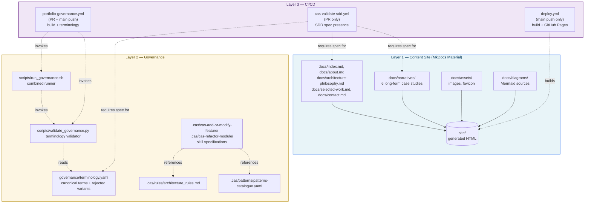

# Portfolio Platform — Layered Architecture

This diagram captures the **three-layer model** of the portfolio platform: a content site, a governance layer, and the CI/CD pipeline that enforces both. It is the canonical visual reference for `ARCHITECTURE.md` §2.

## Reading the diagram

- **Solid arrows** inside Layer 1 represent content flow: authored Markdown → generated `site/`.
- **Dashed arrows** between layers represent *invocation* or *enforcement*: CI workflows invoke scripts; scripts read policy files; CAS skills reference rules and patterns.
- **Each layer has a distinct color** to make boundaries visible at a glance.
- The `site/` node is shown as a **cylinder** to signal that it is generated output, not authored content.

## How this maps to code

| Diagram node | Repo path |
|--------------|-----------|
| A1 | `docs/*.md` (top-level pages) |
| A2 | `docs/narratives/*.md` |
| A3 | `docs/assets/` |
| A4 | `docs/diagrams/*.md` (this file) |
| A5 | `site/` (generated) |
| G1 | `governance/terminology.yaml` |
| G2 | `scripts/validate_governance.py` |
| G3 | `scripts/run_governance.sh` |
| G4 | `.cas/rules/architecture_rules.md` |
| G5 | `.cas/patterns/patterns-catalogue.yaml` |
| G6 | `.cas/cas-add-or-modify-feature/`, `.cas/cas-refactor-module/` |
| C1 | `.github/workflows/portfolio-governance.yml` |
| C2 | `.github/workflows/cas-validate-sdd.yml` |
| C3 | `.github/workflows/deploy.yml` |

See `ARCHITECTURE.md` §2 for the narrative explanation of each layer.