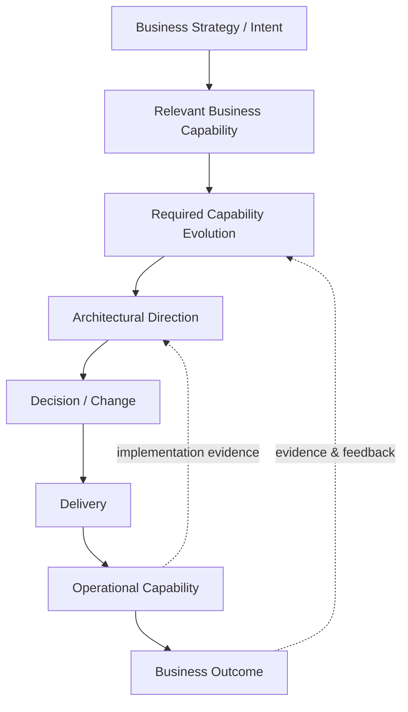
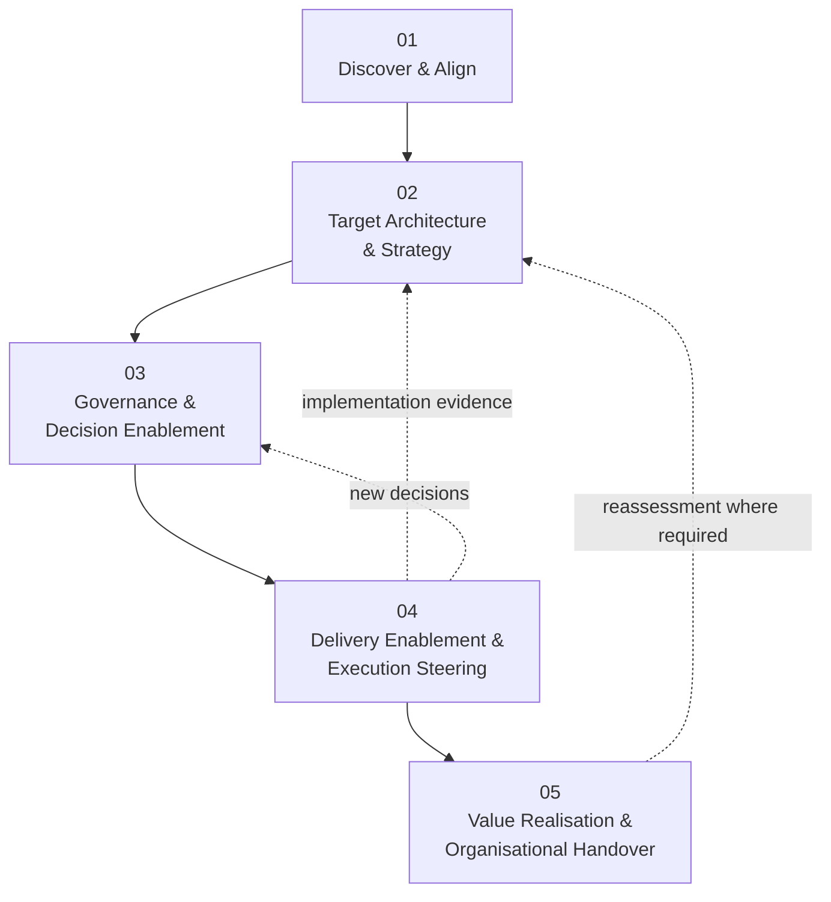
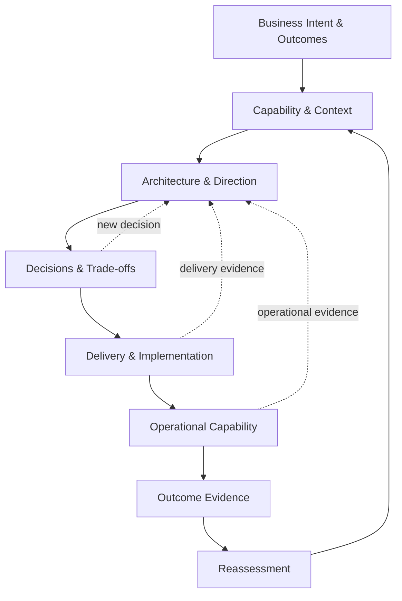
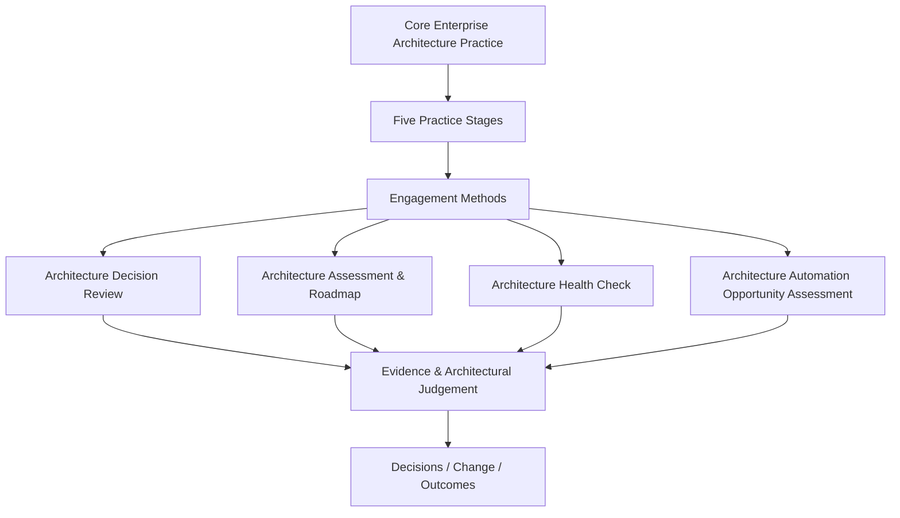
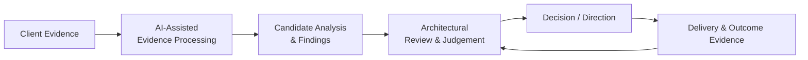
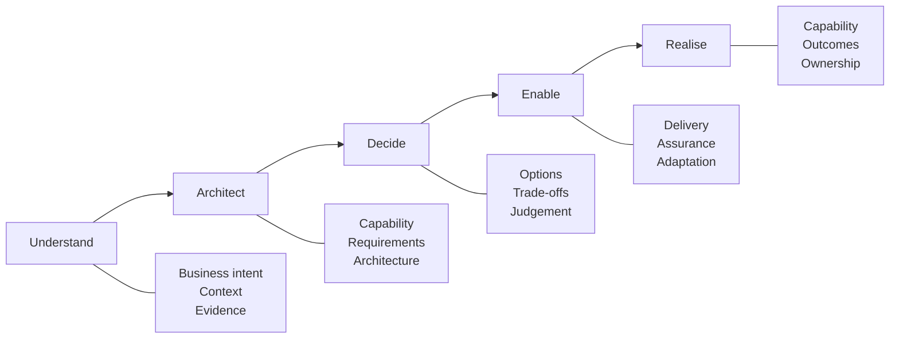

# How I Work

> [!NOTE]
> **Classification Level**: `PUBLIC` — Alexandre Franco Enterprise Architecture Portfolio.

A problem-first, evidence-backed approach to turning business intent and uncertainty into architectural decisions, executable change and realised outcomes.

## From intent to outcome

Enterprise architecture is most useful when it connects business intent to what the organisation actually needs to change — and then stays connected through delivery and operational reality.
The practice follows a continuous chain:

The depth and form of the work adapts to the question being answered. A focused architectural decision does not require an enterprise transformation programme; a broader transformation assessment does not stop at a point-in-time architecture recommendation.

The objective is always the same: make the problem clearer, make the architectural choices explicit, enable practical change, and leave the organisation better able to operate and evolve.

## The five practice stages

The core Enterprise Architecture Standard Operating Procedure provides the overall operating model for architectural work.

### 01 — Discover & Align

Understand the problem before designing the answer.

Establish what the organisation is trying to achieve or decide, why it matters, the relevant strategic priorities and business capabilities, the current context, available evidence, constraints and uncertainties.

The stage establishes the scope and depth of architectural work required rather than assuming them.

Key question:
What are we trying to achieve or decide, why does it matter, what do we know, and what remains uncertain?

### 02 — Target Architecture & Strategy

Turn intent into architectural direction.

Translate established business intent, capability needs, requirements and constraints into architectural requirements and direction. Where required, develop target architecture, evaluate meaningful options and establish the architectural runway for change.

The emphasis is on satisfying the relevant business and architectural needs with the simplest coherent architecture rather than designing technology for its own sake.

Key question:
What architecture should enable the required capability and outcome, and what trade-offs does that involve?

### 03 — Governance & Decision Enablement

Turn architectural analysis into accountable decisions.

Make important architectural choices explicit, evidence-backed and traceable. Evaluate options and trade-offs, establish decision boundaries, record architectural judgement and provide governance that enables delivery rather than becoming a compliance exercise.

This is where architecture becomes a mechanism for making better decisions under uncertainty.

Key question:
What needs to be decided, on what evidence, with what consequences and trade-offs?

### 04 — Delivery Enablement & Execution Steering

Make architecture executable.

Translate architectural direction into practical transition and delivery strategies. Support meaningful increments, manage architectural dependencies and exceptions, provide assurance during implementation, and use delivery evidence to validate or adapt the architecture.

Architecture remains connected to the capability being implemented rather than becoming a document produced before delivery begins.

Key question:
How does the architecture become an implemented capability, and what does delivery evidence tell us?

### 05 — Value Realisation & Organisational Handover

Ensure the organisation can operate, own and evolve what was delivered.

Assess capability realisation, operational readiness, outcome evidence and residual risks. Transfer architectural knowledge, ownership and decision authority, establish future governance and ensure the organisation has the capability required to sustain and evolve the change.

Handover is therefore more than documentation or project closure.

Key question:
What value has been realised or established for future measurement, is the resulting capability ready to operate, and can the organisation sustain and evolve it?

The practice is connected, not linear

The five stages provide structure, but architectural work is rarely a one-way sequence.

Evidence discovered during delivery may require a target architecture to be reconsidered. A new architectural decision may expose a previously unknown constraint. Changes in business strategy may require capability and architectural direction to be reassessed.

This feedback loop is intentional. Architecture evolves through evidence.

## Engagement methods

The core SOP provides the overall practice. Specific engagement methods apply that practice to different architectural questions.

### Architecture Decision Review

Are we making the right architectural decision?

A bounded method for evaluating a defined technology or architecture decision and producing a decision-ready recommendation.

It focuses on:

* decision context and boundaries
* evidence sufficiency
* relevant assessment lenses
* options and trade-offs
* architectural consequences
* recommendation and confidence
* decision traceability
* explicit scope escalation where the question becomes broader than the original decision

### Architecture Assessment & Roadmap

Where are we, where do we need to go, and how do we get there?

A broader method for understanding the current architecture and business context, diagnosing material findings and root causes, establishing target direction and developing a practical transformation roadmap.

It connects:

Business situation → capability → evidence → diagnosis → architectural direction → transformation priorities → transition → roadmap → outcomes

### Architecture Health Check

How healthy is the existing architecture?

A focused assessment of architectural health within a defined scope, using evidence and context to identify material strengths, weaknesses, risks and improvement opportunities.

The assessment depth and lenses are selected according to the engagement rather than imposed through a universal scoring model.

### Architecture Automation Opportunity Assessment

Where should work be eliminated, simplified, integrated or automated?

A method for connecting business strategy and capability context to journeys, processes and operational work, identifying friction and root causes before determining whether the appropriate intervention is to:

Eliminate → Simplify → Integrate → Automate

Automation is therefore treated as an architectural and business intervention, not automatically as the answer.

## How the methods relate to the practice

The methods are not separate frameworks competing with the SOP. They are engagement-specific applications of the same architectural practice.

## Architecture with AI

AI can accelerate architectural work, particularly where large volumes of evidence, documentation or structured information need to be processed.

AI-assisted activities can include:

* evidence ingestion and extraction
* document and architecture artefact analysis
* comparison and gap identification
* evidence organisation
* framework or requirement mapping
* candidate finding identification
* candidate risk and dependency identification
* option analysis support
* report and artefact drafting
* traceability support

Human architectural judgement remains accountable for:

* understanding business context
* determining materiality
* resolving ambiguity
* selecting appropriate assessment lenses
* evaluating trade-offs
* deciding whether evidence is sufficient
* making recommendations
* determining scope
* accepting architectural risk
* communicating and defending architectural decisions

AI accelerates the work; it does not replace architectural accountability.

## What this means in practice

The approach is deliberately engagement-adaptive.

The work may be a focused decision review, a health check, an assessment and roadmap, an automation opportunity assessment, or broader enterprise transformation work.

The method adapts according to:

* the business question
* strategic importance
* affected capabilities
* decision or transformation scope
* evidence available
* uncertainty
* architectural complexity
* delivery complexity
* risk and criticality
* required outcome
* organisational context

There is no assumption that every engagement requires:

* a full enterprise architecture model
* a formal capability maturity model
* a universal assessment framework
* a fixed scoring system
* every architecture domain
* a complete C4 model set
* a large questionnaire
* a predetermined technology stack

The architecture method should be rigorous enough for the decision — and no more complicated than the problem requires.

## The underlying principle

The practice can be summarised as:

Understand the problem.
Architect the change.
Enable the decisions.
Stay connected through delivery.
Leave the organisation able to sustain and evolve the outcome.

⸻

© 2026 Alexandre Franco. Ideas-to-Life. All rights reserved.
