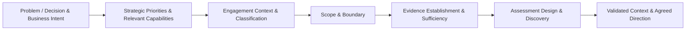
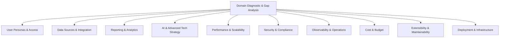
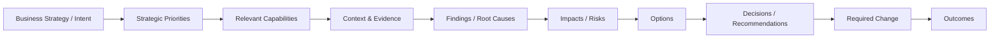

# Stage 01: Discover & Align

> [!IMPORTANT]
> **Classification Level**: `RESTRICTED / HIGHLY CONFIDENTIAL` — Enterprise Architecture Operating Model.

## Overview

The **Discover & Align** stage establishes the strategic and architectural context required for an Enterprise Architecture engagement. It creates a shared understanding of the problem, decision, desired outcomes, relevant strategic priorities and capabilities, context, evidence, scope, and level of analysis required before substantive architectural work begins.
This stage does **not** assume that every engagement requires the same depth of Current State assessment, Desired State definition, capability analysis, domain diagnostic, or roadmap development. Those activities are selected according to the engagement question, scope, complexity, and evidence needs.
The purpose is to answer:
> **What are we trying to achieve or decide, why does it matter, which strategic priorities and business capabilities are relevant, what context are we working within, what do we know, what remains uncertain, what is in scope, and what architectural work is actually required?**

⸻

Core Principles

1. Start with the problem, outcome, or decision. Do not begin with a technology or architecture solution unless the engagement itself is specifically about evaluating one.
2. Understand context before drawing conclusions. Architectural judgement is contextual and depends on business, organisational, technical, commercial, regulatory, and operational realities.
3. Establish evidence before substantive analysis. Distinguish what is known from what is assumed, unknown, conflicting, or requires validation.
4. Tailor discovery to the engagement. Use only the depth and techniques required to answer the question and support the intended outcome.
5. Do not manufacture certainty. Missing information is not automatically a material evidence gap; assess whether its absence could change the conclusion.
6. Keep scope explicit. When the work required to answer the question materially expands beyond the agreed context or purpose, identify and manage the scope change rather than silently expanding the engagement.
7. Separate architectural practice from engagement packaging. This SOP defines the general professional architecture practice. Specific engagement methods, commercial offerings, deliverable variants, or client constraints are applied through engagement-specific tailoring.
8. Maintain traceability. Material findings and recommendations should be traceable to the evidence, assumptions, impacts, risks, and options that support them.
9. Use AI and automation as augmentation. AI may accelerate evidence processing, synthesis, comparison, and artefact preparation, but architectural materiality, judgement, recommendations, and accountability remain human responsibilities.

⸻

Core Workflow

Step 1 — Establish the Business Intent and Trigger

Understand why the engagement exists and what has caused the need for architectural involvement.

Capture, where relevant:

* Business strategy or strategic drivers
* Strategic priorities and goals
* Business problem or opportunity
* Trigger for the engagement
* Desired business outcomes
* Known constraints and non-negotiables
* Stakeholders and decision-makers
* Relevant time horizon
* Existing commitments or dependencies

Examples of triggers include:

* Business transformation
* Growth or expansion
* Cost pressure
* Operational problems
* Technology risk
* Regulatory or compliance change
* Major investment
* AI adoption or transformation
* Platform or technology decisions
* Organisational change
* Need to validate an existing architectural direction

Do not assume that the stated technology request represents the underlying business problem.

Where strategic priorities are known, identify the business capabilities that are materially relevant to achieving them. The purpose is not to create a complete capability model, but to establish the minimum strategic and capability context required for the architectural work.

Where relevant, distinguish:

* What the organisation is trying to achieve
* Which capabilities are important to achieving it
* What those capabilities need to be able to do
* What business change may therefore be required

Step 2 — Frame the Problem, Question, or Decision

Translate the initial request into a precise architectural question that can be investigated.

Determine whether the engagement is primarily concerned with:

* Understanding an existing architecture
* Making or validating an architectural decision
* Defining a target architecture or direction
* Assessing capability or maturity
* Identifying risks or architectural weaknesses
* Establishing a transformation or transition path
* Supporting delivery or implementation
* Establishing governance or operating mechanisms
* Assessing another architecture-related question

Where the question is unclear, resolve the ambiguity before proceeding to detailed analysis.

The resulting statement should make clear:

* What is being asked
* Why it matters
* What outcome is sought
* Who needs the answer
* What decision or action may follow

Step 3 — Classify the Engagement

Select the most appropriate engagement method and scope for the work.

Examples include:

* Architecture Decision Review: Evaluate a defined architecture or technology decision within an established context.
* Architecture Health Check: Assess the condition, risks, weaknesses, and improvement opportunities of an existing architecture.
* Architecture Assessment & Roadmap: Establish or assess broader Current State, Desired State, capability needs, gaps, options, and transition direction.
* Target Architecture / Blueprint: Define an appropriate target architecture and supporting architectural direction where that is the primary need.
* Governance / Operating Model: Establish or improve architectural governance, decision rights, controls, principles, or operating mechanisms where these are in scope.
* Delivery / Implementation Support: Apply architectural direction during execution, resolving material decisions and maintaining architectural coherence where delivery support is required.

The classification is a working hypothesis and may be revised if discovery demonstrates that the initial engagement type does not adequately address the client’s question.

Engagement classification should be distinguished from engagement archetype or commercial packaging. These represent different dimensions of the work and should not be conflated.

Step 4 — Establish the Context and Scope Boundary

Define the boundary within which architectural judgement will be exercised.

Identify, where relevant:

* Business and organisational boundary
* Strategic priorities and outcomes affected
* Products, services, capabilities, or value streams involved
* Relevant business journeys or processes
* Systems, applications, platforms, data, and integrations involved
* Relevant architecture domains and concerns
* Stakeholders and decision authorities
* Geographic, regulatory, or market constraints
* Time horizon
* Explicit exclusions
* Dependencies and adjacent areas that may influence the work

Where capability context is material, establish:

* Which business capabilities are directly affected
* Why those capabilities matter to the relevant strategic priorities or outcomes
* Current capability maturity or effectiveness where evidence exists
* Future capability need or target direction where established
* Relevant journeys, processes, or operational changes
* Architectural implications arising from the required capability change

For decision-focused work, explicitly identify the decision boundary:

* What decision is being evaluated
* What alternatives are relevant
* What criteria matter
* What is outside the decision

For broader transformation or architecture engagements, establish the appropriate organisational, business, technology, and temporal boundaries.

Step 5 — Establish the Evidence Base

Identify and organise the evidence available to support the engagement.

Potential evidence includes:

* Business strategy and objectives
* Strategic priorities and transformation goals
* Business capability information
* Requirements and user needs
* Existing architecture documentation
* Architecture diagrams and models
* Application and technology inventories
* Data and integration information
* Security, compliance, and risk information
* Operational and performance information
* Cost and commercial information
* Vendor or solution proposals
* Existing decisions, standards, principles, and governance records
* Stakeholder interviews and workshops
* Delivery plans, backlogs, or implementation evidence
* Existing metrics and operational data

Classify material information as:

* Known — supported by available evidence.
* Unknown — not currently established.
* Assumption — being used provisionally and requiring appropriate validation.
* Validation Required — information that could materially affect the analysis and should be confirmed.
* Conflict — evidence or stakeholder accounts that materially disagree.

Maintain an appropriate evidence register or equivalent working record where the engagement warrants one.

Step 6 — Apply the Evidence Sufficiency Gate

Determine whether the available evidence is sufficient for the intended architectural work.

Use three possible outcomes:

* Proceed — evidence is sufficient for the planned scope.
* Validate / Obtain Evidence — specific evidence gaps should be resolved before or during analysis.
* Scope Escalation / Reclassification — the evidence or context demonstrates that the original engagement scope or method is no longer sufficient.

Do not request evidence simply because it would be interesting to have.

Prioritise information according to whether its absence could materially change:

* The architectural analysis
* A material finding
* A risk assessment
* A recommendation
* An architectural decision
* Confidence in the conclusion

A missing item is therefore not automatically a reason to stop the engagement.

Step 7 — Determine the Required Discovery Depth

Select the minimum appropriate discovery activities required to establish a reliable basis for the engagement.

Depending on the engagement, this may include:

* Stakeholder interviews
* Workshops
* Strategic and business capability context analysis, including capability importance, current maturity, and future need where relevant
* Current State architecture assessment
* Technology and application landscape analysis
* Data and integration analysis
* Process or operating model analysis
* Requirements analysis
* Target State / Desired State definition
* Architecture principles and constraints
* Risk and dependency analysis
* Financial or commercial analysis
* Operational and service analysis
* AI opportunity, architecture, governance, or readiness analysis
* Domain-specific diagnostic assessment

Not every engagement requires all of these activities.

Capability analysis should be proportionate to the architectural question. It may consist of establishing the relevant capabilities and their strategic importance, rather than creating or assessing a complete enterprise capability model.

The architect should avoid both:

* Under-discovery: reaching conclusions without sufficient understanding of the relevant context.
* Over-discovery: producing analysis that does not contribute materially to the client’s question or outcome.

Step 8 — Establish Current State Where Required

Where the engagement requires understanding the existing architecture, establish a sufficiently grounded Current State.

The assessment may cover:

* Business capabilities, relevant journeys, and business processes
* Applications and platforms
* Data and information flows
* Integration and interfaces
* Technology foundations
* Security and compliance
* Operational characteristics
* Performance and scalability
* Reliability and resilience
* Cost and commercial constraints
* Technical debt and architectural risks
* Organisational and delivery constraints

The level of detail should be proportionate to the question being answered.

Where capability context is material, distinguish between:

* Capability importance — how strongly the capability supports relevant strategic priorities or outcomes.
* Current maturity / effectiveness — how well the organisation can currently perform the capability, based on available evidence.
* Future need / target direction — what the capability may need to become able to do to support the intended strategy or outcome.

Do not infer maturity or future need without evidence. These dimensions provide context for architectural reasoning; they do not require a formal capability maturity model.

A Current State assessment is not an objective in itself; it is evidence for subsequent architectural reasoning.

Where an existing architecture repository, catalogue, model, or source of truth is available, use it as appropriate and validate its relevance and currency rather than assuming that documented architecture represents operational reality.

Step 9 — Establish Desired State / Intent Where Required

Where the engagement requires defining or validating future direction, establish the Desired State / Intent.

Capture, as appropriate:

* Desired business outcomes
* Target capabilities
* Required capability changes and future capability needs
* Relevant business journey or process changes, where these materially influence the architecture
* User and stakeholder outcomes
* Target operating characteristics
* Architectural principles and constraints
* Required performance, security, resilience, or compliance characteristics
* Target cost or economic constraints
* AI or automation objectives where relevant
* Strategic and organisational dependencies

Desired State should express the direction and outcomes that architecture must enable.

It should not prematurely prescribe technology unless technology selection is itself part of the required architectural work.

Step 10 — Perform Capability and Gap Analysis Where Required

Where Current State and Desired State are both established, identify the material gaps between them.

Where capability context has been established, distinguish gaps between:

* What the business currently needs to be able to do
* How effectively it can currently perform that capability
* What the intended strategy requires it to be able to do in future
* What changes to journeys, processes, information, applications, technology, organisation, or governance may be required to enable that capability change

This prevents architectural gap analysis from becoming a technology inventory exercise disconnected from business intent.

Assess gaps in terms of:

* Capability
* Architecture
* Technology
* Data
* Integration
* Security and compliance
* Operations
* Organisation and skills
* Governance
* Economics
* Delivery readiness

Prioritise gaps according to:

* Business impact
* Architectural significance
* Risk
* Dependency
* Urgency
* Feasibility

Do not equate completeness with value. The objective is to identify the gaps that materially influence the architectural direction or decisions.

Step 11 — Select and Apply Assessment Lenses

Select the architectural concerns and analytical lenses appropriate to the engagement.

Possible lenses include:

* Architecture and design coherence
* Business capability alignment
* Integration
* Data
* Security and compliance
* Reliability and resilience
* Scalability and performance
* Operability and observability
* Cost and economics
* Extensibility and maintainability
* Deployment and infrastructure
* AI and advanced technology
* Governance and decision-making
* Organisational and operating model considerations

Assessment lenses should be selected based on the question being answered, rather than applying a mandatory checklist to every engagement.

Step 12 — Validate the Established Context and Direction

Before moving into substantive architectural work, confirm that the established understanding is sufficiently aligned with the relevant stakeholders.

Validate, as appropriate:

* Problem / question
* Business intent
* Strategic priorities
* Relevant capabilities
* Desired outcomes
* Scope and boundaries
* Key assumptions
* Material evidence
* Known constraints
* Current State understanding, where applicable
* Desired State / Intent, where applicable
* Material gaps and risks, where applicable
* Assessment approach
* Engagement method and expected outputs

The level of stakeholder validation should be proportionate to the engagement.

For decision-focused engagements, validation may be a concise confirmation of the decision context and review boundary.

For strategic or transformational engagements, broader executive, business, and technology alignment may be required.

⸻

10-Domain Architecture Requirements Framework

The 10-Domain Architecture Requirements Framework is a reusable assessment and evidence-elicitation asset.

It provides a structured set of questions that can be used to elicit evidence, expose architectural concerns, and support systematic assessment where appropriate.

It should be applied selectively according to the engagement question, scope, and evidence needs, rather than treated as a mandatory diagnostic for every engagement.

The ten domains are:

1. User Personas & Access (12 Questions): Identity, access tiers, user roles, and access requirements.
2. Data Sources & Integration (15 Questions): Data sources, silos, lineage, event streams, interfaces, and API contracts.
3. Reporting & Analytics (15 Questions): Reporting requirements, analytical capabilities, dashboards, and information needs.
4. AI & Advanced Tech Strategy (16 Questions): Whether AI, automation, or other advanced technology is justified and architecturally appropriate.
5. Performance & Scalability (12 Questions): Throughput, concurrency, latency, capacity, and scaling requirements.
6. Security & Compliance (15 Questions): Security controls, privacy, regulatory obligations, encryption, and data protection requirements.
7. Observability & Operations (15 Questions): Monitoring, logging, tracing, alerting, service operations, and operational readiness.
8. Cost & Budget (10 Questions): Infrastructure, licensing, operational expenditure, commercial constraints, and economic considerations.
9. Extensibility & Maintainability (12 Questions): Coupling, modularity, maintainability, extensibility, and vendor dependency.
10. Deployment & Infrastructure (15 Questions): Hosting, deployment, infrastructure, cloud, containerisation, hybrid, and environment constraints.

The framework is a knowledge and evidence asset, not a definition of the complete architectural method.

Additional or alternative assessment lenses should be introduced when the engagement requires them.

⸻

Engagement-Specific Tailoring

The core workflow above defines the general architectural practice. It should remain stable across engagements.

Different engagements may require different:

* Depth of discovery
* Sequence or combination of activities
* Evidence requirements
* Assessment lenses
* Stakeholder involvement
* Architecture artefacts
* Decision and governance mechanisms
* Deliverables
* Quality gates
* Levels of architectural involvement

These variations should be captured through an Engagement Profile / Method Definition rather than by modifying the core SOP workflow for every engagement.

An Engagement Profile should specify, as appropriate:

* Engagement purpose
* Client question or desired outcome
* Engagement method
* Scope and boundaries
* Applicable workflow steps
* Required discovery depth
* Assessment lenses
* Evidence requirements
* Applicable artefacts and deliverables
* Decision and governance requirements
* Quality gates
* Expected level of architectural involvement
* Explicit exclusions
* Escalation conditions

This separation allows the SOP to define how the architect works, while engagement profiles define how that practice is instantiated for a particular type of engagement.

[!NOTE]
Productised or commercial services are implementations of the professional architecture practice, not definitions of the practice itself. Any constraints introduced by a specific commercial offering should be documented in that offering’s engagement profile rather than embedded in this core SOP.

Detailed Engagement Profiles may ultimately be maintained as appendices or as separate controlled artefacts referenced by the SOP. The appropriate structure should be determined after the complete SOP has been reviewed.

⸻

Outputs of Stage 01

The outputs of Discover & Align depend on the engagement.

Typical outputs may include:

* Problem / Decision Statement
* Business Intent, Strategic Priorities, and Desired Outcomes
* Relevant Capability Context, where required
* Engagement Classification
* Context Map or Context Summary
* Scope and Boundary Definition
* Decision Boundary, where applicable
* Stakeholder / Decision Authority Map
* Evidence Register
* Assumptions and Constraints
* Evidence Sufficiency Assessment
* Current State Baseline, where required
* Desired State / Intent, where required
* Capability and Gap Assessment, where required
* Initial Risks, Dependencies, and Issues
* Assessment Design / Agreed Architectural Concerns
* Validated Scope and Direction for subsequent work

These outputs should be produced at the minimum level of detail necessary to support reliable architectural work.

Not every engagement requires every output.

⸻

Governance & Quality Gates

[!IMPORTANT]
Context Gate: Do not begin substantive architectural analysis until the problem, decision, desired outcome, and relevant context are sufficiently understood for the intended work.

[!IMPORTANT]
Scope Gate: The scope and architectural boundary must be explicit. If discovery demonstrates that the work required materially exceeds the agreed purpose, reclassify or escalate the engagement rather than silently expanding it.

[!IMPORTANT]
Evidence Sufficiency Gate: Before relying on evidence for material conclusions, determine whether it is sufficient for the intended analysis. Proceed, validate / obtain evidence, or escalate / reclassify as appropriate.

[!IMPORTANT]
Assessment Design Gate: The selected discovery activities and assessment lenses must be appropriate to the client’s question, engagement scope, and intended outcome. Avoid unnecessary analysis as well as insufficient analysis.

[!IMPORTANT]
Traceability Gate: Material findings and recommendations should be traceable to supporting evidence, assumptions, impacts, risks, and relevant options.

[!IMPORTANT]
Human Judgement Gate: AI and automation may support evidence processing, comparison, synthesis, candidate findings, and artefact preparation, but architectural judgement, materiality assessment, recommendations, confidence, and final conclusions remain subject to human review and approval.

[!IMPORTANT]
Stakeholder Alignment Gate: The relevant stakeholders must have an appropriately shared understanding of the problem, context, scope, assumptions, and intended architectural work before substantive conclusions are relied upon.

[!IMPORTANT]
Stage Completion Gate: Stage 01 is complete when the engagement has a sufficiently validated problem and context, appropriate classification, explicit scope, adequate evidence or a managed evidence plan, and a defined basis for the next architectural activity.

[!NOTE]
Stage progression is conditional. Stage 01 does not imply that every engagement must proceed through every subsequent SOP stage in sequence. The applicable workflow is determined by the engagement method, scope, and client outcome.

⸻

Cross-Stage Architectural Traceability

Where architectural work progresses beyond Stage 01, maintain traceability between:

Where material to the engagement, maintain the relationship between capability change, business journey/process change, architectural change, and the intended outcome.

This traceability should be maintained at an appropriate level of detail for the engagement.

It provides the basis for architectural confidence, challenge, governance, decision-making, and later validation of whether the architecture achieved the intended outcome.

⸻

© 2026 Alexandre Franco. Ideas-to-Life. All rights reserved. Proprietary methodology and agentic architecture specification.
