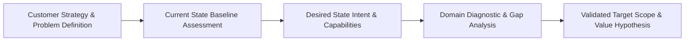
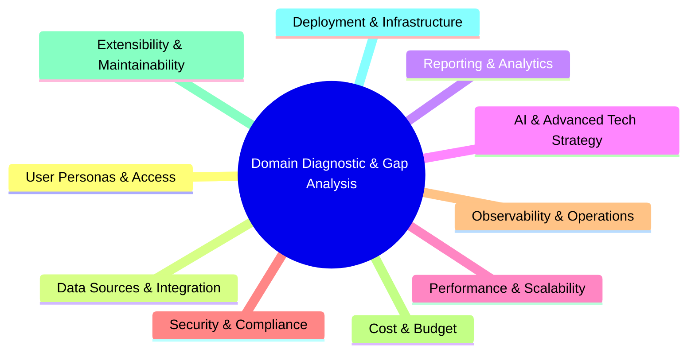

# Stage 01: Discover & Align

## Overview

The **Discover & Align** stage establishes the strategic foundation for any Enterprise Architecture customer engagement. Every new engagement begins by understanding the customer's business strategy, framing the core problem to be solved, defining the Desired State (Intent), and assessing the Current State baseline.

This stage ensures complete alignment across executive, business, and technology stakeholders by answering: **"What problem are we really solving, where is the customer today, what does the desired state look like, and what are the critical gaps?"**

---

## Core Pillars & Methodology

### 1. Customer Strategy & Problem Definition
- **Deconstruct Business Intent:** Uncover root organizational drivers (e.g. revenue expansion, operational efficiency, regulatory compliance, customer retention, or AI enablement).
- **Frame the Core Problem:** Articulate the precise business challenge in plain, non-technical language. Avoid premature solutioning or technology bias.
- **Define Value Metrics:** Establish quantifiable business success metrics prior to evaluating technology options.

### 2. Current State Baseline Assessment
Before proposing target architectures, perform a grounded assessment of the customer's current baseline:
- **Baseline Architecture Audit:** Map existing systems, application catalogs (e.g. LeanIX / TOGAF inventory), data flows, and vendor integrations.
- **Technical Debt & Bottlenecks:** Catalog operational bottlenecks, fragile interfaces, security vulnerabilities, licensing overhead, and scaling limits.
- **Organizational & Process Maturity:** Assess team skills, delivery practices, and operational readiness to identify human and process constraints.

### 3. Desired State Intent
Formulate the target architectural vision that fulfills the business strategy:
- **Target Capability Mapping:** Define the business capabilities required in the desired tomorrow (e.g. *Global Media Asset Distribution*, *Scientific R&D Compliance*, *Automated Customer Workflows*).
- **Target Outcomes & Constraints:** Specify desired operational performance, target cost envelopes, and non-negotiable regulatory or security boundaries.

### 4. Domain Diagnostic & Gap Analysis
Perform a structured gap analysis between the Current State baseline and Desired State intent across 10 critical enterprise domains, evaluating over 130 structural questions:

1. **User Personas & Access (12 Questions):** Current vs target identity federation, access tiers, and user role requirements.
2. **Data Sources & Integration (15 Questions):** Current data silos vs desired data lineage, event streams, and API contracts.
3. **Reporting & Analytics (15 Questions):** Current reporting gaps vs desired executive analytics and operational dashboards.
4. **AI & Advanced Tech Strategy (16 Questions):** Evaluating whether advanced automation or AI components are justified, or if traditional software patterns suffice.
5. **Performance & Scalability (12 Questions):** Current bottlenecks vs target throughput, concurrency, and latency SLAs.
6. **Security & Compliance (15 Questions):** Current compliance gaps vs target encryption, PII masking, and regulatory mandates.
7. **Observability & Operations (15 Questions):** Current monitoring limitations vs target distributed tracing, logging, and operational alerting.
8. **Cost & Budget (10 Questions):** Baseline run costs vs target infrastructure, licensing, and operational expenditure envelopes.
9. **Extensibility & Maintainability (12 Questions):** Current monolithic coupling vs desired modular abstractions and vendor decoupling.
10. **Deployment & Infrastructure (15 Questions):** Current hosting constraints vs target multi-cloud, container, or hybrid delivery environments.

---

## Deliverables by Engagement Archetype

Depending on the engagement scope, Stage 01 produces tailored deliverables:

- **Archetype A (Strategic EA Assessment):** Executive Context Map, Current State Audit Summary, Domain Gap Triage, and  Transformation Roadmap.
- **Archetype B, C & D (Full Engagement):** Comprehensive Baseline & Intent Blueprint, Detailed Gap Matrix, and Scope Boundary Definition.

---

## Governance & Quality Gate

> [!IMPORTANT]
> **Stage Gate Check:** Do not proceed to Stage 02 (Target Architecture & Strategy) until business strategy, Current State baseline findings, and Desired State capability gaps have been reviewed and validated by customer executive and technical leadership.
