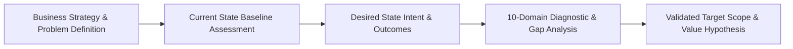
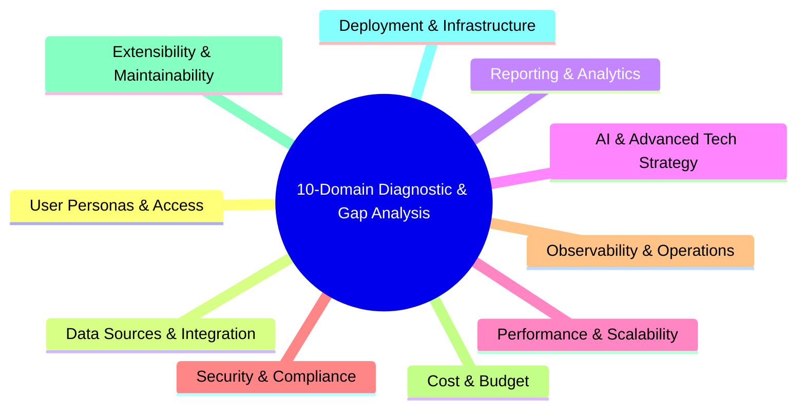

# Stage 01: Frame & Align

## Overview

The **Frame & Align** stage establishes the strategic and operational baseline for any architectural engagement. Every architectural transformation begins by understanding the business strategy, framing the specific problem to be solved, defining the Desired State (Intent), and rigorously assessing the Current State baseline.

This stage eliminates strategic drift by answering the core questions: **"What problem are we really solving, where are we today, what does the desired state look like, and how do we bridge the gap?"**

---

## Core Pillars & Methodology

### 1. Strategy & Problem Definition
- **Deconstruct Strategic Intent:** Identify the overarching organizational drivers (e.g. market expansion, operational cost reduction, regulatory compliance, customer experience modernization).
- **Frame the Core Problem:** Articulate the precise business challenge in plain, non-technical language. Avoid premature solutioning.
- **Define Value Metrics:** Establish quantifiable business success criteria prior to evaluating technology options.

### 2. Current State Baseline Assessment
Before designing new systems, the architect must perform a grounded evaluation of the existing environment:
- **Baseline Architecture Map:** Document existing systems, data flows, application portfolios (e.g. LeanIX / TOGAF inventory), and vendor integrations.
- **Technical Debt & Pain Points:** Catalog operational bottlenecks, fragile interfaces, security vulnerabilities, licensing overhead, and scaling limits.
- **Organizational Capability Assessment:** Gauge the maturity, skills, and readiness of the engineering and operational teams who maintain the baseline.

### 3. Desired State Intent
Formulate the target architectural vision that fulfills the business strategy:
- **Target Capability Mapping:** Define the business capabilities required in the desired tomorrow (e.g. *Global Media Asset Distribution*, *Real-Time Scientific Compliance*, *Automated Workflow Orchestration*).
- **Target Outcomes & Constraints:** Specify the desired operational state, performance expectations, cost envelopes, and non-negotiable regulatory boundaries.

### 4. 10-Domain Diagnostic & Gap Analysis
Perform a structured gap analysis between the Current State and Desired State across 10 critical enterprise domains, evaluating over 130 structural questions:

1. **User Personas & Access (12 Questions):** Current vs target identity federation, access tiers, and user role requirements.
2. **Data Sources & Integration (15 Questions):** Current data silos vs desired data lineage, event streams, and API contracts.
3. **Reporting & Analytics (15 Questions):** Current reporting gaps vs desired executive analytics and operational dashboards.
4. **AI & Advanced Tech Strategy (16 Questions):** Evaluating whether advanced automation or AI/LLM components are justified, or if traditional software patterns suffice.
5. **Performance & Scalability (12 Questions):** Current bottlenecks vs target throughput, concurrency, and latency SLAs.
6. **Security & Compliance (15 Questions):** Current compliance gaps vs target encryption, PII masking, and regulatory mandates.
7. **Observability & Operations (15 Questions):** Current monitoring limitations vs target distributed tracing, logging, and operational alerting.
8. **Cost & Budget (10 Questions):** Baseline run costs vs target infrastructure, licensing, and operational expenditure envelopes.
9. **Extensibility & Maintainability (12 Questions):** Current monolithic coupling vs desired modular abstractions and vendor decoupling.
10. **Deployment & Infrastructure (15 Questions):** Current hosting constraints vs target multi-cloud, container, or hybrid delivery environments.

---

## Inputs & Outputs

### Primary Inputs
- C-suite strategic mandates and business strategy documentation.
- Existing enterprise architecture repository (LeanIX, TOGAF, system diagrams, API catalogs).
- Stakeholder interviews across business, technology, and operations teams.

### Primary Outputs
- **Current State Assessment Report:** Baseline architecture map, technical debt log, and operational constraints.
- **Desired State Intent Document:** Target business capability map and value metrics.
- **10-Domain Diagnostic & Gap Analysis Matrix:** Prioritized gap analysis highlighting technical risks and MVP boundaries.

---

## Governance & Quality Gate

> [!IMPORTANT]
> **Stage Gate Check:** Do not proceed to Stage 02 (Architect & Decouple) until the Current State baseline, Desired State intent, and 10-domain gap analysis have been reviewed and validated by business and technical stakeholders.
