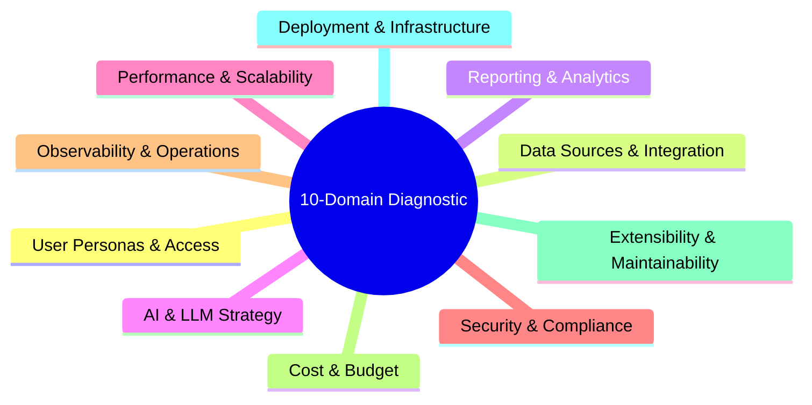

# Stage 01: Frame & Align

## Overview

The **Frame & Align** stage establishes the strategic foundation of any architectural transformation. Before designing systems or deploying AI models, the architect must translate executive strategy and business intent into explicit business capabilities and measurable value outcomes.

This stage eliminates the drift between C-suite strategy and technical reality by answering the core question: **"What problem are we really solving, and what does success look like?"**

---

## Key Activities & Methodology

### 1. Problem-First Value Framing
- **Deconstruct Business Intent:** Uncover the root business drivers (e.g., revenue expansion, operational efficiency, regulatory compliance, customer retention).
- **Define Measurable Outcomes:** Establish quantifiable success metrics prior to discussing technical options.
- **Identify Strategic Constraints:** Pinpoint budget limits, timeframes, regulatory boundaries, and existing legacy technology commitments.

### 2. Strategy-to-Capability Mapping
Map business objectives directly to enterprise business capabilities (e.g., *Scientific R&D Compliance*, *Global Media Distribution*, *Agentic Workflow Orchestration*). This ensures technical transformation remains grounded in core organizational functions rather than technology hype.

### 3. 10-Domain Diagnostic Triage
Execute the Architecture Assessment Framework across 10 critical enterprise domains, evaluating over 130 structural questions:

1. **User Personas & Access (12 Questions):** Who interacts with the system, what are their access tiers, and how is identity federated?
2. **Data Sources & Integration (15 Questions):** Where does data reside, what is the lineage, and what integration patterns (event-driven, REST, batch) apply?
3. **Reporting & Analytics (15 Questions):** What operational metrics, dashboards, and executive insights are required?
4. **AI & LLM Strategy (16 Questions):** What probabilistic model capabilities, context window sizes, RAG pipelines, or multi agent workflows are needed?
5. **Performance & Scalability (12 Questions):** What are peak load thresholds, latency targets, and throughput expectations?
6. **Security & Compliance (15 Questions):** What data classification, encryption standard, and regulatory requirements (GDPR, ISO27001) apply?
7. **Observability & Operations (15 Questions):** How will tracing, error logging, health checks, and alerting be managed?
8. **Cost & Budget (10 Questions):** What are the target compute, storage, and token licensing expenditure boundaries?
9. **Extensibility & Maintainability (12 Questions):** How easily can third-party components be swapped or upgraded?
10. **Deployment & Infrastructure (15 Questions):** What cloud provider, hybrid container environment, or CI/CD pipelines will host the workload?

---

## Inputs & Outputs

### Primary Inputs
- Executive strategic goals & business transformation mandate.
- Current state enterprise architecture documentation (LeanIX / TOGAF repository).
- Organizational capability catalog and domain expert input.

### Primary Outputs
- **Capability Mapping Document:** Business capabilities mapped to target outcomes.
- **Diagnostic Triage Matrix:** Scored 10-domain assessment highlighting gaps and risks.
- **Value Hypothesis & MVP Boundary:** Clear definition of what is strictly in scope vs out of scope.

---

## Governance & Quality Gate

> [!IMPORTANT]
> **Stage Gate Check:** Do not proceed to Stage 02 (Architect & Decouple) until the business value metrics and 10-domain diagnostic boundaries are signed off by both business stakeholders and technical leadership.
