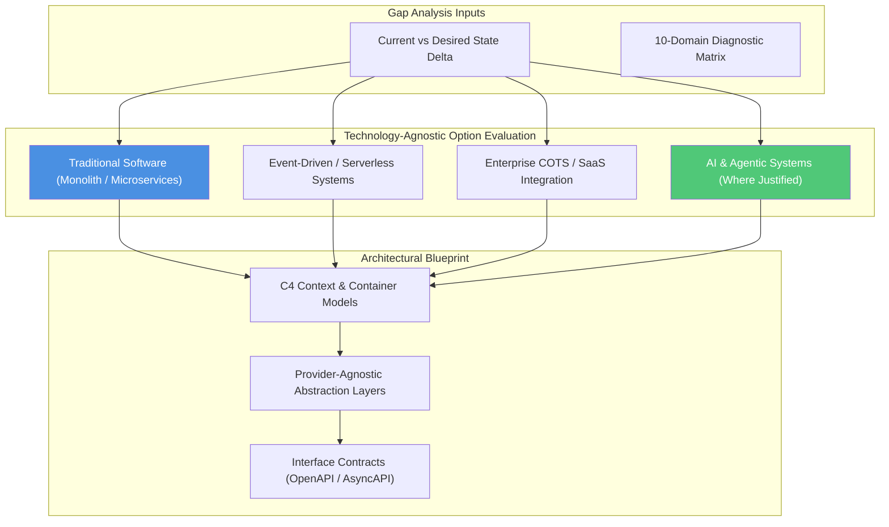

# Stage 02: Architect & Decouple

## Overview

The **Architect & Decouple** stage transforms the gap analysis and Desired State intent into a decoupled, fit-for-purpose system design. This stage is **technology-agnostic**: the architect evaluates a spectrum of architectural options—from classic relational databases and microservices to event-driven architectures, COTS/SaaS integrations, and AI/Agentic systems—selecting the simplest pattern that solves the problem.

The core goal is to establish clean boundaries and vendor-decoupled abstractions: **"How do we structure boundaries so the enterprise remains resilient, decoupled, and fit-for-purpose?"**

---

## Key Activities & Methodology

### 1. Technology-Agnostic Pattern Selection
Evaluate candidate architectural patterns against business value, operational complexity, and total cost of ownership:

| Architectural Pattern | Primary Strengths | Best Fit Scenarios |
| :--- | :--- | :--- |
| **Traditional Microservices / API-First** | High determinism, clear domain ownership, proven scalability. | Standard transactional workflows, CRUD services, core business logic. |
| **Event-Driven / Asynchronous Messaging** | Low coupling, high throughput, real-time reactivity. | Distributed data pipelines, order processing, media ingestion. |
| **Enterprise COTS / SaaS Integration** | Fast time-to-market, vendor-managed maintenance, compliance out of the box. | Standard ERP, CRM, HR, or finance capabilities. |
| **AI & Agentic Systems** | Handles unstructured data, probabilistic reasoning, dynamic workflow adaptation. | Unstructured knowledge extraction, complex decision support, natural language workflows. |

> [!TIP]
> **Simplicity First:** Always choose the simplest architectural pattern that satisfies the requirements. Do not introduce AI or complex distributed patterns if a deterministic database query or standard API solves the problem effectively.

### 2. C4 Architecture Modeling
Communicate system boundaries clearly using the C4 model abstraction hierarchy:
- **Level 1: System Context Diagram:** High-level view showing users, internal systems, external vendor platforms, and organizational boundaries.
- **Level 2: Container Diagram:** Depicting applications, API gateways, microservices, message brokers, datastores, and third-party integrations.
- **Level 3: Component Diagram:** Inner architecture of individual microservices or modules.

### 3. Strategic Vendor Decoupling
Protect the enterprise against vendor lock-in, pricing spikes, and technology obsolescence by building provider-agnostic abstraction layers:
- **Database & Storage Abstraction:** Wrap datastores behind repository interfaces (e.g. SQL, NoSQL, Vector stores).
- **Messaging & Event Abstraction:** Decouple event producers and consumers using standard event schemas (e.g. CloudEvents, Protobuf).
- **AI & External Provider Abstraction:** If AI or external SaaS providers are used, wrap external API calls behind vendor-neutral wrapper interfaces.

---

## Inputs & Outputs

### Primary Inputs
- Gap Analysis and 10-Domain Diagnostic Matrix (from Stage 01).
- Non-functional requirement priority list (P0–P3).
- Existing enterprise tech standards & infrastructure constraints.

### Primary Outputs
- **Technology Pattern Rationale:** Justification for chosen pattern (Traditional, COTS, Event-Driven, or AI).
- **C4 Architecture Blueprint:** Context and Container diagrams (Mermaid / Structurizr).
- **Interface Contracts:** OpenAPI, AsyncAPI, or Protobuf specifications for all container boundaries.

---

## Governance & Quality Gate

> [!IMPORTANT]
> **Stage Gate Check:** Ensure all external cloud, SaaS, or AI model integrations rely on explicit interface contracts and abstraction layers. Direct coupling of application logic to proprietary vendor SDKs is prohibited without an approved Architecture Decision Record (ADR).
