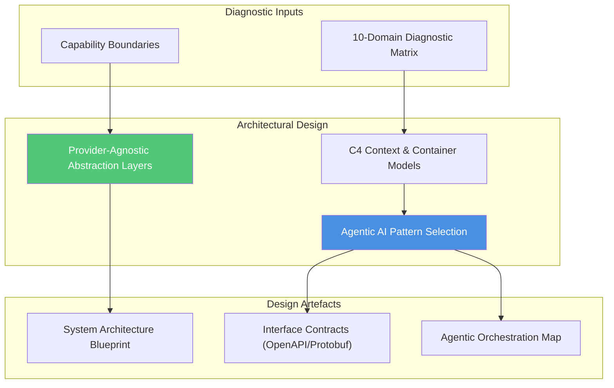

# Stage 02: Architect & Decouple

## Overview

The **Architect & Decouple** stage transforms business requirements and diagnostic insights into a resilient, decoupled system design. This stage defines system boundaries, establishes provider-agnostic abstractions, and selects appropriate Agentic AI architectural patterns.

The core goal is to enable rapid technical innovation while ensuring the enterprise is never locked into a single cloud vendor or AI model provider: **"How do we structure boundaries so the enterprise remains resilient and vendor decoupled?"**

---

## Key Activities & Methodology

### 1. C4 Architecture Modeling
Utilize the C4 model abstraction hierarchy to communicate design clarity across all organizational levels:
- **Level 1: System Context Diagram:** High-level view showing how users, external systems, and enterprise boundaries interact.
- **Level 2: Container Diagram:** Highlighting applications, datastores, AI agent runtimes, and API gateways.
- **Level 3: Component Diagram:** Internal structure of core modules and microservices.
- **Level 4: Code Diagram:** Class and sequence diagrams for complex logic flows.

### 2. Strategic Vendor Decoupling
To protect the enterprise against vendor lock-in and pricing spikes, all core capabilities must be mediated by provider-agnostic abstraction layers:
- **LLM Abstraction Layer:** Interfacing with models (OpenAI, Anthropic, Gemini, local open-weight LLMs) through standardized interfaces (e.g. LiteLLM, LangChain abstractions, custom wrapper interfaces).
- **Storage & Vector Abstraction:** Decoupling vector databases (pgvector, Qdrant, Pinecone) behind repository interfaces.
- **Cloud Infrastructure Abstraction:** Containerizing workloads (Docker, Kubernetes/GKE/Cloud Run) to permit multi-cloud flexibility.

### 3. Agentic AI Pattern Selection
Match functional requirements to proven AI agent architectural patterns derived from the *AI Architecture Enablement* repository:

| Pattern | Description | Ideal Use Case |
| :--- | :--- | :--- |
| **Simple Prompt Agent** | Single-turn zero/few-shot LLM invocation with strict schema enforcement. | Simple entity extraction, text classification. |
| **Stepped / Sequential Agent** | Multi-step chain of thought pipeline where each step's output feeds the next. | Document generation, structured report synthesis. |
| **Multi Agent Team** | Specialized agents operating collaboratively (e.g. Researcher, Architect, Critic). | Complex system analysis, code generation & review. |
| **RAG-Augmented Agent** | Agent equipped with vector search and document retrieval tools. | Enterprise knowledge retrieval, policy QA. |
| **Guardrail Orchestrator** | Dual-layer architecture pairing probabilistic LLM output with deterministic safety guardrails. | High-stakes automated financial/regulatory actions. |

---

## Inputs & Outputs

### Primary Inputs
- Validated 10-Domain Diagnostic Triage Matrix (from Stage 01).
- Non-functional requirement priority list (P0–P3).
- Existing enterprise technical standards & integration contracts.

### Primary Outputs
- **C4 Architecture Blueprint:** Context and Container diagrams (Mermaid / Structurizr).
- **Interface Contracts:** OpenAPI / AsyncAPI definitions for component boundaries.
- **Agentic Architectural Specification:** Mapping of use cases to agent patterns, memory schemas, and tool groups.

---

## Governance & Quality Gate

> [!IMPORTANT]
> **Stage Gate Check:** Ensure all external cloud and AI model integrations rely on explicit interface contracts and abstractions. Direct coupling of application logic to vendor-specific APIs is prohibited without an approved Architecture Decision Record (ADR).
