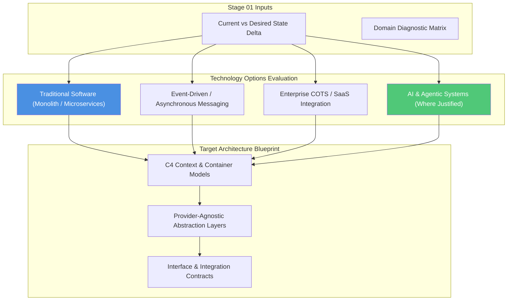

# Stage 02: Target Architecture & Strategy

## Overview

The **Target Architecture & Strategy** stage transforms the Stage 01 gap analysis into a decoupled, fit-for-purpose target architecture design. This stage is **technology-agnostic**: the architect evaluates a full spectrum of technical options—ranging from traditional microservices and monoliths to event-driven architectures, COTS/SaaS integrations, and AI/Agentic systems—selecting the simplest pattern that reliably fulfills the customer's desired state intent.

This stage answers the core question: **"How do we structure target boundaries and technology choices so the customer's enterprise remains resilient, decoupled, and fit-for-purpose?"**

---

## Key Activities & Methodology

### 1. Technology & Vendor Options Evaluation
Evaluate candidate architectural patterns against business value, operational risk, vendor lock-in, and total cost of ownership:

| Architectural Pattern | Primary Strengths | Ideal Customer Use Case |
| :--- | :--- | :--- |
| **Traditional Microservices / API-First** | High determinism, clear domain ownership, proven scalability. | Standard transactional workflows, CRUD services, core business systems. |
| **Event-Driven / Asynchronous Messaging** | Loose coupling, high throughput, real-time reactivity. | Distributed data pipelines, order processing, media ingestion. |
| **Enterprise COTS / SaaS Integration** | Fast time-to-market, vendor-managed maintenance, compliance out of the box. | Standard ERP, CRM, HR, or financial management capabilities. |
| **AI & Agentic Systems** | Handles unstructured data, probabilistic reasoning, dynamic workflow adaptation. | Unstructured knowledge extraction, complex decision support, natural language workflows. |

> [!TIP]
> **Simplicity First:** Always recommend the simplest technical option that satisfies business requirements. Do not introduce AI or complex distributed patterns if a deterministic database query or standard SaaS integration solves the problem effectively.

### 2. C4 Architecture Modeling
Communicate system boundaries clearly across executive and technical audiences using the C4 model hierarchy:
- **Level 1: System Context Diagram:** High-level view showing users, internal customer systems, external vendor platforms, and organizational boundaries.
- **Level 2: Container Diagram:** Highlighting applications, API gateways, microservices, datastores, message brokers, and third-party integrations.
- **Level 3: Component Diagram:** Internal architecture of core microservices or application modules (where deep design is required).

### 3. Strategic Vendor Decoupling
Protect the customer against vendor lock-in, price hikes, and technology obsolescence by building provider-agnostic abstraction layers:
- **Database & Storage Abstraction:** Wrap datastores behind repository interfaces (e.g. SQL, NoSQL, Vector stores).
- **Messaging & Event Abstraction:** Decouple event producers and consumers using standard event schemas (e.g. CloudEvents, Protobuf).
- **AI & SaaS Provider Abstraction:** If AI models or SaaS vendor APIs are integrated, wrap external calls behind vendor-neutral wrapper interfaces.

---

## Deliverables by Engagement Archetype

- **Archetype B, C & D (Blueprint & Full Engagements):** Complete Target Architecture Specification, C4 Context & Container Diagrams, Options Rationale Matrix, and Strategic Abstraction Contracts.

---

## Governance & Quality Gate

> [!IMPORTANT]
> **Stage Gate Check:** Ensure all target cloud, SaaS, or AI model integrations rely on explicit interface contracts and abstraction layers. Direct coupling of application logic to proprietary vendor SDKs is prohibited without an approved Architecture Decision Record (ADR).
