# Stage 02: Target Architecture & Strategy

> [!IMPORTANT]
> **Classification Level**: `RESTRICTED / HIGHLY CONFIDENTIAL` — Enterprise Architecture Operating Model.

## Overview

The **Target Architecture & Strategy** stage translates the established business intent, problem, decision, requirements, constraints, and architectural context into a coherent architectural direction and, where required, a defined target architecture.
The stage is **technology-agnostic**. Architectural options are considered according to the problem being solved rather than starting from a preferred technology, architecture pattern, platform, vendor, or implementation approach.
The depth of this stage is determined by the engagement scope and architectural question. A focused engagement may require only architectural direction and evaluation of a small number of options. A broader transformation may require a complete target architecture, detailed models, technology and vendor evaluation, and transition implications.
The purpose is not to produce complexity for its own sake. The objective is to establish the **simplest architecture that adequately satisfies the relevant business, functional, non-functional, operational, organisational, regulatory, and strategic requirements**, while making material trade-offs explicit.
Where relevant, architectural reasoning should make explicit how the required evolution of a business capability translates into business, process, and architectural change.
A useful reasoning chain is:

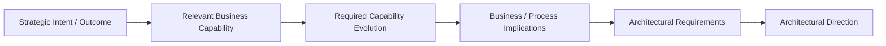

This does not imply that every engagement requires a formal capability model or capability assessment. The relevant level of capability analysis should be proportionate to the architectural question.

This stage answers:

What architectural direction best addresses the established need, what meaningful alternatives and trade-offs matter, what should the target architecture look like, and what implications follow from that direction?

Architecture is developed through a controlled iterative reasoning loop rather than a linear sequence of activities.

The working pattern is:

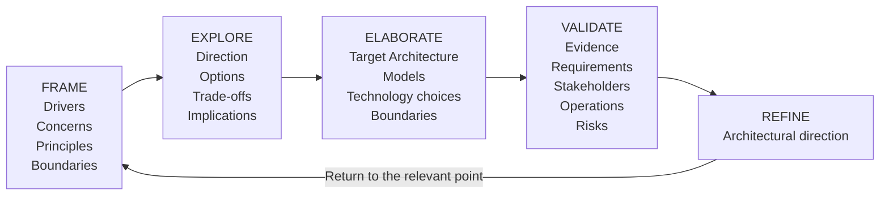

The loop may be entered at different points depending on the engagement.

Refinement may return to any earlier activity where new evidence, stakeholder input, architectural analysis, or an unresolved concern materially affects the direction.

The architecture process therefore remains adaptive without becoming uncontrolled.

⸻

## 1.Core Principles

Outcome Before Technology

Architectural decisions begin with the business outcome, problem, decision, capability need, or constraint established through the engagement’s current understanding of the context.

Where capability evolution is relevant, architectural reasoning should make the relationship between business intent and architecture explicit:

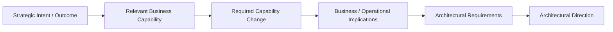

Technology is evaluated as a means of satisfying those needs, not as the starting point.

⸻

## 2. Context Before Architecture

Architectural context is progressively established rather than assumed to be complete at the beginning of Stage 02.

As target-state thinking develops, new architectural questions may require:

* additional evidence;
* stakeholder input;
* investigation;
* clarification of requirements;
* validation of assumptions;
* examination of dependencies;
* reconsideration of the original interpretation.

Where important contextual information is absent, the architect should distinguish between:

* known facts;
* validated assumptions;
* constraints;
* uncertainties;
* material evidence gaps.

Architecture should not manufacture certainty that the evidence does not support.

⸻

## 3. Simplicity First

Prefer the simplest architectural approach that satisfies the relevant requirements and constraints.

Complexity should have a demonstrable purpose.

Do not introduce:

* microservices where a modular application is sufficient;
* event-driven architecture where synchronous interaction is adequate;
* AI where deterministic logic is sufficient;
* additional platforms where existing capabilities can satisfy the requirement;
* abstraction layers where the dependency risk does not justify them.

Simplicity does not mean choosing the least capable solution.

It means avoiding architectural complexity that does not create corresponding value.

⸻

## 4. Technology-Agnostic Evaluation

The architect should remain open to materially relevant architectural approaches, including:

* existing platforms and applications;
* modular monoliths;
* distributed services;
* APIs and integration platforms;
* event-driven and asynchronous architectures;
* COTS and SaaS capabilities;
* data platforms;
* automation and workflow platforms;
* AI and agentic systems;
* hybrid approaches.

These are examples of possible solution patterns, not mandatory categories that must be evaluated in every engagement.

⸻

## 5. Options Before Commitment

Where meaningful architectural alternatives remain open, the architect should identify and evaluate them before establishing a recommendation.

Options should be considered in the context of:

* business fit;
* architectural fit;
* functional and non-functional requirements;
* operational implications;
* organisational capability;
* delivery complexity;
* security and compliance;
* cost and commercial implications;
* strategic alignment;
* dependencies;
* reversibility;
* future flexibility.

Where strategic direction or a material decision is already sufficiently established, the architect should focus on validating its architectural implications rather than manufacturing alternatives.

Not every engagement requires a formal multi-option analysis.

⸻

## 6. Contextual Trade-offs

There is rarely a universally correct architecture.

Architectural judgement must make trade-offs explicit rather than presenting a selected architecture as objectively optimal without qualification.

Typical trade-offs may include:

* simplicity vs scalability;
* speed vs control;
* flexibility vs standardisation;
* autonomy vs governance;
* build vs buy;
* centralisation vs decentralisation;
* determinism vs adaptability;
* short-term value vs strategic flexibility;
* vendor capability vs vendor dependency.

Trade-offs should be assessed according to the context and consequences relevant to the engagement.

⸻

## 7. Appropriate Decoupling

Architectural boundaries should be introduced where they create material architectural or strategic value.

Potential forms include:

* domain boundaries;
* API contracts;
* event contracts;
* integration boundaries;
* data access boundaries;
* provider abstraction;
* model/provider abstraction for AI;
* platform interfaces.

Existing capabilities and assets should be reused or evolved where they remain fit for purpose.

Abstraction is not automatically desirable.

Additional layers introduce their own complexity and should therefore be justified by factors such as:

* dependency risk;
* substitution requirements;
* strategic flexibility;
* ownership;
* expected change;
* operational consequences.

⸻

## 8. Architecture Must Reflect Operational Reality

The target architecture must be viable within the organisation that will operate and evolve it.

Consider:

* skills and capability;
* operating model;
* support model;
* service ownership;
* observability;
* security operations;
* resilience;
* deployment and release practices;
* data ownership;
* governance;
* supplier relationships;
* organisational readiness.

A technically elegant architecture that the organisation cannot operate is not a fit-for-purpose architecture.

⸻

## 9. AI Is an Architectural Choice, Not a Default

AI and agentic systems should be considered where the problem characteristics justify them.

Potentially suitable characteristics include:

* unstructured information;
* knowledge-intensive processes;
* natural-language interaction;
* probabilistic reasoning;
* dynamic workflow adaptation;
* complex decision support;
* pattern recognition;
* human-AI collaboration.

Where deterministic software, data queries, rules, automation, or existing platforms adequately solve the problem, AI should not be introduced merely because it is available.

⸻

## 10. Evolution, Reuse and Strategic Fit

Target architecture should consider how existing capabilities, platforms and strategic assets can be:

* reused;
* evolved;
* consolidated;
* replaced;
* retired.

Evolution may be preferable where existing capabilities remain viable and strategically aligned.

This does not imply preserving unsuitable legacy architecture.

Material:

* technical debt;
* strategic constraints;
* business limitations;
* security concerns;
* operational limitations;
* future-state requirements;

may justify replacement or retirement.

The architectural judgement should therefore consider the strategic fit of both existing and proposed capabilities.

⸻

## 11. Progressive Architectural Direction

Architectural direction should emerge progressively as:

* strategic intent;
* relevant business capabilities;
* required capability evolution;
* business and process implications;
* evidence;
* existing assets;
* constraints;
* stakeholder perspectives;
* architectural options;

become better understood.

The architect should consider not only what the architecture should look like, but also what the architecture must enable the business to do differently.

Where capability evolution is material, the reasoning should connect:

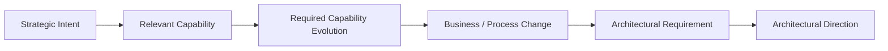

Target architecture should not be treated as a fully formed design that is produced independently of investigation.

As architectural thinking develops, it may:

* identify additional evidence requirements;
* expose previously unrecognised constraints;
* change interpretation of the problem;
* reveal reuse or evolution opportunities;
* eliminate options;
* introduce new concerns;
* expose dependencies;
* change the appropriate level of abstraction.

The architect should maintain a deliberate feedback loop between:

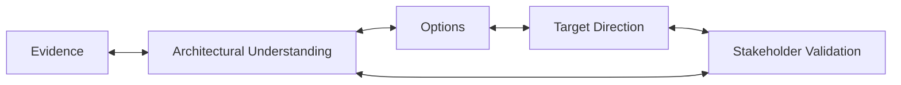

This does not turn Stage 02 into unrestricted discovery.

It recognises that architectural reasoning and evidence development interact.

⸻

## 12. Traceability

Material architectural conclusions should remain traceable to their underlying context and evidence.

Where relevant, the traceability chain should make the relationship between business capability evolution and architecture explicit:

```mermaid
flowchart LR
    A["Strategic Intent / Outcome"]
    B["Relevant Business Capability"]
    C["Required Capability Evolution"]
    D["Business / Process Implications"]
    E["Architectural Requirement"]
    F["Architectural Concern"]
    G["Evidence / Analysis"]
    H["Options / Trade-offs"]
    I["Architectural Judgement"]
    J["Target Architecture / Direction"]
    K["Decision"]
    A --> B
    B --> C
    C --> D
    D --> E
    E --> F
    F --> G
    G --> H
    H --> I
    I --> J
    J --> K
```

Not every architectural engagement requires every element of the chain.

The architect should maintain the level of traceability necessary to explain material architectural reasoning.

This allows architecture to be:

* challenged;
* explained;
* validated;
* revisited;
* governed.

⸻

## 13. Collaborative Human Architectural Judgement

Architectural judgement remains accountable to the architect, but architecture should be developed, challenged and validated with the relevant:

* business;
* technology;
* operational;
* security;
* governance;
* delivery;
* organisational;

stakeholders.

AI and automation may accelerate evidence analysis, comparison, modelling, option generation, documentation and quality checking.

They do not transfer accountability for architectural judgement.

The architect remains accountable for:

* interpretation;
* materiality;
* trade-offs;
* recommendation;
* architectural coherence;
* communication;
* decision quality.

⸻

## 14. Core Workflow

Architecture is developed through the following reasoning loop:

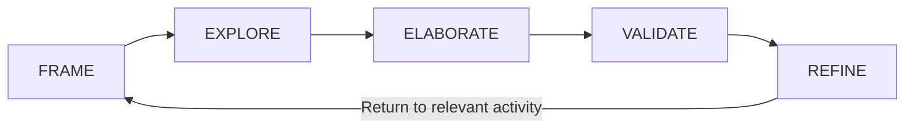

The activities below describe the principal work performed within that loop.

They are not mandatory linear steps.

An engagement may enter, revisit, combine, or omit activities according to:

* architectural question;
* scope;
* evidence;
* complexity;
* uncertainty;
* stakeholder concerns;
* required confidence.

⸻

### 14.1 FRAME

**Frame the Architectural Problem**
Confirm the architectural problem being addressed and the purpose of the architectural work.

Establish, where relevant:

* business outcome;
* problem;
* decision;
* strategic objective;
* relevant strategic priority;
* relevant business capability;
* required capability change or evolution;
* material business or process implications;
* requirements;
* constraints;
* relevant context;
* decision consequences.

Where the engagement concerns a specific architectural decision, explicitly identify the decision being supported.

Where capability evolution is relevant, establish what the architecture is expected to enable the business or organisation to do differently.

Key questions:

* What are we trying to achieve?
* What problem are we solving?
* What decision needs to be supported?
* What architectural question must be answered?
* Why does it matter?
* Which strategic priority or business capability is relevant?
* What capability change is required?
* What would make the architectural work successful?

Output:

* Framed architectural problem.
* Confirmed drivers.
* Relevant strategic priorities where applicable.
* Relevant capability context where applicable.
* Required capability evolution where applicable.
* Material business/process implications where applicable.
* Material requirements and constraints.
* Decision context where applicable.

⸻

**Identify Architectural Concerns and Constraints**
Translate the established context into the architectural concerns that need to be resolved.

Examples include:

* system boundaries;
* capability ownership;
* integration;
* data ownership;
* security;
* identity;
* resilience;
* scalability;
* performance;
* observability;
* deployment;
* operational ownership;
* vendor dependency;
* regulatory requirements;
* AI governance;
* organisational capability.

Distinguish between:

Requirements

What the architecture needs to satisfy.

Constraints

Conditions within which the architecture must operate.

Concerns

Areas requiring architectural analysis.

Assumptions

Propositions that remain unvalidated.

Output:

* Architectural concerns.
* Requirements and constraints.
* Material assumptions.

⸻

**Establish Architectural Principles and Boundaries**
Establish the principles and boundaries that will guide architectural choices.

These may include:

* reuse before replacement;
* simplicity before unnecessary distribution;
* API-first integration where appropriate;
* explicit ownership;
* security by design;
* data ownership and stewardship;
* observable operations;
* automation where economically justified;
* human oversight for material AI decisions;
* provider independence where strategically valuable.

Principles should be specific enough to influence decisions without becoming arbitrary technology mandates.

Establish relevant boundaries such as:

* systems;
* domains;
* organisational responsibilities;
* data domains;
* trust boundaries;
* integration boundaries;
* platform boundaries.

Output:

* Architectural principles.
* Initial architecture boundaries.
* Ownership boundaries.

⸻

**Establish Initial Architectural Direction**
Before selecting specific technologies, establish an initial architectural shape or direction.

Consider:

* logical system boundaries;
* capability ownership;
* required capability changes;
* business/process implications;
* application responsibilities;
* information and data boundaries;
* interaction patterns;
* integration patterns;
* operational responsibilities;
* deployment boundaries;
* security and trust boundaries.

A key question is:

What must the architecture enable the business or organisation to do differently?

Where capability evolution is material, establish the relationship between:

The initial direction should be described at an appropriate level of abstraction.

It is not assumed to be final.

It provides a working architectural hypothesis that can be explored, challenged and refined.

Output:

* Initial architectural direction.
* Logical architecture structure.
* Initial system and capability boundaries.
* Initial relationship between capability change and architectural requirements where relevant.

⸻

### 14.2 EXPLORE

**Identify Meaningful Architectural Options**
Identify realistic alternatives capable of satisfying the established drivers and constraints.

Options may involve:

* extending existing systems;
* introducing new capabilities;
* consolidating platforms;
* replacing existing systems;
* COTS/SaaS adoption;
* custom development;
* integration approaches;
* synchronous or asynchronous communication;
* centralised or distributed models;
* deterministic or AI-enabled approaches;
* hybrid architectures;
* evolution of existing capabilities;
* retirement of unsuitable capabilities.

Do not create artificial options simply to populate a comparison table.

The number of options should reflect genuine architectural alternatives.

Where the strategic direction is already sufficiently established, focus on validating its implications rather than manufacturing alternatives.

Output:

* Candidate architectural options.
* Rationale for option selection.

⸻

**Evaluate Options and Trade-offs**
Evaluate meaningful options against the concerns established earlier.

Assessment criteria may include:

Dimension                    Typical Considerations
Business / Capability Fit   Contribution to required outcomes, affected capabilities and required capability evolution
Functional Fit              Ability to satisfy required capabilities
Technical Fit               Compatibility with existing and target environment
Operational Fit             Supportability, observability, resilience and ownership
Security & Compliance       Risk, controls, regulatory and data requirements
Delivery Complexity         Skills, dependencies, migration and implementation complexity
Scalability & Performance   Expected growth and workload characteristics
Strategic Fit               Alignment with future direction and enterprise principles
Commercial Considerations   Cost, licensing, supplier and commercial implications
Dependency Risk             Vendor, platform, technology and organisational dependencies
Reversibility               Ability to change direction if assumptions change

Evaluation may be:

* qualitative;
* quantitative;
* or a combination.

A scoring model should only be used where it improves decision quality.

Numerical scores must not create false precision.

Output:

* Options assessment.
* Trade-off analysis.
* Preferred direction where appropriate.
* Rationale for architectural judgement.

⸻

**Investigate Architectural Implications**
Investigate the consequences of the emerging architectural direction.

This may include:

* existing-system impact;
* integration implications;
* data implications;
* security implications;
* operational implications;
* organisational implications;
* technology lifecycle;
* dependency implications;
* migration implications;
* scalability;
* resilience;
* cost;
* delivery complexity;
* future flexibility.

The investigation should be targeted.

Do not analyse every architecture dimension to the same depth unless the engagement requires it.

New findings may:

* strengthen the current direction;
* weaken it;
* eliminate an option;
* identify a new option;
* require additional evidence;
* reveal a material constraint.

Output:

* Architectural implications.
* Material risks and dependencies.
* Additional evidence requirements where identified.

⸻

**Refine Architectural Direction**
Refine the emerging architectural direction based on:

* evidence;
* analysis;
* options;
* trade-offs;
* stakeholder input;
* constraints;
* architectural implications.

Refinement may include:

* changing boundaries;
* changing architectural patterns;
* selecting a different option;
* combining options;
* reusing additional existing capabilities;
* introducing or removing abstractions;
* changing technology choices;
* reducing unnecessary complexity.

Refinement may return to any earlier activity in the architectural loop.

Output:

* Refined architectural direction.
* Updated assumptions and concerns.
* Updated option assessment.

⸻

### 14.3 ELABORATE

**Evaluate Technology and Vendor Choices**
Where specific technology or vendor choices are required, evaluate them after establishing the architectural need.

Consider:

* functional capability;
* architectural compatibility;
* maturity;
* security;
* operational model;
* integration;
* data portability;
* licensing;
* total cost;
* supplier viability;
* ecosystem;
* skills availability;
* strategic alignment;
* exit and substitution considerations.

Examples include:

* cloud services;
* SaaS platforms;
* databases;
* integration platforms;
* messaging technologies;
* observability platforms;
* AI model providers;
* vector or retrieval technologies;
* identity platforms.

The architecture should not become vendor-defined merely because a vendor has been selected.

Output:

* Technology/vendor assessment.
* Material dependencies.
* Technology selection rationale.

⸻

**Apply AI and Agentic Architecture Analysis Where Relevant**
Where AI or agentic capability is part of the problem or candidate architecture, evaluate it as an architectural system rather than simply as a model selection.

Consider:

* problem suitability;
* model capabilities and limitations;
* context and knowledge requirements;
* retrieval and grounding;
* tool and system interaction;
* human oversight;
* guardrails;
* security;
* privacy and data handling;
* observability;
* evaluation;
* failure modes;
* determinism requirements;
* cost and latency;
* model/provider dependency;
* lifecycle management.

For agentic systems, consider relevant architectural concerns such as:

* responsibility and agent boundaries;
* autonomy;
* tool permissions;
* state and memory;
* context management;
* orchestration;
* human-in-the-loop controls;
* idempotency;
* auditability;
* observability;
* failure recovery.

These considerations are applied when relevant rather than treated as mandatory components of every architecture.

Output:

* AI/agentic architectural assessment where applicable.
* AI-specific risks and controls.
* AI architecture direction where justified.

⸻

**Model the Architecture**
Create architecture models that communicate the selected direction at the appropriate level of abstraction.

The C4 model may be used where useful to communicate:

* System Context;
* Container;
* Component.

C4 is a modelling technique, not a mandatory deliverable for every engagement.

Other appropriate artefacts may include:

* capability maps;
* application landscapes;
* logical architecture diagrams;
* data flow diagrams;
* integration views;
* deployment views;
* security/trust-boundary views;
* sequence diagrams;
* process views;
* operating model views.

The selected views should answer the architectural questions relevant to the engagement.

Output:

* Architecture models appropriate to scope.
* Supporting architecture views.

⸻

**Define Strategic Boundaries and Abstractions Where Justified**
Where material dependency or substitution risk exists, establish appropriate architectural boundaries.

Potential mechanisms include:

* API contracts;
* domain interfaces;
* event contracts;
* data access interfaces;
* integration boundaries;
* provider abstraction;
* AI model/provider abstraction;
* platform interfaces.

The decision to introduce an abstraction should consider both:

Value

* reduced dependency;
* substitution capability;
* improved governance;
* clearer ownership;
* future flexibility.

Cost

* additional complexity;
* development effort;
* operational overhead;
* reduced access to provider-specific capabilities;
* additional failure or performance boundaries.

A provider-specific integration may be entirely appropriate where the dependency is understood, accepted, and proportionate to the value gained.

Output:

* Architectural boundaries.
* Interface or integration contracts where required.
* Material dependency decisions.

⸻

**Formulate the Target Architecture and Architectural Judgement**
Consolidate the analysis into a coherent architectural direction.

The target architecture should make explicit:

* what is being proposed;
* why it addresses the established need;
* which relevant capability changes it enables;
* how those capability changes translate into business or process change where material;
* how the major components or capabilities interact;
* material assumptions;
* material constraints;
* significant trade-offs;
* key risks;
* important dependencies;
* rejected alternatives where useful;
* areas of remaining uncertainty.

Where relevant, the reasoning should make explicit:

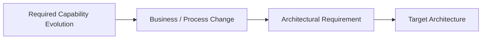

The architect should distinguish between:

* architectural fact;
* architectural recommendation;
* architectural assumption;
* architectural decision.

The target architecture should be sufficiently detailed for the purpose of the engagement.

It should not contain implementation detail that cannot be justified by the architectural question.

Output:

* Target architecture.
* Architectural recommendation/judgement.
* Supporting rationale.

⸻

### 14.4 VALIDATE

**Validate the Architecture**
Challenge the architecture against the original drivers, requirements, constraints and evidence.

Validate:

* business alignment;
* capability alignment;
* requirement coverage;
* architectural coherence;
* operational feasibility;
* security and compliance;
* scalability and resilience;
* organisational readiness;
* technology assumptions;
* vendor dependencies;
* cost implications;
* major risks;
* reversibility;
* unresolved uncertainties.

Validation should involve the relevant stakeholders according to the engagement scope.

Where material evidence gaps remain, record their effect on confidence rather than silently resolving them through assumptions.

Output:

* Validated architecture.
* Confidence assessment.
* Outstanding risks, assumptions and evidence gaps.

⸻

### 14.5 REFINE

**Refine and Re-enter the Architectural Loop Where Required**
Validation may identify a need to revisit earlier architectural reasoning.

Examples include:

* an unrecognised requirement;
* a material stakeholder concern;
* an operational constraint;
* a previously unknown dependency;
* a technology limitation;
* a security concern;
* an unacceptable trade-off;
* insufficient evidence;
* an architectural inconsistency.

Where this occurs, return to the relevant point in the loop.

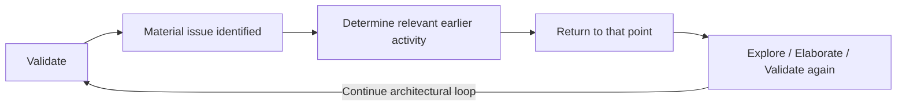

The loop should not be restarted indiscriminately.

Return only to the point necessary to resolve the identified issue.

⸻

## 15 Identify Transition and Implementation Implications Where Required

Where the engagement requires more than target-state definition, identify the implications of moving toward the target architecture.

Consider:

* transition states;
* sequencing;
* dependencies;
* migration;
* coexistence;
* decommissioning;
* organisational change;
* capability development;
* platform enablement;
* implementation risks.

A detailed transformation roadmap should only be produced when it is within the engagement scope and supported by sufficient evidence.

[!NOTE]
A target architecture and an implementation roadmap are related but distinct artefacts. Establishing a target state does not automatically imply that a detailed transition roadmap can or should be produced.

Output:

* Transition implications.
* Migration considerations.
* Implementation dependencies.
* Roadmap inputs where applicable.

⸻

## 16. Capture Material Architectural Decisions

Material architectural decisions should be recorded in an appropriate decision record.

A decision record should capture, where relevant:

* decision;
* context;
* problem or question;
* options considered;
* decision criteria;
* trade-offs;
* rationale;
* consequences;
* assumptions;
* dependencies;
* risks;
* confidence;
* ownership.

An ADR is one mechanism for recording decisions.

The level of formality should be proportionate to the significance of the decision.

Output:

* ADRs or equivalent architectural decision records.
* Decision traceability.

⸻

## 17. Architecture Loop Exit Condition

The architectural reasoning loop may conclude when:

* the architectural problem and drivers are sufficiently understood;
* material architectural concerns have been addressed;
* relevant capability implications have been sufficiently understood where applicable;
* meaningful alternatives have been considered where appropriate;
* the proposed architecture is coherent across relevant dimensions;
* material assumptions, risks, dependencies and uncertainties are explicit;
* the architecture has been sufficiently challenged and validated;
* the level of confidence is appropriate to the engagement purpose;
* no unresolved issue remains that would materially change the architectural direction.

If these conditions are not met, the architect should return to the relevant point in the architectural reasoning loop.

The loop is therefore complete when the architecture is sufficiently coherent, evidence-supported, stakeholder-validated and appropriate to the purpose and scope of the engagement.

Completion does not imply that all architectural uncertainty has been eliminated.

⸻

## 18. Governance & Quality Gates

The following gates operate as control conditions within the architectural reasoning loop.

They are not intended to imply a fixed sequence.

A gate may be invoked whenever the relevant condition becomes material.

⸻

### Gate 1 — Context Sufficiency

Before substantive target architecture work proceeds, confirm that the architectural context is sufficiently established for the intended analysis.

If material information is missing, either:

* obtain the required evidence;
* explicitly record assumptions and proceed only where reasonable;
* reduce the confidence of the conclusion;
* or reassess the engagement scope or method.

Missing information does not automatically constitute a material evidence gap.

The question is whether the missing information could materially change the architectural judgement.

⸻

### Gate 2 — Architectural Scope

Confirm that the architecture being produced is consistent with the agreed scope and boundary.

If answering the architectural question requires materially redefining:

* business strategy;
* required capabilities;
* target-state direction;
* enterprise scope;
* transformation objectives;
* transition strategy;

the engagement should be reassessed to determine whether broader Architecture Assessment & Roadmap or another architectural method is required.

Scope Escalation Gate

Stage 02 should escalate where the architectural question cannot be answered without establishing or materially redefining broader:

* current-state conditions;
* architectural root causes;
* capability needs;
* strategic target direction;
* transformation priorities;
* transition architectures;
* roadmap sequencing.

The architect should not silently expand Stage 02 into a broader assessment.

⸻

### Gate 3 — Options and Trade-offs

Where meaningful alternatives exist, ensure that the recommendation is supported by explicit consideration of those alternatives and their material trade-offs.

Do not rely on:

* technology preference;
* vendor preference;
* fashionable architecture patterns;
* AI adoption pressure;
* unsupported assumptions.

Where the direction is already sufficiently established, validate its architectural implications rather than manufacturing alternatives.

⸻

### Gate 4 — Architectural Coherence

Confirm that the proposed architecture is coherent across relevant dimensions:

* business;
* capability;
* application;
* data;
* integration;
* technology;
* security;
* operations;
* organisation;
* governance.

Not every dimension requires equal depth.

The assessment should reflect the architectural question.

Architectural coherence should be assessed at the level necessary to establish that the proposed architecture is viable and internally consistent.

⸻

### Gate 5 — Dependency and Vendor Risk

Ensure that material dependencies are understood.

Where provider-specific technologies are used, explicitly consider:

* strategic dependency;
* substitution difficulty;
* portability;
* commercial exposure;
* operational dependency;
* provider-specific capabilities.

Abstraction should be introduced where its expected value justifies its cost and complexity.

⸻

### Gate 6 — AI / Agentic Architecture

Where AI or agentic systems are proposed, confirm that the architecture addresses relevant:

* security;
* privacy;
* data;
* context;
* evaluation;
* observability;
* human oversight;
* guardrails;
* failure modes;
* operational ownership;
* model/provider dependency.

For agentic architectures, consider where relevant:

* autonomy boundaries;
* tool permissions;
* state and memory;
* orchestration;
* auditability;
* failure recovery;
* human intervention;
* idempotency.

AI adoption must be justified by the problem characteristics and requirements.

⸻

### Gate 7 — Evidence, Traceability and Confidence

Material recommendations should be traceable through:

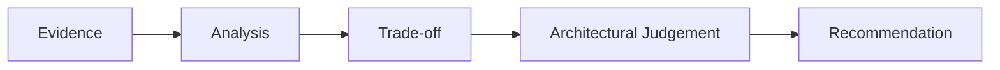

Where relevant, traceability should also connect the recommendation back to the business capability and required capability evolution.

Record material:

* assumptions;
* unresolved evidence gaps;
* risks;
* dependencies;
* uncertainties.

Confidence should reflect the quality and completeness of the evidence supporting the conclusion.

Confidence should not be presented as numerical precision unless a defensible basis exists.

⸻

### Gate 8 — Human Architectural Accountability

AI or automation may be used to accelerate architectural analysis and production of artefacts.

Final architectural judgement must nevertheless be reviewed and accepted by the accountable architect.

The architect remains accountable for:

* interpretation;
* materiality;
* trade-offs;
* recommendation;
* architectural coherence;
* communication;
* decision quality.

⸻

## 19. Architectural Outcomes

Stage 02 may establish some or all of the following substantive architectural outcomes, depending on scope:

* architectural direction;
* target architecture;
* architectural options;
* options and trade-offs;
* architectural judgement;
* material architectural decisions;
* architectural principles and boundaries;
* material risks;
* assumptions and uncertainties;
* dependencies;
* technology/vendor direction;
* AI/agentic architecture direction;
* transition implications;
* roadmap inputs.

These are outcomes of architectural reasoning, not mandatory documents.

⸻

## 20. Supporting Architecture Artefacts

Where useful, the architectural work may produce supporting artefacts such as:

* architecture models;
* capability views;
* application/system views;
* data views;
* integration views;
* security and trust-boundary views;
* deployment views;
* technology/vendor assessments;
* AI/agentic architecture views;
* interface contracts;
* integration contracts;
* dependency views;
* ADRs;
* risk and assumption registers.

Artefacts should be produced where they improve:

* understanding;
* communication;
* decision quality;
* traceability;
* governance;
* implementation.

The production of an artefact is not itself evidence that the architectural problem has been adequately addressed.

⸻

## 21. Target Architecture Blueprint

Where the engagement requires a formal Target Architecture Blueprint, the blueprint should be assembled from the architectural analysis and outcomes produced during Stage 02.

The blueprint is a possible synthesis of Stage 02 outputs, not an automatic Stage 02 deliverable.

A typical structure may include:

1. Executive Summary
2. Business Context and Architectural Drivers
3. Problem / Decision Statement
4. Scope and Architecture Boundary
5. Requirements and Constraints
6. Architectural Principles
7. Current-State Context Where Relevant
8. Capability and Domain Context Where Relevant
9. Target Architecture Overview
10. Architecture Models and Views
11. Data Architecture Where Relevant
12. Integration Architecture
13. Security and Trust Boundaries
14. Deployment / Infrastructure Architecture Where Relevant
15. AI / Agentic Architecture Where Relevant
16. Technology and Vendor Assessment
17. Options and Trade-offs
18. Architectural Decisions
19. Risks, Assumptions and Dependencies
20. Transition Implications Where Relevant
21. Governance and Operational Considerations
22. Recommendations and Next Steps

Not every blueprint requires every section.

The contents should reflect:

* scope;
* architectural question;
* required confidence;
* stakeholder concerns;
* intended use of the blueprint.

⸻

## 22. Relationship to Stage 01 — Discover & Align

Stage 01 establishes sufficient context for architectural reasoning.

It establishes, as required:

* business intent;
* strategic priorities;
* relevant business capabilities;
* required capability context;
* problem/question/decision;
* context;
* scope;
* evidence base;
* relevant constraints;
* required depth;
* what architectural work is actually required.

Stage 02 establishes:

* architectural direction;
* architectural options;
* architectural trade-offs;
* target architecture where required;
* architectural judgement;
* material architectural decisions;
* transition implications where required.

The relationship can be expressed as:

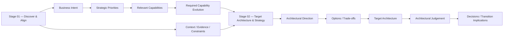

The boundary is not a hard hand-off.

Stage 02 may identify that additional evidence is required.

Where this occurs, the architect should obtain the necessary evidence and return to the relevant architectural reasoning activity.

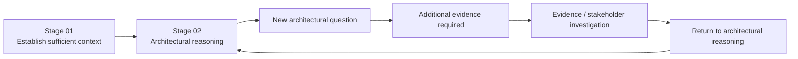

Stage 02 should not, however, silently expand into unrestricted discovery.

If the additional work materially changes the engagement scope or requires broader current-state assessment, target-state establishment, prioritisation or roadmap development, the engagement should be reassessed.

⸻

## 23. Relationship to Architecture Assessment & Roadmap

Architecture Assessment & Roadmap is a separate Engagement Method.

It addresses the broader question:

Where are we now, why are we in this position, where do we need to be, what needs to change, and what is the most practical way to get there?

Stage 02 addresses the narrower architectural question:

Given what we currently understand, what architectural direction best satisfies the need, what meaningful alternatives exist, what trade-offs matter, and what should the target architecture be?

Architecture Assessment & Roadmap may require substantive work across:

* Stage 01;
* Stage 02;
* Stage 03;
* Stage 04;
* and potentially Stage 05.

The escalation from Stage 02 to Architecture Assessment & Roadmap is therefore based on the architectural question and scope, not simply the size of the engagement.

Escalation may be appropriate where answering the question requires establishing or materially redefining:

* current-state conditions;
* architectural root causes;
* broader capability gaps;
* strategic target direction;
* transformation priorities;
* transition architectures;
* roadmap sequencing.

Stage 02 may provide target architecture inputs to an Assessment & Roadmap engagement without itself becoming the full assessment method.

⸻

## 24. Relationship to Stage 03 — Governance & Decision Framework

Stage 02 may establish:

* architectural principles;
* architecture boundaries;
* governance-relevant architectural constraints;
* material decisions;
* required controls;
* governance implications.

Stage 03 establishes or evolves:

* decision rights;
* governance forums;
* authority;
* escalation mechanisms;
* standards;
* compliance mechanisms;
* architecture review processes;
* exceptions;
* governance operating model.

The distinction is:

Stage 02 identifies what governance the architecture requires; Stage 03 establishes how that governance operates.

⸻

## 25. Relationship to Stage 04 — Delivery Enablement & Execution Steering

Stage 02 may establish:

* architectural direction;
* target architecture;
* transition implications;
* material implementation constraints;
* architecture-related delivery risks.

Stage 04 translates architectural direction into:

* delivery enablement;
* implementation steering;
* architecture assurance;
* delivery-time architectural decisions;
* architectural change control;
* implementation governance.

The Enterprise Architect does not automatically become the day-to-day Solution Architect.

Where a Solution Architect is embedded in a delivery team, that role normally owns day-to-day solution design and implementation architecture within the established architectural direction and governance.

⸻

## 26. Relationship to Stage 05 — Value Realisation & Organisational Handover

Stage 02 may identify:

* expected architectural outcomes;
* operational requirements;
* ownership implications;
* adoption considerations;
* success conditions.

Stage 05 establishes:

* value realisation;
* outcome tracking;
* organisational ownership;
* operational handover;
* continued evolution.

The distinction is:

Stage 02 defines what the architecture is intended to enable; Stage 05 determines whether that value has actually been realised and transferred into organisational ownership.

⸻

## 27. Engagement-Specific Tailoring

The professional architecture practice defined by this SOP is applied according to:

* engagement method;
* scope;
* complexity;
* evidence;
* desired outcome.

The following are examples of engagement patterns rather than mandatory packages:

Engagement Pattern                     Typical Stage 02 Application
Focused Architecture / Decision Review Evaluate defined architectural options and provide a decision-ready recommendation
Architecture Health Check              Assess existing architecture and identify architectural direction or priority improvements where required
Target Architecture Blueprint          Establish and communicate a coherent target architecture
Architecture Assessment & Roadmap      Establish target direction as part of a broader current-state, target-state and transition assessment
Enterprise Transformation              Integrate target architecture with capability, operating model, governance and transformation planning
Delivery Steering                      Maintain architectural coherence during implementation and adapt the target architecture as evidence changes

The required depth should be determined by:

* architectural question;
* scope and boundary;
* decision complexity;
* evidence complexity;
* delivery complexity;
* organisational context;
* required confidence;
* consequences of error.

Higher decision criticality may require greater:

* rigour;
* validation;
* review;
* escalation.

It does not automatically require a larger architectural scope.

[!IMPORTANT]
Engagement packaging is separate from the professional architecture practice.

Commercial constraints, fixed deliverable packages, pricing, review limits, or other engagement-specific boundaries must not redefine the underlying architectural methodology.

⸻

## 28. Reusable Architectural Assets

Where appropriate, maintain and reuse controlled architectural assets, including:

* architecture principles;
* reference architectures;
* architecture patterns;
* assessment lenses;
* technology evaluation criteria;
* vendor assessment criteria;
* C4 modelling conventions;
* ADR templates;
* decision records;
* risk and assumption registers;
* AI/agentic architecture patterns;
* integration patterns;
* security architecture patterns;
* governance patterns.

Reusable assets should accelerate architectural work without replacing contextual judgement.

⸻

## 29. Governance, Validation and Architectural Accountability

Architecture should be developed collaboratively with relevant stakeholders.

The stakeholder network should reflect the architectural question and may include:

* business owners;
* business SMEs;
* product leaders;
* Business Analysts;
* technology leaders;
* enterprise architects;
* solution architects;
* engineering;
* security;
* data;
* operations;
* governance;
* finance;
* procurement;
* change management;
* relevant technology partners.

Not every stakeholder is required for every engagement.

Stakeholder disagreement should be treated as architectural input rather than automatically as an approval problem.

Where material disagreement occurs:

1. Understand the concern.
2. Identify the source of the disagreement.
3. Determine whether it relates primarily to:
    * business;
    * technology;
    * architecture;
    * delivery;
    * finance;
    * operations;
    * governance;
    * organisational change.
4. Review the relevant evidence and assumptions.
5. Engage the appropriate stakeholders or subject-matter experts.
6. Reassess the architectural reasoning.
7. Refine the architecture where warranted.
8. Escalate material unresolved decisions through the appropriate governance mechanism.

Architectural judgement remains accountable to the architect.

The architect does not automatically own every business, investment, organisational or governance decision.

⸻

## 30. AI-Assisted Architecture

AI can significantly accelerate Stage 02 where sufficient source material exists.

Potential uses include:

Evidence Processing

* document ingestion;
* extraction;
* classification;
* summarisation;
* cross-document comparison;
* evidence indexing.

Architectural Investigation

* identifying inconsistencies;
* identifying candidate relationships;
* mapping evidence to assessment lenses;
* identifying candidate concerns;
* identifying potential dependencies;
* clustering observations.

Architecture

* candidate architecture views;
* architecture pattern comparison;
* option generation;
* framework mapping;
* dependency analysis.

Decision Analysis

* comparing alternatives;
* identifying trade-offs;
* identifying assumptions;
* identifying missing evidence;
* drafting decision criteria;
* testing architectural reasoning.

Documentation

* architecture narrative drafting;
* diagram generation;
* ADR drafting;
* traceability generation;
* consistency checking.

Quality Assurance

* traceability checking;
* consistency checking;
* duplication detection;
* unsupported-claim detection;
* recommendation coverage;
* evidence-gap identification.

AI-generated analysis remains subject to architectural review.

The architect remains accountable for:

* business context;
* causal interpretation;
* materiality;
* prioritisation;
* trade-offs;
* target-state judgement;
* architectural coherence;
* recommendation;
* stakeholder interpretation;
* architectural accountability.

AI is an augmentation mechanism, not a substitute for architectural judgement.

⸻

## 31. Evidence and Traceability

Material architectural conclusions should maintain a traceability chain.

Where capability evolution is material, the chain should connect strategic intent through capability change and architectural consequence:

```mermaid
flowchart LR
    A["Strategic Intent / Outcome"]
    B["Relevant Business Capability"]
    C["Required Capability Evolution"]
    D["Business / Process Implications"]
    E["Architectural Requirement"]
    F["Architectural Concern"]
    G["Evidence / Analysis"]
    H["Options / Trade-offs"]
    I["Architectural Judgement"]
    J["Target Direction"]
    K["Decision / Recommendation"]
    A --> B
    B --> C
    C --> D
    D --> E
    E --> F
    F --> G
    G --> H
    H --> I
    I --> J
    J --> K
```

Where material uncertainty remains, record:

* evidence gap;
* assumption;
* risk;
* dependency;
* confidence;
* decision required;
* review trigger.

Traceability should be proportionate to the significance of the architectural conclusion.

Not every minor architectural statement requires a formal evidence chain.

⸻

## 32. Architecture Confidence

Confidence should reflect the strength of the architectural basis.

Consider:

* evidence completeness;
* evidence quality;
* stakeholder validation;
* requirement clarity;
* architectural complexity;
* unresolved dependencies;
* uncertainty;
* option maturity;
* technology maturity;
* organisational readiness.

Confidence may be expressed qualitatively where appropriate:

* High;
* Moderate;
* Directional;
* Conditional;
* Low.

The purpose of confidence is to communicate the strength of the architectural conclusion, not to create artificial numerical precision.

⸻

## 33. Outputs

Depending on the engagement, Stage 02 may produce:

Architectural Outcomes

* architectural direction;
* target architecture;
* architectural options;
* options and trade-off analysis;
* architectural judgement;
* material architectural decisions;
* architectural principles and boundaries;
* material risks;
* assumptions and uncertainties;
* dependencies;
* technology/vendor direction;
* AI/agentic architecture direction;
* transition implications;
* roadmap inputs.

Supporting Artefacts

* architecture models;
* capability views;
* application/system views;
* data views;
* integration views;
* security/trust-boundary views;
* deployment views;
* technology/vendor assessments;
* AI/agentic architecture views;
* interface contracts;
* integration contracts;
* dependency views;
* ADRs;
* risk and assumption registers.

Engagement Deliverables

Depending on the engagement method:

* decision-ready architecture assessment;
* Target Architecture Blueprint;
* architecture decision records;
* architecture models;
* architectural recommendation;
* roadmap inputs;
* other agreed architecture deliverables.

Outputs are scope-driven, not automatically required for every engagement.

⸻

## 34. Architecture Method Boundary

Stage 02 should remain focused on architectural direction and target architecture.

The architect should escalate rather than silently absorb work where the engagement requires:

* broad current-state assessment;
* detailed root-cause investigation;
* enterprise capability assessment;
* strategic business transformation definition;
* operating-model redesign;
* comprehensive transformation prioritisation;
* multi-horizon roadmap development;
* detailed implementation planning;
* detailed business-case development;
* organisational restructuring;
* procurement execution;
* detailed engineering design.

Such requirements may indicate the need for:

* Architecture Assessment & Roadmap;
* Architecture Health Check;
* Governance & Operating Model work;
* Delivery Steering;
* another specialised architecture method.

The appropriate method should be selected according to the question that needs to be answered.

⸻

## 35. Relationship to the Core EA SOP

Stage 02 is one capability within the Core Enterprise Architecture SOP.

The Core EA SOP defines the professional architectural practice.

Engagement Methods define how those capabilities are instantiated for particular architectural questions.

Commercial packaging defines how a professional service is offered to a client.

These should remain separate:

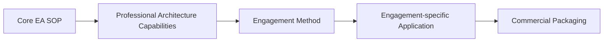

The commercial package must not redefine the professional methodology.

⸻

## 36. External Methodological Alignment

The operating model is consistent with established architecture-process practice without being derived from or identified with any external framework.

ISO/IEC/IEEE 42020:2019 describes architecture processes that can be applied concurrently, iteratively, incrementally and recursively to architecture entities and their elements. The published 2019 edition remains current as of 2026, while a second edition is under development.

This SOP therefore treats iterative architectural reasoning as a professional operating principle rather than adopting an external framework as the identity of the methodology.

⸻

## 37. Summary

Stage 02 exists to turn established context into architectural direction and, where required, a coherent target architecture.

It does so through a controlled reasoning loop:

The architect:

* starts from outcomes, problems, capabilities and decisions rather than technology;
* progressively establishes context;
* connects strategic intent to relevant business capabilities where material;
* identifies required capability evolution where relevant;
* translates capability change into business/process implications and architectural requirements;
* identifies material architectural concerns;
* considers meaningful alternatives;
* makes trade-offs explicit;
* reuses and evolves viable existing capabilities;
* introduces complexity and abstraction only where justified;
* evaluates technology and vendors after establishing architectural need;
* treats AI and agentic capability as architectural choices rather than defaults;
* develops target architecture progressively;
* models only what is useful;
* validates architecture against evidence, requirements and stakeholder concerns;
* records material decisions;
* identifies transition implications where required;
* maintains traceability and confidence;
* remains accountable for architectural judgement.

The architecture loop concludes when the architecture is sufficiently:

* coherent;
* evidence-supported;
* stakeholder-validated;
* traceable;
* operationally viable;
* appropriate to the engagement purpose and scope.

Stage 02 establishes architectural direction.

It does not automatically establish:

* enterprise strategy;
* comprehensive current-state assessment;
* transformation priorities;
* governance operating model;
* delivery ownership;
* value realisation.

Those responsibilities belong to the appropriate stages and engagement methods within the wider EA practice.

⸻

© 2026 Alexandre Franco. Ideas-to-Life. All rights reserved. Proprietary methodology and architecture specification.
