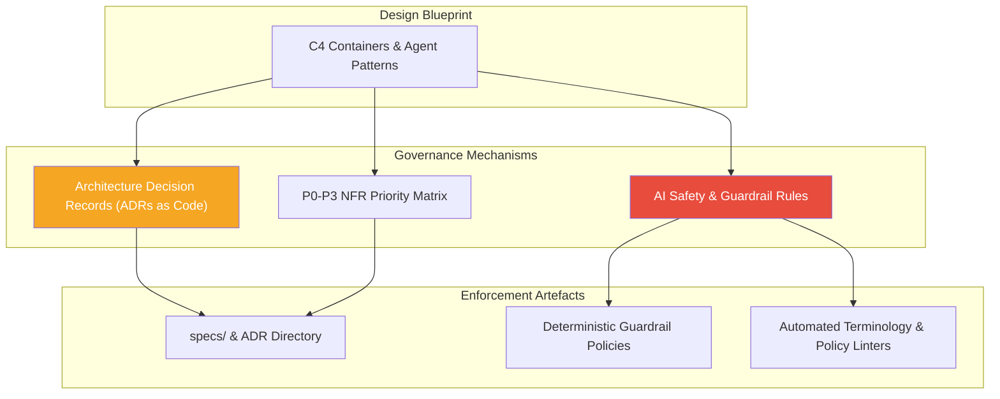
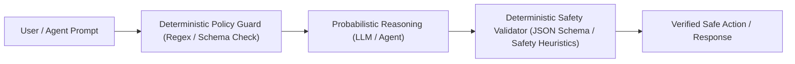

# Stage 03: Govern & Formalise

## Overview

The **Govern & Formalise** stage converts architectural designs into enforceable rules, contracts, and auditable records. Governance is not an afterthought or an external audit panel; it is an active mechanism encoded directly into the codebase.

This stage establishes decision traceability and safety heuristics: **"How do we ensure safety, regulatory compliance, and auditable decisions as we build?"**



---

## Key Activities & Methodology

### 1. Architecture Decision Records (ADRs as Code)
Every architectural choice, technology selection, or structural trade-off must be documented in a light, auditable Markdown ADR saved directly in the repository (e.g. `docs/adr/` or `specs/`):

```markdown
# ADR-005: Decouple Vector Database via Repository Abstraction

## Status
Approved

## Context
Our agentic research workflow requires fast vector search across technical documentation. Proprietary vector database lock-in presents a strategic risk.

## Decision
We will implement an explicit `VectorStore` interface abstraction. The initial implementation will use `pgvector`, with zero direct imports of vendor SDKs in core application code.

## Consequences
- Positive: Ability to migrate to Qdrant or Pinecone without touching agent business logic.
- Negative: Requires writing interface wrapper code.
```

### 2. Priority Boundary Definition (P0–P3 NFR Matrix)
Assign explicit priority classifications to all Non-Functional Requirements (NFRs) to guide engineering trade-offs during delivery:

- **P0 (Critical / Blocker):** Non-negotiable security, data privacy, legal compliance, or core reliability requirements. Must be verified before any deployment.
- **P1 (High Priority):** Key performance SLA targets (e.g. sub-200ms latency), primary error handling, and core observability logging.
- **P2 (Medium Priority):** Secondary performance optimization, extended analytics logging, and automated developer tooling.
- **P3 (Low Priority / Nice to Have):** Cosmetic UI enhancements, experimental features, and non-blocking optimizations.

### 3. AI Safety & Guardrail Heuristics
When deploying probabilistic models (LLMs, multi agent systems) in enterprise environments, safety must be guaranteed through a **Dual-Layer Guardrail Architecture**:



1. **Input Guardrails:** Sanitize prompt inputs, prevent prompt injection, validate token limits, and enforce identity authorization.
2. **Output Guardrails:** Validate structured output schemas (JSON/Pydantic), filter sensitive data (PII masking), and verify hallucination scores before executing side-effects.

---

## Inputs & Outputs

### Primary Inputs
- C4 Architecture Blueprint and Interface Contracts (from Stage 02).
- Organizational security, privacy, and compliance policies.
- Diagnostic risk priorities.

### Primary Outputs
- **Repository ADR Catalog:** Version-controlled ADRs documenting rationale and consequences.
- **NFR Priority Matrix (P0–P3):** Explicit non-functional acceptance criteria.
- **Guardrail Specification:** Policy rules for input/output sanitization and AI safety filters.

---

## Governance & Quality Gate

> [!IMPORTANT]
> **Stage Gate Check:** No pull request introducing structural or architectural changes shall be merged without a corresponding approved ADR and verified P0 compliance criteria.
