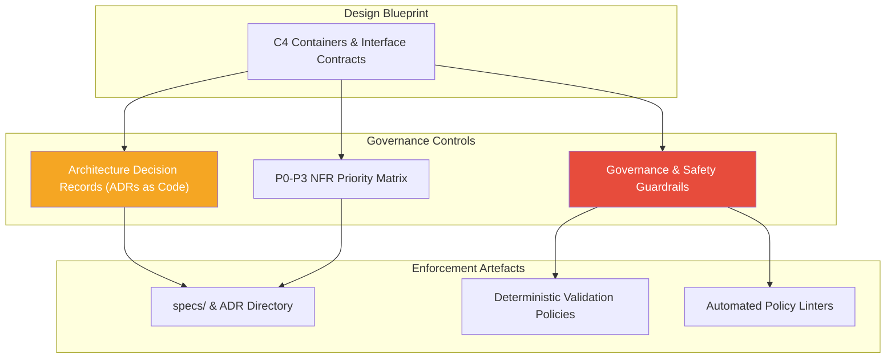
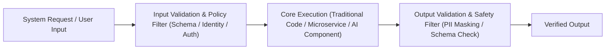

# Stage 03: Govern & Formalise

## Overview

The **Govern & Formalise** stage converts architectural designs into enforceable rules, contracts, and auditable records. Governance is an active mechanism encoded directly into the development and operational lifecycle.

This stage establishes decision traceability and compliance controls: **"How do we ensure safety, regulatory compliance, and auditable decisions as we build?"**



---

## Key Activities & Methodology

### 1. Architecture Decision Records (ADRs as Code)
Every architectural choice, technology selection, or structural trade-off must be documented in a light, auditable Markdown ADR saved directly in the repository (e.g. `docs/adr/` or `specs/`):

```markdown
# ADR-005: Decouple Database Layer via Repository Interface Pattern

## Status
Approved

## Context
Our core transaction service requires fast read queries. Coupling domain logic directly to proprietary database SDKs presents a lock-in risk.

## Decision
We will implement an explicit `Repository` interface abstraction. The initial implementation will use PostgreSQL, with zero direct imports of vendor-specific drivers in core business logic.

## Consequences
- Positive: Ability to migrate or add caching (e.g. Redis) without touching domain logic.
- Negative: Requires writing interface wrapper code.
```

### 2. Priority Boundary Definition (P0–P3 NFR Matrix)
Assign explicit priority classifications to all Non-Functional Requirements (NFRs) to guide engineering trade-offs during delivery:

- **P0 (Critical / Blocker):** Non-negotiable security, data privacy, legal compliance, or core reliability requirements. Must be verified before any deployment.
- **P1 (High Priority):** Key performance SLA targets (e.g. sub-200ms latency), primary error handling, and core observability logging.
- **P2 (Medium Priority):** Secondary performance optimization, extended analytics logging, and automated developer tooling.
- **P3 (Low Priority / Nice to Have):** Cosmetic UI enhancements, experimental features, and non-blocking optimizations.

### 3. Governance & Safety Guardrail Heuristics
Establish deterministic safety and compliance controls across system boundaries:



1. **Input Guardrails:** Sanitize API payloads, validate request schemas, enforce identity authorization, and prevent malformed inputs.
2. **Output Guardrails:** Validate response schemas, filter sensitive data (PII masking / encryption), and verify output policy compliance before triggering external side-effects.
3. **AI Safety Controls (Where AI is Used):** If probabilistic models are deployed, enforce dual-layer guardrails pairing probabilistic outputs with deterministic schema validation and hallucination checks.

---

## Inputs & Outputs

### Primary Inputs
- C4 Architecture Blueprint and Interface Contracts (from Stage 02).
- Organizational security, privacy, and regulatory compliance standards.
- Diagnostic risk priorities.

### Primary Outputs
- **Repository ADR Catalog:** Version-controlled ADRs documenting rationale and consequences.
- **NFR Priority Matrix (P0–P3):** Explicit non-functional acceptance criteria.
- **Guardrail & Governance Policy Specification:** Rules for input/output validation, PII handling, and safety filters.

---

## Governance & Quality Gate

> [!IMPORTANT]
> **Stage Gate Check:** No pull request introducing structural or architectural changes shall be merged without a corresponding approved ADR and verified P0 compliance criteria.
