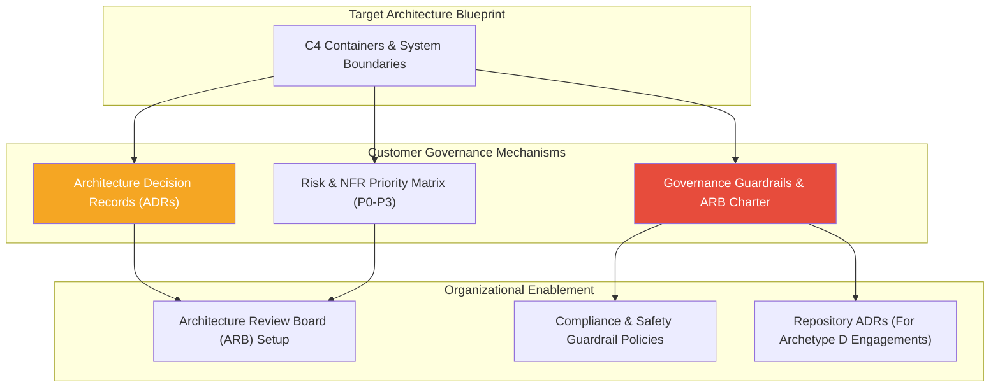

# Stage 03: Governance & Decision Framework

> [!IMPORTANT]
> **Classification Level**: `RESTRICTED / HIGHLY CONFIDENTIAL` — Enterprise Architecture Operating Model.

## Overview

The **Governance & Decision Framework** stage converts target architectural designs into enforceable rules, contracts, and auditable governance structures tailored to the customer's organization. Governance is a model of **enablement**, establishing clear guardrails and decision processes that allow delivery teams to operate with autonomy while remaining aligned with enterprise standards.

This stage answers the core question: **"How do we ensure safety, regulatory compliance, and auditable architectural decisions across the client organization?"**



---

## Key Activities & Methodology

### 1. Architecture Decision Records (ADRs)
Every major architectural trade-off, technology selection, or structural boundary choice must be documented in a concise, auditable ADR:

```markdown
# ADR-003: Adopt Event-Driven Integration Pattern for Media Asset Workflows

## Status
Approved by Architecture Review Board (ARB)

## Context
The legacy media ingestion platform relies on point-to-point batch processing, causing high latency during peak ingest windows and tight coupling between media processing services.

## Decision
We will establish an asynchronous Event Bus utilizing CloudEvents schemas. Media ingestion services will publish events, allowing downstream processing services to react asynchronously without direct service-to-service dependencies.

## Consequences
- Positive: Loose coupling, independent scalability of processing workers, real-time status visibility.
- Negative: Requires establishing an event broker and monitoring dead-letter queues.
```

Depending on the engagement archetype, ADRs may be delivered as executive documentation (Archetype B/C) or as version-controlled Markdown in the codebase (`docs/adr/` under Archetype D).

### 2. Risk & NFR Priority Matrix (P0–P3)
Establish explicit priority classifications for Non-Functional Requirements (NFRs) to guide client trade-offs during delivery:

- **P0 (Critical / Blocker):** Non-negotiable security, data privacy, legal compliance, or core reliability requirements. Must be verified prior to deployment.
- **P1 (High Priority):** Key performance SLA targets (e.g. sub-200ms latency), primary error handling, and core observability logging.
- **P2 (Medium Priority):** Secondary performance optimization, extended analytics logging, and automated developer tooling.
- **P3 (Low Priority / Nice to Have):** Cosmetic UI enhancements, experimental features, and non-blocking optimizations.

### 3. Governance Guardrails & ARB Setup
Establish governance structures that fit the client's culture and delivery scale:
- **Architecture Review Board (ARB) Charter:** Define lightweight review cadence, decision criteria, escalation paths, and architectural sign-off rules.
- **Input / Output Guardrails:** Define deterministic validation policies for API payloads, identity authorization, and data encryption.
- **AI Safety Controls (Where AI is Used):** If AI components are deployed, establish dual-layer guardrails pairing probabilistic outputs with deterministic schema validation and hallucination filters.

---

## Deliverables by Engagement Archetype

- **Archetype C & D (Governance & Full Engagements):** Governance Charter, ARB Operating Manual, ADR Catalog, NFR Priority Matrix (P0–P3), and Compliance Guardrail Specifications.

---

## Governance & Quality Gate

> [!IMPORTANT]
> **Stage Gate Check:** Ensure all governance rules are designed for enablement rather than blocking. Clear escalation paths and P0–P3 boundaries must be agreed upon by both enterprise architects and delivery leadership.

---

*© 2026 Alexandre Franco. Ideas-to-Life. All rights reserved. Proprietary methodology and agentic architecture specification.*

