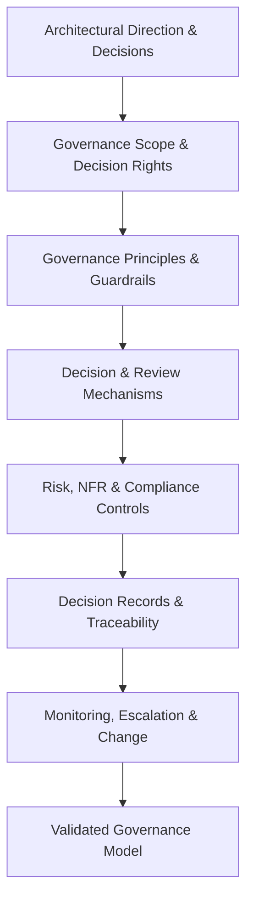

# Stage 03: Governance & Decision Framework

> [!IMPORTANT]
> **Classification Level**: `RESTRICTED / HIGHLY CONFIDENTIAL` — Enterprise Architecture Operating Model.

## Overview

The **Governance & Decision Framework** stage establishes the mechanisms through which architectural decisions are made, challenged, recorded, governed, and evolved.
Governance is treated as a mechanism for **enablement rather than control for its own sake**. Its purpose is to provide sufficient clarity, accountability, guardrails, and decision rights for teams to operate with appropriate autonomy while maintaining architectural coherence, risk management, regulatory compliance, and strategic alignment.
The governance model must reflect the customer's organisational structure, delivery model, risk profile, regulatory environment, architecture maturity, and scale.
Not every engagement requires a formal Architecture Review Board, a complete governance operating model, a full ADR catalogue, or a detailed NFR classification system. The appropriate mechanisms are selected according to the decisions being governed and the consequences of those decisions.
This stage answers:
> **How should architectural decisions be made, who has authority to make them, what guardrails are required, how are material decisions recorded and challenged, and how can the organisation maintain architectural coherence without unnecessarily slowing delivery?**

⸻

Core Principles

## 1. Governance Exists to Enable

Governance should help the organisation make better decisions faster and with appropriate confidence.

Avoid governance mechanisms that:

* duplicate existing controls;
* require approval without adding meaningful assurance;
* create unnecessary documentation;
* centralise decisions that can safely be delegated;
* impose controls unrelated to material risk.

Governance should establish guardrails within which teams can act autonomously.

⸻

## 2. Decision Rights Before Committees

Effective governance starts by establishing:

* what decisions need to be made;
* who owns those decisions;
* who must be consulted;
* who provides assurance;
* who has escalation authority.

An Architecture Review Board may be an appropriate mechanism in some organisations, but a committee should not be introduced merely because governance is expected to have one.

Decision rights may instead be distributed across:

* product teams;
* engineering leadership;
* enterprise architects;
* domain architects;
* security;
* data governance;
* risk and compliance;
* technology leadership;
* executive sponsors.

⸻

## 3. Proportionate Governance

Governance should be proportionate to:

* decision significance;
* risk;
* complexity;
* regulatory obligations;
* organisational scale;
* reversibility;
* potential impact.

Low-risk and reversible decisions should not require the same level of scrutiny as high-impact, difficult-to-reverse architectural decisions.

⸻

## 4. Guardrails Over Gatekeeping

Where possible, establish guardrails that allow teams to proceed autonomously rather than requiring central approval for every activity.

Examples include:

* approved technology standards;
* security requirements;
* data handling rules;
* integration standards;
* architecture principles;
* AI usage policies;
* operational requirements;
* defined escalation thresholds.

Teams should be able to make decisions independently when they remain within the established guardrails.

⸻

## 5. Explicit Decision Ownership

Every material architectural decision should have an identifiable owner.

Governance should make clear:

* who proposes a decision;
* who provides architectural advice;
* who validates compliance;
* who approves where approval is required;
* who is accountable for the outcome;
* who can challenge or escalate the decision.

Architecture governance should not obscure accountability.

⸻

## 6. Decisions Should Be Traceable

Material decisions should be traceable to:

Context → Evidence → Concerns → Options → Trade-offs → Decision → Consequences

The level of documentation should reflect the significance of the decision.

A lightweight decision record may be sufficient for one decision, while a major transformation may require formal Architecture Decision Records (ADRs) and supporting governance documentation.

⸻

## 7. Governance Should Reflect the Operating Model

The governance model must fit how the organisation actually works.

Consider:

* product operating models;
* project/programme delivery;
* agile and continuous delivery;
* platform teams;
* centralised architecture;
* federated architecture;
* outsourced delivery;
* regulated environments;
* global vs local decision-making.

Do not impose a governance structure that conflicts with the organisation’s operating model without explicitly addressing the resulting consequences.

⸻

## 8. Risk and Compliance Are Part of Architecture

Architectural governance should incorporate material:

* security risks;
* privacy risks;
* regulatory requirements;
* operational risks;
* resilience requirements;
* data risks;
* supplier risks;
* technology lifecycle risks;
* AI-specific risks where applicable.

Governance should clarify where these concerns require architectural intervention, specialist assurance, or formal escalation.

⸻

## 9. Standards Should Guide, Not Constrain Without Reason

Architecture standards and principles should establish a coherent baseline while allowing justified exceptions.

A mature governance model should define:

* required standards;
* recommended practices;
* prohibited patterns where appropriate;
* exception mechanisms;
* ownership;
* review and retirement processes.

Exceptions should be visible and deliberate rather than becoming undocumented deviations.

⸻

## 10. Governance Must Evolve

Governance itself should be reviewed as the organisation, technology landscape, and delivery model evolve.

A governance mechanism that was appropriate for a large transformation programme may be unnecessarily heavy once the organisation moves into continuous product delivery.

Governance should therefore have mechanisms for:

* feedback;
* measurement;
* exception analysis;
* policy review;
* retirement of obsolete controls;
* continuous improvement.

⸻

## Core Workflow

1. Establish Governance Context

Understand the environment in which architectural decisions will be governed.

Assess, where relevant:

* organisational structure;
* architecture maturity;
* existing governance;
* delivery model;
* decision-making culture;
* regulatory environment;
* risk appetite;
* technology landscape;
* existing standards;
* existing review forums;
* stakeholder responsibilities.

Identify what governance already exists before proposing new mechanisms.

Output

* Governance context.
* Existing governance inventory.
* Governance gaps and opportunities.

⸻

## 2. Define Governance Scope

Establish what the governance framework needs to govern.

Potential scope includes:

* enterprise architecture;
* solution architecture;
* technology standards;
* application portfolio;
* data architecture;
* integration;
* cloud;
* security architecture;
* AI and agentic systems;
* major transformation initiatives;
* technology investment decisions;
* architectural exceptions.

Governance scope should remain consistent with the engagement boundary.

Output

* Governance scope.
* Governed decision categories.
* Explicit exclusions where relevant.

⸻

## 3. Identify Architectural Decision Types

Identify the types of decisions that require governance.

Examples include:

* technology selection;
* architectural pattern selection;
* system boundary changes;
* integration strategy;
* data ownership;
* cloud strategy;
* platform adoption;
* significant vendor dependencies;
* security architecture;
* AI model/provider selection;
* AI autonomy and control;
* material exceptions to architecture standards.

Classify decisions according to their significance rather than applying the same governance process to all decisions.

Output

* Decision taxonomy.
* Decision significance criteria.

⸻

## 4. Define Decision Rights and Accountability

Establish who has authority and accountability for each relevant decision category.

A decision-rights model may define:

| Role / Group                 | Typical Responsibility                                               |
| ---------------------------- | -------------------------------------------------------------------- |
| Business Owner               | Owns business outcome and business consequences                      |
| Product / Delivery Owner     | Owns delivery priorities and implementation decisions                |
| Solution / Domain Architect  | Provides architectural design and recommendation                     |
| Enterprise Architect         | Ensures enterprise alignment and addresses cross-domain implications |
| Security / Risk              | Provides specialist assurance and risk assessment                    |
| Data Governance              | Provides data ownership, quality, privacy and governance assurance   |
| Architecture Forum / ARB     | Provides collective review where required                            |
| Executive Sponsor            | Resolves strategic or material escalations                           |

The exact roles should be adapted to the organisation.
Output

* Decision-rights model.
* RACI or equivalent accountability model where useful.
* Escalation responsibilities.

⸻

## 5. Establish Governance Principles

Define principles that govern architectural decision-making.

Examples include:

* decisions should be made at the lowest appropriate level;
* material decisions require explicit accountability;
* governance should be proportionate to risk;
* evidence should support material decisions;
* standards should be reusable;
* exceptions should be visible;
* decisions should be reversible where practical;
* governance should enable delivery;
* security and regulatory obligations cannot be bypassed;
* AI decisions require appropriate human accountability where material.

Output

* Governance principles.
* Governance design criteria.

⸻

## 6. Define Guardrails and Standards

Establish the controls that allow teams to operate within clearly understood boundaries.

Potential guardrails include:

Architecture

* approved architecture patterns;
* required interface standards;
* system boundary principles;
* integration standards;
* technology lifecycle requirements.

Security

* identity and access requirements;
* encryption;
* secrets management;
* network controls;
* threat modelling;
* security review thresholds.

Data

* data ownership;
* classification;
* retention;
* privacy;
* data quality;
* lineage.

Operations

* observability;
* resilience;
* disaster recovery;
* service ownership;
* support requirements;
* operational readiness.

AI / Agentic Systems

Where AI is relevant:

* approved model/provider requirements;
* data handling;
* evaluation;
* monitoring;
* human oversight;
* tool permissions;
* guardrails;
* auditability;
* model lifecycle;
* risk classification.

Guardrails should distinguish between:

* mandatory controls;
* recommended practices;
* context-dependent guidance.

Output

* Governance guardrails.
* Architecture standards.
* Required controls.
* Recommended practices.

⸻

## 7. Establish Architecture Review and Challenge Mechanisms

Determine how material architectural decisions will be reviewed and challenged.

Possible mechanisms include:

* Architecture Review Board;
* architecture forum;
* peer review;
* domain architecture review;
* design authority;
* asynchronous architecture review;
* architecture clinic;
* lightweight decision review.

A formal ARB should be introduced only where its value justifies its cost.

Where an ARB exists, establish:

* purpose;
* scope;
* membership;
* authority;
* decision criteria;
* quorum where required;
* review triggers;
* escalation paths;
* decision recording;
* review cadence;
* exception handling.

Output

* Architecture review mechanism.
* ARB charter where applicable.
* Review triggers and criteria.

⸻

## 8. Establish Decision Recording

Define how material architectural decisions are documented.

An ADR or equivalent decision record may include:

## 9. ADR-XXX: [Decision Title]

### Status

Proposed / Accepted / Superseded / Rejected

### Context

What problem or decision requires resolution?

### Decision

What has been decided?

### Options Considered

What meaningful alternatives were evaluated?

### Rationale

Why was this option selected?

### Consequences

What are the expected benefits, costs, risks and dependencies?

### Assumptions

What assumptions materially influence the decision?

### Related Decisions

Which other decisions or architectural artefacts are affected?

The format may be adapted to the organisation.

Not every architectural decision requires a formal ADR. Documentation requirements should be proportionate to decision significance.

### Output

* Decision-recording standard.
* ADR template where appropriate.
* Decision repository or equivalent mechanism.

⸻

## 10. Establish Risk and NFR Governance

Identify the Non-Functional Requirements and risks that require explicit governance.

Relevant dimensions may include:

* security;
* privacy;
* availability;
* resilience;
* performance;
* scalability;
* maintainability;
* interoperability;
* observability;
* recoverability;
* regulatory compliance;
* data integrity.

Priority classifications may be used where useful.

For example:

* Critical — failure prevents safe, lawful, or viable operation;
* High — material impact requiring explicit management;
* Medium — important but manageable within normal delivery;
* Low — desirable or optimisation-oriented.

A P0–P3 scheme may be adopted where it fits the organisation, but it is not a mandatory methodology requirement.

Output

* NFR priorities.
* Architectural risk register.
* Risk ownership and escalation thresholds.

⸻

## 12. Establish Exception and Escalation Management

No governance framework can anticipate every situation.

Define how teams can request and obtain exceptions to:

* architecture standards;
* technology policies;
* approved patterns;
* governance requirements;
* control requirements where legally and operationally permissible.

An exception process should capture:

* requested deviation;
* rationale;
* evidence;
* risks;
* compensating controls;
* owner;
* approval authority;
* expiry or review date where appropriate.

Exceptions should be treated as explicit architectural decisions rather than hidden workarounds.

Output

* Exception process.
* Escalation criteria.
* Exception register where appropriate.

⸻

## 11. Establish Governance for Material AI Decisions Where Relevant

Where AI or agentic systems form part of the architecture, governance should address the additional characteristics of these systems.

Potential governance concerns include:

* AI use-case classification;
* data sensitivity;
* model/provider selection;
* evaluation requirements;
* human oversight;
* autonomy boundaries;
* tool permissions;
* security;
* privacy;
* explainability where required;
* monitoring;
* incident handling;
* model change;
* prompt/context management;
* auditability.

Governance should distinguish between:

* low-risk assistive AI;
* material decision-support systems;
* systems capable of taking consequential autonomous actions.

The governance response should be proportionate to the risk and consequences.

Output

* AI governance requirements where relevant.
* AI decision criteria.
* AI-specific escalation and assurance mechanisms.

⸻

## 12. Establish Governance Feedback and Measurement

Governance should be evaluated based on whether it improves architectural decision quality and organisational outcomes.

Potential indicators include:

* decision turnaround time;
* percentage of decisions made within defined authority;
* number and age of unresolved exceptions;
* recurring architecture issues;
* standards adoption;
* governance bottlenecks;
* significant incidents attributable to architectural decisions;
* stakeholder satisfaction;
* proportion of decisions requiring escalation;
* obsolete controls or standards.

Metrics should be selected only where they provide useful management information.

The objective is not to maximise governance activity. It is to improve decision quality while minimising unnecessary friction.

Output

* Governance measures.
* Feedback mechanisms.
* Improvement backlog.

⸻

## 13. Validate the Governance Model

Validate the proposed governance framework with the relevant stakeholders.

Confirm that:

* decision rights are understood;
* accountability is clear;
* governance is proportionate;
* guardrails are practical;
* review mechanisms are usable;
* escalation paths are clear;
* standards are achievable;
* exceptions can be handled;
* delivery teams can operate with appropriate autonomy;
* risks and regulatory obligations are adequately addressed.

Output

* Validated governance model.
* Agreed decision rights.
* Confirmed governance mechanisms.

⸻

## 14. Governance Operating Model

Where the engagement requires a formal Governance Operating Model, it may include:

1. Governance Purpose
2. Governance Principles
3. Scope
4. Decision Taxonomy
5. Decision Rights
6. Roles and Responsibilities
7. Architecture Review Mechanisms
8. Architecture Review Triggers
9. Architecture Standards
10. Governance Guardrails
11. Risk and NFR Management
12. Security and Compliance Integration
13. AI Governance Where Relevant
14. ADR / Decision Recording
15. Exception Management
16. Escalation Paths
17. Governance Forums
18. Metrics and Reporting
19. Continuous Improvement
20. Governance Lifecycle and Review

Not every engagement requires the complete operating model.

⸻

## 15. Architecture Review Board

Where an Architecture Review Board (ARB) is appropriate, its role should be clearly defined.

The ARB should generally:

* review material architectural decisions;
* challenge architectural assumptions;
* assess cross-domain impacts;
* provide architectural assurance;
* resolve escalated architectural issues;
* approve exceptions where authority requires it;
* maintain architectural coherence.

The ARB should not become:

* a mandatory approval stage for every technical decision;
* a substitute for accountable delivery leadership;
* a mechanism for centralising decisions unnecessarily;
* a documentation review committee;
* a bottleneck for routine delivery.

Where teams operate safely within established guardrails, decisions should remain delegated to them.

⸻

## 16. Governance Artefacts

Depending on the engagement, governance may produce:

* Governance Principles.
* Decision Taxonomy.
* Decision Rights Matrix.
* Governance Operating Model.
* ARB Charter.
* Architecture Review Criteria.
* Architecture Standards.
* Governance Guardrails.
* NFR Requirements.
* Risk Register.
* ADR Template.
* ADR Catalogue.
* Exception Process.
* Exception Register.
* AI Governance Controls.
* Architecture Governance Metrics.
* Governance Improvement Backlog.

Outputs are scope-driven, not automatically required for every engagement.

⸻

## 17. Engagement-Specific Tailoring

The core governance practice is instantiated according to the engagement’s:

* purpose;
* scope;
* organisational context;
* decision significance;
* risk;
* regulatory environment;
* architecture maturity;
* delivery model.

Examples include:

| Engagement Pattern                     | Typical Governance Contribution                                                              |
| -------------------------------------- | -------------------------------------------------------------------------------------------- |
| Focused Architecture / Decision Review | Clarify decision authority, assumptions, decision record and required escalation             |
| Architecture Health Check              | Assess effectiveness of existing governance and identify material weaknesses                 |
| Target Architecture Blueprint          | Identify governance implications, standards, ownership and material architectural decisions  |
| Architecture Assessment & Roadmap      | Establish governance requirements needed to support the target state and transition          |
| Enterprise Governance & Operating Model| Design decision rights, forums, guardrails, standards and operating mechanisms               |
| Delivery Steering                      | Apply governance mechanisms during implementation and manage architectural change            |

The engagement may therefore use only selected elements of this stage.

A focused architectural decision does not automatically require an ARB, governance charter, or enterprise-wide governance framework.

⸻

## 18. Reusable Governance Assets

Where appropriate, maintain reusable assets including:

* governance principles;
* decision taxonomies;
* decision-rights templates;
* ADR templates;
* review criteria;
* architecture standards;
* architecture patterns;
* risk assessment criteria;
* NFR frameworks;
* exception templates;
* AI governance patterns;
* ARB charter templates;
* governance metrics.

Reusable assets should accelerate governance design without assuming that every organisation requires the same governance model.

⸻

## Outputs

Depending on the engagement, Stage 03 may produce:

* Governance principles.
* Decision taxonomy.
* Decision-rights model.
* Architecture review mechanism.
* ARB charter where applicable.
* Architecture standards.
* Governance guardrails.
* Risk and NFR framework.
* ADRs or equivalent decision records.
* Exception and escalation mechanism.
* AI governance controls where relevant.
* Governance operating model.
* Governance metrics and improvement mechanisms.

Outputs are proportionate to the engagement and decision context.

⸻

## Governance & Quality Gates

### Gate 1 — Governance Scope

Confirm that governance mechanisms correspond to the decisions and architectural scope being addressed.

Do not create enterprise-wide governance structures to solve a narrowly bounded architectural problem unless the evidence demonstrates that broader governance is required.

⸻

### Gate 2 — Decision Rights

Confirm that material decisions have:

* clear ownership;
* appropriate authority;
* defined accountability;
* escalation paths where necessary.

No governance process should exist without clarity about who ultimately owns the decision.

⸻

### Gate 3 — Proportionality

Confirm that the governance burden is proportionate to:

* risk;
* decision significance;
* complexity;
* regulatory requirements;
* reversibility.

Low-risk decisions should not be subjected to high-cost governance processes without justification.

⸻

### Gate 4 — Enablement

Confirm that governance enables delivery rather than unnecessarily blocking it.

Where possible:

* delegate decisions;
* automate compliance checks;
* use predefined guardrails;
* use asynchronous review;
* reserve formal governance for material decisions.

⸻

### Gate 5 — Traceability

Confirm that material decisions can be traced from:

Context → Evidence → Analysis → Decision → Consequences

Where decisions cannot be adequately justified, identify whether additional evidence, analysis, or escalation is required.

⸻

### Gate 6 — Risk and Compliance

Confirm that material:

* security;
* privacy;
* regulatory;
* operational;
* resilience;
* data;
* supplier;
* AI

risks have appropriate ownership and assurance.

⸻

### Gate 7 — Exceptions

Confirm that deviations from standards or guardrails are:

* explicit;
* justified;
* owned;
* appropriately approved;
* visible;
* reviewed where necessary.

Exceptions should not become an informal alternative architecture.

⸻

### Gate 8 — Governance Viability

Confirm that the organisation has the capability and authority to operate the proposed governance model.

A governance design that depends on roles, skills, forums, or controls that do not exist should identify the organisational change required to make it viable.

⸻

### Gate 9 — Continuous Improvement

Confirm that governance contains a mechanism for identifying:

* ineffective controls;
* unnecessary process;
* recurring exceptions;
* decision bottlenecks;
* emerging risks;
* obsolete standards.

Governance should evolve as the organisation and architecture evolve.

⸻

### Relationship to Other Stages

Stage 03 receives architectural direction, target-state decisions, risks, constraints, and architectural concerns from earlier work.

It establishes the governance mechanisms needed to control, enable, challenge, and evolve those decisions.

Its outputs provide inputs to:

* Stage 04 — Delivery Enablement & Execution Steering, where governance is applied during implementation and delivery;
* Stage 05 — Value Realisation & Organisational Handover, where governance ownership, operational accountability, and continuous improvement are transitioned into the organisation.

Governance is not necessarily a discrete activity that begins only after target architecture has been completed. Governance concerns may be identified earlier and refined as architectural decisions mature.

⸻

© 2026 Alexandre Franco. Ideas-to-Life. All rights reserved. Proprietary methodology and architecture specification.
