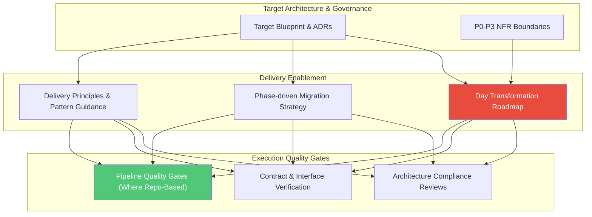

# Stage 04: Delivery Enablement & Execution Steering

## Overview

The **Delivery Enablement & Execution Steering** stage translates target architecture blueprints and governance rules into an actionable execution path for client delivery teams. This stage is **delivery-model agnostic**: whether the customer operates with SAFe, Agile Scrum, System Integrator (SI) vendor contracts, or GitOps/Repository-Driven teams, the architect provides clear guidance and quality gate criteria fit for that environment.

This stage answers the core question: **"How do we translate target architecture into an executable roadmap and steer delivery teams to success?"**

---

## Key Activities & Methodology

### 1.  Day Transformation Roadmap

Structure the execution trajectory into clear, manageable horizons:

- **First 30 Days (Foundation & Quick Wins):** Establish governance rules, validate initial architectural spikes/POCs, finalize interface contracts, and align delivery teams.
- **First 60 Days (Core Capability Delivery):** Execute Phase 1 core services, establish CI/CD quality gates, and conduct mid-point architecture reviews.
- **First 90 Days (Scaling & Hardening):** Deliver end-to-end integration, execute non-functional load and security testing, and transition to operational runbooks.

### 2. Delivery Principles & Pattern Guidance

Provide concrete guidance to internal engineering teams or System Integrators (SIs):

- **Contract-First Delivery:** Mandate that API schemas, database contracts, and integration interfaces are agreed upon before component implementation begins.
- **Scope Discipline:** Focus delivery on minimal viable architecture slices that prove business value early.
- **Vendor Abstraction Enforcement:** Ensure delivery teams utilize the provider-agnostic abstraction layers defined in Stage 02.

### 3. Adaptive Quality Gates

Establish quality gates matched to the customer's delivery model:

- **For Executive & Strategic Engagements (Archetypes A, B, C):** Milestone architecture compliance reviews, contract verification checkpoints, and ARB sign-offs.
- **For Hands-on Delivery Steering (Archetype D):** Automated pipeline quality gates (build integrity, policy linters `scripts/validate_governance.py`, unit/integration tests, Specification-Driven Delivery `specs/`).

---

## Deliverables by Engagement Archetype

- **Archetype A, B & C:**  Transformation Roadmap, Migration Strategy (Phase 1/2/3), Delivery Principles Guide, and Compliance Checklists.
- **Archetype D (Hands-On Delivery Steering):** Specification-Driven Execution Framework, Repository Quality Gate Scripts, and Automated CI/CD Governance Workflows.

---

## Governance & Quality Gate

> [!IMPORTANT]
> **Stage Gate Check:** Ensure delivery roadmaps account for team capability and operational constraints. Never hand off a target blueprint without an accompanying  roadmap and clear quality gate criteria.
