# Stage 04: Delivery Enablement & Execution Steering

> [!IMPORTANT]
> **Classification Level**: `RESTRICTED / HIGHLY CONFIDENTIAL` — Enterprise Architecture Operating Model.

## Overview

The **Delivery Enablement & Execution Steering** stage translates established architectural direction into an executable path and provides architectural guidance and assurance as the organisation moves toward implementation.
The stage bridges the gap between:

* what the organisation is trying to achieve;
* the capabilities it needs to establish, evolve or improve;
* what has been architecturally decided;
* how that architecture can practically be delivered;
* and how the resulting capability can be transitioned into operation and value realisation.
Delivery enablement is **delivery-model agnostic**.
The architect adapts to the customer's existing ways of working, whether they use:
* Agile;
* Scrum;
* SAFe;
* waterfall;
* hybrid delivery;
* product teams;
* System Integrators;
* platform teams;
* DevOps;
* GitOps;
* or other approaches.
The architect does not prescribe a delivery methodology unless that is explicitly part of the engagement.
The depth of this stage depends on the engagement.
Some engagements may require only:
* implementation implications;
* delivery guidance;
* architecture constraints;
* decision support.
Others may require:
* implementation readiness assessment;
* detailed transformation roadmap;
* migration sequencing;
* capability increments;
* architecture assurance;
* implementation steering;
* operational readiness;
* hands-on support during delivery.
The stage should maintain traceability from architectural intent through execution:

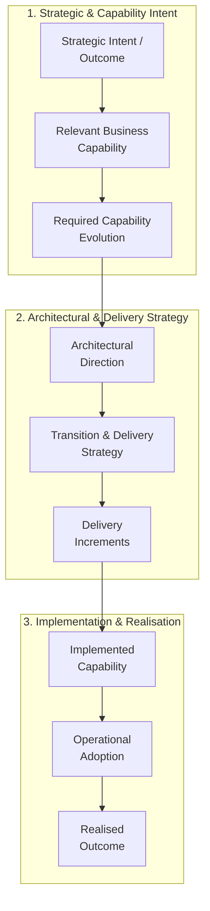

This does not imply that every engagement requires every element to be formally documented.

The depth of traceability should be proportionate to the engagement and the consequences of delivery failure or architectural deviation.

This stage answers:

How can the agreed architectural direction be translated into a realistic path to implementation, how do we enable delivery teams to execute it effectively, and how do we maintain architectural integrity while delivery progresses toward the intended capability and outcome?

Implementation is treated as an evidence-generating activity, not simply as execution of a frozen plan.

Delivery may reveal:

* new constraints;
* better options;
* capability gaps;
* architectural assumptions that were incorrect;
* new dependencies;
* operational realities;
* organisational constraints.

The architect should therefore maintain a controlled feedback loop between architecture and execution.

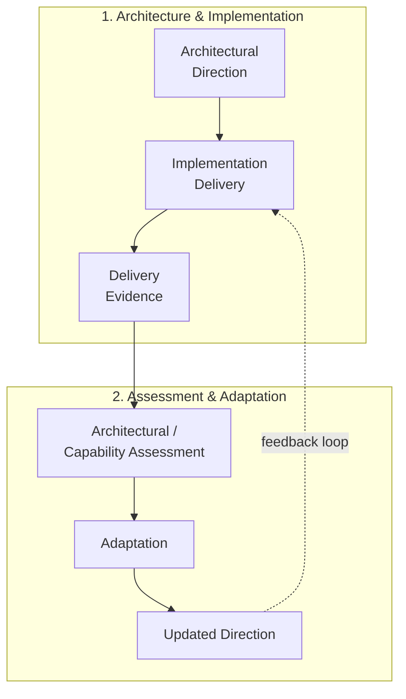

The objective is not to prevent change.

The objective is to ensure that change remains deliberate, visible, understood and governed.

⸻

Core Principles

## 1. Architecture Must Become Executable

Architecture has value only when it can be translated into action.

Delivery enablement should therefore connect:

* architectural intent;
* business priorities;
* relevant capabilities;
* required capability evolution;
* delivery scope;
* implementation sequencing;
* dependencies;
* organisational capability;
* operational readiness;
* governance;
* investment where relevant.

The objective is not simply to produce a roadmap.

It is to establish a credible path from architectural intent to an implemented and operable capability.

Where capability evolution is material, the execution chain should remain explicit:

flowchart LR
    A["Required Capability Evolution"]
    B["Architectural Change"]
    C["Delivery Change"]
    D["Implemented Capability"]
    E["Operational Capability"]
    A --> B --> C --> D --> E

The delivery path should therefore be assessed not only in terms of technical implementation, but also in terms of whether the intended business capability can actually be established.

⸻

## 2. Respect the Existing Delivery Model

The architect should work with the customer’s existing delivery model unless there is a demonstrated reason to change it.

The role is to provide:

* architectural clarity;
* constraints;
* priorities;
* dependencies;
* decision support;
* assurance;
* escalation.

The architect should not introduce a delivery methodology simply because it is familiar or preferred.

Where the existing delivery model creates a material constraint on architectural outcomes, the architect should make the constraint visible and identify the architectural or organisational consequence.

Changes to the delivery model should only become part of the engagement where they are explicitly required.

⸻

## 3. Deliver Value Incrementally Where Practical

Where the architecture permits, structure implementation around meaningful increments of business or technical value.

This may involve:

* vertical slices;
* minimum viable architecture;
* capability increments;
* migration waves;
* platform enablement;
* proof-of-value initiatives;
* progressive rollout.

Where possible, an increment should establish a meaningful part of the intended capability rather than simply complete an isolated technical component.

Incremental delivery should not compromise architectural integrity or create avoidable transitional complexity.

The architect should distinguish between:

* useful transitional architecture;
* accidental architectural debt;
* deliberate temporary compromise;
* permanent target-state architecture.

⸻

## 4. Sequence According to Dependencies and Risk

Implementation sequencing should reflect:

* architectural dependencies;
* business priorities;
* technical dependencies;
* capability dependencies;
* organisational readiness;
* migration complexity;
* risk;
* regulatory constraints;
* operational dependencies.

A roadmap should not simply be a chronological list of projects.

Where capability evolution is material, sequencing should consider what must be established first for the intended capability to become viable.

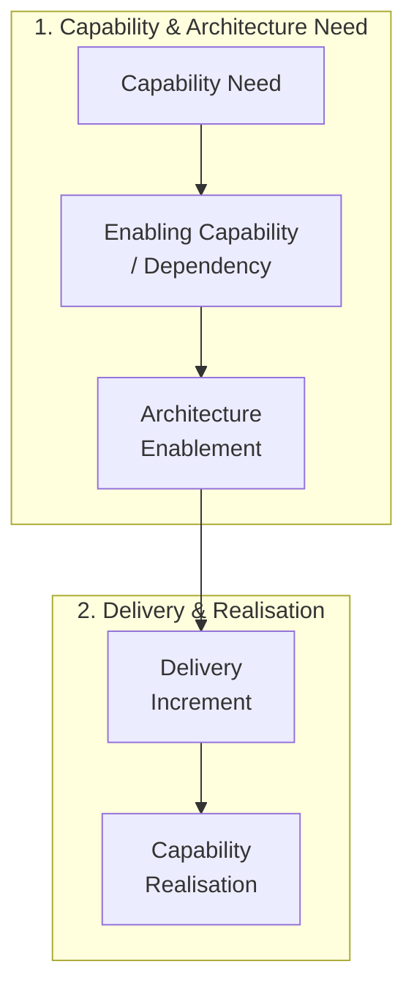

⸻

## 5. Architecture Is a Living Constraint and Decision Framework

Target architecture is not frozen at the point of approval.

Implementation generates new evidence.

The architect should therefore assess whether emerging information requires:

* clarification;
* adaptation;
* an architectural decision;
* an exception;
* a change to the target state;
* escalation.

Architecture should evolve deliberately rather than drift invisibly.

A change discovered during delivery is not automatically an architectural failure.

It may represent:

* better evidence;
* improved understanding;
* an implementation optimisation;
* an acceptable deviation;
* a material architectural change.

The appropriate response depends on the consequence of the change.

⸻

## 6. Enable Autonomy Through Guardrails

Delivery teams should have sufficient freedom to make implementation decisions within established architectural boundaries.

The architect should focus attention on:

* material deviations;
* cross-team dependencies;
* significant architectural decisions;
* systemic risks;
* target-state integrity;
* material capability impacts.

Routine implementation decisions should remain with the appropriate delivery teams.

Architecture should provide enough clarity and guardrails to enable delivery autonomy without requiring the architect to approve every implementation detail.

⸻

## 7. Assurance Should Be Proportionate

Not every implementation activity requires an architecture review.

Assurance should be focused on areas where architectural deviation or failure could materially affect:

* business outcomes;
* capability realisation;
* security;
* resilience;
* compliance;
* interoperability;
* scalability;
* operational viability;
* strategic architecture.

Architecture assurance should be used primarily to:

* identify material risk;
* provide decision support;
* surface dependencies;
* enable correction;
* improve architectural outcomes.

It should not become a blanket compliance exercise.

⸻

## 8. Operational Readiness Is Part of Delivery

Delivery is not complete when software has been deployed.

Where relevant, implementation should address:

* service ownership;
* support;
* monitoring;
* observability;
* resilience;
* security;
* incident management;
* operational runbooks;
* data operations;
* supplier responsibilities;
* business readiness;
* organisational capability.

The architecture should be capable of being operated by the organisation.

Operational readiness should therefore be treated as part of capability realisation rather than as a final administrative handover.

⸻

## 9. Evidence Should Drive Adaptation

During implementation, new evidence may invalidate assumptions made during earlier architecture work.

The architect should distinguish between:

* implementation variance;
* architectural change;
* new evidence;
* emerging risk;
* accepted deviation;
* capability impact.

This prevents normal delivery evolution from being confused with architectural failure.

Where new evidence materially changes the architectural context, the architect should revisit the relevant architectural reasoning rather than forcing delivery to conform to an obsolete assumption.

⸻

## 10. Human Judgement Remains Accountable

Automation and AI may assist with:

* roadmap analysis;
* dependency identification;
* documentation;
* architecture compliance checks;
* repository analysis;
* specification validation;
* risk identification;
* status aggregation;
* architecture drift detection.

The architect remains accountable for interpreting those results and determining whether architectural intervention is required.

AI-generated or automated findings should therefore be treated as evidence or analysis inputs rather than as autonomous architectural decisions.

⸻

Core Workflow

The Stage 04 workflow is an execution-oriented loop rather than a mandatory linear sequence.

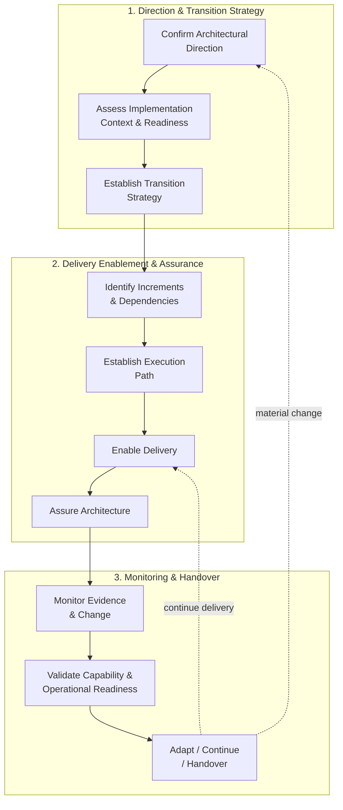

The workflow may be entered, revisited or concluded according to:

* engagement scope;
* delivery maturity;
* architecture maturity;
* implementation complexity;
* evidence;
* risk;
* organisational readiness;
* required level of assurance.

⸻

## Core Workflow

1. Confirm Architectural Direction

Establish the architectural baseline from which delivery will proceed.

Review:

* target architecture;
* architectural decisions;
* principles;
* constraints;
* assumptions;
* risks;
* dependencies;
* governance requirements;
* relevant non-functional requirements;
* relevant capability outcomes.

Confirm that the architectural direction is sufficiently understood to support implementation.

Where the architecture establishes a required capability evolution, confirm that the intended capability change is understood by the delivery context.

Output:

* Delivery architecture baseline.
* Confirmed architectural constraints.
* Relevant capability outcomes.
* Outstanding architectural questions.

⸻

## 2. Assess Implementation Context and Readiness

Understand the environment in which the architecture must be delivered.

Consider:

* delivery teams;
* skills;
* organisational structure;
* existing platforms;
* technology maturity;
* supplier relationships;
* delivery capacity;
* operational capability;
* data readiness;
* security readiness;
* governance maturity;
* organisational change requirements;
* investment constraints where material.

Readiness should distinguish between:

* technical readiness;
* delivery readiness;
* organisational readiness;
* operational readiness;
* governance readiness;
* capability readiness.

Identify constraints that could materially affect implementation.

Do not assume that an architecture is executable simply because it is technically coherent.

Output:

* Implementation context.
* Delivery readiness assessment.
* Capability and constraint gaps.
* Material readiness risks.

⸻

## 3. Establish Transition Strategy

Determine how the organisation can move from the established state toward the target architecture.

Potential approaches include:

* incremental evolution;
* migration waves;
* parallel operation;
* strangler patterns;
* phased replacement;
* platform-first enablement;
* capability-by-capability transition;
* big-bang transition where genuinely justified.

The selected approach should reflect:

* risk;
* dependencies;
* business continuity;
* technical complexity;
* organisational capacity;
* capability dependencies;
* operational readiness.

Where the target architecture changes an existing business capability, the transition strategy should make clear how the organisation moves from the current capability to the intended capability.

Output:

* Transition strategy.
* Migration approach.
* Major transition assumptions.
* Capability transition considerations.

⸻

## 4. Identify Delivery Increments and Dependencies

Break the transition into meaningful implementation increments where appropriate.

Identify dependencies between:

* capabilities;
* applications;
* platforms;
* data;
* integrations;
* teams;
* suppliers;
* governance activities;
* organisational change.

Prioritise dependencies that could materially affect sequencing or delivery risk.

Where possible, identify whether an increment:

* enables another increment;
* establishes an architectural prerequisite;
* delivers part of the intended capability;
* reduces material risk;
* validates a critical assumption.

Output:

* Delivery increments.
* Dependency map.
* Sequencing considerations.
* Capability enablement relationships.

⸻

## 5. Establish the Execution Path

Where the engagement requires a roadmap, translate the transition strategy into an executable path.

The roadmap may use:

* phases;
* waves;
* releases;
* capabilities;
* workstreams;
* milestones;
* decision points;
* dependencies.

A roadmap should communicate:

* what needs to happen;
* why it needs to happen;
* what capability it enables;
* dependencies;
* expected outcomes;
* major risks;
* decision points;
* ownership where appropriate.

Avoid false precision where implementation detail has not yet been established.

The roadmap should represent a credible sequence of change, not merely a collection of planned activities.

Output:

* Transformation roadmap where required.
* Implementation sequencing.
* Capability sequencing where relevant.
* Milestones and decision points.

⸻

## 6. Define Delivery Principles and Architectural Guidance

Provide delivery teams with practical guidance for implementing the architecture.

Examples include:

Architecture

* preserve defined system boundaries;
* respect ownership boundaries;
* avoid unnecessary coupling;
* maintain agreed interface contracts;
* use approved architectural patterns where appropriate;
* preserve material target-state constraints.

Integration

* establish explicit contracts;
* manage versioning;
* consider resilience and failure handling;
* avoid undocumented point-to-point dependencies;
* maintain appropriate observability.

Data

* respect data ownership;
* maintain data quality;
* avoid uncontrolled duplication;
* establish appropriate lineage and stewardship;
* maintain appropriate data lifecycle controls.

AI / Agentic Systems

Where relevant:

* implement defined autonomy boundaries;
* maintain appropriate human oversight;
* evaluate system behaviour;
* monitor production performance;
* control tool permissions;
* maintain auditability;
* manage model/provider dependencies.

Guidance should establish intent and boundaries rather than prescribing implementation details unnecessarily.

Output:

* Delivery principles.
* Architecture guidance.
* Relevant implementation patterns.
* Material guardrails.

⸻

## 7. Establish Architecture Assurance

Define how architectural integrity will be assessed during implementation.

Possible assurance mechanisms include:

* architecture reviews;
* design reviews;
* milestone reviews;
* peer reviews;
* architecture checkpoints;
* automated policy checks;
* interface contract validation;
* security reviews;
* operational readiness reviews;
* capability validation.

The appropriate mechanism depends on the delivery model and risk.

Assurance should answer:

Is implementation still establishing the intended capability within the agreed architectural direction?

rather than simply:

Does implementation exactly match the original design?

Output:

* Architecture assurance approach.
* Review triggers.
* Assurance criteria.
* Materiality thresholds.

⸻

## 8. Monitor Architectural Conformance

Assess implementation against the agreed architecture where appropriate.

Review:

* material deviations;
* boundary violations;
* undocumented dependencies;
* significant technology changes;
* security concerns;
* operational risks;
* NFR compliance;
* changes to assumptions;
* impacts to intended capability.

Conformance does not mean that implementation must reproduce every detail of the original design.

Where implementation evidence demonstrates that a different approach is better, the architecture should be reconsidered through the appropriate decision mechanism.

Output:

* Architecture assurance findings.
* Deviations.
* Capability impacts.
* Required decisions or actions.

⸻

## 9. Manage Architectural Change

During implementation, new requirements, constraints, discoveries, or technical realities may require architectural change.

Determine whether an issue represents:

* normal implementation detail;
* an acceptable deviation;
* an architectural exception;
* a new architectural decision;
* a material change to target architecture;
* a capability change;
* a scope change.

Material architectural changes should be recorded and governed through the mechanisms established in Stage 03.

The architect should distinguish between:

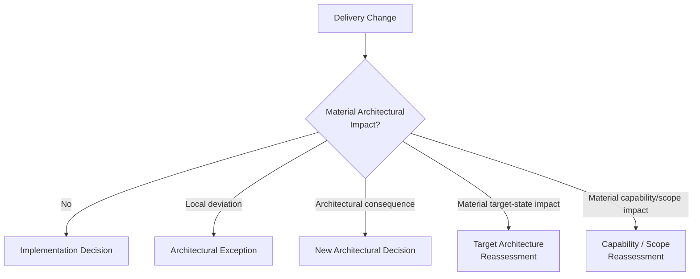

Output:

* Change decisions.
* Updated architectural records.
* Updated risks and assumptions.
* Updated capability implications where relevant.

⸻

## 10. Steer Through Risks, Issues and Dependencies

Provide architectural input into material delivery risks and issues.

Typical concerns include:

* unresolved dependencies;
* technology limitations;
* integration complexity;
* migration risk;
* security findings;
* operational readiness;
* supplier constraints;
* organisational capability;
* architectural divergence;
* capability delivery risk.

The architect should focus on issues that materially affect architectural outcomes rather than attempting to manage the entire delivery programme.

Output:

* Architectural risk and issue input.
* Escalations.
* Mitigation recommendations.
* Architectural decisions where required.

⸻

## 11. Support Delivery Decisions

Delivery teams may encounter decisions that were not foreseeable during target architecture development.

Provide architectural judgement where decisions affect:

* architectural boundaries;
* technology strategy;
* cross-team integration;
* data ownership;
* security;
* resilience;
* significant vendor dependencies;
* target-state integrity;
* capability realisation.

Use the appropriate decision mechanism established in Stage 03.

Output:

* Delivery-related architectural decisions.
* Decision records where material.

⸻

## 12. Validate Operational Readiness

Where the engagement extends into implementation or transition, validate that the delivered capability can be operated effectively.

Consider:

* service ownership;
* monitoring;
* observability;
* alerting;
* support;
* incident management;
* resilience;
* disaster recovery;
* security;
* access management;
* operational documentation;
* runbooks;
* data operations;
* supplier responsibilities;
* business readiness;
* organisational capability.

Operational readiness should be considered progressively rather than only immediately before go-live.

Output:

* Operational readiness assessment.
* Outstanding operational actions.
* Handover inputs.
* Operational ownership confirmation where applicable.

⸻

## 13. Validate Delivery Against Intended Outcomes

Assess whether implementation remains aligned with the original architectural and business intent.

Confirm:

* intended capabilities are being established;
* material requirements remain satisfied;
* architectural risks are understood;
* significant deviations are explicit;
* operational implications are addressed;
* remaining gaps are known;
* intended outcomes remain valid.

The validation chain should be:

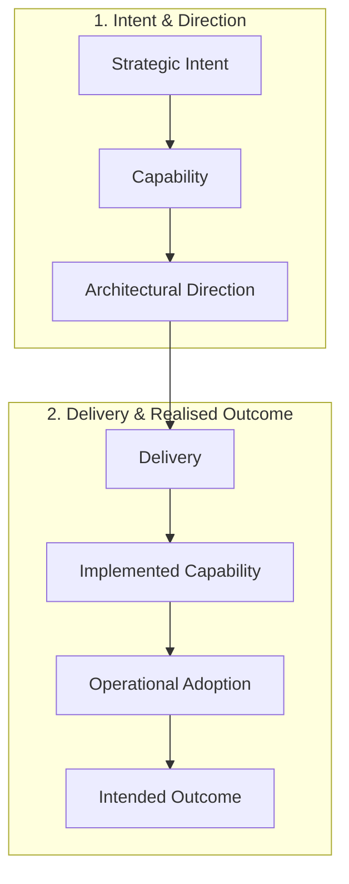

Where outcomes or capability requirements have materially changed, revisit the relevant earlier stage rather than continuing to execute an obsolete architecture.

Output:

* Delivery validation.
* Capability realisation status.
* Remaining gaps.
* Recommendations for continuation, adaptation, or handover.

⸻

## Transformation Roadmap

Where a transformation roadmap is required, it should communicate a credible transition rather than simply list activities.

A roadmap may include:

| Element        | Purpose                                           |
| -------------- | ------------------------------------------------- |
| Outcome        | What value or capability the increment enables    |
| Capability     | What business or operational capability changes   |
| Scope          | What is included                                  |
| Dependencies   | What must exist first                             |
| Architecture   | Relevant target-state alignment                   |
| Delivery       | Major implementation activity                     |
| Risk           | Material implementation concerns                  |
| Decision Point | Decisions required before progression             |
| Ownership      | Accountable organisation/team                     |
| Readiness      | Conditions required for transition                |

The roadmap should preserve the relationship between delivery activity and the capability or outcome it is intended to establish.

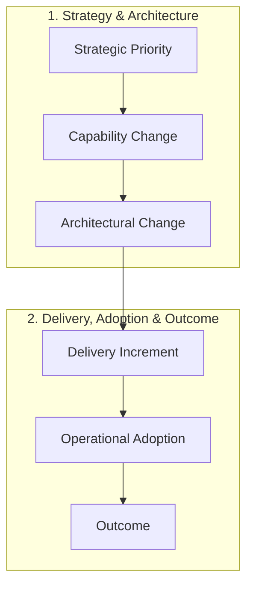

Roadmap horizons may be expressed as:

* immediate;
* near-term;
* medium-term;
* longer-term;

or through phases, waves or releases appropriate to the organisation.

A fixed 30/60/90-day model should not be assumed.

Time horizons should reflect the actual transformation context.

⸻

## Architecture Assurance

Architecture assurance should focus on whether implementation remains consistent with the material intent of the architecture and continues to support the intended capability.

Potential assurance dimensions include:

Architecture

* boundaries;
* responsibilities;
* patterns;
* dependencies;
* technology choices.

Integration

* interfaces;
* contracts;
* event flows;
* resilience;
* versioning.

Data

* ownership;
* quality;
* privacy;
* lineage;
* lifecycle.

Security

* identity;
* access;
* threat controls;
* data protection;
* regulatory requirements.

Operations

* observability;
* resilience;
* support;
* recovery;
* service ownership.

Capability

* intended capability being established;
* material capability gaps;
* organisational readiness;
* process or journey implications where relevant.

AI / Agentic Systems

Where applicable:

* model behaviour;
* evaluation;
* context;
* autonomy;
* tool permissions;
* human oversight;
* monitoring;
* safety controls.

The assurance mechanism should be selected according to the materiality of the concern.

Assurance should provide useful information and intervention where necessary.

It should not become an objective of achieving maximum compliance for its own sake.

⸻

## Delivery Quality Gates

Quality gates may be used where they provide meaningful assurance.

Examples include:

Architecture Gate

Confirm that implementation remains aligned with the agreed architectural direction.

Contract Gate

Confirm that material interfaces and integration contracts are defined and managed appropriately.

Security Gate

Confirm that relevant security and compliance requirements have been addressed.

NFR Gate

Confirm that material non-functional requirements have been validated.

Capability Readiness Gate

Confirm that the implementation is establishing the intended capability and that material business/process dependencies have been addressed.

Operational Readiness Gate

Confirm that the capability can be supported and operated.

Transition Gate

Confirm that the conditions required for migration, release, or organisational transition have been satisfied.

Not every delivery requires all of these gates.

Quality gates should be proportionate and should not duplicate existing delivery controls.

A quality gate should exist because it reduces material uncertainty or risk, not because a governance process requires another checkpoint.

⸻

## Automation and AI-Assisted Delivery Assurance

Where appropriate, automation may support architectural assurance.

Potential mechanisms include:

* architecture policy validation;
* repository analysis;
* dependency analysis;
* API contract validation;
* infrastructure policy checks;
* security scanning;
* specification validation;
* automated documentation;
* architecture drift detection;
* compliance reporting;
* capability evidence aggregation.

For repository-driven or CI/CD environments, checks may be integrated into existing engineering workflows.

Examples include:

* build validation;
* policy linters;
* unit and integration tests;
* infrastructure validation;
* specification checks;
* architecture compliance checks.

AI may additionally support:

* repository and implementation analysis;
* architecture-to-code comparison;
* dependency discovery;
* change-impact analysis;
* evidence aggregation;
* candidate architecture deviations;
* documentation consistency;
* risk identification;
* implementation traceability.

Automated or AI-generated findings should be treated as evidence requiring appropriate validation.

These mechanisms should complement rather than replace architectural judgement.

[!NOTE]
Specific scripts, repository structures, CI/CD workflows, or implementation tooling are engagement-specific delivery mechanisms. They are not mandatory components of the Enterprise Architecture SOP.

⸻

Engagement-Specific Tailoring

The core delivery-enablement practice is instantiated according to:

* engagement purpose;
* target architecture maturity;
* implementation scope;
* delivery model;
* organisational capability;
* transition complexity;
* risk;
* required level of architectural involvement.

Examples include:

| Engagement Pattern                     | Typical Stage 04 Contribution                                                                            |
| -------------------------------------- | -------------------------------------------------------------------------------------------------------- |
| Focused Architecture / Decision Review | Usually limited to implementation implications, constraints and next-step guidance                       |
| Architecture Health Check              | Prioritised remediation actions and implementation considerations where required                         |
| Target Architecture Blueprint          | Transition implications and implementation guidance where within scope                                   |
| Architecture Assessment & Roadmap      | Detailed transition strategy, roadmap and sequencing                                                     |
| Enterprise Transformation              | Transformation roadmap, dependency management, architecture assurance and organisational enablement      |
| Delivery Steering                      | Ongoing architecture assurance, decision support, risk management and adaptation during implementation   |

A detailed roadmap is therefore not automatically required merely because Stage 04 is referenced.

Similarly, ongoing execution steering may be unnecessary once architectural direction has been sufficiently transferred to capable delivery teams.

The appropriate level of architectural involvement should be determined by:

* materiality;
* architectural complexity;
* delivery risk;
* organisational capability;
* consequence of deviation;
* required confidence.

⸻

Reusable Delivery Assets

Where appropriate, maintain reusable assets including:

* roadmap templates;
* transition patterns;
* migration patterns;
* architecture assurance criteria;
* quality gate templates;
* delivery principles;
* architecture compliance checklists;
* operational readiness checklists;
* dependency assessment templates;
* architecture deviation templates;
* implementation decision templates;
* capability readiness checklists;
* AI/agentic delivery assurance patterns.

Reusable assets should accelerate delivery enablement without prescribing a particular delivery methodology.

⸻

Outputs

Depending on the engagement, Stage 04 may produce:

* Implementation readiness assessment.
* Transition strategy.
* Migration approach.
* Delivery sequencing.
* Transformation roadmap.
* Capability transition plan.
* Delivery principles.
* Architecture guidance.
* Dependency map.
* Architecture assurance approach.
* Architecture review checkpoints.
* Quality gate criteria.
* Architecture compliance assessments.
* Architectural deviation records.
* Delivery-related ADRs.
* Risk and issue recommendations.
* Operational readiness assessment.
* Capability readiness assessment.
* Transition and handover inputs.

Outputs are scope-driven, not automatically required for every engagement.

⸻

Governance & Quality Gates

Gate 1 — Architectural Baseline

Confirm that the implementation team understands:

* target architecture;
* architectural principles;
* material decisions;
* constraints;
* assumptions;
* key risks;
* intended capability outcomes.

⸻

Gate 2 — Delivery Feasibility

Confirm that the proposed execution path is realistic given:

* team capability;
* organisational capacity;
* technology constraints;
* dependencies;
* operational requirements;
* supplier constraints;
* required capability changes.

Do not produce a roadmap that assumes capabilities or resources without evidence.

⸻

Gate 3 — Dependency and Sequencing

Confirm that material dependencies have been identified and that implementation sequencing is credible.

Where dependencies remain uncertain, record them explicitly.

Where capability dependencies are material, confirm that the sequence supports the intended capability evolution.

⸻

Gate 4 — Architecture Assurance

Confirm that appropriate mechanisms exist to detect and address material architectural deviations.

Assurance should be proportionate to:

* risk;
* complexity;
* decision significance;
* consequences of deviation;
* capability impact.

⸻

Gate 5 — Change Control

Confirm that material changes to architectural direction are:

* identified;
* assessed;
* decided;
* recorded;
* communicated.

Delivery should not silently redefine the architecture.

⸻

Gate 6 — Operational Readiness

Before transition or handover, confirm that relevant operational requirements have been addressed.

⸻

Gate 7 — Capability and Outcome Alignment

Confirm that delivery remains aligned with the intended:

* capability;
* business outcome;
* architectural direction.

If the original intent is no longer valid, revisit the appropriate earlier stage rather than continuing against an obsolete baseline.

⸻

Relationship to Other Stages

Stage 04 receives:

* target architecture;
* architectural decisions;
* governance principles;
* guardrails;
* risks;
* requirements;
* constraints;
* intended capability changes;
* intended outcomes;

from earlier stages.

It translates those into practical implementation and provides feedback as delivery generates new evidence.

The relationship can be expressed as:

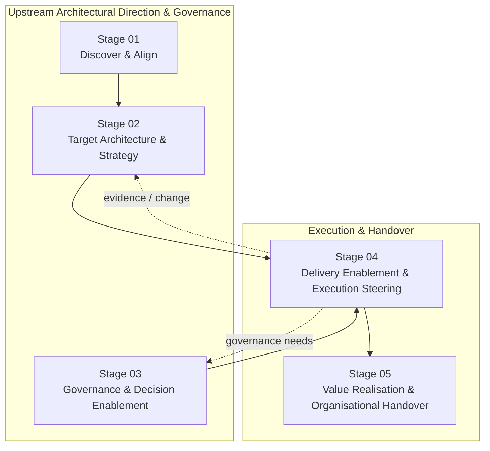

Stage 04 therefore operates as a bridge between architecture and execution, rather than as a one-way handoff.

Material architectural changes identified during delivery should feed back into:

* Stage 02 — Target Architecture & Strategy, where architectural direction requires reassessment;
* Stage 03 — Governance & Decision Enablement, where new decision rights, controls, exceptions, or governance mechanisms are required.

Stage 04 provides important inputs to:

* Stage 05 — Value Realisation & Organisational Handover, where delivered capabilities are transitioned into operational ownership and their outcomes are assessed.

The intended lifecycle is therefore:

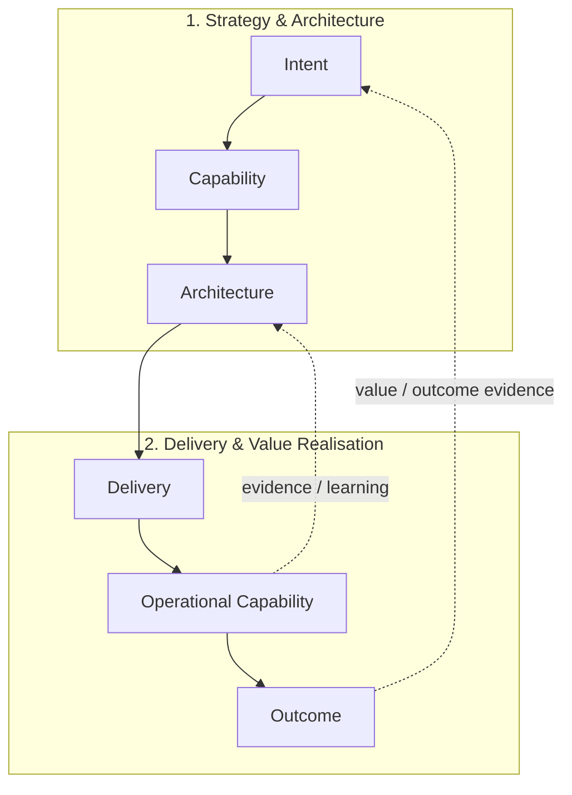

The feedback arrows are deliberate.

The EA operating model is not a waterfall from strategy to delivery.

It is a controlled learning system in which implementation and realised outcomes provide evidence that may influence subsequent architectural decisions.

⸻

Relationship to Stage 01 — Discover & Align

Stage 01 establishes:

* business intent;
* strategic priorities;
* relevant business capabilities;
* required capability evolution;
* problem/question/decision;
* context;
* scope;
* evidence base;
* relevant constraints;
* desired outcomes.

Stage 04 uses this context to ensure that delivery is ultimately establishing the intended capability and outcome.

Where implementation reveals that the original capability requirement or business context was materially misunderstood, Stage 04 should trigger reassessment rather than silently compensate through technical changes.

⸻

Relationship to Stage 02 — Target Architecture & Strategy

Stage 02 establishes:

* architectural direction;
* architectural options;
* trade-offs;
* target architecture where required;
* architectural judgement;
* material architectural decisions;
* transition implications where required.

Stage 04 translates these into:

* execution paths;
* implementation increments;
* dependencies;
* delivery guidance;
* architecture assurance;
* operational readiness;
* capability realisation.

Stage 04 does not replace Stage 02.

When material evidence changes the architectural direction, the work should return to Stage 02 through the appropriate decision or governance mechanism.

⸻

Relationship to Stage 03 — Governance & Decision Framework

Stage 03 establishes:

* decision rights;
* governance mechanisms;
* architecture authority;
* standards;
* controls;
* exceptions;
* escalation;
* governance operating model.

Stage 04 applies those mechanisms during implementation.

Stage 04 may identify new governance requirements where delivery reveals:

* new decision rights;
* recurring exceptions;
* new architectural risks;
* control gaps;
* new organisational dependencies.

Such requirements should feed back into Stage 03.

The distinction is:

Stage 03 establishes how architectural decisions and exceptions are governed; Stage 04 applies that governance while architecture is being implemented.

⸻

Relationship to Stage 05 — Value Realisation & Organisational Handover

Stage 04 establishes and validates:

* implementation;
* operational readiness;
* capability readiness;
* transition;
* delivery alignment.

Stage 05 establishes:

* value realisation;
* outcome tracking;
* organisational ownership;
* operational handover;
* continued evolution.

The distinction is:

Stage 04 establishes and validates the transition into an operable capability; Stage 05 determines whether the capability is delivering the intended organisational value and is sustainably owned.

⸻

Architecture Method Boundary

Stage 04 should remain focused on:

* translating architecture into execution;
* enabling delivery;
* architecture assurance;
* implementation decisions;
* transition;
* operational readiness;
* architectural adaptation.

The architect should escalate rather than silently absorb work where the engagement requires:

* detailed programme management;
* detailed project management;
* sprint management;
* resource management;
* commercial management;
* procurement execution;
* detailed engineering management;
* organisational restructuring;
* business transformation ownership;
* comprehensive benefits management.

Such responsibilities may be closely related to delivery but are not automatically Enterprise Architecture responsibilities.

The architect may contribute to these activities where explicitly engaged to do so.

⸻

Governance, Validation and Architectural Accountability

The architect should maintain an appropriate relationship with delivery leadership and teams.

The architect may:

* provide direction;
* challenge assumptions;
* identify risks;
* facilitate decisions;
* assess architectural impact;
* review implementation;
* escalate material concerns;
* help teams navigate architectural constraints.

The architect should not become a bottleneck for routine implementation decisions.

Where delivery teams are capable of operating within established architectural guardrails, the architect should enable autonomy.

Architectural intervention should be concentrated where the consequences of deviation are material.

⸻

Evidence and Traceability

Material delivery decisions should remain traceable to architectural intent.

Where relevant:

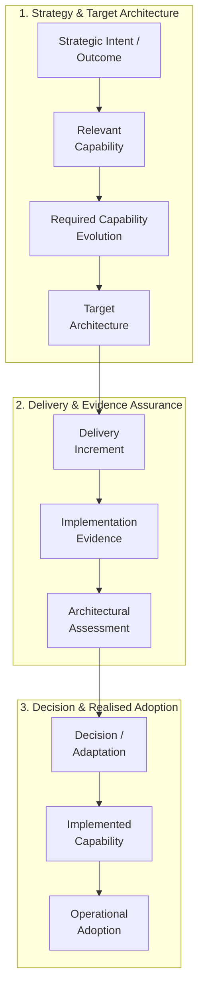

Material changes should record:

* evidence;
* architectural implication;
* capability implication;
* decision;
* consequence;
* owner;
* confidence;
* follow-up where required.

This allows the organisation to distinguish between:

* intentional evolution;
* accidental drift;
* accepted deviation;
* architectural change.

⸻

Architecture Confidence

Confidence during delivery should reflect the strength of evidence available about:

* implementation;
* capability realisation;
* architectural conformance;
* operational readiness;
* organisational readiness;
* remaining risks;
* unresolved dependencies;
* assumptions;
* expected outcomes.

Confidence may change during implementation.

A high-confidence target architecture may become lower confidence if:

* implementation evidence contradicts assumptions;
* operational constraints emerge;
* dependencies change;
* technology behaviour differs from expectations;
* organisational readiness proves insufficient.

Conversely, implementation may increase confidence by validating previously uncertain architectural assumptions.

Confidence should therefore be treated as an evolving property rather than a one-time approval status.

⸻

Summary

Stage 04 exists to turn architectural direction into credible, executable and governable change.

It connects:

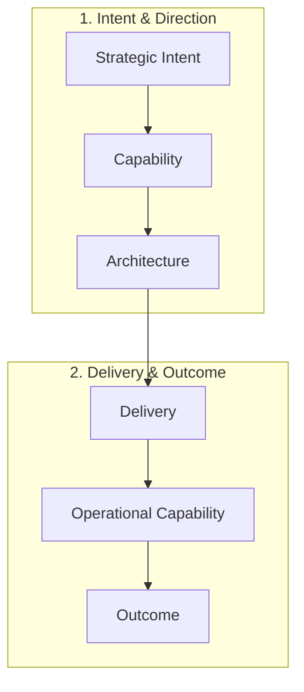

The architect:

* starts from intended outcomes and capability changes;
* confirms that architectural direction is executable;
* assesses implementation readiness;
* establishes transition strategy;
* identifies meaningful delivery increments;
* sequences according to dependencies and risk;
* respects the existing delivery model;
* enables delivery teams through architectural guardrails;
* provides proportionate architecture assurance;
* monitors architectural conformance;
* manages material architectural change;
* supports delivery decisions;
* validates operational readiness;
* validates capability and outcome alignment;
* uses implementation evidence to adapt architecture where necessary;
* maintains traceability;
* remains accountable for architectural judgement.

Architecture assurance is not primarily about enforcing conformity.

It is about maintaining sufficient architectural integrity, visibility and decision quality to enable successful change.

Delivery is not complete simply because implementation has finished.

The relevant endpoint is the establishment of an operable capability that remains aligned with the intended architectural direction and business outcome.

Stage 04 therefore provides the bridge between:

Architecture as direction

and

Architecture as realised organisational capability.

⸻

© 2026 Alexandre Franco. Ideas-to-Life. All rights reserved. Proprietary methodology and architecture specification.
