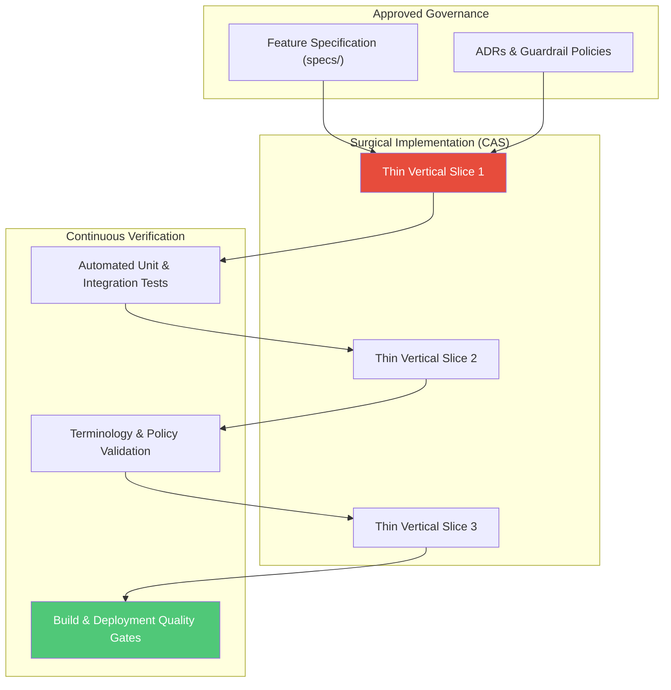
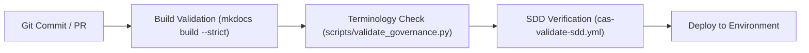

# Stage 04: Operationalise & Orchestrate

## Overview

The **Operationalise & Orchestrate** stage bridges design and governance with hands-on delivery. By employing the **Continuous Architecture System (CAS)** and **Specification-Driven Development (SDD)**, software engineering and agentic workflows are executed in thin, verifiable slices.

This stage eliminates guesswork and arbitrary refactoring: **"How do we build thin vertical slices and prove correctness in the codebase?"**

---

## Key Activities & Methodology

### 1. Specification-Driven Development (SDD)
Before any code or narrative modification is made, a formal specification must be authored under `specs/` (or via Speckit tools). The specification defines:
- Prioritized User Stories (P1, P2, P3).
- Given-When-Then Acceptance Scenarios.
- Functional Requirements (FR-001, FR-002...).
- Measurable Success Criteria.

### 2. Surgical Slice Implementation
Deliver code in minimal, self-contained vertical slices. Avoid monolithic "big bang" pull requests:
- **Scope Discipline:** Touch only what is required by the specification.
- **No Unsolicited Refactoring:** Do not modify orthogonal components or remove code/comments without explicit approval.
- **Contract-First Code:** Implement public interfaces and schemas before writing internal logic.

### 3. Continuous Repository Quality Gates
Automate compliance verification directly in the CI/CD pipeline (`.github/workflows/`):

1. **Build Integrity Gate:** Validate zero broken links, missing references, or navigation errors (`mkdocs build --strict`).
2. **Terminology Governance Gate:** Run automated checks (`scripts/validate_governance.py`) against `governance/terminology.yaml` to prevent narrative drift and enforce canonical terms.
3. **SDD Compliance Gate:** Verify that structural changes are accompanied by an approved spec in `specs/`.

---

## Inputs & Outputs

### Primary Inputs
- Approved Feature Specification (`specs/*.md`) and ADRs.
- Repository source code and delivery workflow configuration.
- Local validation scripts (`scripts/run_governance.sh`).

### Primary Outputs
- **Tested Code & Narrative Slices:** Production-ready additions passing all unit and integration tests.
- **Passing Quality Gate Reports:** Automated CI/CD execution logs demonstrating zero errors.
- **Updated Architectural State:** Living documentation synchronized with codebase reality.

---

## Governance & Quality Gate

> [!IMPORTANT]
> **Stage Gate Check:** Never declare success without empirical verification. A feature is incomplete until local verification (`bash scripts/run_governance.sh` and pytest) passes cleanly.
