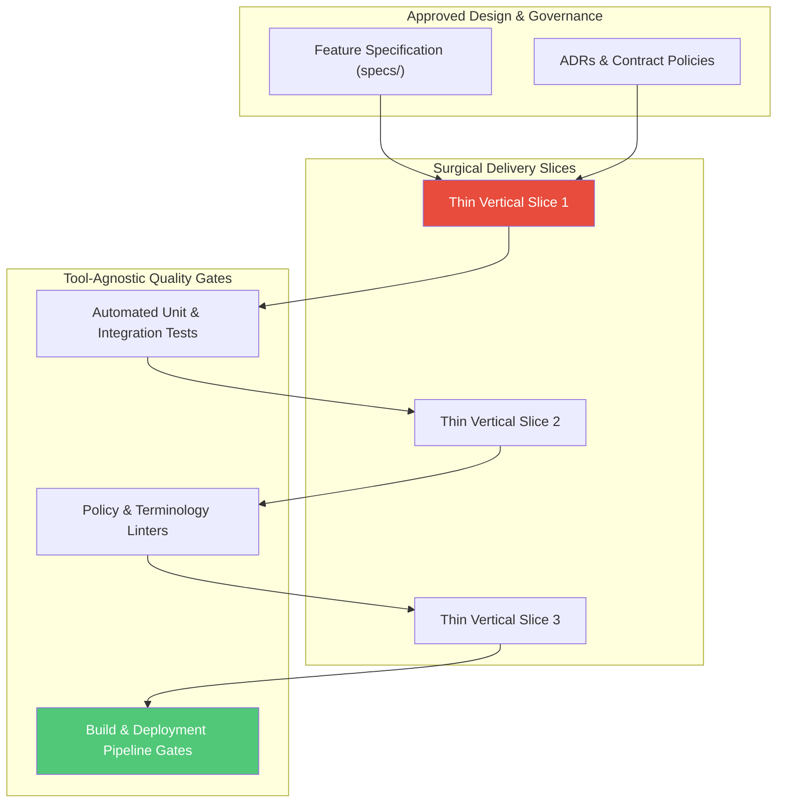
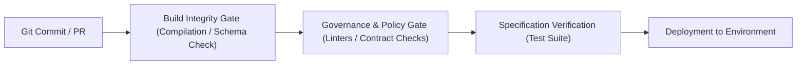

# Stage 04: Operationalise & Orchestrate

## Overview

The **Operationalise & Orchestrate** stage bridges design and governance with hands-on engineering delivery. This stage is **tool-agnostic**: whether delivery teams use standard CI/CD pipelines, GitOps toolchains, agile delivery systems, or repository-driven governance frameworks (such as the Continuous Architecture System - CAS), the core process remains identical.

This stage eliminates arbitrary code changes and unverified deployments: **"How do we build thin vertical slices and prove correctness in the delivery pipeline?"**

---

## Key Activities & Methodology

### 1. Specification-Driven Delivery (SDD)
Before any code or narrative modification is made, a formal specification must be authored (e.g. under `specs/` or via team specification tools). The specification defines:
- Prioritized User Stories (P1, P2, P3).
- Given-When-Then Acceptance Scenarios.
- Functional Requirements (FR-001, FR-002...).
- Measurable Success Criteria.

### 2. Surgical Slice Execution
Deliver code in minimal, self-contained vertical slices. Avoid monolithic "big bang" deployments:
- **Scope Discipline:** Touch only what is required by the specification.
- **No Unsolicited Refactoring:** Do not modify orthogonal components or remove existing code/comments without explicit approval.
- **Contract-First Implementation:** Implement public interfaces, API schemas, and data models before writing internal component logic.

### 3. Tool-Agnostic Pipeline Quality Gates
Enforce automated quality gates directly in the team's delivery pipeline (GitHub Actions, GitLab CI, Jenkins, Azure DevOps, or custom toolchains):

1. **Build Integrity Gate:** Validate zero compilation errors, broken links, or schema mismatches.
2. **Governance & Policy Gate:** Run automated linters (e.g. `scripts/validate_governance.py` or policy checkers) to verify architectural standards, security rules, and canonical terminology.
3. **Specification Verification Gate:** Execute unit, integration, and contract test suites to prove that functional requirements are met.

---

## Inputs & Outputs

### Primary Inputs
- Approved Feature Specification (`specs/*.md`) and ADRs.
- Repository source code and team delivery pipeline configurations.
- Local and CI validation scripts.

### Primary Outputs
- **Production-Ready Code Slices:** Tested code and documentation passing all pipeline checks.
- **Passing Quality Gate Reports:** Automated CI/CD logs demonstrating zero build or policy errors.
- **Updated Architectural State:** Living documentation and system state synchronized with codebase reality.

---

## Governance & Quality Gate

> [!IMPORTANT]
> **Stage Gate Check:** Never declare success without empirical verification. A delivery slice is incomplete until automated pipeline quality gates (builds, tests, linters) pass cleanly.
