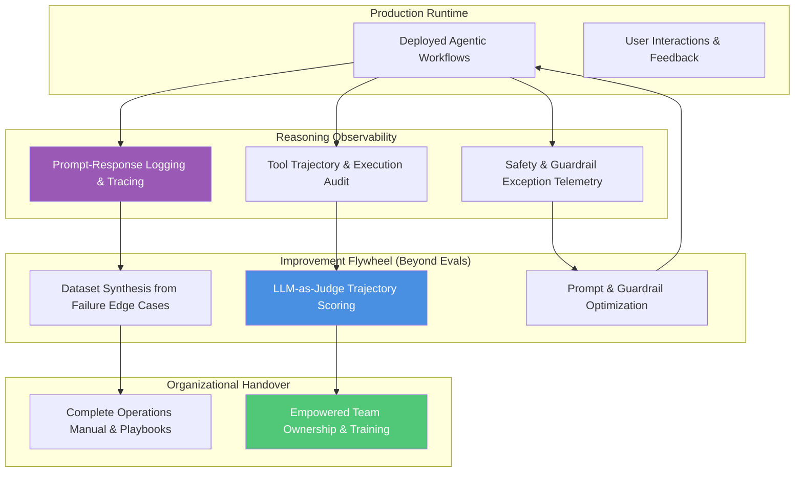
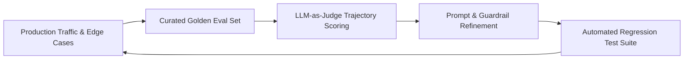

# Stage 05: Evolve & Observe

## Overview

The **Evolve & Observe** stage ensures long-term operational health, continuous learning, and seamless handover. In modern Agentic AI systems, deployment is not the end of the architectural lifecycle—it is the beginning of continuous observation and flywheel refinement.

This stage establishes transparent auditability and self-improving capabilities: **"How do we audit agent reasoning, continuously improve AI performance, and empower teams?"**

---

## Key Activities & Methodology

### 1. Reasoning Observability for Autonomous Agents
Autonomous agents require deep observability beyond traditional application monitoring (CPU/Memory/Latency). Architects must implement **Reasoning Observability**:
- **Prompt-Response Tracing:** Capture full input context, system prompts, model parameters, and raw generation outputs (using Cloud Trace, OpenTelemetry, or specialized agent tracing platforms).
- **Tool Trajectory Audit:** Record exact sequences of tool calls, arguments passed, execution results, and retry loops.
- **Decision Audit Trail:** Maintain immutable logs detailing *why* an agent selected a specific branch or tool execution path.

### 2. LLM Improvement Flywheels ("Beyond Evals")
Building upon problem-first AI methodologies and evaluation flywheels, system quality is continuously upgraded post-launch:

- **Golden Eval Datasets:** Continuously harvest edge-case failures from production telemetry to expand regression eval sets.
- **LLM-as-Judge Scoring:** Implement multi-axis evaluators assessing accuracy, adherence to system prompts, tool usage efficiency, and safety.
- **Systematic Flywheel Iteration:** Use eval results to refine system prompts, update guardrail rules, or fine-tune specialized models without breaking existing behavior.

### 3. Empowered Organizational Handover
Handover is not a static PDF delivery; it is a structured enablement process that transfers full ownership to the client organization:
- **Architectural Runbooks:** Clear operational guides detailing maintenance procedures, troubleshooting steps, and failover protocols.
- **Governance Enablement:** Training internal engineering teams to maintain ADRs, run local governance linters (`scripts/validate_governance.py`), and operate quality gates.
- **Strategic Sunset / Roadmap Review:** Reviewing initial Stage 01 value metrics against runtime performance to prioritize Phase 2/3 roadmap enhancements.

---

## Inputs & Outputs

### Primary Inputs
- Runtime telemetry, execution logs, and user feedback.
- Production error stack traces and guardrail rejection logs.
- Original Stage 01 Value Metrics and Stage 03 NFR Priorities.

### Primary Outputs
- **Reasoning Observability Dashboards:** Real-time visibility into agent trajectories, token costs, and error rates.
- **Refined Eval Suites & Flywheels:** Expanded regression datasets and benchmark scores.
- **Operational Handover Package:** Complete runbooks, architecture diagrams, and team training artifacts.

---

## Governance & Quality Gate

> [!IMPORTANT]
> **Stage Gate Check:** Handover is complete only when client engineering teams can independently execute governance checks, interpret reasoning observability logs, and deploy slice updates without external dependency.
