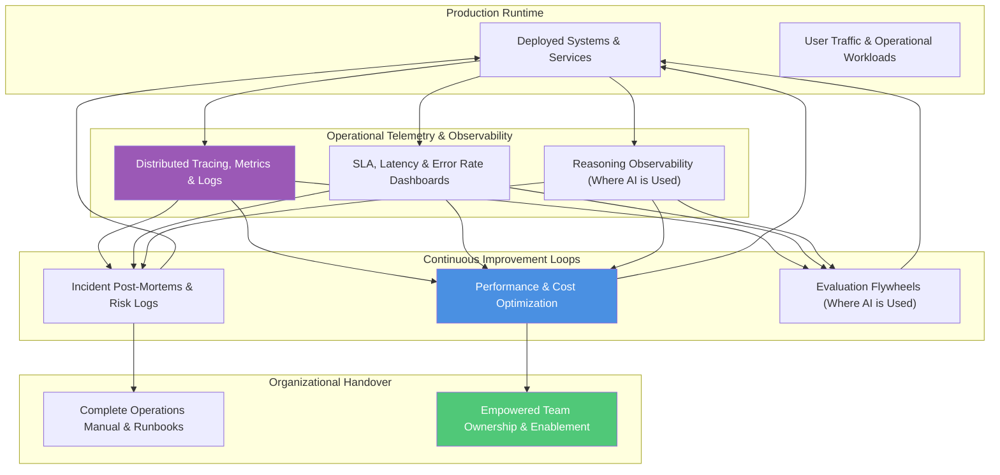
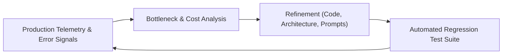

# Stage 05: Evolve & Observe

## Overview

The **Evolve & Observe** stage ensures long-term operational health, continuous learning, and seamless handover. Deployment is not the end of the architectural lifecycle—it is the beginning of continuous observation, operational feedback loops, and capability refinement.

This stage establishes transparent telemetry and organizational empowerment: **"How do we observe system performance, drive continuous improvement, and empower teams?"**

---

## Key Activities & Methodology

### 1. Operational & System Telemetry
Establish comprehensive telemetry across all system layers:
- **Core System Metrics (Golden Signals):** Monitor Latency, Traffic, Errors, and Saturation (CPU, Memory, Storage, Database Connections).
- **Distributed Tracing & Logs:** Implement structured logging and distributed tracing (e.g. OpenTelemetry, Cloud Trace) across microservice boundaries.
- **Reasoning Observability (Where AI is Used):** If AI/Agentic components are deployed, log prompt-response pairs, tool trajectories, and token cost telemetry to audit probabilistic execution.

### 2. Continuous Improvement Feedback Loops
System quality is upgraded iteratively post-launch using empirical runtime evidence:

- **Post-Mortem & Debt Harvesting:** Feed operational incidents and performance bottlenecks back into Stage 01 framing for future roadmap iterations.
- **Evaluation Flywheels (Where AI is Used):** Harvest production edge cases into golden evaluation datasets to continuously score and refine model outputs ("Beyond Evals").

### 3. Empowered Organizational Handover
Handover is a structured enablement process that transfers full ownership to the client organization:
- **Architectural Runbooks:** Clear operational guides detailing maintenance procedures, failure modes, and recovery steps.
- **Governance Enablement:** Train internal engineering teams to maintain ADRs, operate quality gates, and run governance linters (`scripts/validate_governance.py`).
- **Roadmap Review:** Compare actual runtime metrics against Stage 01 value metrics to validate ROI and prioritize Phase 2/3 roadmap enhancements.

---

## Inputs & Outputs

### Primary Inputs
- Runtime telemetry, APM metrics, error logs, and user feedback.
- Production incident reports and cost reports.
- Original Stage 01 Value Metrics and Stage 03 NFR Priorities.

### Primary Outputs
- **Observability Dashboards:** Real-time visibility into system health, latency SLAs, and error rates.
- **Operational Runbooks:** Complete maintenance guides and disaster recovery procedures.
- **Handover Package:** Trained engineering team, updated architecture repository, and roadmap recommendations.

---

## Governance & Quality Gate

> [!IMPORTANT]
> **Stage Gate Check:** Handover is complete only when client engineering teams can independently operate the system, interpret telemetry, and execute governance quality gates without external dependency.
