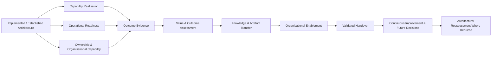
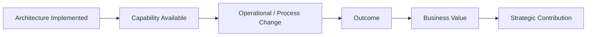
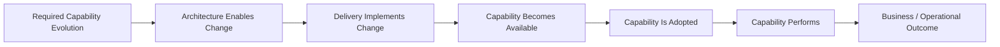
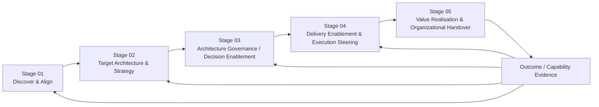

# Stage 05: Value Realisation & Organizational Handover

> [!IMPORTANT]
> **Classification Level**: `RESTRICTED / HIGHLY CONFIDENTIAL` — Enterprise Architecture Operating Model.

## Overview

The **Value Realisation & Organizational Handover** stage establishes whether the architectural intervention has delivered its intended outcomes, whether the resulting capability is ready to operate sustainably, and whether appropriate ownership has been transferred into the organisation.
An Enterprise Architecture engagement should ultimately create **organisational capability and decision-making capacity**, rather than permanent dependency on the architect.
Where implementation and measurable outcomes fall within the engagement scope, value should be assessed against the original business intent, relevant capability change, and success measures.
Where the engagement concludes before implementation or operational use, Stage 05 instead establishes the conditions, measures, ownership, and follow-up mechanisms required for subsequent value realisation.
Handover is therefore not simply the transfer of documents. It is the transfer of sufficient:

- knowledge;
- ownership;
- decision authority;
- operational capability;
- architectural context;
- governance responsibility
for the organisation to operate and evolve the resulting architecture appropriately.
This stage answers:

> **What value has been realised or established for future measurement, is the resulting capability ready to operate, and does the organisation have the ownership and capability required to sustain and evolve it?**
The stage closes the architectural lifecycle by connecting implementation evidence back to the original business intent.

⸻

## Core Principles

## 1. Value Starts With Original Intent

Value should be assessed against the business outcomes, problem, decision, capability change, or strategic intent established during earlier stages.

Where measurable outcomes were defined, assess them explicitly.

Examples may include:

- business capability improvement;
- operational efficiency;
- cost management;
- risk reduction;
- improved resilience;
- improved decision quality;
- improved customer experience;
- improved delivery capability;
- successful AI adoption;
- increased automation.

Do not invent measures after implementation simply because they are easy to obtain.

Where the engagement did not establish measurable outcomes, distinguish clearly between:

- what was originally intended;
- what can now be evidenced;
- what remains expected;
- what cannot yet be measured.

⸻

## 2. Distinguish Delivered Outputs From Capability, Outcomes and Value

An architecture being delivered does not automatically mean that its intended business value has been realised.

Distinguish between:

| Level           | Question                                                       |
| --------------- | ---------------------------------------------------------------|
| Output          | What was produced or implemented?                              |
| Capability      | What can the organisation now do?                              |
| Outcome         | What changed as a result?                                      |
| Value           | What measurable benefit resulted?                              |
| Strategic Impact| Did the change contribute to the broader strategic objective?  |

For example:

The architect should avoid claiming realised value where only implementation evidence exists.

⸻

## 3. Capability Realisation Is the Bridge Between Architecture and Value

Architecture creates value through the capabilities it enables, changes, improves, or protects.

Where relevant, Stage 05 should therefore establish whether the intended capability evolution actually occurred.

Consider:

- capability availability;
- capability adoption;
- capability effectiveness;
- operational usage;
- changed business or user journeys;
- changed processes;
- changed information flows;
- changed decision-making;
- changed organisational responsibilities.

This does not require a formal capability maturity model.

The question is whether the intended capability change is observable and supported by evidence.

⸻

## 4. Value Realisation May Extend Beyond the Engagement

Some engagements conclude before the resulting architecture is implemented or before sufficient operational data exists to measure outcomes.

In those circumstances, the appropriate output may be:

- defined success measures;
- measurement approach;
- baseline;
- ownership;
- expected outcomes;
- value hypothesis;
- follow-up recommendations.

A credible architecture engagement should distinguish between:

- realised value;
- expected value;
- value yet to be measured.

⸻

## 5. Operational Readiness Is Contextual

Operational readiness should be assessed where the engagement involves implementation, production transition, or operational ownership.

It may include:

- support;
- monitoring;
- observability;
- resilience;
- security;
- disaster recovery;
- service ownership;
- incident management;
- operational documentation;
- supplier responsibilities.

An engagement that ends at architectural recommendation does not automatically require an Operational Readiness Review.

⸻

## 6. Handover Means Transfer of Capability

Handover is complete when the organisation has sufficient capability to:

- understand the architecture;
- operate relevant capabilities;
- make appropriate decisions;
- maintain governance;
- manage known risks;
- evolve the architecture.

Documents are necessary where they support that capability, but documentation alone does not constitute successful handover.

⸻

## 7. Ownership Must Be Explicit

Every material capability, architecture domain, service, decision, and governance responsibility should have an identifiable owner where appropriate.

Handover should make clear:

- who owns the capability;
- who operates it;
- who governs it;
- who makes future architectural decisions;
- who owns outstanding risks;
- who maintains the relevant artefacts.

Ownership should reflect the organisation’s actual operating model rather than introducing an artificial architecture structure.

⸻

## 8. Architecture Should Remain Evolvable

The conclusion of an engagement should not create the expectation that architecture is permanently fixed.

The organisation should understand:

- what can change safely;
- what decisions remain material;
- which constraints remain;
- which assumptions require monitoring;
- when architectural reassessment is required.

Where appropriate, establish a continuous improvement or architecture evolution mechanism.

⸻

## 9. Knowledge Transfer Should Be Practical

Enablement should be targeted at the people who will actually use and evolve the architecture.

Potential audiences include:

- executives;
- business owners;
- product leaders;
- enterprise architects;
- solution architects;
- engineering teams;
- data teams;
- security teams;
- operations;
- governance functions.

The depth and format of enablement should reflect the audience and engagement scope.

⸻

## 10. Evidence Before Claims

Value, readiness, capability, and ownership claims should be supported by appropriate evidence.

Evidence may include:

- operational telemetry;
- business metrics;
- user adoption;
- service performance;
- incident data;
- delivery evidence;
- stakeholder feedback;
- capability assessments;
- governance records;
- decision records.

Where evidence is unavailable, state the limitation rather than presenting an assumption as a result.

⸻

## 11. Handover Should Reduce Dependency

The architect should progressively transfer:

- context;
- rationale;
- decisions;
- knowledge;
- governance responsibility;
- operational understanding.

The desired outcome is organisational autonomy, not continued dependency on the external architect.

⸻

## 12. Closure Should Preserve the Feedback Loop

The end of an engagement is not necessarily the end of the architecture lifecycle.

Where Stage 05 identifies material divergence from:

- business intent;
- required capability evolution;
- architectural direction;
- delivery assumptions;
- operational conditions;
- expected outcomes;

the appropriate earlier stage should be revisited.

Stage 05 therefore provides both closure and feedback.

⸻

Core Workflow

1. Confirm Intended Outcomes and Success Measures

Revisit the original:

- business intent;
- problem statement;
- decision;
- desired outcomes;
- relevant capability;
- required capability evolution;
- success measures;
- architectural objectives.

Confirm what was intended to change as a result of the engagement.

Where measures were not established earlier, define appropriate measures only where this remains within the engagement scope.

Output

- Confirmed outcome framework.
- Relevant capability and intended capability change.
- Success measures.
- Measurement assumptions and limitations.

⸻

## 13. Establish the Value Baseline

Where value realisation is being assessed, establish the relevant baseline against which change can be evaluated.

Potential baseline information includes:

- current performance;
- existing costs;
- operational metrics;
- process measures;
- risk exposure;
- capability effectiveness;
- customer or user measures.

The baseline may come from Stage 01 or may need to be established during this stage.

A baseline should not be reconstructed retrospectively without sufficient evidence.

Output

- Value baseline.
- Measurement sources.
- Baseline limitations.

⸻

## 14. Assess Capability Realisation

Assess whether the intended capability change has actually occurred.

Consider:

- whether the capability is available;
- whether it is being used;
- whether relevant processes or journeys changed;
- whether the capability performs as intended;
- whether ownership is operationally established;
- whether material constraints remain;
- whether the resulting capability supports the intended outcome.

Distinguish between:

- capability established;
- capability partially established;
- capability not established;
- capability established but not yet adopted;
- capability not yet measurable.

Output

- Capability realisation assessment.
- Capability evidence.
- Adoption findings.
- Capability gaps and limitations.

⸻

## 15. Assess Outcomes and Value

Assess actual results against the intended outcomes where sufficient evidence exists.

Consider:

- what changed;
- whether the intended capability was achieved;
- whether expected outcomes occurred;
- whether benefits are measurable;
- whether unexpected consequences emerged;
- whether assumptions proved correct.

Separate:

- achieved outcomes;
- partially achieved outcomes;
- unmet outcomes;
- outcomes not yet measurable.

Do not convert architectural or delivery activity directly into business value without evidence.

Output

- Value realisation assessment.
- Outcome findings.
- Evidence and confidence.
- Expected-value or measurement plan where required.

⸻

## 16. Assess Operational Readiness

Where production or operational transition is within scope, assess whether the organisation can operate the resulting capability.

Consider:

Service Ownership

- accountable owner;
- support responsibilities;
- escalation paths.

Operations

- monitoring;
- observability;
- alerting;
- incident management;
- operational procedures.

Resilience

- backup;
- recovery;
- disaster recovery;
- resilience testing;
- failure handling.

Security

- identity and access;
- security monitoring;
- vulnerability management;
- data protection.

Data

- ownership;
- quality;
- lifecycle;
- governance.

Suppliers

- contractual responsibilities;
- support;
- service levels;
- escalation;
- dependency management.

AI / Agentic Systems

Where relevant:

- model monitoring;
- evaluation;
- cost monitoring;
- safety controls;
- human oversight;
- model/provider lifecycle;
- incident handling.

Output

- Operational readiness assessment.
- Outstanding readiness actions.
- Ownership gaps.
- Readiness evidence and limitations.

⸻

## 17. Identify Residual Risks and Gaps

Identify material issues that remain at the point of handover.

These may include:

- technical debt;
- unresolved dependencies;
- operational gaps;
- security risks;
- governance gaps;
- capability gaps;
- supplier risks;
- data issues;
- architectural assumptions;
- outstanding implementation work;
- unresolved outcome dependencies.

Each material item should have an appropriate:

- owner;
- action;
- priority;
- target resolution where known;
- escalation path where appropriate.

Output

- Residual risk register.
- Outstanding actions.
- Ownership assignments.
- Escalation requirements.

⸻

## 18. Confirm Organisational Ownership

Establish who owns the architecture and resulting capabilities after the engagement.

Ownership may include:

- business capability owner;
- product owner;
- service owner;
- technology owner;
- enterprise architect;
- domain architect;
- data owner;
- security owner;
- governance owner.

The ownership model should reflect the organisation’s actual operating model.

Ownership should cover both ongoing responsibility and future decision authority.

Output

- Ownership model.
- Accountabilities.
- Decision rights.
- Post-engagement responsibilities.

⸻

## 19. Transfer Architectural Knowledge

Transfer the knowledge required for the organisation to understand and evolve the architecture.

Relevant artefacts may include:

- architecture diagrams;
- target architecture;
- target-state principles;
- architecture principles;
- decision records;
- ADRs;
- interface contracts;
- technology decisions;
- risk registers;
- assumptions;
- transition plans;
- governance requirements;
- operational documentation.

The repository should reflect the organisation’s existing information-management approach where possible.

There is no requirement to introduce a particular tool such as LeanIX, MkDocs, or an internal wiki unless that is appropriate to the engagement.

Output

- Architecture knowledge base.
- Transferred artefacts.
- Confirmed repository ownership.
- Confirmed access and maintenance responsibility.

⸻

## 20. Enable Client Teams

Where appropriate, conduct structured enablement for the teams responsible for operating and evolving the architecture.

Enablement may include:

- architecture walkthroughs;
- decision rationale sessions;
- governance briefings;
- operational walkthroughs;
- technical knowledge transfer;
- training;
- working sessions;
- documentation walkthroughs.

Enablement should focus on practical capability rather than presentation volume.

Output

- Enablement sessions.
- Knowledge-transfer materials.
- Capability confirmation.
- Outstanding enablement actions.

⸻

## 21. Establish Future Decision and Escalation Triggers

Define circumstances that should trigger further architectural review.

Examples include:

- material changes to business strategy;
- significant changes in scale;
- major technology replacement;
- new regulatory requirements;
- material security events;
- significant vendor changes;
- new AI capabilities;
- architectural drift;
- major changes to operating model;
- significant deviations from target architecture;
- material changes to capability requirements.

The organisation should understand when an existing architecture can evolve locally and when a broader architectural decision is required.

Output

- Reassessment triggers.
- Escalation criteria.
- Future decision guidance.

⸻

## 22. Establish Continuous Improvement

Where appropriate, establish mechanisms through which the organisation can continue to learn from:

- operational data;
- user feedback;
- architecture changes;
- incidents;
- technology evolution;
- emerging business needs;
- AI system evaluation;
- governance exceptions;
- capability performance.

Potential mechanisms include:

- architecture review cycles;
- improvement backlogs;
- periodic health checks;
- architecture metrics;
- operational feedback loops;
- AI evaluation cycles;
- roadmap refreshes.

Continuous improvement should be proportionate to the organisation’s needs.

Output

- Improvement mechanism.
- Follow-up recommendations.
- Future assessment triggers.
- Ownership for ongoing improvement.

⸻

## 23. Validate Handover

Confirm that the relevant organisation or teams can take responsibility for the resulting capability.

Validation may include:

- ownership confirmed;
- operational responsibilities understood;
- governance understood;
- material decisions transferred;
- risks accepted or assigned;
- documentation accessible;
- required knowledge transferred;
- outstanding actions owned;
- future decision triggers understood.

Handover validation should test organisational capability, not merely document completion.

Output

- Handover assessment.
- Confirmed ownership.
- Confirmed decision rights.
- Outstanding actions.
- Remaining capability gaps.

⸻

## 24. Close or Transition the Engagement

Conclude the engagement by establishing:

- what has been achieved;
- what remains outstanding;
- what has been transferred;
- what remains uncertain;
- what value has been demonstrated;
- what value remains to be measured;
- what should happen next;
- who owns future actions.

Where ongoing architectural support is required, establish the appropriate continuation mechanism rather than allowing responsibility to remain ambiguous.

Output

- Engagement closure summary.
- Outcome and value status.
- Next-step recommendations.
- Follow-up ownership.
- Reassessment or continuation recommendation where required.

⸻

## 25. Value Realisation Framework

Where value assessment is within scope, evaluate value across an appropriate hierarchy.

| Level             | Question                                                        | Evidence Example                                          |
| ----------------- | --------------------------------------------------------------- | --------------------------------------------------------- |
| Output            | What was delivered?                                             | Implemented architecture, service, process or control     |
| Capability        | What can the organisation now do?                               | New or improved business / operational capability         |
| Outcome           | What changed as a result?                                       | Performance, adoption, risk, service or process change    |
| Value             | What measurable benefit resulted?                               | Cost, efficiency, revenue, risk or experience measure     |
| Strategic Impact  | Did the change contribute to the broader strategic objective?   | Contribution to strategic outcome or priority             |

Not every engagement will reach the Value or Strategic Impact level during the engagement period.

Where measurement is not yet possible, document:

- expected value;
- outcome hypothesis;
- measurement approach;
- baseline;
- owner;
- future measurement point.

This prevents expected value from being represented as realised value.

⸻

## 26. Capability Realisation

Where capability change is a material part of the engagement, assess the progression:

The architect should distinguish between:

| State             | Meaning                                                        |
| ----------------- | -------------------------------------------------------------- |
| Enabled           | Architecture and implementation provide the required mechanism |
| Available         | The capability can be used operationally                       |
| Adopted           | Relevant users, teams or processes actually use it             |
| Effective         | Evidence indicates that it performs as intended                |
| Outcome Realised  | The intended business or operational change is evidenced       |

These states should not be collapsed into a single assertion that the architecture “delivered value”.

⸻

## 27. Operational Readiness Review

Where an Operational Readiness Review (ORR) is required, assess the capability against the operational concerns relevant to the engagement.

Potential areas include:

| Area          | Typical Considerations                                         |
| ------------- | -------------------------------------------------------------- |
| Ownership     | Service owner, support responsibility, escalation              |
| Observability | Monitoring, logging, metrics, alerting                         |
| Resilience    | Availability, recovery, failure handling                       |
| Security      | Access, controls, monitoring, vulnerabilities                  |
| Data          | Ownership, quality, privacy, lifecycle                         |
| Support       | Processes, runbooks, service management                        |
| Recovery      | Backup, restore, disaster recovery                             |
| Performance   | Capacity, scalability, performance monitoring                  |
| Supplier      | Support model, dependencies, SLAs                              |
| AI            | Evaluation, monitoring, safety, human oversight where relevant |

The assessment should identify:

- ready;
- conditionally ready;
- not ready;

or another classification appropriate to the organisation.

An ORR should not be represented as a formal production sign-off unless the architect actually has the authority and scope to provide that sign-off.

⸻

## 28. Organisational Handover

A successful handover should transfer four forms of capability:

| Capability  | Meaning                                                                                                         |
| ----------- | --------------------------------------------------------------------------------------------------------------- |
| Knowledge   | The organisation understands the architecture and the rationale behind it                                       |
| Ownership   | Responsibilities and decision rights are assigned                                                               |
| Operation   | Teams can operate and support the resulting capability where applicable                                         |
| Evolution   | The organisation can make future decisions and evolve the architecture without unnecessary external dependency  |

This is more important than simply transferring a collection of documents.

Handover should therefore be considered successful only when the receiving organisation has sufficient knowledge, authority and capability to assume the agreed responsibilities.

⸻

Executive Impact Brief

Where appropriate, provide an executive-level summary covering:

- original problem or strategic intent;
- relevant capability and intended capability change;
- architectural intervention;
- key decisions;
- capabilities established;
- outcomes achieved or expected;
- material risks;
- remaining gaps;
- next steps.

Where financial or quantitative ROI has not been evidenced, use terms such as:

- expected value;
- indicative benefit;
- outcome hypothesis;
- value opportunity.

Do not present unverified estimates as realised ROI.

⸻

Engagement-Specific Tailoring

The core Stage 05 capabilities are applied according to:

- engagement scope;
- implementation status;
- duration;
- availability of outcome evidence;
- operational responsibility;
- organisational maturity;
- agreed deliverables.

Examples include:

| Engagement Pattern                     | Typical Stage 05 Contribution                                                                |
| -------------------------------------- | -------------------------------------------------------------------------------------------- |
| Focused Architecture / Decision Review | Decision closure, final recommendation, residual risks and next-step guidance                |
| Architecture Health Check              | Findings closure, prioritised improvement actions and ownership                              |
| Target Architecture Blueprint          | Knowledge transfer, architectural ownership and implementation guidance where applicable     |
| Architecture Assessment & Roadmap      | Transition ownership, roadmap governance and measurement framework                           |
| Enterprise Transformation              | Value assessment, operational readiness, organisational enablement and governance transition |
| Delivery Steering                      | Operational transition, outcome validation and ongoing architecture ownership                |

A short advisory engagement may conclude with a decision-ready artefact and clear ownership without requiring a formal handover process.

A transformation engagement may require substantially deeper value measurement and operational transition.

Stage 05 should therefore be proportionate to the point reached by the engagement, rather than being interpreted as a mandatory full value-realisation programme.

⸻

Reusable Assets

Where appropriate, maintain reusable assets including:

- value measurement templates;
- outcome frameworks;
- capability realisation templates;
- operational readiness checklists;
- handover checklists;
- ownership matrices;
- architecture repository structures;
- knowledge-transfer templates;
- executive impact summaries;
- continuous improvement frameworks;
- architecture health-check criteria;
- AI operational evaluation frameworks;
- reassessment trigger templates.

Reusable assets should accelerate handover without imposing unnecessary documentation or process.

⸻

Outputs

Depending on the engagement, Stage 05 may produce:

- Value realisation assessment.
- Outcome assessment.
- Capability realisation assessment.
- Value measurement framework.
- Operational readiness assessment.
- Residual risk register.
- Ownership model.
- Architecture repository.
- Architecture decision catalogue.
- Operational documentation.
- Knowledge-transfer materials.
- Client enablement sessions.
- Executive impact brief.
- Continuous improvement mechanism.
- Future reassessment triggers.
- Engagement closure summary.
- Handover assessment.

Outputs are scope-driven, not automatically required for every engagement.

⸻

## 29. Governance & Quality Gates

### Gate 1 — Outcome Evidence

Where value realisation is claimed, confirm that the claim is supported by appropriate evidence.

Distinguish clearly between:

- realised;
- expected;
- partially realised;
- not yet measurable.

⸻

### Gate 2 — Capability Realisation

Where capability change is within scope, confirm whether the intended capability:

- was established;
- is available;
- has been adopted where relevant;
- is operating as intended where evidence exists;
- has remaining material gaps.

Do not infer capability realisation solely from implementation completion.

⸻

### Gate 3 — Operational Readiness

Where operational transition is within scope, confirm that material operational concerns have been addressed.

Outstanding issues should have clear ownership and disposition.

⸻

### Gate 4 — Ownership

Confirm that the organisation has identified appropriate owners for:

- architecture;
- capabilities;
- services;
- decisions;
- risks;
- governance;
- operational responsibilities.

⸻

### Gate 5 — Knowledge Transfer

Confirm that relevant organisational stakeholders can access and understand the architectural knowledge required to operate and evolve the resulting capability.

⸻

### Gate 6 — Governance Continuity

Confirm that the organisation understands how future material architectural decisions will be governed.

This includes:

- decision rights;
- escalation;
- standards;
- exceptions;
- review mechanisms.

⸻

### Gate 7 — Residual Risk

Confirm that material unresolved risks and gaps have been:

- accepted;
- mitigated;
- transferred;
- escalated; or
- explicitly documented for future action.

⸻

### Gate 8 — Organisational Capability

Where handover is intended to establish autonomy, confirm that the receiving organisation or teams possess the necessary:

- knowledge;
- authority;
- skills;
- operational capability;
- governance access.

If capability gaps remain, document the required enablement rather than declaring complete handover.

⸻

### Gate 9 — Future Evolution

Confirm that the organisation understands the circumstances under which the architecture should be:

- reviewed;
- adapted;
- reassessed;
- replaced.

The end of an engagement should not create an artificial boundary around future architectural change.

⸻

## 30. Relationship to Other Stages

Stage 05 receives:

- intended outcomes;
- relevant capability context;
- required capability evolution;
- target architecture;
- architectural decisions;
- governance mechanisms;
- delivery outcomes;
- operational evidence;
- residual risks

from earlier stages.

It closes the feedback loop by comparing what was intended with what was achieved and by transferring the resulting knowledge and responsibility into the organisation.

Where value or operational evidence identifies a material divergence from the original architecture or intent, the appropriate earlier stage should be revisited.

For example:

- a material change to architectural direction may return to Stage 02;
- a change to governance or decision rights may return to Stage 03;
- implementation changes may return to Stage 04;
- a fundamental change to business intent may require renewed Stage 01 discovery.

The lifecycle is therefore iterative rather than strictly linear.

⸻

Architecture Method Boundary

Stage 05 does not automatically assume responsibility for:

- benefits management;
- financial controlling;
- programme closure;
- formal production sign-off;
- organisational restructuring;
- service management ownership;
- operational management;
- contractual supplier management.

Where these activities are performed by other organisational functions, Stage 05 establishes the architectural inputs, dependencies, ownership and evidence required for them.

The architect remains accountable for the architectural judgement within the agreed engagement scope, but does not assume organisational responsibilities that belong elsewhere.

⸻

Evidence and Traceability

Where applicable, maintain traceability through the following chain:

```mermaid
flowchart LR
    A["Strategic Intent / Outcome"] --> B["Relevant Business Capability"]
    B --> C["Required Capability Evolution"]
    C --> D["Architectural Direction"]
    D --> E["Delivery Increment"]
    E --> F["Implementation Evidence"]
    F --> G["Capability Realisation"]
    G --> H["Operational Adoption"]
    H --> I["Outcome Evidence"]
    I --> J["Value Assessment"]
    J --> K["Organisational Ownership"]
    K --> L["Future Evolution"]
```

The strength of the conclusion should reflect the strength of the evidence available at each point in the chain.

Where a link cannot be evidenced, the limitation should be explicit.

⸻

## 31. Architecture Confidence

Architecture confidence should evolve as implementation and operational evidence becomes available.

Confidence may be affected by:

- implementation evidence;
- operational constraints;
- capability adoption;
- dependency changes;
- organisational readiness;
- emerging risks;
- changing business conditions;
- changes to technology or supplier landscape;
- AI system behaviour and evaluation where relevant.

Stage 05 should therefore not simply confirm whether the original architecture was implemented.

It should establish whether the architecture remains appropriate in the context of what has actually been learned.

Where material evidence invalidates an earlier assumption, the appropriate architectural stage should be revisited.

⸻

## 32. Engagement Closure

An engagement may be considered complete when the agreed scope has been satisfied and:

- conclusions are documented;
- material decisions are recorded;
- intended capability changes are understood;
- value status is clear;
- outstanding risks are identified;
- ownership is clear;
- required knowledge has been transferred;
- next steps are understood;
- future reassessment triggers are established where appropriate.

A formal operational handover or demonstrated value realisation is only required where those outcomes are within the agreed engagement scope.

The architect should leave the organisation with greater capability to understand, decide, operate and evolve its architecture than it had at the beginning of the engagement.

⸻

© 2026 Alexandre Franco. Ideas-to-Life. All rights reserved. Proprietary methodology and architecture specification.
