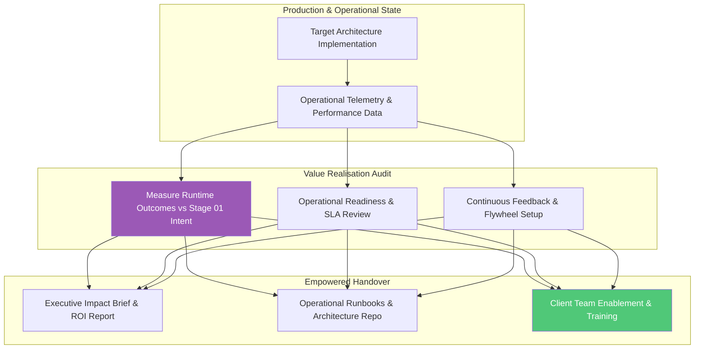

# Stage 05: Value Realisation & Organizational Handover

## Overview

The **Value Realisation & Organizational Handover** stage completes the customer engagement by verifying business impact, assessing operational readiness, and transferring full capability ownership to the client organization.

An Enterprise Architecture engagement is only successful when the client can independently operate, maintain, and evolve the architecture: **"How do we verify value realization, ensure operational readiness, and empower client ownership?"**

---

## Key Activities & Methodology

### 1. Value Realisation Audit
Measure actual operational performance against the business metrics defined in Stage 01:
- **Business Impact Review:** Verify whether target outcomes (e.g. cost reduction, throughput increase, SLA compliance, or AI automation efficiency) were achieved.
- **Operational Readiness Review (ORR):** Assess disaster recovery protocols, backup systems, security controls, and support team preparedness prior to full production sign-off.
- **Continuous Improvement Setup:** Establish operational feedback loops so future enhancements continuously draw from runtime performance data. (Where AI components are deployed, establish evaluation flywheels to refine model prompts and datasets).

### 2. Organizational Empowerment & Handover
Handover is a structured enablement process that transfers complete ownership to the customer:
- **Executive Impact Brief:** Deliver a concise summary to C-suite sponsors showcasing business ROI, capability gains, and strategic next steps.
- **Operational Runbooks & Architectural Repository:** Package all C4 diagrams, ADR catalogs, interface contracts, and runbooks into an easily accessible repository (e.g. LeanIX, MkDocs, or internal wiki).
- **Client Team Training:** Conduct enablement sessions for internal architects, delivery leads, and operations teams to ensure long-term self-sufficiency.

---

## Deliverables by Engagement Archetype

- **All Engagement Archetypes (A, B, C, D):** Executive Impact Brief, Operational Readiness Sign-off, Complete Architectural Repository, and Client Team Enablement Package.

---

## Governance & Quality Gate

> [!IMPORTANT]
> **Stage Gate Check:** Handover is complete only when customer leadership confirms value realization against Stage 01 goals, and internal client teams demonstrate full capability to operate and govern the architecture independently.
