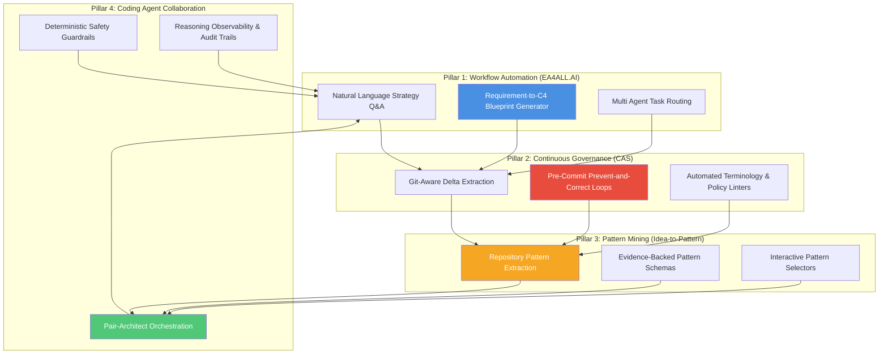
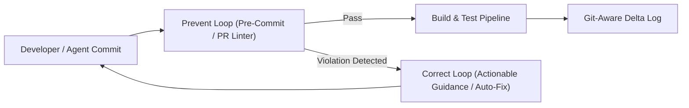

# AI Augmented Architecture Workflows & Governance

## Overview & Philosophy

As enterprise environments become increasingly complex and fast-moving, traditional architecture practices risk becoming reactive bottlenecks. Enterprise Architecture teams often struggle with knowledge silos, manual documentation overhead, and drift between strategic intent and delivery reality.

By augmenting the Enterprise Architecture lifecycle with **Generative AI, Agentic Workforces, and Repository-Driven Governance**, architecture transforms from static documentation into an active, continuous intelligence engine.

This document details four operational pillars derived from my real-world experiments (`EA4ALL.AI`, `Continuous Architecture System - CAS`, and `Idea-to-Pattern`) that transform architectural ways of working.

---

## 1. AI-Automated Architectural Workflows (EA4ALL.AI)

Traditional architecture deliverables—such as reference blueprints, capability maps, and stakeholder briefings—require hours of manual synthesis. The **EA4ALL.AI** framework democratizes architectural knowledge and accelerates document generation:

- **Natural Language Architecture Access:** Enables business sponsors, project managers, and engineers to query enterprise IT landscapes, business capability maps, and architectural standards using conversational AI.
- **Automated Blueprint Generation:** Translates unstructured business requirements into C4 Context and Container diagrams (Mermaid syntax), initial component specs, and risk summaries in seconds.
- **Multi Agent Task Routing:** Employs an orchestration agent that analyzes user requests and routes tasks to specialized subagents (e.g., *Security Auditor*, *Integration Specialist*, *Data Governance Analyst*).

---

## 2. CAS Prevent-and-Correct Governance Process

The **Continuous Architecture System (CAS)** shifts architectural governance from reactive post-implementation reviews to continuous, automated verification operating directly in the delivery pipeline.

### The Dual-Loop Governance Mechanism

1. **The Prevent Loop (Pre-Commit & PR Gates):**
   - Intercepts structural or narrative changes during code commits or pull requests.
   - Executes deterministic linters (`scripts/validate_governance.py`) to enforce canonical terminology, frontmatter metadata, and navigation integrity.
   - Verifies that structural changes are accompanied by an approved specification (`specs/`) per Specification-Driven Development (SDD) rules.

2. **The Correct Loop (Actionable Feedback & Auto-Correction):**
   - Rather than silently failing a build or acting as a passive blocker, the correct loop provides precise, actionable feedback pointing to the exact line, policy rule, or missing ADR.
   - Enables automated correction scripts to resolve non-semantic drift (e.g. formatting, terminology normalization) before merging.

3. **Git-Aware Architectural Delta Extraction:**
   - Continuously extracts architectural deltas from repository commit history, maintaining an auditable lineage connecting code changes back to original ADRs and strategic intent.

---

## 3. Evidence-Based Architecture Pattern Mining (Idea-to-Pattern)

Instead of relying on theoretical textbook frameworks, AI is used to mine **evidence-backed architecture patterns** directly from real-world systems, codebases, and operational signals:

- **Repository Pattern Extraction:** Prompts and automated scripts scan implementation repositories to uncover recurring design choices (e.g. LLM provider abstraction wrappers, vector database repository interfaces, event-driven retry queues).
- **Structured Pattern Schemas:** Standardizes mined patterns into structured, reusable learning artifacts defining Context, Problem, Solution Blueprint, Consequences, and Implementation Code.
- **Pattern Selector Systems:** Provides interactive tools that recommend proven patterns to architects based on problem requirements and non-functional priorities.

---

## 4. Governance Aware Coding Agent Collaboration

As organizations adopt AI coding agents (such as Antigravity, Gemini, or Claude) for software generation, architects must govern agentic workflows to prevent unstructured code sprawl.

### Operating Principles for Coding Agent Collaboration

- **Pair-Architect Persona:** Coding agents are equipped with explicit system prompts ([`agent-architect-prompt.md`](agent-architect-prompt.md)) instructing them to act as governance aware pair-architects.
- **Deterministic Guardrail Boundaries:** Agents operate within strict safety envelopes—prohibiting direct imports of vendor-locked SDKs, enforcing contract-first API design, and requiring ADR approval for structural changes.
- **Reasoning Observability:** All agentic decision paths, tool calls, and prompt trajectories are logged to maintain an auditable decision trail.

---

## Summary of Impact on Architectural Ways of Working

| Traditional EA Practice | AI Augmented EA Practice | Value Delivered |
| :--- | :--- | :--- |
| **Manual Documentation** | Automated natural language synthesis & C4 generation | 10x faster artifact creation |
| **Reactive Gatekeeping** | CAS Prevent-and-Correct SDLC + CI/CD automated pipeline checks | Reduced architectural drift |
| **Theoretical Frameworks** | Evidence-based pattern mining from code repositories | Reusable, proven designs |
| **Ivory-Tower Isolation** | Democratized EA knowledge access via conversational AI | Cross-functional alignment |
| **Ungoverned AI Coding** | Governance aware coding agent collaboration | Safe, scalable AI delivery |
