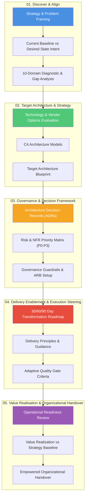
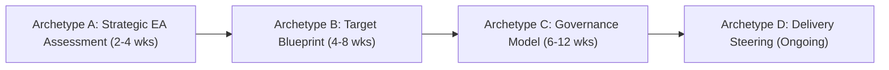

# Enterprise Architecture Customer Engagement SOP

> [!IMPORTANT]
> **Classification Level**: `RESTRICTED / HIGHLY CONFIDENTIAL` — Enterprise Architecture Operating Model.

## Overview & Executive Summary

The **Enterprise Architecture Customer Engagement Standard Operating Procedure (SOP)** is a problem-first, systems thinking operating model governing how Alexandre Franco engages with client organizations, projects, and transformation initiatives. Built upon four decades of experience across global enterprises (consulting, banking, FMCG, media, and advertising), this SOP provides a structured framework for translating C-suite business strategy into resilient operational outcomes.

Rather than forcing a rigid Software Development Lifecycle (SDLC) or repository toolchain onto every engagement, this SOP is **engagement-adaptive**. It defines clear consulting stages, core deliverables, and decision frameworks that scale dynamically based on the client mandate—whether delivering a 3-week strategic audit, a target architecture blueprint, an enterprise governance transformation, or hands-on delivery steering.

Furthermore, this SOP incorporates **AI Augmented Architecture Workflows**, leveraging Generative AI, agentic workforces, Continuous Architecture System (CAS) prevent-and-correct processes, and evidence-based pattern mining to accelerate deliverables and maintain zero architectural drift.

---

## The 5 Customer Engagement Stages

| Stage | Focus | Core Question Solved | Key Deliverables |
| :--- | :--- | :--- | :--- |
| [**01. Discover & Align**](01-discover-align.md) | Strategy, Baseline & Intent | *What problem are we solving, where are we today, and what does the desired state look like?* | Context Map, Current State Baseline, Desired State Intent, 10-Domain Gap Triage |
| [**02. Target Architecture & Strategy**](02-target-architecture.md) | Options & Blueprint | *How do we structure target boundaries so the enterprise remains resilient and fit-for-purpose?* | Target Architecture Blueprint, Options Analysis, C4 Views (Context/Container) |
| [**03. Governance & Decision Framework**](03-governance-framework.md) | Controls & Guardrails | *How do we ensure safety, regulatory compliance, and auditable decisions across the client organization?* | Architecture Decision Records (ADRs), NFR Priority Matrix (P0–P3), ARB Charter |
| [**04. Delivery Enablement & Execution Steering**](04-delivery-enablement.md) | Roadmap & Execution Guidance | *How do we translate target architecture into an executable roadmap and steer delivery teams?* | 30/60/90 Transformation Roadmap, Delivery Guidance, Quality Gate Criteria |
| [**05. Value Realisation & Organizational Handover**](05-value-realisation-handover.md) | Impact & Enablement | *How do we verify value realization, ensure operational readiness, and empower client ownership?* | Operational Readiness Review, Value Realization Report, Executive & Team Handover Package |

---

## Enterprise Architecture Tools & Assessment Accelerators

To execute engagement stages deterministically without reinventing diagnostic models, the SOP incorporates three core execution toolsets and assessment accelerators:

1. **10-Domain Architecture Requirements Framework:**
   A workshop-driven diagnostic framework grounded in 7 Enterprise Architecture principles (*Maximize Business Benefit*, *Scalability First*, *Cost Optimization*, *Security by Design*, *Operational Excellence*, *Data Governance*, *Technology Agility*). Evaluating over 130 structural questions, it is used in **Stage 01 (Discover & Align)** to rapidly map Current State baselines and Desired State intent.

2. **Solutions & Target Architecture Assessment Scorecard:**
   A quantitative evaluation matrix scoring candidate technology options, SaaS platforms, vendor solutions, and target architecture blueprints against weighted functional, technical, architectural, security, NFR, and TCO criteria. Used in **Stage 02 & 03** for objective vendor and options evaluation.

3. **Agentic Architecture Design Principles:**
   An architectural policy framework (adapted from AWS, GCP, and Azure Well-Architected Frameworks) governing AI native and agentic deployments. Enforces core principles including Agent Single Responsibility, Autonomous Guardrails, Observability First, Human-in-the-Loop (HITL) checkpoints, Context Injection (RAG), and Idempotency. Used in **Stage 02 & AI Workflows**.

---

## AI Augmented Architecture Workflows & Governance

To transform architectural productivity and operational trust, the SOP incorporates four AI-augmented capability pillars detailed in [**AI Augmented Architecture Workflows**](ai-augmented-architecture.md):

1. **AI-Automated Architecture Workflows (EA4ALL.AI):** Natural language architecture access, multi agent task routing, and automated business-requirement-to-C4-blueprint generation.
2. **CAS Prevent-and-Correct Governance Process:** Shifting governance from reactive post-project audits to continuous pre-commit prevention and automated correction loops (`scripts/validate_governance.py`).
3. **Evidence-Based Architecture Pattern Mining (Idea-to-Pattern):** Mining reusable, evidence-backed architectural patterns directly from code repositories and execution signals.
4. **Governance Aware Coding Agent Collaboration:** Orchestrating AI coding agents (Antigravity, Gemini, Claude) as pair-architects operating strictly within explicit guardrails and ADRs.

---

## Engagement Archetypes: Adaptive SOP Depth

To prevent over-engineering non-development engagements, the SOP defines **4 Engagement Archetypes** that scale deliverable depth to match the customer mandate:

1. **Archetype A: Strategic EA Assessment (2–4 Weeks):** Focuses on Stage 01 and high-level Stage 04 (Strategy framing, current state baseline audit, 10-domain gap analysis, and 30/60/90 transformation roadmap).
2. **Archetype B: Target Architecture Blueprint (4–8 Weeks):** Extends through Stage 02 (Desired state vision, technology/vendor options analysis, C4 models, and target architecture specifications).
3. **Archetype C: Enterprise Governance & Operating Model (6–12 Weeks):** Focuses on Stage 03 (Governance framework setup, ARB charter, NFR priority matrices, compliance rules, and safety guardrails).
4. **Archetype D: Delivery Steering & Implementation (Ongoing / Sprints):** Deep execution steering involving hands-on delivery guidance, repository-driven governance (ADR-as-Code, SDD), CI/CD quality gates, and operational telemetry.

---

## Multi-Audience Projection Engine

From this single canonical Master SOP, three target projections are generated:

1. **Executive Projection:** 1-Page Business Value Bridge & 30/60/90 Strategic Transformation Roadmap.
2. **Agentic Co-Pilot Projection:** Structured System Prompts ([`agent-architect-prompt.md`](agent-architect-prompt.md)) and JSON schemas enabling AI coding agents to execute automated architectural analysis and C4 generation.
3. **Delivery & Governance Projection:** Governance charters, ARB checklists, NFR assessment matrices, and CI/CD quality gate workflows.

---

## Core Architectural Principles

- **Problem-First System Thinking:** Put the *why* and *what* before the *how*. Technology choices serve business capabilities, never vice versa.
- **Engagement Agnosticism & Scalability:** Adapt governance depth and artifact formats to the specific customer engagement scope.
- **Technology Agnosticism:** Evaluate traditional software, enterprise COTS/SaaS, and AI systems objectively based on business value and ROI.
- **Strategic Vendor Decoupling:** Establish provider-agnostic abstractions to prevent lock-in and preserve strategic optionality.
- **Governance Through Enablement:** Empower client teams with clear guardrails, reusable patterns, and auditable decision frameworks rather than acting as a rigid bottleneck.

---

*© 2026 Alexandre Franco. Ideas-to-Life. All rights reserved. Proprietary methodology and agentic architecture specification.*

