# Enterprise Architecture Standard Operating Procedure

> [!IMPORTANT]
> **Classification Level**: `RESTRICTED / HIGHLY CONFIDENTIAL` — Enterprise Architecture Practice Methodology.

## Overview

The **Enterprise Architecture Standard Operating Procedure (SOP)** defines a problem-first, systems-thinking approach to architectural practice.
It provides a common operating model for understanding business context, establishing architectural direction, enabling delivery, realising value, and leaving organisations with the capability to understand, govern, operate, and evolve their architecture.
The SOP is **engagement-adaptive**. It does not prescribe a fixed level of analysis, a mandatory modelling technique, or a particular technology stack. The depth, evidence, artefacts, governance and level of architectural involvement are determined by the business question, decision, transformation context, risk, complexity and required outcome.
The methodology is designed to connect business strategy to architectural change and ultimately to realised organisational capability and business outcomes.

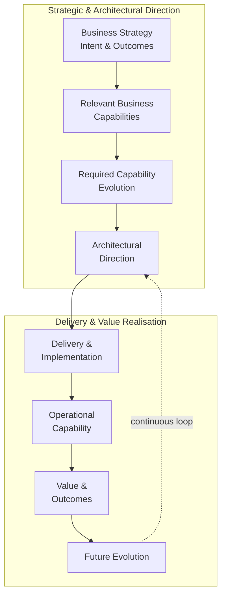

The central architectural principle

Architecture is not an end in itself.

The architectural question is ultimately connected to:

What is the organisation trying to achieve, what capabilities must change, what must the architecture enable, and how will we know that the resulting change has created the intended outcome?

This creates a continuous chain:

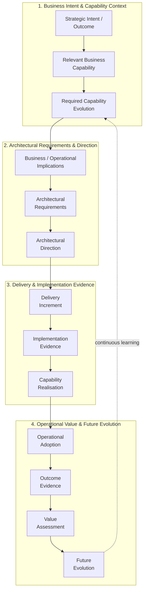

⸻

## The Five Practice Stages

### The SOP is organised into five connected stages

The stages represent capabilities of architectural practice rather than mandatory project phases. An engagement may use all five stages, a subset of stages, or selected activities from several stages depending on the problem being addressed.

| Stage                                             | Focus                                                                  | Core Question                                                                                                                                                       | Typical Outputs                                                                                                                              |
| ------------------------------------------------ | ----------------------------------------------------------------------- | ------------------------------------------------------------------------------------------------------------------------------------------------------------------- | -------------------------------------------------------------------------------------------------------------------------------------------- |
| 01. Discover & Align⁠                            | Business context, strategic intent, capabilities, evidence and scope    | What are we trying to achieve or decide, why does it matter, what context are we working within, what do we know, and what architectural work is actually required? | Business Intent, Strategic Priorities, Relevant Capability Context, Current State, Desired State Intent, Scope and Evidence Baseline         |
| 02. Target Architecture & Strategy⁠              | Architectural direction, options, trade-offs and target architecture    | Given the established context and required capability evolution, what architectural direction should we take and what must the architecture enable?                 | Architectural Requirements, Options Analysis, Architectural Direction, Target Architecture, Transition Implications, Architectural Decisions |
| 03. Governance & Decision Enablement             | Architectural decisions, guardrails, assurance and controlled evolution | How do we make, govern and evolve architectural decisions while enabling delivery rather than creating unnecessary friction?                                        | Decision Records, Governance Principles, Guardrails, Assurance Approach, Exceptions and Escalation Paths                                     |
| 04. Delivery Enablement & Execution Steering⁠    | Translating architecture into delivery and operational capability       | How do we turn architectural direction into meaningful delivery increments while maintaining alignment with capability and outcome?                                 | Delivery Guidance, Transition Strategy, Architecture Assurance, Capability Readiness, Delivery Decisions, Adaptation Actions                 |
| 05. Value Realisation & Organisational Handover⁠ | Outcomes, operational readiness, ownership and future evolution         | What value has been realised or established for future measurement, is the resulting capability ready to operate, and can the organisation sustain and evolve it?   | Outcome Evidence, Capability Realisation Assessment, Operational Readiness, Knowledge Transfer, Ownership, Future Evolution Triggers         |

Note: Stage 03 is deliberately positioned as a governance and decision-enablement capability. Specific decision-review methods may be used within the wider SOP without turning the SOP into a collection of individual governance artefacts.

⸻

### How the Stages Connect

The stages form a connected architectural practice rather than a strictly sequential lifecycle.

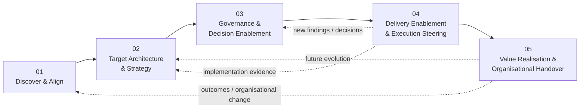

The important characteristic is the feedback loop.

Architecture is not frozen once a target state has been produced. Delivery evidence, operational experience, changing business priorities, emerging risks, new dependencies and organisational learning may require architectural direction to be reassessed.

⸻

## Core Principles

The SOP is governed by the following principles.

## 1. Start With Business Intent

Architectural work begins with the business situation, strategic intent, desired outcome or decision that creates the need for architectural intervention.

Technology is not the starting point.

⸻

## 2. Connect Strategy to Capability

Strategic priorities become meaningful to architecture through the capabilities the organisation needs to establish, improve, change or protect.

The methodology therefore distinguishes between:

* strategic importance;
* current capability maturity or effectiveness where evidence exists;
* future capability need;
* required capability evolution.

No formal capability maturity model is required unless the engagement specifically calls for one.

⸻

## 3. Understand Context Before Judgement

Architecture should be based on evidence and context rather than assumptions.

Relevant context may include:

* business strategy and priorities;
* business capabilities;
* customer or user journeys;
* processes and workflows;
* information and data;
* applications and services;
* integrations and interfaces;
* technology platforms;
* operating model;
* organisation and skills;
* governance;
* regulatory and compliance requirements;
* suppliers and external dependencies;
* financial and delivery constraints.

The relevant dimensions are selected according to the architectural question.

⸻

## 4. Evidence Before Conclusions

Architectural findings should be traceable to available evidence.

Where evidence is incomplete, uncertainty should be made explicit rather than converted into unsupported certainty.

A useful traceability pattern is:

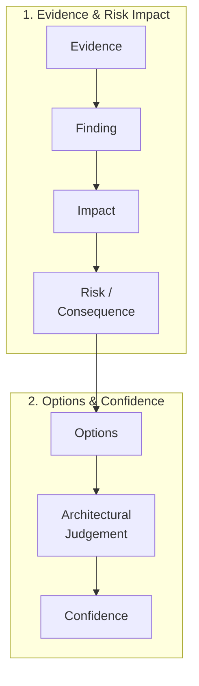

⸻

## 5. Architecture Is Context-Driven

There is no universally correct architecture independent of context.

Architectural choices should consider the relevant combination of:

* business outcomes;
* capability requirements;
* functional requirements;
* non-functional requirements;
* security and compliance;
* operational needs;
* data;
* integration;
* delivery constraints;
* organisational readiness;
* technology constraints;
* supplier considerations;
* strategic direction.

⸻

## 6. Prefer the Simplest Architecture That Satisfies the Need

Architectural sophistication is not itself a measure of architectural quality.

The preferred direction should be the simplest architecture that adequately satisfies the relevant requirements, constraints, risks and future needs.

⸻

## 7. Make Trade-offs Explicit

Architectural decisions inherently involve trade-offs.

The methodology makes those trade-offs visible rather than presenting recommendations as universally optimal.

Typical trade-offs include:

* speed versus control;
* flexibility versus simplicity;
* cost versus capability;
* resilience versus complexity;
* autonomy versus governance;
* build versus buy;
* centralisation versus decentralisation;
* short-term delivery versus long-term evolution;
* vendor capability versus strategic optionality.

⸻

## 8. Governance Should Enable Delivery

Governance exists to improve decision quality, manage material risk and preserve architectural coherence.

It should not become a bottleneck for delivery.

Governance depth should therefore be proportional to:

* decision criticality;
* architectural risk;
* complexity;
* regulatory requirements;
* organisational context;
* degree of uncertainty.

⸻

## 9. Architecture Must Become Executable

Architectural direction has value only when it can influence delivery and organisational change.

The methodology therefore connects:

Architectural Direction → Delivery Change → Implemented Capability → Operational Adoption → Outcome

Architecture should remain sufficiently concrete to guide meaningful implementation while avoiding unnecessary specification.

⸻

## 10. Architecture Evolves Through Evidence

Implementation and operational experience create new evidence.

That evidence may confirm, challenge or change previous architectural assumptions.

Architecture therefore operates as a feedback loop rather than a one-time design exercise.

⸻

## 11. AI Can Accelerate Architectural Work

Generative AI and agentic systems can significantly accelerate activities such as:

* evidence ingestion;
* document extraction;
* information organisation;
* comparison;
* pattern identification;
* gap identification;
* framework mapping;
* candidate finding generation;
* option exploration;
* report drafting;
* consistency checking.

However:

AI-generated analysis is evidence or an analytical input. Architectural judgement and accountability remain with the architect.

AI does not remove the need for contextual judgement, trade-off analysis or human accountability.

⸻

## 12. Leave the Organisation More Capable

A successful architectural engagement should not create permanent dependency on the architect.

The organisation should leave the engagement with greater capability to:

* understand its architecture;
* make architectural decisions;
* govern change;
* operate resulting capabilities;
* recognise emerging risks;
* evolve its architecture;
* continue the feedback loop.

⸻

Engagement Adaptability

The SOP is intentionally not a fixed delivery template.

Different engagements require different levels of architectural depth.

A focused architectural decision may require only a bounded review of evidence, options and trade-offs.

A transformation may require broader investigation of strategy, capabilities, current state, target direction, transition architecture, dependencies, roadmap and delivery assurance.

The methodology therefore adapts according to the question being answered.

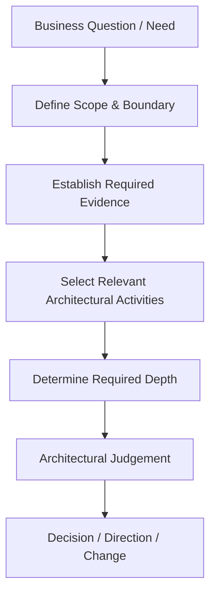

Depth is influenced by

| Consideration             | Architectural Implication                                                                         |
| ------------------------- | ------------------------------------------------------------------------------------------------- |
| Business importance       | Greater consequence may require greater rigour                                                    |
| Decision criticality      | Higher-impact decisions require stronger evidence and assurance                                   |
| Complexity                | More dependencies and interactions require deeper investigation                                   |
| Uncertainty               | Material uncertainty increases evidence requirements                                              |
| Risk                      | Greater architectural or business risk increases assurance depth                                  |
| Regulatory context        | Regulatory obligations may require additional evidence and controls                               |
| Delivery complexity       | Complex transition paths may require deeper architecture and roadmap work                         |
| Organisational readiness  | Significant capability or operating-model change may require additional enablement                |
| Engagement objective      | Decision review, assessment, target architecture and delivery steering require different emphasis |

⸻

## 13. Engagement Methods

The SOP defines the core architectural practice.

Specific engagement methods instantiate that practice for particular client questions.

Examples include:

| Method                                         | Core Question                                                                                                                                            |
| ---------------------------------------------- | -------------------------------------------------------------------------------------------------------------------------------------------------------- |
| Architecture Decision Review                   | Given the decision we need to make, the context in which it sits, and the evidence available, is this the right architectural direction?                 |
| Architecture Health Check                      | How healthy is the existing architecture, where are the material weaknesses, and what should be addressed?                                               |
| Architecture Assessment & Roadmap              | Where are we, where should we go, what needs to change, and how should the transition be sequenced?                                                      |
| Architecture Automation Opportunity Assessment | Where can process, information and architectural change eliminate, simplify, integrate or automate work to improve business and architectural outcomes?  |

These methods are deliberately separate.

A Decision Review should not silently become a transformation assessment. An Architecture Assessment should not automatically become a detailed delivery programme. An automation assessment should not assume that automation is the answer before the underlying problem has been diagnosed.

The appropriate method and depth are determined by the client question.

⸻

## 14. Decision and Scope Boundaries

A key characteristic of the methodology is recognising when an architectural question has expanded beyond its original boundary.

For example, a bounded technology decision may begin as:

Should we adopt technology X?

If answering that question requires establishing:

* broader enterprise strategy;
* significant capability evolution;
* enterprise-wide current state;
* a new target operating model;
* a transformation portfolio;
* multi-horizon transition planning;

then the engagement has moved beyond a bounded decision review and requires a broader architectural method.

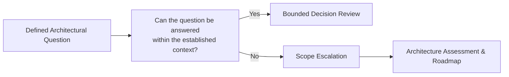

This boundary protects both the quality of the architectural judgement and the proportionality of the engagement.

⸻

## 15. Evidence, Traceability and Confidence

The methodology maintains traceability across the architectural lifecycle.

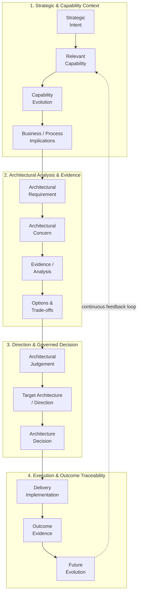

Architecture Confidence

Architectural confidence should evolve as evidence improves.

Confidence may be affected by:

* quality of available evidence;
* unresolved assumptions;
* implementation evidence;
* operational behaviour;
* emerging dependencies;
* organisational readiness;
* new risks;
* changes in business strategy;
* technology evolution;
* supplier changes;
* AI behaviour and evaluation results.

Confidence is therefore not a static property of an architecture document.

⸻

## 16. AI-Augmented Architectural Practice

AI is treated as an enabling capability within architectural practice, rather than as a separate methodology.

The architect may use AI to accelerate appropriate parts of the workflow while retaining accountability for architectural judgement.

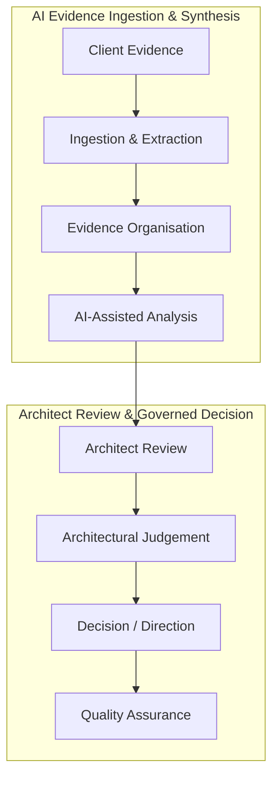

Suitable AI-assisted activities

AI can be particularly useful for:

* large-document analysis;
* evidence extraction;
* information classification;
* cross-document comparison;
* identifying candidate gaps;
* identifying potential dependencies;
* organising architectural evidence;
* generating candidate options;
* drafting architectural artefacts;
* consistency and traceability checks.

Activities requiring architectural judgement

The architect remains accountable for:

* interpreting business context;
* determining materiality;
* assessing trade-offs;
* challenging assumptions;
* selecting appropriate evidence;
* deciding whether evidence is sufficient;
* determining architectural consequences;
* making recommendations;
* validating decisions with stakeholders.

The methodology therefore uses AI to increase architectural capacity without transferring architectural accountability to AI.

⸻

## 17. Quality and Governance

Quality is established through proportionate gates rather than through a universal checklist applied to every engagement.

Typical quality questions include:

| Quality Area           | Question                                                                             |
| ---------------------- | ------------------------------------------------------------------------------------ |
| Intent                 | Is the business problem, decision or desired outcome clear?                          |
| Context                | Is the relevant business, capability and architectural context understood?           |
| Evidence               | Are important conclusions supported by sufficient evidence?                          |
| Scope                  | Is the architectural work still answering the agreed question?                       |
| Requirements           | Are the relevant architectural requirements understood?                              |
| Options                | Have meaningful alternatives and trade-offs been considered where appropriate?       |
| Judgement              | Is the recommendation or direction explicitly reasoned?                              |
| Architecture           | Does the proposed direction address the required capability evolution?               |
| Delivery               | Can the architecture be translated into meaningful implementation change?            |
| Operational Readiness  | Can the resulting capability be operated and supported?                              |
| Value                  | Is there evidence of the intended outcome or a clear basis for future measurement?   |
| Ownership              | Can the organisation sustain and evolve the resulting architecture?                  |

The gates are applied according to engagement scope and materiality.

⸻

## 18. Architecture Method Boundary

This SOP defines architectural practice.

It does not automatically absorb every adjacent management discipline.

Depending on engagement scope, specialist responsibilities may remain with:

* programme management;
* project management;
* product management;
* financial management;
* procurement;
* commercial management;
* detailed engineering;
* service management;
* organisational restructuring;
* formal benefits management;
* contractual supplier management;
* production operations.

The architect collaborates with these disciplines where required while retaining accountability for architectural judgement within the agreed scope.

⸻

## 19. Typical Architectural Outputs

The methodology may produce different artefacts depending on the engagement.

Typical outputs include:

* Business Intent and Strategic Context;
* Relevant Capability Context;
* Current-State Architecture;
* Desired-State Intent;
* Architectural Requirements;
* Architecture Assessments;
* Architecture Decision Reviews;
* Architecture Decision Records;
* Options and Trade-off Analysis;
* Target Architecture;
* Transition Architecture;
* Architecture Principles and Guardrails;
* Architecture Assurance Findings;
* Delivery Architecture Guidance;
* Capability Readiness Assessments;
* Transformation Roadmaps;
* Operational Readiness Assessments;
* Value and Outcome Assessments;
* Architectural Knowledge Transfer;
* Future Evolution Triggers.

Not every engagement requires every artefact.

⸻

## 20. Reusable Architectural Assets

The methodology can be supported by reusable assets such as:

* assessment templates;
* decision-review templates;
* architecture principles;
* architectural requirement structures;
* evidence registers;
* decision records;
* architecture diagrams;
* roadmap structures;
* assurance checklists;
* capability context models;
* traceability structures;
* AI-assisted analysis workflows.

These assets support consistency and efficiency without becoming mandatory components of every engagement.

⸻

## 21. The Architectural Practice Loop

The complete practice can be represented as a continuous loop:

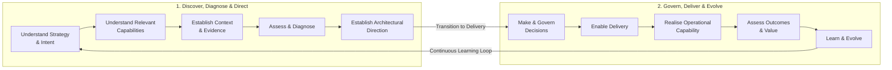

This loop reflects the fundamental role of Enterprise Architecture:

Understand where the organisation is, understand where it needs to go, determine what must change, help the organisation make and execute the right decisions, and ensure that architectural change contributes to sustainable business capability and outcomes.

⸻

## 22. Relationship to Other Practice Areas

The SOP provides the architectural operating model that supports several related professional services.

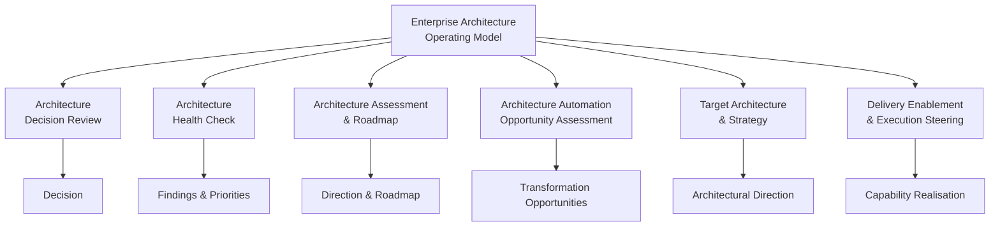

The SOP remains the common foundation.

Individual methods determine how that foundation is applied to a particular client problem.

⸻

## 23. Closing Principle

The purpose of Enterprise Architecture is not to produce architecture documents.

It is to help organisations make better decisions about how they evolve their business, capabilities, information, technology and operating environment.

A successful architectural engagement should therefore leave a clear chain between:

Why the change matters → what capability must change → what the architecture must enable → what is delivered → what becomes operational → what outcome is realised → how the organisation will continue to evolve.

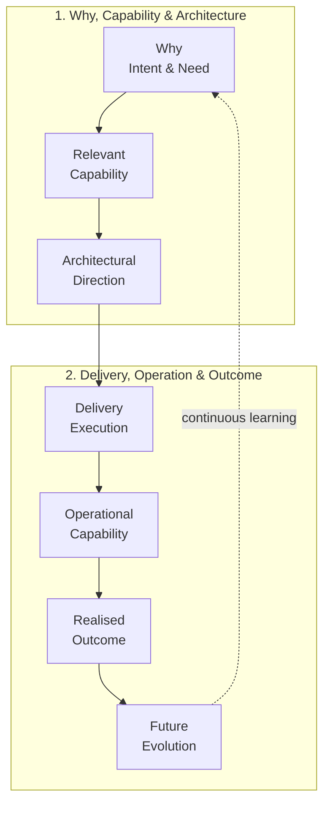

The architect’s role is to make that chain understandable, evidence-based, actionable and adaptable.

⸻

© 2026 Alexandre Franco. Ideas-to-Life. All rights reserved. Proprietary methodology and architecture specification.
