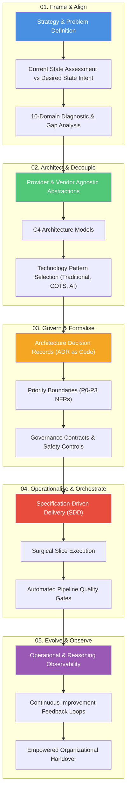

# Architect Standard Operating Procedure (SOP)

## Overview & Executive Summary

The **Architect Standard Operating Procedure (SOP)** is a technology-agnostic, problem-first systems thinking operating model designed to turn organizational uncertainty into evidence-backed business outcomes. Built upon four decades of experience across global enterprises (consulting, banking, FMCG, media, and advertising), this SOP provides a structured framework for translating executive strategy and business intent into resilient technical execution.

A core principle of this SOP is **Technology Agnosticism**. Technology—whether classic microservices, event-driven architectures, enterprise COTS/SaaS platforms, or modern AI & Agentic Systems—is evaluated strictly based on business value, feasibility, and total cost of ownership. AI is never treated as a mandatory hammer, but as one powerful option in the architect's toolbox.

---

## The 5 Strategic Lifecycle Stages

| Stage | Focus | Core Question Solved | Key Deliverables |
| :--- | :--- | :--- | :--- |
| [**01. Frame & Align**](01-frame-align.md) | Strategy, Baseline & Intent | *What problem are we solving, where are we today, and what does the desired state look like?* | Strategy Map, Current State Baseline, Desired State Intent, 10-Domain Gap Triage |
| [**02. Architect & Decouple**](02-architect-decouple.md) | Design & Pattern Selection | *How do we structure boundaries so the enterprise remains resilient, decoupled, and fit-for-purpose?* | C4 Models (Context/Container), Abstraction Contracts, Technology Pattern Matrix (Traditional / COTS / AI) |
| [**03. Govern & Formalise**](03-govern-formalise.md) | Contracts & Controls | *How do we ensure safety, regulatory compliance, and auditable decisions as we build?* | ADRs as Code, NFR Priority Matrix (P0–P3), Safety & Compliance Rules |
| [**04. Operationalise & Orchestrate**](04-operationalise-orchestrate.md) | Delivery Orchestration | *How do we build thin vertical slices and prove correctness in the delivery pipeline?* | Specification-Driven Delivery, Thin Vertical Slices, Pipeline Quality Gates |
| [**05. Evolve & Observe**](05-evolve-observe.md) | Observability & Handover | *How do we observe system performance, drive continuous improvement, and empower teams?* | Operational & Reasoning Telemetry, Feedback Loops, Team Enablement Package |

---

## Multi-Audience Projection Engine

A foundational principle of this SOP is **Single Source of Truth, Multi-Audience Projection**. From this canonical Master SOP, three target projections are generated:

1. **Executive Brief Projection:** 1-Page Business Value Bridge & 30/60/90 Day Strategic Transformation Roadmap.
2. **Agentic Co-Pilot Projection:** Structured System Prompts ([`agent-architect-prompt.md`](agent-architect-prompt.md)) and JSON schemas enabling AI coding agents to execute automated architectural analysis and C4 generation.
3. **Delivery & Governance Projection:** Automated policy linters (`scripts/validate_governance.py`), NFR assessment checklists, and CI/CD pipeline quality gates.

---

## Core Architectural Principles

- **Problem-First System Thinking:** Put the *why* and *what* before the *how*. Technology choices serve business capabilities, never vice versa.
- **Technology Agnosticism:** Select the simplest technical pattern that reliably solves the business problem—whether traditional software, SaaS/COTS integration, or AI systems.
- **Strategic Vendor Decoupling:** Build provider-agnostic abstraction layers to prevent vendor lock-in and preserve long-term enterprise optionality.
- **Governance Aware Safety:** Combine deterministic safety guardrail heuristics with probabilistic components for predictable enterprise execution.
- **Repository-Driven Governance:** Treat architecture as code. Every decision is documented as an auditable ADR directly inside the delivery repository.
