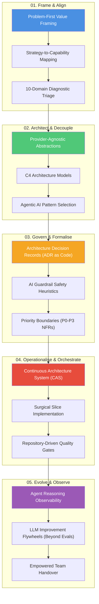

# Architect Standard Operating Procedure (SOP)

## Overview & Executive Summary

The **Architect Standard Operating Procedure (SOP)** is a problem-first, systems thinking operating model designed to turn organisational uncertainty into evidence-backed business outcomes. Built upon four decades of experience across global enterprises (consulting, banking, FMCG, media, and advertising), this SOP provides a structured framework for translating C-suite business strategy into resilient technical execution.

Rather than treating architecture as a static ivory-tower documentation exercise, this SOP integrates **Enterprise Architecture (TOGAF, SAFe, LeanIX)** with modern **Agentic AI Systems**, **Continuous Architecture Systems (CAS)**, and **Repository-Driven Governance (Architecture-as-Code)**.

---

## The 5 Strategic Lifecycle Stages

| Stage | Focus | Core Question Solved | Key Deliverables |
| :--- | :--- | :--- | :--- |
| [**01. Frame & Align**](01-frame-align.md) | Strategy & Capability | *What business problem are we really solving, and what does value look like?* | Capability Map, 10-Domain Diagnostic Triage, Value Hypothesis |
| [**02. Architect & Decouple**](02-architect-decouple.md) | Design & AI Patterns | *How do we structure boundaries so the enterprise remains resilient and vendor decoupled?* | C4 Models (Context/Container), Agentic AI Blueprint, Strategic Abstractions |
| [**03. Govern & Formalise**](03-govern-formalise.md) | Contracts & AI Safety | *How do we ensure safety, regulatory compliance, and auditable decisions as we build?* | ADRs as Code, AI Safety Guardrails, Priority NFR Matrix (P0–P3) |
| [**04. Operationalise & Orchestrate**](04-operationalise-orchestrate.md) | CAS & Delivery Execution | *How do we build thin vertical slices and prove correctness in the codebase?* | Specification-Driven Delivery, Repository Quality Gates, CI/CD Validation |
| [**05. Evolve & Observe**](05-evolve-observe.md) | Flywheels & Observability | *How do we audit agent reasoning, continuously improve AI performance, and empower teams?* | Reasoning Observability Logs, LLM Evaluation Flywheels, Team Handoff Kit |

---

## Multi-Audience Projection Engine

A foundational principle of this SOP is **Single Source of Truth, Multi-Audience Projection**. From this canonical Master SOP, three target projections are generated:

1. **Executive Brief Projection:** 1-Page Business Value Bridge & 30/60/90 Day Strategic Transformation Roadmap.
2. **Agentic Co-Pilot Projection:** Structured System Prompts ([`agent-architect-prompt.md`](agent-architect-prompt.md)) and JSON schemas enabling AI coding agents to execute automated architectural analysis and C4 generation.
3. **Delivery & Governance Projection:** Automated linting rules (`scripts/validate_governance.py`), NFR assessment matrix, and GitHub Actions CI/CD pipeline quality gates.

---

## Core Architectural Principles

- **Problem-First System Thinking:** Put the *why* and *what* before the *how*. Technology choices serve business capabilities, never vice versa.
- **Strategic Vendor Decoupling:** Build provider-agnostic abstraction layers to prevent lock-in and preserve long-term enterprise optionality.
- **Governance Aware AI Safety:** Combine probabilistic LLM/Agent reasoning with deterministic safety guardrail heuristics for predictable enterprise execution.
- **Repository-Driven Governance:** Treat architecture as code. Every decision is documented as an auditable ADR directly inside the delivery repository.
