# Architecture Assessment & Roadmap

> [!IMPORTANT]
> **Classification Level**: `PUBLIC — Enterprise Architecture Practice Methodology`

## Purpose

The **Architecture Assessment & Roadmap** is a broad architectural method for understanding an organisation, business capability, product, platform, or technology landscape in the context of a meaningful business problem or strategic objective; identifying the architectural conditions and root causes affecting that situation; determining where the organisation needs to go; identifying the changes required; and establishing a practical sequence for those changes.
It is used when the architectural question cannot be answered adequately by reviewing a single defined decision within an already established context.
The method answers:
> **"Where are we now, why are we in this position, where do we need to be, what needs to change, and what is the most practical way to get there?"**
The method connects:

```mermaid
flowchart LR
    A["Business Situation & Strategic Intent"]
    B["Evidence & Context"]
    C["Current-State Investigation"]
    D["Architectural Diagnosis"]
    E["Findings, Root Causes & Materiality"]
    F["Target Direction & Architectural Runway"]
    G["Transformation Options & Priorities"]
    H["Transition Architectures & Dependencies"]
    I["Multi-Horizon Roadmap"]
    J["Collaborative Validation"]
    K["Governance & Execution Assurance"]
    A --> B --> C --> D --> E --> F --> G --> H --> I --> J --> K
```

The method is deliberately adaptable.

A focused assessment may examine one domain, product, platform, or capability.

A broader enterprise assessment may establish a multi-domain baseline, diagnose material architectural issues, establish target architecture, define transformation priorities, identify transition states, and develop a multi-year roadmap.

The method does not require every engagement to perform every activity at the same depth.

The assessment is not primarily an exercise in documenting the architecture. Current-state architecture, capability context, process views, operational evidence and other artefacts are established to the extent necessary to understand the problem, support architectural judgement, establish a credible target direction, and make actionable recommendations.

⸻

## Relationship to the Core EA SOP

Architecture Assessment & Roadmap is an Engagement Method within the Core Enterprise Architecture SOP.

The Core EA SOP defines the professional architectural capabilities.

This method combines those capabilities into a repeatable approach for broader assessment and transformation planning.

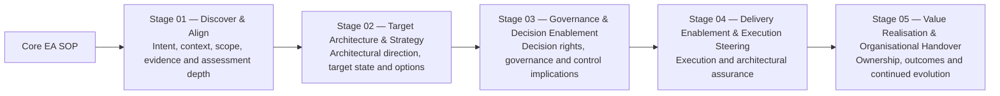

Unlike a bounded Architecture Decision Review, this method may require substantive work across several or all of these capabilities.

The method may subsequently transition into architecture governance and assurance, but this does not imply that the assessment architect becomes the day-to-day Solution Architect for implementation.

⸻

## 1. Method Principles

### 1.1 Start with the business situation and intended outcome

An assessment should exist to support a meaningful organisational outcome.

The architect should first understand:

* the business situation;
* the trigger for the assessment;
* the problem or opportunity;
* the impact on the organisation;
* the impact on key stakeholders;
* the impact on employees, customers or users where relevant;
* strategic vision;
* business strategy;
* technology strategy;
* goals;
* priorities;
* desired future outcomes.

Possible triggers include:

* business transformation;
* technology modernisation;
* growth;
* operational problems;
* strategic change;
* platform replacement;
* AI adoption;
* technical debt;
* regulatory change;
* cost pressure;
* organisational restructuring;
* merger or acquisition;
* new product or service development;
* architectural uncertainty.

The assessment should not become an exercise in documenting the landscape merely because documentation is incomplete.

The first question should be:

What are we trying to improve, enable, resolve or decide?

⸻

### 1.2 Assess in context

Architecture cannot be assessed independently from the business and organisational context.

The assessment should establish, to the degree necessary:

* strategic intent;
* business outcomes;
* relevant business capabilities;
* stakeholders;
* organisational constraints;
* operating model;
* technology strategy;
* technology context;
* delivery context;
* regulatory environment;
* financial constraints;
* strategic dependencies;
* existing business and technology transformation activity.

The depth of contextual analysis should reflect the assessment scope.

Where capability context is material, distinguish between:

* the importance of the capability to the strategy;
* the current effectiveness or maturity of the capability where evidence exists;
* the future capability need or target direction;
* the architectural changes required to support that evolution.

A formal capability maturity model is not required unless the engagement explicitly calls for one.

⸻

### 1.3 Establish evidence before conclusions

The assessment should distinguish between:

* verified evidence;
* observed operational behaviour;
* stakeholder-provided information;
* documented architecture;
* assumptions;
* inferred information;
* professional judgement;
* unresolved uncertainty.

Potential evidence should be sought from both business and technology sources.

Evidence may include:

* strategy and business plans;
* capability models;
* process and workflow information;
* user journeys;
* examples of users operating systems;
* operational reports;
* logs;
* dashboards;
* incidents;
* performance information;
* architecture documentation;
* application and platform information;
* integration and data flows;
* infrastructure;
* security information;
* technology standards;
* delivery roadmaps;
* PMO plans;
* financial information;
* supplier information.

The architect should avoid creating apparent precision where the evidence does not support it.

⸻

### 1.4 Understand the problem before expanding the investigation

The assessment should progressively connect the business problem to the architecture supporting it.

The architect should seek to understand, where relevant:

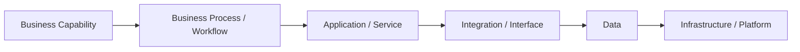

The purpose is not to model every layer exhaustively.

The purpose is to understand how the architecture contributes to the observed situation and where further investigation is most valuable.

⸻

### 1.5 Use hypothesis-driven architectural investigation

Assessment should not rely on a purely linear inventory-and-gap process.

As evidence is gathered, the architect should form hypotheses about potential causes of the observed problem and use targeted investigation to test them.

A typical diagnostic loop is:

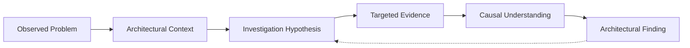

The next investigation should be determined by what is most useful to establish, not by an assumption that every architectural domain must be investigated equally.

Sources of investigative direction may include:

* observed user behaviour;
* operational evidence;
* architecture evidence;
* stakeholder experience;
* known architectural patterns;
* previous incidents;
* dependency relationships;
* professional architectural judgement.

The architect should be willing to narrow the investigation quickly when evidence supports a plausible root cause.

⸻

### 1.6 Establish sufficient root-cause understanding

The assessment does not need to prove every possible causal relationship before making progress.

The architect should determine whether the evidence is sufficient to explain why the material problem occurs to the degree required to support architectural judgement.

Where useful, techniques such as a 5-Whys analysis may be used as a reasoning test.

The objective is not to produce a formal 5-Whys artefact in every engagement.

The objective is to establish sufficient causal understanding to answer:

Do we understand why the problem occurs well enough to determine what architectural change is required?

Root-cause sufficiency and recommendation sufficiency are distinct.

A problem may be sufficiently understood while additional analysis is still required to determine the best architectural response.

⸻

### 1.7 Current state is a diagnostic instrument, not the objective

Current-state architecture should be documented to the extent necessary to understand:

* how the organisation operates today;
* what capabilities already exist;
* how processes and technology interact;
* what works;
* what does not work;
* where material risks exist;
* where dependencies exist;
* what constraints exist;
* what can be reused;
* what must change;
* what may be contributing to the identified problem.

The objective is not to create an exhaustive inventory unless that inventory is itself required.

⸻

### 1.8 Assess against a defined future intent

A current-state assessment has limited value without a meaningful view of what the organisation is trying to achieve.

The future direction may be expressed as:

* business outcomes;
* strategic vision;
* capability intent;
* capability maturity where established and evidenced;
* architectural principles;
* target capabilities;
* target architecture;
* transformation objectives;
* strategic technology direction.

The target state does not need to be fully designed before assessment begins.

Current-state evidence may influence the target direction.

Likewise, emerging target-state thinking may identify additional evidence that needs to be investigated.

⸻

### 1.9 Architecture is developed iteratively and collaboratively

Architecture should not be developed in isolation.

The working loop is:

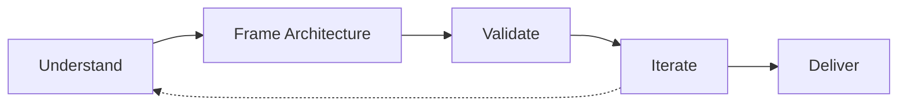

The loop applies throughout the assessment.

New evidence, stakeholder perspectives, constraints or architectural findings may change:

* current-state understanding;
* root-cause hypotheses;
* target direction;
* options;
* priorities;
* roadmap sequence.

Architectural judgement remains the responsibility of the architect, but architecture should be developed and validated collaboratively with relevant business, technology, operational and governance stakeholders.

⸻

### 1.10 Findings should establish architectural causality

A useful assessment should move beyond a list of observations.

Findings should progressively connect:


Multiple observations should be consolidated where they represent the same underlying architectural issue.

The assessment should identify:

* patterns;
* common root causes;
* systemic issues;
* architectural themes;
* capability-level concerns;
* isolated issues;
* material opportunities.

⸻

### 1.11 Group findings through capabilities and architectural themes

Findings should be organised so that leadership and delivery teams can understand the broader implications.

A useful synthesis structure is:

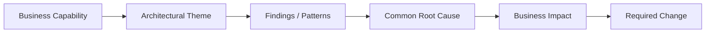

This prevents the assessment from becoming a flat register of technical problems.

It also allows multiple technical findings to be connected to the business capability or strategic outcome they affect.

⸻

### 1.12 Materiality is business-led

Architectural materiality should not be determined solely by technical severity.

Assessment of materiality should consider:

* strategic goals;
* strategic priorities;
* business impact;
* business risk;
* customer or user impact;
* long-term direction;
* regulatory or legal exposure;
* operational consequences;
* technology strategy;
* architectural significance.

The most technically severe issue is not necessarily the most strategically important issue.

⸻

### 1.13 Distinguish quick wins from priorities

A quick win is an intervention that can be implemented relatively easily and produces tangible business improvement.

Examples of potential quick-win value include:

* business efficiency;
* cost reduction;
* user experience;
* customer experience;
* removal of an obvious operational bottleneck.

A quick win is not automatically a high-priority initiative.

Quick-win status describes an opportunity’s relative ease and immediacy.

Priority reflects the broader decision context.

⸻

### 1.14 Prioritisation is contextual

Not every identified gap should become a roadmap item.

Prioritisation should consider, as relevant:

* business strategic goals;
* business strategic priorities;
* business impact;
* business value;
* business risk;
* technology strategy;
* TCO;
* investment;
* dependencies;
* prerequisites;
* implementation complexity;
* organisational readiness;
* delivery capacity;
* regulatory obligations;
* timing;
* opportunity enablement.

Avoid false precision.

The architect should use the dimensions that materially affect the decision rather than applying an arbitrary scoring model.

⸻

### 1.15 Roadmaps are transformation decision-support mechanisms

A roadmap should explain:

* what needs to change;
* why it needs to change;
* what value or outcome it enables;
* what must happen first;
* what can happen in parallel;
* what depends on another change;
* what the likely sequence is;
* where uncertainty remains.

A roadmap is not merely a list of projects.

A useful structure is:

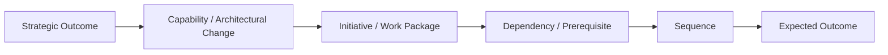

⸻

### 1.16 Integrate with existing organisational roadmaps

The architecture roadmap should not become a parallel planning universe.

Where available, the architect should use and reconcile:

* business roadmaps;
* technology roadmaps;
* PMO roadmaps;
* transformation portfolios;
* programme plans;
* product roadmaps;
* investment plans.

These provide important inputs for:

* opportunities;
* prerequisites;
* dependencies;
* timing;
* investment;
* organisational capacity;
* sequencing.

Architecture should connect architectural change to the organisation’s existing transformation and investment mechanisms.

⸻

### 1.17 Roadmap horizons should reflect planning reality

A common roadmap structure is:

flowchart LR
    A["Immediate"]
    B["Current Fiscal Year"]
    C["2–3 Years"]
    D["5+ Years"]
    A --> B --> C --> D

These horizons are a useful default rather than a mandatory calendar model.

Immediate

Problems that require action now, or opportunities that can be addressed without waiting for larger transformation.

Current Fiscal Year

Initiatives that can realistically be planned, funded or executed within the current planning cycle.

2–3 Years

Structural transformation, capability development, platform evolution and larger architectural change.

5+ Years

Longer-term strategic direction and architectural runway where sufficient direction exists.

The roadmap may use alternative horizons where the client context requires them.

A horizon describes when a change is realistically positioned.

It does not by itself determine priority.

⸻

### 1.18 Separate roadmap horizon from sequencing logic

Roadmap timing and prioritisation are different concepts.

For example:

* a quick win may be immediate but not strategically critical;
* a high-value initiative may be deferred because of dependencies;
* a foundational platform capability may precede several higher-visibility initiatives;
* a strategic direction may be clear even though implementation timing remains uncertain.

Therefore:

Horizon describes when change is positioned.

Priority and sequence explain why it occurs in that order.

⸻

### 1.19 Dependencies determine practical sequence

Roadmap sequencing should reflect meaningful dependencies.

Dependencies may be:

* architectural;
* technical;
* data;
* organisational;
* regulatory;
* financial;
* capability;
* supplier;
* delivery;
* governance.

The architect should identify:

* prerequisites;
* enabling capabilities;
* blocking decisions;
* parallel opportunities;
* transition constraints;
* external dependencies.

A roadmap that ignores dependencies may be visually attractive but operationally unrealistic.

⸻

### 1.20 Use transition architectures where they provide real value

Where the target cannot or should not be reached in one step, define meaningful transition architectures.

For example:

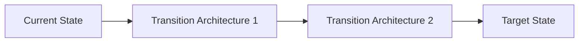

A transition architecture should represent a meaningful intermediate architectural or capability state.

It may enable:

* incremental business value;
* dependency resolution;
* platform consolidation;
* coexistence;
* migration;
* risk reduction;
* organisational readiness;
* investment sequencing.

Transition architectures should not be manufactured merely to create phases.

⸻

### 1.21 Roadmap certainty should reflect evidence and organisational commitment

The architect should distinguish between:

* firm direction;
* directional recommendation;
* conditional initiative;
* unresolved decision;
* future opportunity.

A roadmap item can be stated firmly where uncertainty is sufficiently low.

Examples include:

* an organisation has selected a strategic project-management platform and already uses it, making consolidation/migration toward that platform a well-supported direction;
* an organisation has an established SAP HANA consolidation strategy, making rationalisation and migration of local or regional ERP solutions toward HANA a sufficiently established direction.

The implementation detail, timing, dependencies or investment may still require refinement.

Where uncertainty remains, represent it explicitly through:

* risks;
* assumptions;
* constraints;
* dependencies;
* revisions;
* governance approvals;
* decision points;
* conditional initiatives;
* review triggers;
* confidence.

Do not manufacture precision.

⸻

### 1.22 Architecture should be actionable

The final assessment should enable decisions such as:

* what should change;
* what should remain;
* what should be reused;
* what should be evolved;
* what should be consolidated;
* what should be retired;
* what should be invested in;
* what should be prioritised;
* what should be investigated further;
* what should be tested;
* what should be governed;
* what should be sequenced later.

⸻

## 2. Entry Conditions

Architecture Assessment & Roadmap is appropriate when:

* the architectural context is broader than a single decision;
* the organisation needs to understand its current situation;
* the desired future state is unclear, evolving, or needs to be established;
* there are multiple architectural gaps or concerns;
* there are suspected architectural root causes;
* multiple initiatives or dependencies must be considered;
* transformation sequencing is required;
* strategic direction needs to be translated into architecture;
* the client requires a roadmap rather than an isolated recommendation.

Typical triggers include:

* “We need to modernise our architecture.”
* “We need to understand our current technology landscape.”
* “Our architecture is preventing growth.”
* “Our architecture is contributing to operational problems.”
* “We have accumulated significant technical debt.”
* “We need an AI transformation roadmap.”
* “We need to understand what capabilities we need to support our strategy.”
* “We need to move from our current platform landscape to a target state.”
* “We have many initiatives but no coherent architecture roadmap.”

⸻

## 3. Scope Definition

The assessment scope should be defined before significant analysis begins.

Scope may be bounded by:

* enterprise;
* business unit;
* capability;
* product;
* platform;
* domain;
* application landscape;
* technology landscape;
* transformation initiative;
* geography;
* operating model;
* time horizon.

The scope should explicitly identify:

* what is included;
* what is excluded;
* relevant stakeholders;
* assessment depth;
* target-state horizon;
* expected roadmap horizon;
* evidence sources;
* required outputs;
* known assumptions;
* known constraints.

Where useful, define explicit assessment questions.

Examples:

* Can the current architecture support the organisation’s growth strategy?
* What architectural conditions are contributing to the current business problem?
* Which capabilities require modernisation?
* Where is technical debt materially constraining change?
* What architecture is required to support AI-enabled operations?
* Which platforms should be retained, evolved, consolidated, or replaced?
* What must happen before the target architecture can be achieved?

⸻

## 4. Assessment Depth

Not every assessment requires the same level of investigation.

A useful classification is:

Focused Assessment

A bounded assessment of a specific architecture, product, platform, capability, or domain.

Typical outputs:

* problem/context understanding;
* relevant current-state view;
* key findings;
* material root causes;
* major gaps;
* target direction;
* prioritised recommendations.

Domain Assessment

A broader assessment covering multiple related architectural concerns.

Typical outputs:

* current-state baseline;
* capability/domain assessment;
* architectural findings;
* root causes and themes;
* target direction;
* priority initiatives;
* roadmap.

Enterprise / Transformation Assessment

A broad assessment connecting business strategy, capabilities, architecture, governance, operating model and transformation.

Typical outputs:

* strategic context;
* capability assessment;
* current-state architecture;
* architectural diagnosis;
* target architecture;
* transformation themes;
* transition architectures;
* work packages;
* multi-horizon roadmap;
* governance implications.

These are examples rather than mandatory packages.

⸻

## 5. Core Workflow

```mermaid
flowchart LR
    A["0. Establish Business Situation & Assessment Intent"]
    B["1. Define Assessment Scope & Boundary"]
    C["2. Establish Evidence Base"]
    D["3. Determine Assessment Depth"]
    E["4. Investigate Current Situation & Architecture"]
    F["5. Form and Test Architectural Hypotheses"]
    G["6. Establish Findings, Root Causes & Materiality"]
    H["7. Establish Target Direction & Architectural Runway"]
    I["8. Identify Architectural Options & Opportunities"]
    J["9. Prioritise Capabilities & Required Changes"]
    K["10. Define Transition Architectures & Dependencies"]
    L["11. Construct Multi-Horizon Roadmap"]
    M["12. Validate Roadmap & Feasibility"]
    N["13. Refine, Confirm Confidence & Establish Governance"]
    O["14. Produce Decision-ready Assessment & Roadmap"]
    A --> B --> C --> D --> E --> F --> G --> H --> I --> J --> K --> L --> M --> N --> O
    E -.-> F
    F -.-> G
    G -.-> H
    H -.-> I
    I -.-> J
    J -.-> K
    K -.-> L
    L -.-> M
    M -.-> N
    N -.-> E
```

The workflow is iterative.

In particular:

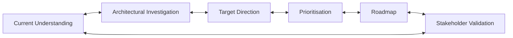

New findings may require the current-state understanding, target direction, priorities or roadmap to be revisited.

⸻

### Step 0 — Establish Business Situation & Assessment Intent

Objective

Understand why the assessment is being performed, what problem or opportunity exists, and what outcome the assessment needs to support.

Activities

Establish:

* business trigger;
* current situation;
* critical problems;
* impact on the organisation;
* impact on stakeholders;
* impact on employees, customers or users;
* strategic vision;
* business strategy;
* technology strategy;
* goals;
* priorities;
* desired outcomes;
* decision context;
* stakeholders;
* assessment questions;
* expected time horizon;
* known constraints.

Where relevant, establish the relationship between:

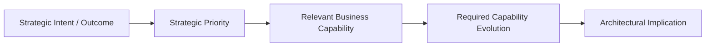

This relationship should be established only to the degree supported by the engagement and available evidence.

Key questions

* What is happening today?
* Why does it matter?
* What problems are being experienced?
* Who is affected?
* What is the impact?
* What would success look like?
* What are the organisation’s strategic goals?
* What are its priorities?
* What technology strategy or direction already exists?
* What capabilities are materially relevant?
* What changes in those capabilities may be required?
* What happens if nothing changes?
* What decisions will the assessment support?

Output

Assessment Intent Statement

⸻

### Step 1 — Define Assessment Scope & Boundary

Objective

Establish what will and will not be assessed.

Define:

* organisational boundary;
* business capability boundary;
* architecture domains;
* systems/platforms;
* geographic scope;
* time horizon;
* stakeholders;
* assessment depth;
* roadmap horizon.

The scope should explicitly identify areas that may require separate work.

For example:

* detailed solution design;
* implementation planning;
* business-case development;
* organisational restructuring;
* procurement;
* detailed product selection;
* detailed engineering estimation;
* detailed change-management planning.

The discovery of additional required work should not automatically cause uncontrolled scope expansion.

Output

Assessment Scope & Boundary

⸻

### Step 2 — Establish Evidence Base

Objective

Determine what evidence exists, what evidence is relevant, and what additional evidence is required.

Potential evidence includes:

Business

* strategy;
* objectives;
* business plans;
* operating model;
* capability models;
* business processes;
* workflows;
* user journeys;
* stakeholder interviews;
* examples of real user activity.

Architecture

* architecture repositories;
* application inventories;
* architecture diagrams;
* standards;
* principles;
* ADRs;
* technology catalogues;
* architecture assessments.

Technology

* infrastructure;
* cloud;
* applications;
* databases;
* integration;
* networks;
* platforms;
* development practices.

Data

* data sources;
* data ownership;
* information flows;
* data quality;
* governance;
* lifecycle.

Operations

* SLAs;
* incidents;
* operational metrics;
* monitoring;
* logs;
* dashboards;
* performance information;
* resilience;
* disaster recovery;
* support model.

Delivery

* portfolios;
* programmes;
* projects;
* product roadmaps;
* technical debt backlogs;
* delivery capacity;
* PMO roadmaps.

Financial / Commercial

* technology costs;
* licensing;
* supplier contracts;
* investment constraints;
* business cases;
* TCO.

AI

Where relevant:

* AI use cases;
* model/provider landscape;
* AI architecture;
* data/context sources;
* evaluation;
* governance;
* operational telemetry.

The architect should actively seek evidence that can explain the observed business problem, rather than collecting documentation indiscriminately.

⸻

### Step 3 — Determine Assessment Depth

Before performing detailed analysis, determine how much evidence and analysis is actually required.

Consider:

* scope;
* architectural complexity;
* number of systems/capabilities;
* evidence availability;
* stakeholder complexity;
* decision consequences;
* target-state uncertainty;
* roadmap horizon;
* organisational change complexity;
* suspected root-cause complexity.

Evidence Sufficiency Gate

| Outcome                           | Meaning                                                                    |
| --------------------------------- | -------------------------------------------------------------------------- |
| Sufficient                        | Proceed.                                                                   |
| Sufficient with assumptions       | Proceed while explicitly recording assumptions and their potential impact. |
| Insufficient but resolvable       | Collect additional evidence.                                               |
| Insufficient and scope-changing   | Reassess the engagement method or scope.                                   |

The assessment should not attempt to establish every possible fact before progressing.

⸻

### Step 4 — Investigate Current Situation & Architecture

Objective

Understand how the business problem or opportunity relates to the current architecture.

The architect should progressively connect relevant layers:


The depth of investigation should follow the assessment question.

Investigation techniques

Where useful:

* observe users running the system;
* review business workflows;
* review operational reports;
* inspect logs and dashboards;
* identify peak or abnormal operating periods;
* inspect impacted applications;
* trace end-to-end processes;
* map dependencies;
* review relevant architecture views;
* examine areas that may contribute to the problem based on architectural experience;
* test specific hypotheses through targeted evidence collection.

Output

Current-State Diagnostic Baseline

This may include architecture views, process views, capability views, operational evidence and dependency views as appropriate.

⸻

### Step 5 — Form and Test Architectural Hypotheses

Objective

Identify plausible architectural causes and determine whether available evidence supports them.

A typical investigation loop is:

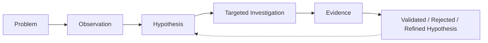

The architect should prioritise investigations that are most likely to materially improve understanding.

Potential hypotheses may concern:

* application design;
* integration;
* data;
* infrastructure;
* scalability;
* operational processes;
* architecture dependencies;
* technology choices;
* organisational ownership;
* governance;
* capability maturity where relevant;
* technical debt;
* architectural coupling.

Where useful, perform a 5-Whys-style reasoning test.

The goal is to establish sufficient root-cause understanding, not to prove every possible causal relationship.

Diagnostic Sufficiency

The investigation can move forward when:

* the material problem is sufficiently understood;
* the likely root cause or contributing causes are sufficiently clear;
* remaining uncertainty is explicit;
* further investigation is unlikely to materially change the architectural assessment.

If the root cause remains materially uncertain, either:

* investigate further;
* state the conclusion as directional;
* identify the uncertainty as a decision or roadmap item;
* or escalate the scope.

⸻

### Step 6 — Establish Findings, Root Causes & Materiality

Objective

Turn diagnostic observations into a coherent architectural assessment.

A useful structure is:

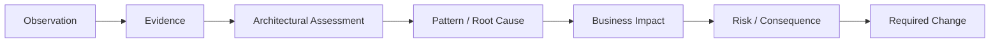

The architect should distinguish between:

* strengths;
* gaps;
* risks;
* constraints;
* dependencies;
* opportunities;
* technical debt;
* capability gaps;
* decisions required;
* evidence gaps;
* systemic root causes.

Not every observation should become a formal finding.

Finding synthesis

Initially group findings through relevant business capabilities.

Then identify:

* architecture themes;
* recurring patterns;
* common root causes;
* systemic issues;
* business-critical areas;
* opportunities for reuse;
* low-hanging improvements.

Materiality

Assess each material finding against:

* business strategic goals;
* strategic priorities;
* business impact;
* business risk;
* long-term direction;
* technology strategy;
* regulatory or legal consequences;
* operational consequences.

A high technical severity does not automatically imply high business priority.

⸻

### Gap Analysis

Gap analysis compares established current and desired conditions.

A useful structure is:

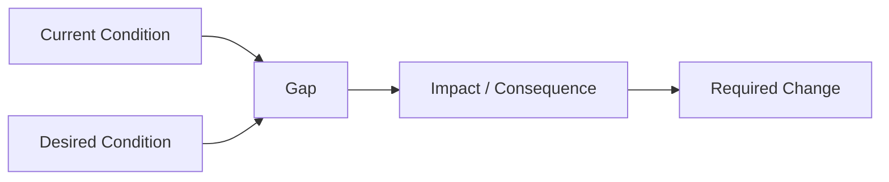

A gap may represent:

* capability;
* architecture;
* technology;
* data;
* integration;
* security;
* operational;
* governance;
* organisational capability;
* skills;
* delivery capability.

Multiple observations should be consolidated where they represent the same underlying architectural issue.

Avoid creating a roadmap item for every individual gap.

⸻

### Step 7 — Establish Target Direction & Architectural Runway

Objective

Define the architectural direction required to achieve the desired outcomes.

Target-state thinking should begin from:

* strategic vision;
* strategic goals;
* strategically important business capabilities;
* capability maturity where established and evidenced;
* future capability needs;
* technology strategy;
* existing strategic technology partners;
* existing strategic components;
* opportunities for reuse;
* business constraints;
* cost;
* resources;
* time;
* NFRs.

The target state may be expressed at different levels.

Strategic

* transformation themes;
* strategic capabilities;
* architectural principles;
* strategic direction.

Capability

* required capabilities;
* capability maturity where appropriate;
* capability ownership;
* capability evolution.

Architecture

* target application architecture;
* target data architecture;
* target integration architecture;
* target technology architecture;
* target AI architecture where relevant.

Operating Model

* ownership;
* governance;
* skills;
* operational responsibilities.

The target state should be detailed enough to guide prioritisation and transition, but not unnecessarily detailed.

Architectural Runway

The assessment should establish a high-level architectural runway describing the direction and major enabling architectural changes required to move toward the target.

This may include:

* strategic platforms;
* enabling capabilities;
* foundational architecture;
* reusable components;
* target-state principles;
* transition requirements;
* dependencies.

⸻

### Target-State Validation

The target direction should be challenged against:

* business outcomes;
* strategic direction;
* capabilities;
* requirements;
* constraints;
* organisational capability;
* technology reality;
* investment capacity;
* operational viability;
* security and compliance;
* future flexibility.

Ask:

If this target direction were achieved, would it materially address the original reason for the assessment?

If not, revisit the target direction.

Target-state development remains iterative with current-state investigation and stakeholder validation.

⸻

### Step 8 — Identify Architectural Options & Opportunities

Where meaningful alternatives exist, identify alternative ways of moving from the current state toward the desired direction.

Options may include:

* evolve;
* consolidate;
* replace;
* retire;
* integrate;
* outsource;
* build;
* buy;
* partner;
* centralise;
* decentralise;
* introduce a new platform;
* modernise incrementally;
* establish an intermediate architecture.

Options should be assessed according to:

* business value;
* strategic alignment;
* architectural fit;
* technology strategy;
* risk;
* TCO;
* investment;
* complexity;
* dependency;
* organisational readiness;
* delivery feasibility;
* strategic flexibility.

Not every assessment requires multiple options.

Where the strategic direction is already sufficiently established, the architect should not manufacture alternatives simply to create an options analysis.

⸻

### Step 9 — Prioritise Capabilities & Required Changes

Objective

Determine which changes should happen first, which can follow, and which should not yet be pursued.

The prioritisation process should consider, as relevant:

Strategic

* business strategic goals;
* strategic priorities;
* technology strategy;
* long-term direction.

Business

* business impact;
* business value;
* customer/user impact;
* efficiency;
* cost;
* risk.

Architectural

* architectural importance;
* dependencies;
* prerequisites;
* target-state enablement;
* technical risk.

Investment

* TCO;
* investment;
* funding availability;
* financial constraints.

Feasibility

* skills;
* delivery capacity;
* organisational readiness;
* supplier constraints;
* change capacity.

Timing

* regulatory deadlines;
* strategic windows;
* technology lifecycle;
* business urgency.

Priority should reflect the overall decision context.

Avoid treating technical difficulty, ease of implementation or roadmap horizon as a proxy for business priority.

⸻

### Quick Wins

Identify low-complexity opportunities that can provide tangible business improvement.

Typical value may include:

* business efficiency;
* cost reduction;
* user experience;
* customer experience;
* operational improvement.

Quick wins should be assessed alongside larger transformation requirements.

A quick win is not automatically a high-priority initiative.

Where a quick win depends on a larger transformation, this dependency should be explicit.

⸻

### Step 10 — Define Transition Architectures & Dependencies

Objective

Determine how the organisation can realistically move from the current state toward the target direction.

Consider:

* transition architectures;
* sequencing;
* work packages;
* migration;
* coexistence;
* decommissioning;
* capability enablement;
* organisational change;
* technology dependencies;
* data migration;
* operational readiness;
* investment timing.

A transition state should have a meaningful purpose.

For example:


Each transition should describe the capability or architectural outcome it enables.

⸻

### Work Package Definition

Group related changes into coherent work packages.

A work package may contain:

* objective;
* scope;
* expected outcome;
* architectural change;
* business capability enabled;
* dependencies;
* prerequisites;
* risks;
* assumptions;
* constraints;
* indicative effort;
* ownership;
* success criteria.

Avoid decomposing the roadmap into detailed project plans unless that level of planning is explicitly in scope.

⸻

### Step 11 — Construct the Multi-Horizon Roadmap

Objective

Translate the assessment into an actionable sequence of change.

A roadmap should show:

* strategic themes;
* business capabilities;
* architecture domains/themes;
* architectural changes;
* initiatives/work packages;
* dependencies;
* prerequisites;
* quick wins;
* transition architectures;
* sequencing;
* expected outcomes;
* ownership;
* indicative timing where supportable.

A useful roadmap structure is:


⸻

### Roadmap Horizons

A common roadmap structure is:

Immediate

Problems that need to be solved now and opportunities that can provide near-term value.

Current Fiscal Year

Initiatives that can realistically be planned, funded or executed within the current fiscal cycle.

2–3 Years

Structural transformation, capability development, platform evolution and larger architectural changes.

5+ Years

Longer-term strategic direction and architectural runway where sufficient strategic direction exists.

These horizons are a useful default, not a mandatory model.

Alternative horizons may be used where the client context requires them.

⸻

### Integrate Existing Business and Technology Roadmaps

The architecture roadmap should be reconciled with existing:

* business roadmaps;
* technology roadmaps;
* PMO roadmaps;
* transformation portfolios;
* programme plans;
* product roadmaps;
* investment plans.

Use these as inputs to identify:

* opportunities;
* prerequisites;
* dependencies;
* existing commitments;
* investment timing;
* organisational capacity;
* sequencing constraints.

The architecture roadmap should complement the organisation’s existing planning mechanisms rather than compete with them.

⸻

### Roadmap Sequencing Logic

Sequence should be driven by the overall transformation context.

Primary considerations include:

* business strategic goals;
* business strategic priorities;
* business impact;
* technology strategy;
* TCO;
* investment;
* business value;
* dependencies;
* prerequisites;
* organisational readiness;
* implementation feasibility.

Dependencies may cause an initiative with lower immediate visibility to precede a higher-value initiative because it enables that later change.

The roadmap should make the reason for sequencing understandable.

⸻

### Roadmap Dependency Analysis

Before finalising the roadmap, explicitly test:

* technical dependencies;
* data dependencies;
* capability dependencies;
* governance dependencies;
* funding dependencies;
* organisational dependencies;
* supplier dependencies;
* programme dependencies;
* sequencing constraints.

The roadmap should be re-sequenced where dependencies make the proposed sequence unrealistic.

⸻

### Roadmap Feasibility

A technically correct roadmap may still be organisationally impossible.

Assess:

Capacity

* people;
* skills;
* funding;
* delivery teams.

Readiness

* leadership;
* governance;
* operating model;
* organisational change.

Technology

* platform readiness;
* migration complexity;
* integration constraints.

Change Absorption

* concurrent initiatives;
* organisational fatigue;
* competing priorities;
* dependency load.

Commercial

* procurement;
* contracts;
* vendor commitments;
* licensing.

The roadmap should represent a credible path, not simply an ideal architecture.

⸻

### Roadmap Certainty & Uncertainty

The architect should distinguish between:

* firm architectural direction;
* directional recommendation;
* conditional initiative;
* unresolved decision;
* future opportunity.

Firm direction is appropriate where:

* evidence is strong;
* strategic intent is established;
* the relevant decision has already been made or is sufficiently mature;
* major uncertainty is low.

Where uncertainty remains, explicitly record:

* risks;
* assumptions;
* constraints;
* dependencies;
* revisions;
* governance approvals;
* decision points;
* conditional initiatives;
* review triggers;
* confidence.

A roadmap may have:

High confidence in direction

while retaining:

Lower confidence in execution timing or implementation detail.

Do not manufacture precision.

⸻

### Step 12 — Validate Roadmap & Feasibility

The roadmap should be validated collaboratively.

Stakeholders should be selected according to the change and its implications.

Potential participants include:

* business owners;
* business SMEs;
* Business Analysts;
* PMO;
* technology leaders directly involved or impacted;
* other architects;
* Head of Architecture;
* engineering;
* change management;
* finance;
* IT Services;
* relevant technology partners.

Not every stakeholder is required for every assessment.

The stakeholder network should reflect the scope and implications of the proposed change.

Validation questions

Strategic

* Does the roadmap support the original strategic intent?
* Does it align with business goals and priorities?

Business

* Is the expected business value credible?
* Does it address the original business problems?
* Are customer/user impacts understood?

Architectural

* Does the roadmap actually move toward the target architecture?
* Are the transition architectures coherent?

Dependency

* Is the sequence feasible?
* Are prerequisites understood?
* Have material dependencies been missed?

Organisational

* Can the organisation absorb the change?
* Are ownership and capabilities available?

Financial

* Is the investment direction plausible?
* Are TCO considerations understood?

Delivery

* Does the roadmap align with existing PMO, business and technology plans?
* Are concurrent initiatives creating conflicts?

Operational

* Can intermediate states be operated safely?
* Are IT Services and operational teams able to support the proposed direction?

Risk

* Does the roadmap reduce or introduce material risk?

Value

* Does each major phase deliver meaningful value or enable a necessary dependency?

Assumptions

* Are important assumptions sufficiently validated?

⸻

### Stakeholder Conflict & Architectural Challenge

Stakeholder disagreement should not automatically be treated as an approval problem.

When a stakeholder challenges the assessment or roadmap:

1. Listen to the concern.
2. Understand the stakeholder’s perspective and context.
3. Identify the source of the disagreement.
4. Determine whether the issue relates primarily to:
    * business;
    * technology;
    * architecture;
    * delivery;
    * finance;
    * operations;
    * governance;
    * organisational change;
    * another constraint.
5. Engage the relevant stakeholders or subject-matter experts.
6. Review the relevant evidence, assumptions or architectural reasoning.
7. Reassess the conclusion.
8. Refine the assessment or roadmap where warranted.
9. Escalate material unresolved decisions through the appropriate governance mechanism.

Possible outcomes are:

Validated

The roadmap is sufficiently supported.

Refine

Further evidence, analysis or stakeholder alignment is required.

Escalate

The disagreement represents a material strategic, investment, risk, governance or organisational decision that cannot appropriately be resolved at the architecture level.

Architectural judgement remains accountable, but the architect does not automatically own every business, investment or organisational decision.

⸻

### Step 13 — Refine, Confirm Confidence & Establish Governance

Before finalising the assessment:

* incorporate validated stakeholder feedback;
* resolve material evidence gaps;
* update assumptions;
* update risks;
* update dependencies;
* update constraints;
* confirm target direction;
* confirm roadmap sequence;
* confirm ownership;
* identify governance approvals;
* record material unresolved decisions;
* assess confidence.

The final roadmap should distinguish between:

* agreed direction;
* recommendations;
* assumptions;
* dependencies;
* conditional items;
* decisions required;
* governance approvals;
* future review points.

⸻

### Step 14 — Produce the Decision-ready Assessment & Roadmap

The final assessment should communicate the reasoning from business situation through diagnosis to roadmap.

A typical structure is:

1. Executive Summary
2. Business Situation & Assessment Intent
3. Strategic Context
4. Scope & Boundary
5. Evidence & Assumptions
6. Current-State Diagnostic
7. Architectural Findings
8. Root Causes & Themes
9. Business Impact, Risks & Constraints
10. Capability / Architecture Gaps
11. Target Direction & Architectural Runway
12. Options & Trade-offs
13. Prioritised Change Themes
14. Transition Architectures
15. Roadmap
16. Dependencies & Prerequisites
17. Risks, Assumptions & Constraints
18. Confidence & Uncertainty
19. Governance Implications
20. Recommendations
21. Ownership & Next Steps

Not every engagement requires every section.

⸻

## 6. Executive Communication

The executive view should answer:

1. What is happening today?
2. What is working?
3. What is constraining the organisation?
4. Why is it happening?
5. What needs to change?
6. Why does it matter?
7. What should happen first?
8. What does the transformation journey look like?
9. What decisions or investments are required?
10. Where does uncertainty remain?

The executive view should not require the reader to understand the underlying architecture before understanding the recommendation.

⸻

## 7. Governance, Ownership & Post-Assessment Involvement

The assessment should establish what happens after delivery.

Depending on scope, this may include:

* architecture governance;
* decision ownership;
* roadmap ownership;
* initiative ownership;
* architecture review mechanisms;
* dependency management;
* roadmap review cadence;
* benefits tracking;
* architecture repository maintenance;
* future assessment triggers;
* governance approvals.

Where the architect remains involved in execution, the involvement may occur through:

* architecture governance boards;
* project or programme gates;
* architecture forums;
* material architecture decisions;
* exception reviews;
* architecture assurance.

The assessment architect does not necessarily become the day-to-day Solution Architect.

Where a Solution Architect is embedded in a delivery team, that role normally owns day-to-day solution design and implementation architecture within the established architectural direction and governance.

The assessment architect may provide higher-level architectural assurance, challenge and steering.

⸻

## 8. Architecture Assessment vs Day-to-Day Solution Architecture

The distinction should remain explicit.

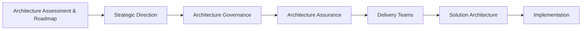

Architecture Assessment & Roadmap establishes direction and transformation priorities.

Solution Architecture applies that direction to specific delivery contexts.

The two roles should collaborate rather than duplicate one another.

⸻

## 9. AI-Assisted Assessment

AI can significantly accelerate this method when sufficient source material exists.

Potential uses include:

Evidence Processing

* document ingestion;
* extraction;
* classification;
* summarisation;
* cross-document comparison;
* evidence indexing.

Investigation

* identifying inconsistencies;
* identifying candidate relationships;
* mapping evidence to assessment lenses;
* identifying candidate root causes;
* identifying potential dependencies;
* clustering observations.

Architecture

* candidate architecture views;
* architecture pattern comparison;
* option generation;
* contextual framework mapping;
* dependency analysis.

Findings

* clustering findings;
* identifying recurring themes;
* detecting potential common root causes;
* linking findings to evidence;
* identifying potential gaps.

Roadmap

* grouping related gaps;
* identifying candidate dependencies;
* clustering initiatives;
* generating candidate sequencing hypotheses;
* drafting roadmap narratives;
* checking roadmap traceability.

Quality

* traceability checking;
* consistency checking;
* finding duplication;
* detecting unsupported claims;
* checking recommendation coverage;
* identifying evidence gaps.

AI-generated analysis remains subject to architectural review.

The architect remains accountable for:

* business context;
* causal interpretation;
* materiality;
* prioritisation;
* trade-offs;
* target-state judgement;
* roadmap sequence;
* stakeholder interpretation;
* recommendation;
* architectural accountability.

AI is an augmentation mechanism, not a substitute for architectural judgement.

⸻

## 10. Evidence Traceability

Material assessment conclusions should maintain a traceability chain:

```mermaid
flowchart LR
    A["Strategic Intent / Outcome"]
    B["Relevant Business Capability"]
    C["Required Capability Evolution"]
    D["Evidence"]
    E["Observation"]
    F["Assessment"]
    G["Finding"]
    H["Pattern / Root Cause"]
    I["Business Impact / Risk"]
    J["Gap"]
    K["Required Change"]
    L["Priority"]
    M["Roadmap Item"]
    N["Expected Outcome"]
    A --> B --> C
    C --> D --> E --> F --> G --> H --> I --> J --> K --> L --> M --> N
```

This creates a defensible relationship between strategic intent, source evidence and transformation recommendations.

It also makes it possible to challenge the roadmap without reopening the entire assessment.

Where a capability relationship is not established by evidence or engagement scope, the architect should not manufacture one.

⸻

## 11. Assessment Confidence

Confidence should be assessed explicitly where evidence is incomplete.

High

Evidence is sufficiently comprehensive and consistent to support strong architectural conclusions.

Medium

The assessment is well supported but contains assumptions or evidence gaps that could affect some conclusions.

Low

Significant uncertainty remains and conclusions should be treated as directional.

Confidence may vary across individual findings, target-state decisions and roadmap items.

Roadmap certainty should additionally consider:

* evidence;
* strategic commitment;
* decision maturity;
* dependencies;
* investment certainty;
* organisational readiness.

⸻

## 12. Architecture Assessment vs Decision Review

The two methods should remain distinct.

| Dimension                 | Architecture Decision Review              | Architecture Assessment & Roadmap                                           |
| ------------------------- | ----------------------------------------- | --------------------------------------------------------------------------- |
| Primary question          | Are we making the right decision?         | Where are we, why are we here, where should we go, and how do we get there? |
| Context                   | Established                               | May need to be established                                                  |
| Current state             | Only as required                          | Often substantive                                                           |
| Diagnostic investigation  | Decision-specific                         | Potentially substantive                                                     |
| Root-cause analysis       | Only as required                          | Often relevant                                                              |
| Target state              | Only as required                          | Often substantive                                                           |
| Gap analysis              | Decision-specific                         | Broader                                                                     |
| Options                   | Decision-specific                         | Architectural/transformation alternatives                                   |
| Roadmap                   | Usually limited                           | Core potential output                                                       |
| Scope                     | Bounded                                   | Broader                                                                     |
| Output                    | Decision-ready recommendation             | Assessment + target direction + roadmap                                     |
| Escalation                | To broader assessment                     | To deeper architecture/strategy work                                        |

An Architecture Decision Review should escalate to this method when answering the decision requires substantial establishment or reassessment of:

* current state;
* target state;
* business capabilities;
* strategic direction;
* architectural runway;
* transition direction;
* transformation roadmap.

Conversely, an Architecture Assessment & Roadmap should not absorb a bounded architectural decision simply because that decision occurs during the assessment.

A distinct Architecture Decision Review may be used where a material decision requires focused architectural judgement.

⸻

## 13. Engagement-Specific Tailoring

The professional method may be instantiated as:

* focused architecture assessment;
* product/platform assessment;
* capability assessment;
* technology landscape assessment;
* AI architecture assessment;
* transformation assessment;
* enterprise architecture assessment;
* assessment and roadmap.

These are engagement definitions, not separate methodologies.

Commercial or channel-specific packaging should remain outside this method.

⸻

## 14. Reusable Assessment Lenses

The assessment should use the lenses that are relevant to the engagement.

Potential lenses include:

* business alignment;
* capability fitness;
* process performance;
* application architecture;
* integration;
* data;
* technology;
* infrastructure;
* security;
* resilience;
* scalability;
* observability;
* maintainability;
* cost;
* vendor dependency;
* governance;
* operating model;
* organisational capability;
* delivery capability;
* AI readiness.

The assessment should not treat this list as a mandatory checklist.

The architect should select and adapt assessment lenses according to:

* assessment scope;
* business context;
* architecture type;
* stakeholder concerns;
* evidence;
* decision needs;
* material risks;
* intended outcomes.

Where a reusable assessment framework exists for a specific engagement type, it should be treated as an engagement asset or lens library rather than as a mandatory component of the Architecture Assessment & Roadmap method.

⸻

## 15. Reusable Assets

Potential reusable assets include:

Assessment

* Assessment Intent template;
* Assessment Scope template;
* Evidence Register;
* Evidence Sufficiency Checklist;
* Current-State Diagnostic template;
* Assessment Lens Library;
* Stakeholder Map.

Investigation

* Problem Statement template;
* Investigation Hypothesis Register;
* Root-Cause Analysis template;
* User Journey / Workflow Analysis;
* Operational Evidence Register;
* Dependency Map.

Analysis

* Findings Register;
* Root Cause Register;
* Risk Register;
* Assumption Register;
* Constraint Register;
* Dependency Register;
* Gap Analysis Matrix;
* Capability Assessment;
* Architecture Health Assessment;
* Options Matrix;
* Materiality Assessment.

Target State

* Target-State template;
* Architecture Blueprint;
* Capability Target-State template;
* Architecture Principles;
* Reference Architectures;
* Architectural Runway.

Roadmap

* Transformation Theme template;
* Work Package template;
* Dependency Map;
* Transition Architecture template;
* Multi-Horizon Roadmap template;
* Prioritisation Matrix;
* Roadmap Validation Checklist;
* Roadmap Confidence Assessment.

⸻

## 16. Outputs

Depending on scope, the method may produce:

* Assessment Intent;
* Scope & Boundary;
* Evidence Register;
* Current-State Diagnostic;
* Architecture Assessment;
* Capability Assessment;
* Findings;
* Root-Cause Analysis;
* Risks;
* Assumptions;
* Constraints;
* Dependencies;
* Gap Analysis;
* Desired State;
* Target Direction;
* Target Architecture;
* Architectural Runway;
* Options Analysis;
* Prioritised Change Themes;
* Transition Strategy;
* Transition Architectures;
* Work Packages;
* Multi-Horizon Roadmap;
* Governance Recommendations;
* ADRs;
* PoC recommendations;
* Executive Assessment;
* Architecture Blueprint.

Outputs are scope-driven.

⸻

## 17. Governance & Quality Gates

Gate 1 — Intent

The assessment has a clear business situation, purpose and intended outcome.

Gate 2 — Scope

The assessment boundary is explicit.

Gate 3 — Evidence Sufficiency

The evidence is sufficient for the intended level of confidence.

Gate 4 — Current-State Integrity

Material current-state conclusions are traceable to evidence or explicit assumptions.

Gate 5 — Diagnostic Sufficiency

Material problems have been investigated sufficiently to support architectural judgement, or remaining uncertainty is explicit.

Gate 6 — Assessment Relevance

The assessment lenses are appropriate to the engagement.

Gate 7 — Root-Cause / Finding Materiality

Material architectural findings and root causes are distinguished from minor observations.

Gate 8 — Target-State Coherence

The target direction addresses the original business and architectural intent.

Gate 9 — Prioritisation

Priorities reflect strategic goals, business impact, value, risk, technology strategy, TCO, investment, dependencies and feasibility as appropriate.

Gate 10 — Transition Coherence

Transition architectures and intermediate states have a meaningful purpose where used.

Gate 11 — Roadmap Feasibility

The proposed sequence is credible given dependencies, investment and organisational capacity.

Gate 12 — Stakeholder Validation

Relevant business, technology, architecture, delivery, operational, financial and change perspectives have been considered.

Gate 13 — Traceability

Material roadmap items can be traced back to architectural findings and business outcomes.

Gate 14 — Ownership

Major roadmap outcomes have an accountable owner or an explicit ownership gap.

Gate 15 — Confidence & Uncertainty

The confidence of material conclusions and roadmap direction is explicit where evidence is incomplete.

Gate 16 — Governance

Required decisions, approvals, review triggers and governance mechanisms are identified.

⸻

## 18. Scope Escalation

The assessment itself may identify that broader work is required.

Examples include:

* enterprise strategy is insufficiently defined;
* target business capabilities have not been established;
* operating-model transformation is required;
* investment decisions require a separate business case;
* detailed solution architecture is required;
* implementation planning exceeds the assessment scope;
* organisational change is materially larger than architectural change;
* procurement or vendor selection requires separate work;
* unresolved decisions materially affect the target architecture.

The architect should distinguish between:

Assessment finding

and:

Additional engagement requirement.

The discovery of additional required work should not automatically cause uncontrolled scope expansion.

Where answering the original question requires materially redefining strategy, capability requirements, target direction or transformation scope, the engagement should be explicitly escalated or re-scoped.

```mermaid
flowchart LR
    A["Assessment Finding"]
    B{"Can the original question<br/>still be answered within scope?"}
    C["Continue Assessment"]
    D["Refine Existing Scope"]
    E["Escalate / Re-scope"]
    F["Separate Engagement or Method"]
    A --> B
    B -->|Yes| C
    B -->|Yes, with bounded change| D
    B -->|No| E
    E --> F
```

Typical escalation may include:

* a bounded architectural decision → Architecture Decision Review;
* broader current-state, target-state or transformation work → Architecture Assessment & Roadmap;
* detailed implementation architecture → separate Solution Architecture responsibility;
* broader governance or organisational responsibilities → appropriate subsequent engagement.

The assessment architect should make the boundary explicit rather than silently absorbing additional work.

⸻

## 19. Assessment Success Criteria

An Architecture Assessment & Roadmap is successful when it provides the client with:

1. a clear understanding of the business situation and strategic context;
2. a sufficiently useful representation of the current situation;
3. evidence-based architectural findings;
4. sufficient understanding of material root causes where relevant;
5. material architectural and capability gaps;
6. a coherent desired or target direction;
7. a high-level architectural runway where appropriate;
8. explicit architectural options and trade-offs where relevant;
9. prioritised change themes;
10. a credible transition direction;
11. a dependency-aware, multi-horizon roadmap;
12. alignment with relevant business, technology and PMO roadmaps;
13. explicit risks, assumptions, constraints and dependencies;
14. appropriate confidence in the conclusions;
15. clear ownership and governance;
16. practical next steps.

The objective is not to produce the most comprehensive architecture inventory possible.

The objective is to turn business situation and architectural understanding into a credible direction for change and an executable transformation path.

⸻

## 20. Method Governance

This method is governed by the Core Enterprise Architecture SOP.

Changes should be recorded through the Methodology Improvement Log.

A method-specific improvement should normally remain within this method.

A change should be promoted into the Core SOP only when it represents a general principle of the professional architectural practice.

The distinction should be maintained between:

Professional architectural practice

and:

Engagement-specific method instantiation or commercial packaging.

⸻

## 21. Relationship to the Core EA Lifecycle

Architecture Assessment & Roadmap may span several capabilities of the Core EA SOP.

The relationship is:

```mermaid
flowchart LR
    A["Stage 01 — Discover & Align"]
    A1["Business Situation<br/>Intent<br/>Scope<br/>Evidence<br/>Investigation Context"]
    B["Stage 02 — Target Architecture & Strategy"]
    B1["Target Direction<br/>Architectural Runway<br/>Options<br/>Transition Direction"]
    C["Stage 03 — Governance & Decision Enablement"]
    C1["Decision Rights<br/>Governance<br/>Approvals<br/>Guardrails"]
    D["Stage 04 — Delivery Enablement & Execution Steering"]
    D1["Roadmap Execution<br/>Architecture Assurance<br/>Project Gates<br/>Architecture Forums"]
    E["Stage 05 — Value Realisation & Organisational Handover"]
    E1["Outcomes<br/>Ownership<br/>Value<br/>Continuous Evolution"]
    A --> A1 --> B --> B1 --> C --> C1 --> D --> D1 --> E --> E1
```

The lifecycle is not necessarily linear.

The working model remains:

```mermaid
flowchart LR
    A["Understand"]
    B["Frame Architecture"]
    C["Validate"]
    D["Iterate"]
    E["Deliver"]
    A --> B --> C --> D --> E
    D -.-> A
```

The assessment method may enter or exit different Core SOP capabilities depending on engagement scope.

⸻

## 22. Professional Method Boundary

Architecture Assessment & Roadmap is intended to answer:

What is happening, why does it matter, what architectural change is required, where should the organisation go, and what is the practical path to get there?

It is not intended by itself to provide:

* detailed project management;
* detailed implementation plans;
* detailed engineering design;
* procurement execution;
* formal financial business-case ownership;
* organisational restructuring;
* day-to-day Solution Architecture.

Where those capabilities are required, they should be established as separate or subsequent engagement responsibilities.

⸻

## 23. Method Governance Principle

The method should evolve from evidence and professional experience.

Method improvements should be captured when:

* recurring problems are identified;
* assessment outcomes reveal a weakness in the method;
* new architectural patterns emerge;
* new technology materially changes assessment practice;
* stakeholder feedback identifies an improvement;
* delivery experience reveals better sequencing or governance;
* AI-assisted techniques improve evidence processing or analytical quality.

Method evolution should preserve the distinction between:

* reusable professional principles;
* reusable assessment techniques;
* reusable assets;
* engagement-specific practices;
* commercial packaging.

⸻

## 24. Summary

Architecture Assessment & Roadmap provides a problem-led path from business situation to executable transformation direction.

The core reasoning chain is:

```mermaid
flowchart LR
    A["Business Situation & Strategic Intent"]
    B["Relevant Business Capability"]
    C["Required Capability Evolution"]
    D["Evidence & Current State"]
    E["Architectural Diagnosis"]
    F["Findings & Root Causes"]
    G["Target Direction"]
    H["Architectural Change"]
    I["Priorities & Dependencies"]
    J["Transition Architectures"]
    K["Transformation Roadmap"]
    L["Validated Direction & Governance"]
    A --> B --> C --> D --> E --> F --> G --> H --> I --> J --> K --> L
```

The method deliberately avoids treating architecture assessment as an inventory exercise.

It establishes enough business, capability, architectural and operational understanding to support sound architectural judgement.

It connects:

Strategy → Capability → Required Capability Evolution → Architecture → Change → Roadmap → Outcome

while maintaining explicit boundaries around evidence, uncertainty, scope, responsibility and professional judgement.

The architect’s responsibility is not to manufacture certainty or prescribe every implementation detail.

It is to establish a sufficiently credible understanding of the current situation, determine the architectural direction required, make the implications visible, and provide a practical path for the organisation to move forward.

⸻

© 2026 Alexandre Franco · Mostelli.com · All rights reserved.
