**Enterprise Architecture & AI Transformation**

---

# Illustrative Architecture Assessment & Transformation Roadmap
>
> **Illustrative portfolio sample**
>
> This document demonstrates how an Enterprise Architect might assess a fragmented architecture, identify architectural root causes, establish target direction, and translate the findings into a practical transformation roadmap.
>
> The organisation, systems, evidence and findings are fictional.
---

## 1. Executive Summary

The organisation is a fictional B2B services company whose customer operations have evolved through acquisitions, successive technology initiatives and local optimisation.
The resulting architecture is not fundamentally characterised by one failing technology platform. Instead, several architectural conditions have accumulated:

- overlapping business capabilities across multiple applications;
- duplicated customer and operational information;
- inconsistent ownership of business rules and data;
- increasing point-to-point integration;
- fragmented reporting and operational visibility;
- legacy applications carrying important business responsibilities;
- increasing difficulty changing customer-facing processes without affecting multiple systems.
The assessment therefore treats the problem as an **architectural coherence and evolution problem**, rather than simply a legacy technology replacement exercise.
The central diagnosis is:

> **Capability fragmentation has led to information fragmentation, which has increased integration complexity and created operational and change friction.**
The recommended direction is therefore not a wholesale technology replacement.
Instead, the organisation should progressively:

1. establish clear ownership of business capabilities and critical information;
2. stabilise high-risk integration and operational dependencies;
3. establish clearer capability, application and information boundaries;
4. selectively separate or modernise legacy capabilities where there is a material business reason;
5. consolidate and retire redundant applications and integrations;
6. evolve toward a simpler, more coherent target architecture.
The transformation should be implemented incrementally rather than through a single large-scale replacement programme.

### Overall assessment

| Dimension | Assessment |
| --- | --- |
| Current architecture | Fragmented and increasingly difficult to evolve |
| Primary problem | Architectural fragmentation rather than legacy technology alone |
| Principal root cause | Capability and information ownership evolved locally rather than through an enterprise architectural model |
| Target direction | Clearer capability boundaries, authoritative information ownership and simpler integration |
| Transformation approach | Incremental capability-led transformation |
| Recommended strategy | Stabilise → Simplify → Consolidate → Transform → Optimise |
| Confidence | High for major architectural themes and target direction; medium for detailed sequencing |

---

## 2. Context & Intent

### 2.1 Business Context

The organisation provides B2B services to corporate customers.
Over several years it has:

- acquired smaller businesses;
- retained some acquired applications;
- introduced new digital channels;
- implemented local operational systems;
- added integrations between systems;
- introduced new reporting and analytics capabilities;
- modernised selected applications independently.
These initiatives have generally delivered local business value.
However, the cumulative effect has been increasing architectural complexity.
Different parts of the organisation now have different views of:
- customer identity;
- customer status;
- contracts;
- service entitlements;
- operational activities;
- service performance;
- reporting ownership.
The architecture therefore works, but increasingly requires coordination and reconciliation between systems.

### 2.2 Assessment Trigger

The assessment was initiated because leadership wants to:

- improve customer-service consistency;
- reduce operational friction;
- simplify the application landscape;
- improve the reliability of management information;
- reduce the cost and risk of change;
- establish a practical transformation roadmap.
The question is not:

> "Which technology should replace the legacy systems?"
The architectural question is:
> **"What architectural changes are required to create a simpler, more coherent and more adaptable operating environment, and in what sequence should they be made?"**
---

## 3. Scope & Boundary

The assessment covers:

- customer-facing business capabilities;
- supporting operational capabilities;
- major business applications;
- critical integrations;
- customer and operational information;
- reporting and analytics dependencies;
- architectural ownership;
- major technology and platform dependencies;
- transformation implications.

The assessment does not attempt to produce:

- detailed solution designs;
- application-level implementation specifications;
- detailed migration plans;
- vendor selection;
- detailed financial business cases;
- detailed project plans.
Those activities would follow from the architectural direction and roadmap.

### Scope principle

The assessment is intended to establish sufficient understanding of the current architecture, target direction and transformation dependencies to support architectural decisions and roadmap development. It is not intended to document every component of the technology estate

---

## 4. Evidence Base

The assessment is based on an illustrative evidence set including:

- business and capability documentation;
- application inventory;
- existing architecture diagrams;
- integration inventory;
- data ownership information;
- operational reports;
- stakeholder interviews;
- selected incident and operational information;
- existing transformation initiatives;
- technology strategy material;
- existing programme roadmaps.
Evidence quality is uneven.
The assessment therefore distinguishes between:
- established observations;
- architectural interpretations;
- hypotheses requiring validation;
- recommendations based on the current evidence.
Detailed implementation sequencing should be validated as the transformation progresses.

### Evidence principle

The assessment does not treat the existence of documentation as evidence of architectural truth. Where possible, evidence should be corroborated through multiple sources, including stakeholder knowledge, system behaviour, operational evidence and existing architectural artefacts

---

## 5. Assessment Approach

The assessment follows a problem-led, evidence-driven approach.


The investigation is deliberately hypothesis-driven.

The objective is not to document every element of the architecture.

The objective is to understand enough of the architecture to determine:

- what is causing the material business problems;
- which architectural conditions matter;
- what needs to change;
- what should remain;
- what dependencies constrain the sequence of change.

The assessment therefore moves from business situation and strategic intent, through capability and architectural evidence, to findings, target direction and an executable transformation roadmap.

⸻

## 6. Business Strategy & Capability Context

The assessment begins with the business situation rather than with the technology estate.

The organisation’s stated priorities are:

- improve customer-service consistency;
- reduce operational friction;
- simplify the application landscape;
- improve management information;
- reduce the cost and risk of change.

These priorities affect several business capabilities.

| Business capability | Strategic relevance | Current observation | Required capability evolution |
| --- | --- | --- | --- |
| Customer Management | High | Customer information and responsibilities are distributed | Establish clearer ownership and consistent customer information |
| Contract & Entitlement Management | High | Responsibilities are distributed across systems | Clarify capability and information ownership |
| Service Management | High | Operational workflows vary by business unit | Establish more coherent operational capability boundaries |
| Customer Interaction | High | Multiple channels depend on overlapping information | Reduce dependency and inconsistency |
| Reporting & Analytics | Medium/High | Multiple sources and definitions exist | Improve authoritative information and reporting consistency |
| Operational Management | Medium/High | Local processes and systems remain important | Clarify responsibilities and reduce unnecessary duplication |
| Integration Management | High | Increasing number of system-to-system dependencies | Establish explicit and manageable integration boundaries |
| Data Management | High | Ownership varies by information domain | Establish authoritative information ownership |

The assessment does not establish a formal capability maturity model.

The capability context is used to understand:

- which capabilities matter to the business;
- where capability responsibilities are fragmented;
- what capability changes the strategy requires;
- how those changes relate to applications, information and technology.

Architectural traceability


This relationship provides the basis for assessing whether an architectural change is actually addressing a business requirement rather than simply improving technology.

⸻

## 7. Current Application Landscape

The illustrative landscape contains:

| Application | Primary role | Architectural observation |
| --- | --- | --- |
| Customer Platform | Customer interaction and account management | Strategic but overlaps with legacy customer systems |
| Legacy Operations System | Core operational processing | Business-critical and deeply embedded |
| Acquired CRM | Acquired customer management | Duplicate customer capability |
| Service Portal | Customer self-service | Depends on multiple backend systems |
| Reporting Platform | Management reporting | Multiple upstream information sources |
| Integration Layer | System integration | Increasing number of point-to-point interfaces |
| Data Platform | Analytics and consolidated reporting | Reconciles information from multiple sources |

The estate is therefore not simply “legacy versus modern”.

It is a combination of:

- strategic systems;
- transitional systems;
- retained legacy systems;
- duplicated capabilities;
- integration components;
- reporting and data consolidation mechanisms.

The architectural assessment therefore considers the responsibilities and relationships of these systems, rather than treating technology age as the primary determinant of transformation priority.

⸻

## 8. Current-State Investigation

The investigation traced several representative business journeys across the architecture.

Particular attention was given to:

- customer onboarding;
- customer-service interactions;
- contract and entitlement changes;
- operational service fulfilment;
- management reporting.

The investigation repeatedly identified the same pattern.

A single business activity frequently requires information from several applications.

For example:

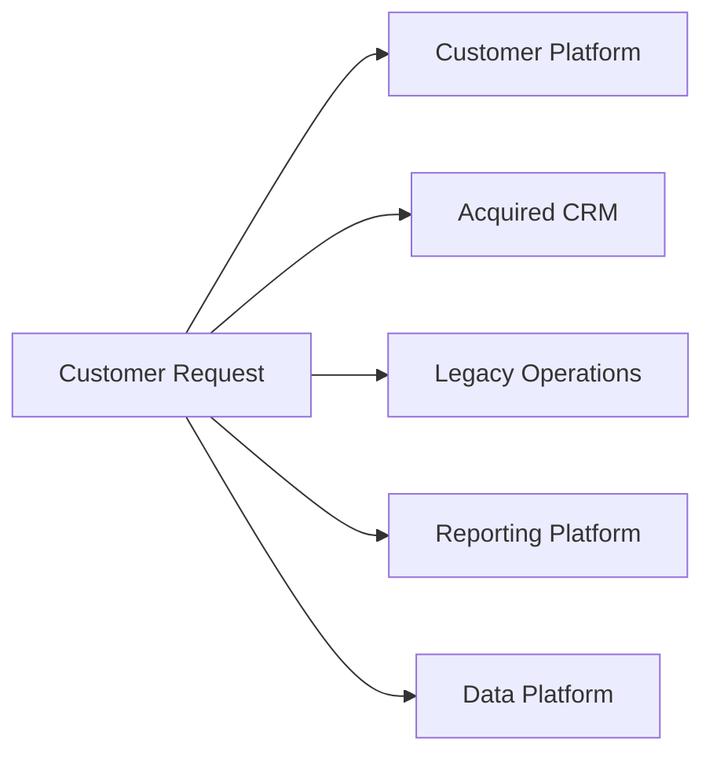

This creates several consequences:

- duplicated information;
- reconciliation activities;
- integration dependencies;
- inconsistent business rules;
- unclear ownership;
- increased change impact.

The investigation therefore focused increasingly on relationships and ownership, rather than simply application technology.

Investigation principle

Current state is treated as a diagnostic instrument.

The purpose of investigating the current architecture is to explain material business problems and establish what must change.

It is not to produce an exhaustive catalogue of every technology component.

⸻

## 9. Architectural Diagnosis

### F-01 — Fragmented Customer Information

Observation

Customer information is distributed across multiple applications.

Different systems maintain overlapping representations of:

- customer identity;
- account status;
- service relationships;
- contractual information.

Finding

The organisation lacks a consistently authoritative information model for critical customer information.

Business impact

This contributes to:

- reconciliation effort;
- inconsistent customer views;
- reporting complexity;
- increased integration requirements;
- higher change risk.

Materiality

High

⸻

### F-02 — Duplicated Business Logic

Observation

Business rules associated with customer and service operations are implemented in multiple applications.

This includes rules relating to:

- customer status;
- service eligibility;
- operational workflows;
- reporting definitions.

Finding

A change to a business rule may require coordinated changes across several systems.

Business impact

This increases:

- delivery effort;
- testing scope;
- change risk;
- probability of inconsistent behaviour.

Materiality

High

⸻

### F-03 — Increasing Integration Complexity

Observation

The application landscape contains an increasing number of interfaces connecting systems with overlapping responsibilities.

The resulting architecture can be represented conceptually as:

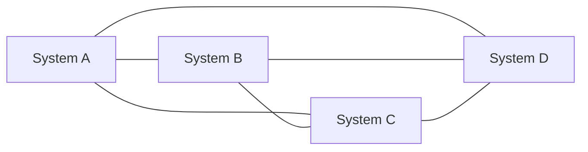

The principal concern is not simply the number of interfaces.

It is that integration is increasingly compensating for unclear architectural boundaries.

Business impact

This contributes to:

- operational fragility;
- difficult troubleshooting;
- higher change coordination;
- hidden dependencies;
- longer delivery cycles.

Materiality

High

⸻

### F-04 — Fragmented Reporting Ownership

Observation

Management information is assembled from several systems.

Different teams maintain different interpretations of:

- customer status;
- operational performance;
- service measures;
- financial or contractual information.

Finding

Reporting becomes a reconciliation mechanism rather than simply a presentation layer.

Business impact

This reduces confidence in management information and increases manual effort.

Materiality

Medium/High

⸻

### F-05 — Legacy Technology Is Not the Primary Problem

Observation

Several legacy applications are technically old.

However, replacing them alone would not resolve the underlying architectural issues.

Finding

The more fundamental problem is unclear capability, information and integration boundaries.

Business impact

A new application could reproduce the same fragmentation if introduced without resolving these architectural conditions.

This is a key architectural judgement.

The transformation should therefore not be framed as:

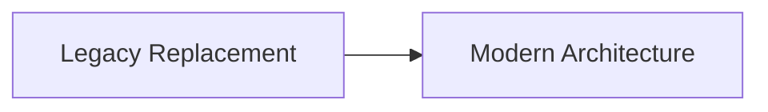

It should instead be framed as:

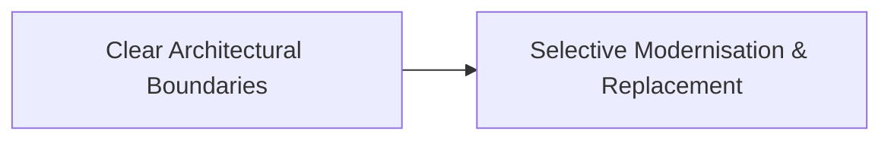

Materiality

High

⸻

## 10. Architectural Patterns & Root Causes

The findings can be grouped into a common causal chain.

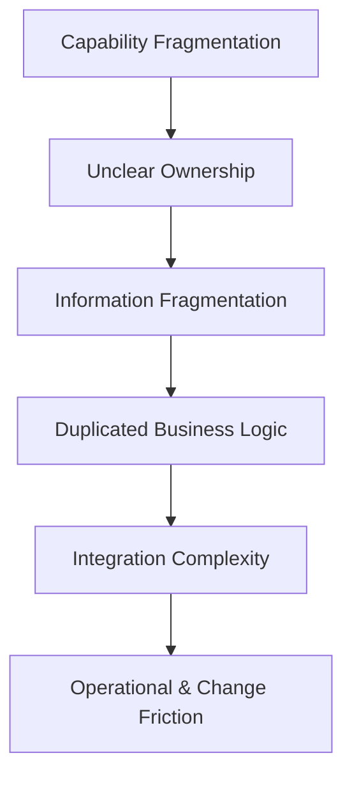

This pattern explains why several apparently separate problems repeatedly occur together.

### Root Cause 1 — Capability boundaries evolved locally

Applications were introduced to solve local business problems.

Capability boundaries therefore do not consistently correspond to current enterprise responsibilities.

### Root Cause 2 — Information ownership evolved with applications

Applications became implicit owners of information because they were the systems available when particular processes were implemented.

### Root Cause 3 — Integration compensated for architectural overlap

As responsibilities overlapped, integrations were added to exchange information and coordinate behaviour.

### Root Cause 4 — Transformation occurred incrementally without sufficient architectural convergence

Individual initiatives delivered value but did not consistently reduce duplication or establish reusable enterprise boundaries.

### Root-cause interpretation

The assessment does not claim that every local technology decision was individually incorrect.

The architectural issue is the cumulative interaction between individually reasonable changes that have not consistently converged on shared capability, information and integration boundaries.

⸻

## 11. Business Impact & Materiality

The architectural conditions have different levels of materiality.

| Issue | Business impact | Materiality |
| --- | --- | --- |
| Duplicate customer information | Inconsistent customer view | High |
| Duplicate business rules | Change risk and delivery effort | High |
| Integration complexity | Operational and delivery risk | High |
| Reporting fragmentation | Management confidence and effort | Medium/High |
| Individual legacy platforms | Cost and technical risk | Medium |
| Isolated technical debt | Local delivery friction | Medium/Low |

The assessment therefore recommends prioritising architectural causes rather than treating every technical debt item as an independent transformation priority.

Materiality principle

An architectural issue becomes a transformation priority when its effect on business outcomes, capability evolution, risk, cost, dependency or change materially justifies intervention.

Technology age alone is not sufficient evidence of materiality.

⸻

## 12. Target Architectural Direction

The target direction is based on five architectural shifts.

### 12.1 Capability Ownership

Business capabilities should have explicit ownership.

The architecture should make clear:

- which system supports each capability;
- where business rules belong;
- which capabilities are strategic;
- which capabilities are transitional;
- which capabilities are candidates for retirement.

### 12.2 Information Ownership

Critical information domains should have explicit ownership.

For example:

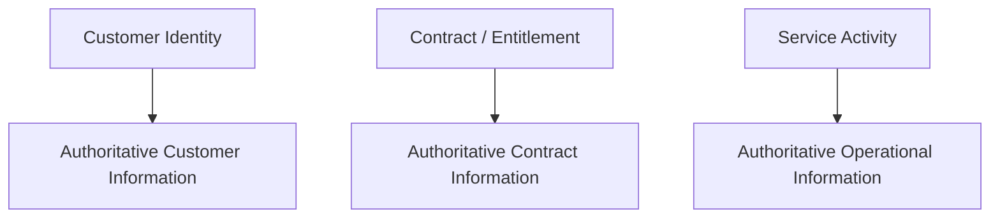

Other applications may consume this information, but should not independently redefine ownership without an explicit architectural reason.

### 12.3 Explicit Integration Boundaries

Integration should increasingly occur across deliberate architectural boundaries.

The target is not “no integration”.

The target is:

Fewer ambiguous dependencies and more intentional integration boundaries.

Where appropriate, APIs and events can provide explicit interaction contracts.

### 12.4 Strategic Platform Reuse

Existing strategic platforms should be retained where they provide a good architectural fit.

The target architecture should not introduce new platforms merely to create a visually cleaner architecture.

### 12.5 Selective Legacy Transformation

Legacy systems should be assessed capability by capability.

Possible outcomes include:

- retain;
- stabilise;
- encapsulate;
- progressively decompose;
- replace;
- retire.

The correct choice depends on business value, risk, architectural fit and transformation dependencies.

⸻

## 13. Target Architectural Structure

The target direction can be represented conceptually as:

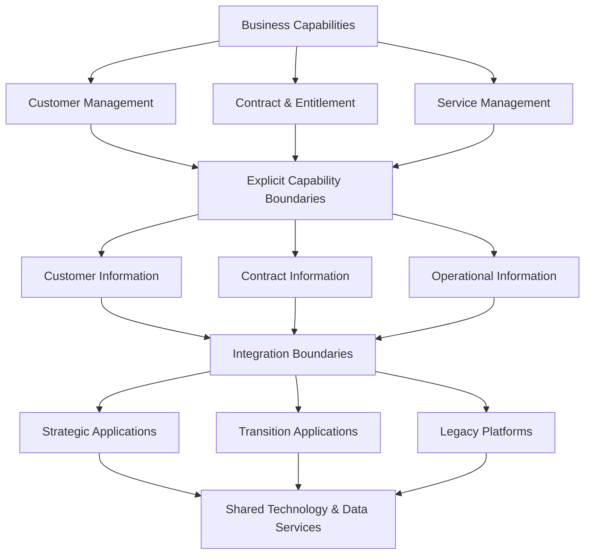

This is a target architectural direction, not a detailed solution design.

The important architectural properties are:

- explicit capability boundaries;
- explicit information ownership;
- intentional application responsibilities;
- controlled integration;
- visible transition states;
- selective rather than indiscriminate legacy transformation.

⸻

## 14. Target-State Architectural Implications

The target direction implies several architectural changes.

| Area | Current condition | Target implication |
| --- | --- | --- |
| Capability ownership | Overlapping | Explicit ownership |
| Customer information | Distributed | Defined authoritative source |
| Business rules | Duplicated | Clear responsibility |
| Integration | Increasing point-to-point | Explicit integration boundaries |
| Legacy applications | Broad responsibilities | Capability-specific treatment |
| Reporting | Reconciliation-heavy | More authoritative information |
| Architecture governance | Initiative-led | Cross-enterprise architectural assurance |

The target direction should be treated as an architectural runway rather than a single end-state implementation.

Architectural runway principle

The target architecture should provide sufficient direction to guide transformation while allowing implementation detail to evolve as evidence, technology and business needs become clearer.

⸻

## 15. Transformation Options

Three broad approaches were considered.

### Option A — Replace Major Legacy Platforms

Replace major legacy applications with new strategic platforms.

Advantages

- potentially significant simplification;
- opportunity to establish clean boundaries;
- visible transformation programme.

Risks

- high investment;
- significant business disruption;
- migration complexity;
- risk of reproducing existing business ambiguity in new technology;
- long time before benefits are realised.

⸻

### Option B — Incremental Capability & Architecture Transformation

Establish architectural boundaries and progressively transform affected capabilities.

This would involve:

- clarifying ownership;
- stabilising critical dependencies;
- establishing information ownership;
- separating selected capabilities;
- modernising or replacing systems selectively;
- retiring redundant components as dependencies are removed.

Advantages

- lower transformation risk;
- incremental business value;
- preserves existing business capability;
- allows architectural learning;
- supports progressive retirement.

Risks

- requires sustained architectural governance;
- transitional complexity remains for some time;
- benefits depend on disciplined sequencing.

⸻

### Option C — Build a New Digital Platform

Create a new platform and progressively move business capabilities onto it.

Advantages

- opportunity for strong architectural coherence;
- modern technology foundation;
- potentially simplified customer experience.

Risks

- substantial parallel architecture;
- migration complexity;
- significant investment;
- potential duplication during transition;
- risk of becoming another platform alongside existing systems.

⸻

## 16. Options & Architectural Judgement

The options are assessed against the specific business context, architectural findings and transformation constraints established in this assessment.

This is not a universal options-scoring framework.

The assessment considers:

- business continuity;
- strategic alignment;
- architectural coherence;
- transformation risk;
- dependency implications;
- investment and complexity;
- ability to establish architectural control;
- incremental value;
- ability to reduce existing complexity.

Comparative assessment

| Consideration | Option A — Major Platform Replacement | Option B — Incremental Capability Transformation | Option C — New Digital Platform |
| --- | --- | --- | --- |
| Architectural simplification potential | High | High | High |
| Transformation disruption | High | Medium | High |
| Ability to establish control early | Medium | High | Medium |
| Incremental value | Low/Medium | High | Low/Medium |
| Dependency management | Complex | Progressive | Complex |
| Investment requirement | High | Progressive | High |
| Risk of reproducing existing ambiguity | Medium/High | Lower where boundaries are established first | Medium |
| Long-term architectural flexibility | High | High | High |

The assessment is not based on the number of “High” assessments.

The architectural judgement considers the relationship between the organisation’s current problems, desired capability evolution, transformation constraints and dependency structure.

Architectural judgement

### Option B — Incremental Capability & Architecture Transformation is recommended

The recommendation is based on the balance between:

- business continuity;
- transformation risk;
- ability to establish architectural control early;
- incremental value;
- ability to learn during transition;
- preservation of valuable existing capabilities;
- eventual simplification.

The critical condition is that incremental transformation must not become incremental accumulation.

Each transformation increment should therefore contribute toward:

Clearer capability boundaries + clearer information ownership + simpler integration + reduced architectural duplication.

The architecture should be reviewed at each major transition point to confirm that local changes are still converging toward the target direction.

⸻

## 17. Finding-to-Transformation Traceability

The assessment can be traced from business need through to transformation response.

| Finding / Root Cause | Business / Capability Consequence | Architectural Response | Transformation Implication |
| --- | --- | --- | --- |
| Capability fragmentation | Inconsistent capability ownership | Establish capability boundaries | Capability ownership and boundary work |
| Fragmented information | Inconsistent customer and operational views | Establish authoritative information ownership | Information ownership and migration decisions |
| Duplicated business logic | Higher change effort and risk | Clarify application/business-rule responsibilities | Selective capability transformation |
| Integration complexity | Operational and change friction | Establish explicit integration boundaries | Integration stabilisation and redesign |
| Legacy platforms carry overlapping responsibilities | High dependency and change risk | Reduce responsibility selectively | Encapsulate, transform or replace where justified |
| Fragmented reporting | Reduced management information confidence | Improve information authority and flow | Reporting/data transformation |

The overall traceability is:

```mermaid
flowchart LR
    Intent["Strategic Intent / Outcome"]
    Capability["Relevant Business Capability"]
    Evolution["Required Capability Evolution"]
    Evidence["Evidence"]
    Observation["Observation"]
    Assessment["Assessment"]
    Finding["Finding"]
    RootCause["Pattern / Root Cause"]
    Impact["Business Impact / Risk"]
    Gap["Architectural Gap"]
    Change["Required Change"]
    Priority["Priority"]
    Roadmap["Roadmap Item"]
    Outcome["Expected Outcome"]
    Intent --> Capability
    Capability --> Evolution
    Evolution --> Evidence
    Evidence --> Observation
    Observation --> Assessment
    Assessment --> Finding
    Finding --> RootCause
    RootCause --> Impact
    Impact --> Gap
    Gap --> Change
    Change --> Priority
    Priority --> Roadmap
    Roadmap --> Outcome
```

This traceability prevents the roadmap from becoming a disconnected list of technology initiatives.

⸻

## 18. Transformation Priorities

The recommended priorities are:

### Priority 1 — Establish Architectural Control

Create explicit ownership for:

- business capabilities;
- critical information;
- major applications;
- integration dependencies.

### Priority 2 — Stabilise Critical Dependencies

Identify and address:

- fragile integrations;
- critical operational dependencies;
- unsupported or high-risk components;
- unclear recovery responsibilities.

### Priority 3 — Establish Capability & Information Boundaries

Define:

- capability ownership;
- application responsibility;
- authoritative information sources;
- integration contracts.

### Priority 4 — Selectively Transform Legacy Capabilities

Transform only those legacy responsibilities where there is a material business or architectural reason.

### Priority 5 — Retire Redundant Components

As capabilities and information move to clearer ownership, retire:

- redundant applications;
- obsolete interfaces;
- duplicate data stores;
- unnecessary reconciliation processes.

### Priority 6 — Optimise the Target Architecture

Once major structural issues are addressed:

- simplify further;
- improve operational characteristics;
- optimise cost;
- improve reuse;
- evolve the architecture in line with business strategy.

⸻

## 19. Transformation Sequence

The transformation sequence is:

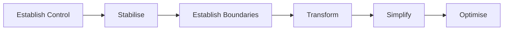

The sequence is not intended to imply that each phase must complete entirely before the next begins.

Different capabilities may progress at different rates.

The architectural principle is that each significant change should establish or reinforce the conditions required for subsequent transformation.

⸻

## 20. Transition Architectures

A direct move from the current architecture to the target architecture would create excessive transformation risk.

The architecture should therefore evolve through transition states.

### Transition 1 — Establish Control

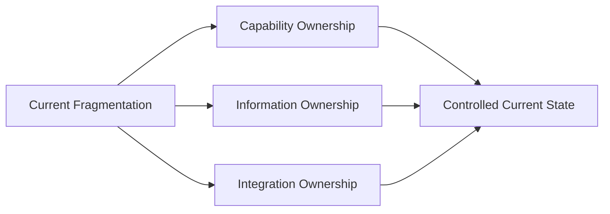

The first objective is not technology replacement.

It is establishing architectural control.

⸻

### Transition 2 — Stabilise Critical Integration

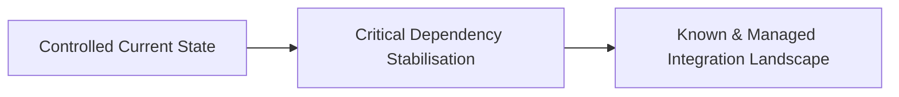

Critical integrations should have:

- identified owners;
- known dependencies;
- defined operational expectations;
- understood failure/recovery characteristics.

⸻

### Transition 3 — Establish Boundaries

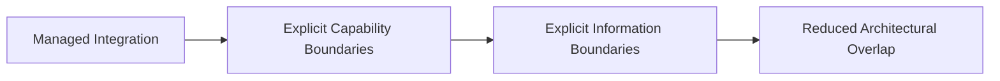

This creates the foundation for selective transformation.

⸻

### Transition 4 — Transform Selected Capabilities

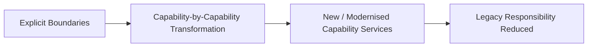

Legacy systems remain where necessary while their responsibilities are progressively reduced.

⸻

### Transition 5 — Simplify & Retire

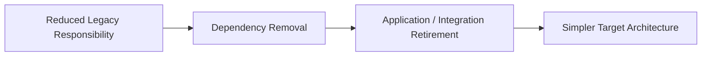

Retirement should follow dependency removal rather than precede it.

⸻

## 21. Transformation Roadmap

The roadmap is deliberately dependency-aware.

The sequence is not simply a chronological list of projects.

It represents an architectural progression.

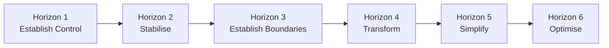

The horizons describe architectural intent rather than fixed calendar periods.

⸻

### Horizon 1 — Establish Control

Objectives

- establish capability ownership;
- establish information ownership;
- identify critical application responsibilities;
- map critical integration dependencies;
- establish architectural governance.

Key activities

- capability ownership review;
- critical information-domain identification;
- application responsibility mapping;
- integration dependency mapping;
- architecture governance baseline.

Example outcomes

- critical capabilities have named owners;
- critical information domains have identified authoritative sources;
- critical integration dependencies are known;
- major architectural responsibilities are visible.

Why first?

Later transformation decisions depend on knowing which capabilities and information responsibilities are actually being transformed.

⸻

### Horizon 2 — Stabilise

Objectives

- reduce immediate operational and architectural risk;
- stabilise fragile dependencies;
- address high-risk integration points;
- establish operational ownership.

Key activities

- critical integration remediation;
- operational dependency assessment;
- resilience improvements;
- monitoring and observability improvements;
- recovery responsibility clarification.

Example outcomes

- critical integration dependencies have named owners;
- failure and recovery characteristics are understood;
- priority operational risks have mitigation plans;
- high-risk dependencies no longer constrain transformation unexpectedly.

Dependency

This horizon depends on the visibility established in Horizon 1.

⸻

### Horizon 3 — Establish Boundaries

Objectives

- establish clearer capability boundaries;
- establish authoritative information ownership;
- reduce duplicated business responsibility;
- define strategic application responsibilities.

Key activities

- capability boundary definition;
- information ownership decisions;
- application responsibility reassessment;
- integration contract definition;
- duplication identification.

Example outcomes

- priority customer capabilities have explicit ownership;
- critical information has defined authoritative sources;
- duplicated business responsibilities are identified and prioritised;
- major integration boundaries are explicit.

Dependency

This horizon should follow sufficient stabilisation of critical dependencies.

⸻

### Horizon 4 — Transform

Objectives

- progressively separate selected capabilities;
- modernise high-value/high-risk areas;
- reduce legacy responsibility;
- introduce target-state architectural patterns where justified.

Key activities

- capability decomposition where justified;
- application modernisation;
- selective replacement;
- information migration;
- integration redesign;
- transition architecture implementation.

Example outcomes

- selected legacy capabilities have been separated from unrelated responsibilities;
- transformed capabilities operate behind clearer architectural boundaries;
- duplicated business logic has been reduced;
- critical information flows through defined ownership boundaries.

Dependency

Transformation should only begin where capability and information boundaries are sufficiently understood.

⸻

### Horizon 5 — Simplify

Objectives

- remove obsolete architecture;
- retire redundant applications;
- retire unnecessary integrations;
- eliminate duplicated information stores.

Key activities

- application retirement;
- interface retirement;
- data-store retirement;
- reconciliation-process elimination;
- dependency verification.

Example outcomes

- redundant application components have been retired;
- obsolete integrations have been removed;
- duplicate information sources have been reduced;
- operational and architectural complexity is demonstrably lower.

Dependency

Retirement depends on successful transition of the capabilities and information responsibilities previously supported by those components.

⸻

### Horizon 6 — Optimise

Objectives

- continue evolving the architecture;
- improve cost and operational efficiency;
- strengthen reuse;
- align architecture with future business strategy.

Key activities

- architecture optimisation;
- platform rationalisation;
- service reuse;
- operational improvement;
- periodic target-direction reassessment.

Example outcomes

- target architecture remains aligned with business strategy;
- redundant components continue to be identified and removed;
- architecture decisions increasingly reuse established capabilities and services;
- transformation becomes an ongoing architectural capability rather than a one-off programme.

⸻

## 22. Roadmap Dependencies

The principal architectural dependencies are:

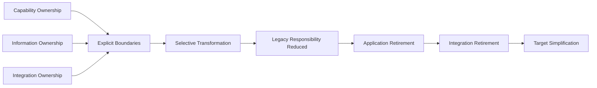

Several dependencies are particularly important.

### Dependency 1 — Ownership before transformation

The organisation should not transform an application capability without first understanding who owns the underlying business capability.

### Dependency 2 — Information ownership before migration

Information should not be migrated simply because an application is being replaced.

The target ownership of that information should be understood first.

### Dependency 3 — Boundary definition before decomposition

Legacy applications should not automatically be decomposed into technical components.

The business capability boundary should provide the architectural rationale for decomposition.

### Dependency 4 — Dependency removal before retirement

An application or integration should not be retired until the capabilities and dependencies it supports have been safely transitioned.

### Dependency 5 — Stabilisation before high-risk transformation

Where existing operational dependencies are fragile, stabilisation may be required before transformation can proceed safely.

⸻

## 23. Roadmap Prioritisation Logic

Roadmap prioritisation should consider several dimensions together.

| Dimension | Question |
| --- | --- |
| Strategic importance | Does this directly support a strategic objective? |
| Business impact | What business outcome improves? |
| Architectural risk | What risk exists if nothing changes? |
| Capability importance | How important is the affected business capability? |
| Capability evolution | How important is the required capability change? |
| Dependency | Does another transformation depend on this? |
| Complexity | How difficult is the change? |
| Technology strategy | Does the change support the intended technology direction? |
| Total cost | What is the expected investment and ongoing cost? |
| Business value | What measurable or material value is expected? |
| Timing | Is there a business, contractual or regulatory trigger? |
| Confidence | How strong is the evidence supporting the proposed change and sequence? |

These dimensions are not intended to form a universal numerical scoring model.

They provide a decision lens for comparing transformation possibilities within the specific engagement.

The sequence should not be determined by business value alone.

A high-value transformation may need to wait if a lower-level architectural prerequisite has not yet been established.

Conversely, a relatively small activity may become an early priority if it removes a dependency blocking several important changes.

This produces a roadmap that represents architectural logic, not simply project ranking.

⸻

## 24. Roadmap Confidence & Uncertainty

Roadmap confidence should reflect the strength of available evidence.

| Roadmap element | Typical confidence |
| --- | --- |
| Major architectural themes | High |
| Target architectural direction | High |
| Capability-level transformation priorities | Medium/High |
| Transition architecture | Medium |
| Detailed sequencing | Medium |
| Individual project scope | Medium/Low |
| Detailed implementation estimates | Low unless separately evidenced |

As transformation progresses, evidence should be refreshed.

New evidence may change:

- dependencies;
- implementation constraints;
- target architecture;
- transformation sequence;
- priority;
- expected outcomes.

The roadmap should therefore be treated as a living architectural decision-support mechanism.

⸻

## 25. Key Architectural Decisions

The transformation requires several explicit decisions.

| Decision | Architectural question |
| --- | --- |
| Capability ownership | Who owns each priority business capability? |
| Information ownership | Which system is authoritative for each critical information domain? |
| Application responsibility | Which applications should retain, reduce or acquire responsibility? |
| Integration boundary | Where should systems interact and through what contract? |
| Legacy treatment | Which capabilities should be retained, encapsulated, transformed or replaced? |
| Transition architecture | What intermediate state is required to move safely? |
| Retirement | What conditions must be satisfied before an application or integration is retired? |
| Governance | Who owns architectural decisions during execution? |

These decisions should be maintained as part of the transformation governance process.

⸻

## 26. Risks, Assumptions & Uncertainty

### 26.1 Key Risks

**Transformation becomes another source of complexity**
Incremental transformation can accidentally add another layer of technology.

**Mitigation:** every significant transformation increment should include an explicit simplification or boundary objective.

**Legacy systems remain indefinitely**
Incremental approaches can become permanent coexistence.

**Mitigation:** define retirement conditions and review legacy responsibility at each transition.

**Ownership decisions remain unresolved**
Architecture cannot become coherent if capability and information ownership remain ambiguous.

**Mitigation:** treat ownership as an explicit governance decision.

**Roadmap sequencing becomes project-driven**
Existing programmes may attempt to dictate architectural sequence.

**Mitigation:** maintain architecture-level dependency analysis and use it to challenge sequencing where necessary.

⸻

### 26.2 Assumptions

This assessment assumes:

- strategic business direction remains broadly stable;
- the organisation can establish capability ownership;
- critical information ownership can be agreed;
- existing strategic platforms remain viable;
- transformation can occur incrementally;
- architecture governance can influence programme decisions.

These assumptions should be validated before major investment decisions.

⸻

### 26.3 Confidence

| Area | Confidence |
| --- | --- |
| Major architectural problems | High |
| Causal relationship between findings | High |
| Target architectural direction | High |
| Transformation strategy | Medium/High |
| Detailed transition architecture | Medium |
| Detailed roadmap sequencing | Medium |
| Individual project estimates | Low |

The roadmap should therefore be treated as a decision-support mechanism, not a fixed multi-year commitment.

⸻

## 27. Governance & Execution Assurance

Architecture should remain involved throughout transformation, but should not become the day-to-day delivery owner.

Enterprise Architecture responsibilities

- maintain target architectural direction;
- govern major architectural decisions;
- validate transition architectures;
- review material changes;
- maintain architectural dependencies;
- provide strategic assurance;
- update the roadmap as evidence changes.

Solution / Delivery Architecture responsibilities

- translate architectural direction into solution designs;
- resolve delivery-level technical decisions;
- work with engineering and delivery teams;
- maintain implementation-level architecture.

Business and Programme responsibilities

- own business outcomes;
- own investment decisions;
- manage delivery;
- manage organisational change;
- own business-side dependencies.

The transformation should therefore operate as a collaboration between:

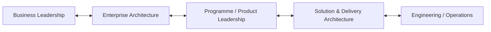

⸻

## 28. Architecture Feedback & Reassessment

Architecture should not be treated as fixed once the roadmap has been approved.

Implementation creates new evidence.

That evidence should feed back into architectural assessment and decision-making.

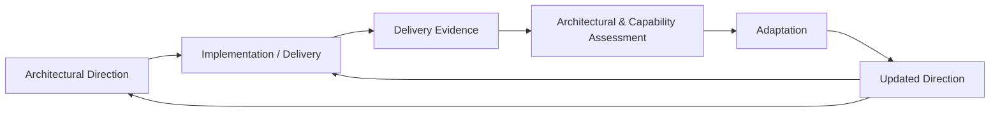

This feedback loop is particularly important where:

- transition assumptions change;
- business priorities change;
- operational constraints emerge;
- technology choices evolve;
- dependencies prove different from expected;
- organisational readiness changes.

Architecture confidence should therefore evolve with evidence rather than remain fixed at the point of assessment.

⸻

## 29. Scope Boundary & Escalation

An Architecture Assessment & Roadmap is broader than a bounded Architecture Decision Review.

The assessment establishes:

- current architectural context;
- material findings and root causes;
- target direction;
- transformation implications;
- transition architectures;
- roadmap logic.

However, the assessment should not silently absorb work that requires a fundamentally different engagement.

For example:

- detailed solution architecture;
- detailed programme planning;
- benefits management;
- detailed financial modelling;
- vendor procurement;
- organisational restructuring;
- implementation ownership.

Where evidence indicates that a specific architectural decision requires a bounded decision review, that work can be separated into an Architecture Decision Review.

Where a narrower engagement reveals the need for broader current-state, target-state or transformation analysis, the work can transition into an Architecture Assessment & Roadmap.

```mermaid
flowchart LR
    Engagement["Architectural Engagement"]
    Question{"What level of architectural work is required?"}
    Decision["Defined Architectural Decision"]
    Review["Architecture Decision Review"]
    Broad["Broader Current / Target / Transformation Question"]
    Assessment["Architecture Assessment & Roadmap"]
    Engagement --> Question
    Question --> Decision
    Decision --> Review
    Question --> Broad
    Broad --> Assessment
```

The purpose of this boundary is not to restrict useful investigation.

It is to make additional architectural work explicit rather than allowing scope to expand invisibly.

⸻

## 30. Recommended Next Steps

The recommended immediate actions are:

1. Confirm business objectives and transformation outcomes.
2. Establish named owners for priority capabilities.
3. Establish authoritative ownership for critical information domains.
4. Validate the critical integration dependency map.
5. Identify the highest-risk operational dependencies.
6. Confirm strategic application responsibilities.
7. Validate the target architectural direction with business and technology stakeholders.
8. Select one or two transformation areas where architectural boundaries can be established incrementally.
9. Define transition architecture for those areas.
10. Establish measurable success criteria for the first transformation horizon.
11. Review roadmap sequencing based on evidence gathered during the first transition.
12. Establish governance for ongoing architectural assurance.

⸻

## 31. What This Sample Demonstrates

This sample demonstrates an architecture assessment approach that moves from business problem to actionable transformation direction.

The reasoning chain is:

```mermaid
flowchart LR
    Business["Business Situation"]
    Evidence["Evidence"]
    Current["Current-State Investigation"]
    Observation["Observation"]
    Assessment["Architectural Assessment"]
    Finding["Finding"]
    RootCause["Root Cause / Pattern"]
    Impact["Business Impact"]
    Direction["Target Architectural Direction"]
    Options["Transformation Options"]
    Judgement["Architectural Judgement"]
    Transition["Transition Architectures"]
    Roadmap["Dependency-Aware Roadmap"]
    Governance["Governance & Execution"]
    Business --> Evidence
    Evidence --> Current
    Current --> Observation
    Observation --> Assessment
    Assessment --> Finding
    Finding --> RootCause
    RootCause --> Impact
    Impact --> Direction
    Direction --> Options
    Options --> Judgement
    Judgement --> Transition
    Transition --> Roadmap
    Roadmap --> Governance
```

The key architectural judgement is that the organisation does not primarily have a legacy technology problem.

It has an architectural coherence problem.

The appropriate response is therefore not to replace technology indiscriminately.

It is to:

Establish architectural ownership and boundaries, stabilise critical dependencies, transform capabilities selectively, and use each transition to progressively simplify the architecture.

That distinction is what turns an architecture assessment into a transformation roadmap rather than an inventory of technical problems.

⸻

## 32. Illustrative Limitation

This document is intentionally illustrative.

A real assessment would require substantially more evidence, stakeholder engagement, validation and iteration before specific architectural decisions or implementation commitments could be made.

The roadmap horizons, transition states and example outcomes demonstrate the type of architectural reasoning and decision support expected from the method; they should not be interpreted as generic prescriptions for every organisation.

The assessment approach is intended to be adapted to:

- the business situation;
- strategic priorities;
- affected capabilities;
- architecture scope;
- available evidence;
- transformation constraints;
- stakeholder context;
- required decision depth.

The method therefore provides architectural discipline without prescribing a universal architecture or transformation pattern.

⸻

© 2026 Alexandre Franco · Mostelli.com · All rights reserved.
