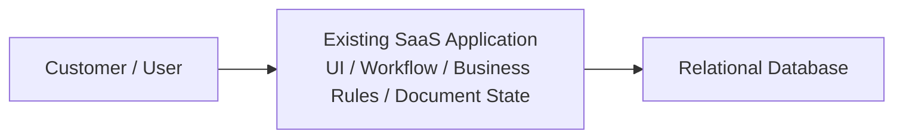
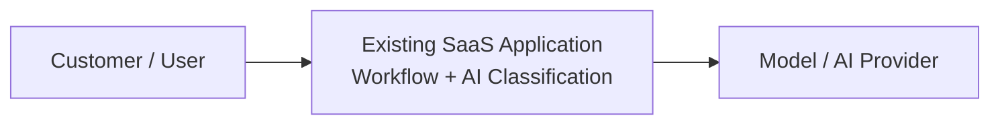
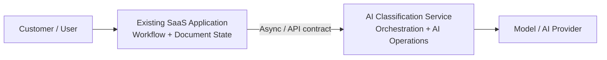
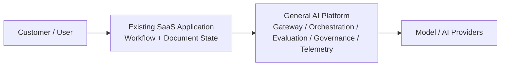
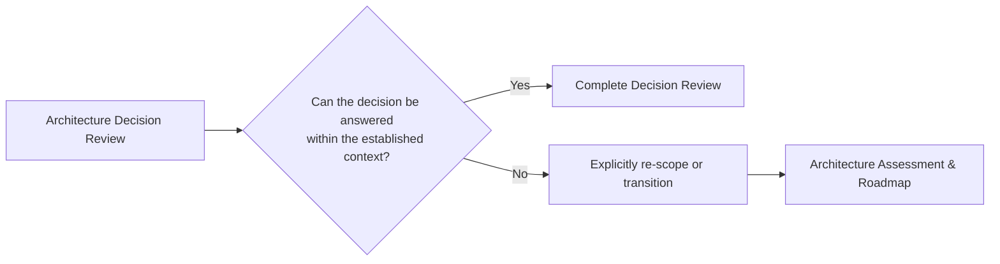

**Enterprise Architecture & AI Transformation**

---

# Illustrative Architecture Decision Review

## Fictional scenario — representative sample
>
> This document demonstrates the structure, reasoning and types of outputs provided through an Architecture Decision Review. It is not a real client engagement and contains no client-confidential information.
---

## 1. Executive Decision Summary

### Decision

Where should an AI document-classification capability be architecturally located within an existing SaaS platform?

### Decision boundary

The review is bounded to the architectural placement and boundary of the AI document-classification capability within the existing SaaS platform.
It does not determine a broader enterprise AI platform strategy or the target architecture of the SaaS platform as a whole.

### Recommendation

Introduce a **dedicated AI Classification Service** integrated with the existing SaaS platform through an explicit, preferably asynchronous, service boundary.
The existing SaaS application remains responsible for:

- document lifecycle
- workflow state
- user interaction
- business rules
- business metadata
The AI Classification Service is responsible for:
- classification orchestration
- model/provider interaction
- AI-specific evaluation
- AI-specific telemetry
- classification processing state

### Why

A dedicated service provides a better balance between:

- isolating AI workloads from the core transactional application
- supporting different scaling and failure characteristics
- allowing model and provider choices to evolve independently
- providing AI-specific operational controls
- avoiding the complexity of introducing a broader general-purpose AI platform before there is sufficient justification

### Confidence

**High confidence in the architectural direction; medium confidence in implementation detail pending validation of classification quality, workload volumes and concurrency, data/security requirements, and economics.**

### Critical condition

The boundary should remain **narrow and capability-specific**. The recommendation is not to introduce a general-purpose enterprise AI platform.

---

## 2. Decision Context & Review Boundary

### Business context

The fictional SaaS platform receives customer documents that currently require categorisation as part of an operational workflow.
The organisation wants to introduce AI-based document classification to:

- reduce manual categorisation
- improve routing through downstream workflows
- support increasing document volumes
- establish a foundation for future AI-enabled capabilities
The platform is an established cloud SaaS application with:
- a transactional application
- REST APIs
- relational persistence
- existing monitoring
- an established product and engineering team
- limited capacity for broad architectural change

### Decision under review

Where should the AI document-classification capability reside, and what architectural boundary should exist between the AI capability and the existing SaaS application?

### In scope

The review considers:

- architectural placement
- service boundaries
- integration
- isolation
- scalability
- resilience and failure behaviour
- security and data flow
- observability
- maintainability and evolution
- cost
- operational complexity
- architectural trade-offs

### Out of scope

The review does not cover:

- detailed model selection
- prompt engineering
- enterprise AI strategy
- full SaaS target architecture
- detailed implementation design
- delivery estimation
- business case development
- programme planning

---

## 3. Business & Architectural Drivers

| Driver | Architectural implication |
| --- | --- |
| Protect core product availability | AI processing should not compromise the transactional application |
| Support variable AI workloads | AI workload capacity may need to scale independently |
| Allow AI technology to evolve | Model/provider concerns should not become tightly coupled to core application logic |
| Preserve product-domain ownership | Existing application should remain authoritative for workflow and business state |
| Maintain operational control | AI-specific failures, latency, usage and quality should be observable |
| Avoid premature platformisation | Broader AI platform capabilities should only be introduced where justified |
| Minimise unnecessary complexity | Additional architectural boundaries should provide clear value |

---

## 4. Business Capability Context

The immediate business capability affected by the decision is **document processing within the operational workflow**.
The required capability evolution is to introduce AI-assisted classification while preserving the existing workflow capability and its operational ownership.

| Business capability | Context | Required capability evolution |
| --- | --- | --- |
| Document processing / classification | Existing capability supporting customer document categorisation | Introduce AI-assisted classification |
| Operational workflow management | Existing capability responsible for routing and processing documents | Consume classification results without transferring ownership of workflow state |

This capability context is intentionally lightweight. The review does not establish a complete capability model or capability maturity assessment.

---

## 5. Requirements & Non-Functional Requirements

### 5.1 Functional requirement

The capability must:

1. receive a document for classification
2. classify the document using an AI capability
3. return the classification to the existing workflow

### 5.2 Non-Functional Requirements

| ID | Requirement | Priority |
| --- | --- | --- |
| NFR-01 | **Availability:** AI processing must not make the core workflow unavailable. | High |
| NFR-02 | **Performance:** Classification must complete within an agreed target. | High |
| NFR-03 | **Scalability:** AI processing capacity should scale independently from the core application where required. | High |
| NFR-04 | **Resilience:** Temporary AI or model failure must not result in document loss or corruption of workflow state. | High |
| NFR-05 | **Security:** Documents must only be exposed to authorised AI components and providers. | High |
| NFR-06 | **Observability:** Failures, latency, usage, cost and classification outcomes must be measurable. | High |
| NFR-07 | **Maintainability:** Model or provider changes should not require major changes to the core application. | High |
| NFR-08 | **Auditability:** Classification requests and results must be traceable where required. | Medium |
| NFR-09 | **Cost efficiency:** AI processing cost must remain within an agreed unit-cost envelope. | Medium |
| NFR-10 | **Simplicity:** The architecture should avoid unjustified platform and distributed-system complexity. | High |

The requirements above are established specifically for this decision. The assessment dimensions and approach are engagement-specific and should not be interpreted as a mandatory scoring framework for every Architecture Decision Review.

---

## 6. Current Architecture & Constraints

The existing SaaS platform is the primary application platform.

### Current architecture

### Constraints

The review identified the following relevant constraints:

- the existing application is the primary platform
- broad architectural change has limited engineering capacity
- customer documents may contain sensitive information
- the initial AI capability is narrowly focused on document classification
- AI model and provider choices are expected to evolve
- the existing application has basic monitoring but requires additional AI-specific operational signals

⸻

### Option A — Extend Existing Application

Option A — Architectural approach

Implement the AI classification capability directly within the existing SaaS application.

Option A — Strengths

- lowest additional architectural complexity
- minimal additional infrastructure
- straightforward integration with existing workflow
- potentially fastest initial implementation
- lower initial operational overhead

Option A — Weaknesses

- AI workloads share resources with the core application
- AI failure or performance issues can affect the core application
- model/provider concerns become coupled to application logic
- independent scaling becomes more difficult
- AI-specific operational concerns become embedded in the existing application
- future AI capabilities may increase architectural coupling

⸻

### Option B — Dedicated AI Classification Service

Option B — Architectural approach

Introduce a dedicated service responsible for AI classification while keeping workflow and business state within the existing SaaS application.

Option B — Strengths

- isolates AI workloads from core application resources
- enables independent scaling
- creates a clear data and security boundary
- isolates model/provider concerns from core application logic
- supports dedicated AI observability and evaluation
- provides a relatively small architectural step from the existing system

Option B — Weaknesses

- introduces distributed-system complexity
- requires an explicit service contract
- introduces additional deployment and operational responsibilities
- requires deliberate handling of asynchronous failures and processing state
- adds some infrastructure and operational cost

⸻

### Option C — General AI Platform

Option C — Architectural approach

Introduce a broader AI platform intended to support multiple current and future AI capabilities.

Option C — Strengths

- provides reusable AI capabilities
- enables centralised governance
- can support multiple AI use cases
- may provide value if significant future AI adoption is already established
- can create common model/provider integration and operational capabilities

Option C — Weaknesses

- highest architectural and operational complexity
- introduces platform capabilities before they are clearly justified
- requires greater initial investment
- increases transformation overhead
- may delay value from the immediate classification capability
- risks designing for hypothetical future requirements

⸻

## 7. Options Assessment Against Requirements

The following assessment uses the requirements established for this specific decision. The dimensions and assessment approach are engagement-specific and should not be interpreted as a mandatory scoring framework for every Architecture Decision Review.

| Requirement | Option A — Existing Application | Option B — Dedicated AI Service | Option C — General AI Platform |
| --- | --- | --- | --- |
| NFR-01 Availability | Medium | High | High |
| NFR-02 Performance | Medium | High | High |
| NFR-03 Independent scalability | Low | High | High |
| NFR-04 Resilience | Medium | High | High |
| NFR-05 Security | Medium | High | High |
| NFR-06 Observability | Medium | High | High |
| NFR-07 Maintainability and evolution | Medium | High | High |
| NFR-08 Auditability | Medium | High | High |
| NFR-09 Cost efficiency | High | High | Medium |
| NFR-10 Simplicity | High | Medium | Low |

Interpretation

There is no universal winner.

Option A performs strongly on simplicity and initial cost but introduces greater coupling between AI processing and the core application.

Option C provides the greatest potential for future reuse and centralised AI capabilities but introduces substantially more complexity than the current capability appears to justify.

Option B provides the strongest overall balance between isolation, scalability, resilience, evolution and operational control while avoiding the broader complexity of a general-purpose AI platform.

The recommendation is primarily driven by NFR-01 Availability, NFR-03 Independent Scalability, NFR-04 Resilience, NFR-06 Observability, NFR-07 Maintainability/Evolution and NFR-10 Simplicity.

The decision is therefore not based on the number of “High” assessments alone. Option B is recommended because it provides an appropriate balance between isolation, resilience and independent evolution without introducing the broader platform complexity of Option C.

⸻

## 8.Material Assessment Findings

### F-01 — AI processing has different operational characteristics

Observation

AI processing may introduce variable compute requirements and latency that differ from the core transactional workload.

Finding

The architecture should establish an explicit boundary between AI processing and the core transactional application.

Impact

Without an explicit boundary, AI workload characteristics can affect core application capacity and availability.

Materiality

High

⸻

### F-02 — Model and provider technology is expected to evolve

Observation

AI model and provider choices are likely to change more frequently than core business workflow logic.

Finding

Model/provider-specific concerns should be isolated from the core application.

Impact

This reduces change propagation and allows AI technology to evolve independently.

Materiality

High

⸻

### F-03 — The initial capability is narrow

Observation

The immediate requirement is document classification rather than a broad portfolio of AI capabilities.

Finding

A general-purpose AI platform is not currently justified by the evidence available.

Impact

Avoiding premature platformisation reduces architectural complexity and transformation overhead.

Materiality

High

⸻

### F-04 — AI requires additional operational signals

Observation

Conventional application monitoring does not fully capture AI-specific concerns such as classification quality, model behaviour, token/usage cost or provider-specific failures.

Finding

The AI capability should provide dedicated observability and evaluation mechanisms.

Impact

This improves the ability to detect quality, performance and cost issues that may not be visible through conventional application monitoring.

Materiality

Medium

⸻

### F-05 — Engineering capacity is constrained

Observation

The organisation has limited capacity for broad architectural change.

Finding

The architecture should introduce only the separation that materially improves the capability.

Impact

A narrow dedicated service reduces transformation overhead compared with introducing a general AI platform.

Materiality

Medium

⸻

## 9. Finding-to-Decision Traceability

The recommendation is derived from the material findings rather than from option scoring alone.

| Finding | Evidence / Context | Consequence | Architectural response |
| --- | --- | --- | --- |
| F-01 — AI has different operational characteristics | Variable AI compute and latency | Core application resources and availability could be affected | Isolate AI processing behind a service boundary |
| F-02 — Model/provider technology will evolve | AI technology expected to change independently of workflow logic | Tight coupling increases change propagation | Separate model/provider concerns from core application |
| F-03 — Initial capability is narrow | Immediate requirement is document classification | General platform introduces complexity beyond current need | Establish a capability-specific boundary |
| F-04 — AI needs additional operational signals | AI quality, model behaviour, usage and provider failures require visibility | Conventional application monitoring is insufficient | Provide AI-specific observability and evaluation |
| F-05 — Engineering capacity is constrained | Limited capacity for broad architectural change | Large architectural intervention increases transformation overhead | Introduce the smallest boundary that addresses the material concerns |

⸻

## 10. Architectural Trade-offs

The central architectural question is:

How much separation is justified by the characteristics of the AI capability?

### Option A

Simplicity now ↔ coupling and change cost later

The existing application remains simple from an infrastructure perspective, but AI workload and technology concerns become increasingly coupled to the core system.

### Option B

Moderate distributed complexity ↔ isolation, evolution and operational control

The dedicated service introduces additional infrastructure and integration complexity but provides a clearer boundary around a capability with materially different operational characteristics.

### Option C

Upfront complexity ↔ potential future reuse

A general AI platform may provide greater future reuse, but the current evidence does not demonstrate sufficient demand to justify that investment.

Architectural conclusion

The available evidence supports the smallest boundary that adequately addresses the identified architectural concerns.

⸻

## 11. Architectural Judgement

Selected option

Option B — Dedicated AI Classification Service

The recommendation is based on the following considerations:

1. AI processing has different operational characteristics from the core transactional workload.
2. AI technology and model/provider choices are expected to evolve independently.
3. AI requires dedicated observability and evaluation capabilities.
4. The core application should remain protected from AI-specific failure and workload behaviour.
5. A narrow dedicated service provides these benefits without requiring a broader AI platform.

Important qualification

The recommendation is not to create an AI microservices platform.

Instead:

Create the smallest explicit architectural boundary that adequately isolates AI classification and allows independent evolution.

This is a narrow architectural boundary around one capability, not a commitment to a general AI platform architecture.

The boundary should remain justified by the capability’s operational characteristics and should be revisited if the scope, workload or future reuse requirements materially change.

⸻

## 12. Recommendation & Conditions

Decision recommendation

Introduce a dedicated AI Classification Service with an explicit service contract.

Where appropriate, classification should be handled asynchronously so that AI processing does not become a synchronous dependency of the core transactional workflow.

The service should provide:

- controlled data transfer
- independent scaling
- explicit failure handling
- AI-specific observability
- classification-quality evaluation
- appropriate model/provider abstraction
- traceability of classification processing

The existing SaaS application should remain authoritative for:

- workflow
- document lifecycle
- business state
- user interaction
- business rules

Conditions for proceeding

The recommendation should be validated against:

- classification quality requirements
- data and security requirements
- expected workload and peak volumes
- latency expectations
- operational ownership
- observability requirements
- model/provider characteristics
- unit economics

These conditions do not invalidate the architectural direction; they determine the implementation shape and confirm whether the proposed boundary remains appropriate.

⸻

## 13. Risks, Evidence Gaps & Next Steps

Key risks

| Risk | Implication |
| --- | --- |
| Classification quality is insufficient | Automation may create operational or customer impact |
| AI processing cost is higher than expected | Unit economics may make the capability unattractive |
| Service boundary expands beyond classification | The dedicated service could gradually become an unintended general AI platform |
| AI failure affects workflow processing | Poor failure handling could introduce operational disruption |
| Sensitive documents are exposed incorrectly | Security, privacy or regulatory consequences |

Evidence gaps

The following evidence should be established before detailed implementation:

- expected document volumes
- peak processing volumes
- classification accuracy requirements
- document sensitivity and data-handling requirements
- acceptable classification latency
- retention requirements
- model/provider choices
- expected unit cost
- resilience and recovery expectations
- operational monitoring requirements

Immediate next steps

1. Run a classification-quality evaluation against representative documents.
2. Validate data and security requirements.
3. Establish expected workload and concurrency characteristics.
4. Define the service contract and failure-handling model.
5. Validate expected economics.
6. Confirm operational ownership and observability requirements.

⸻

## 14. Scope Boundary & Escalation

An Architecture Decision Review evaluates a defined architectural decision within an established business and architectural context.

During the review, evidence may indicate that answering the decision requires broader investigation of the current architecture, business capabilities, target architecture or transformation direction.

Where this occurs, the review should not silently expand into an Architecture Assessment & Roadmap.

The additional requirement should be explicitly identified and the engagement re-scoped or transitioned as appropriate.

This boundary protects the integrity of the Decision Review while providing a clear route when the decision exposes a broader architectural requirement.

⸻

## 15. Decision Summary

| Decision area | Assessment |
| --- | --- |
| Preferred architecture | Dedicated AI Classification Service |
| Affected business capability | Document processing / classification |
| Required capability evolution | Introduce AI-assisted classification while preserving existing workflow ownership |
| Core application responsibility | Workflow, business state, document lifecycle and business rules |
| AI service responsibility | Classification orchestration, model/provider interaction, AI operations |
| Integration | Explicit service contract; asynchronous where appropriate |
| Main architectural benefit | Isolation and independent evolution |
| Main architectural cost | Additional distributed-system and operational complexity |
| General AI platform | Not justified by current evidence |
| Confidence | High direction; medium implementation detail |
| Key validation required | Quality, workload, security, economics and operational model |

Review versus ADR: This review is an independent architectural assessment of a defined decision. It is not, by itself, an Architecture Decision Record. Where appropriate, the findings, trade-offs and recommendation can be used to create or inform the client’s ADR and associated decision governance.

⸻

## 16. What this sample demonstrates

This illustrative review demonstrates how an Architecture Decision Review moves from a defined architectural question to a decision-ready recommendation.

The reasoning is deliberately traceable:

The review is therefore not simply a technology recommendation. Its purpose is to establish sufficient architectural evidence, reasoning and judgement for the client to make a decision with appropriate confidence.

The final client-facing version may use C4-style or other architecture views where they improve architectural clarity; the representation should be selected according to the decision and audience rather than treated as mandatory.

⸻

© 2026 Alexandre Franco · Mostelli.com · All rights reserved.
