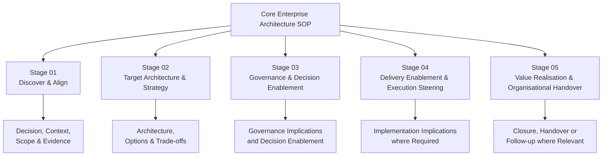
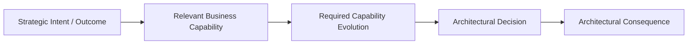
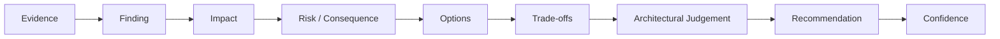
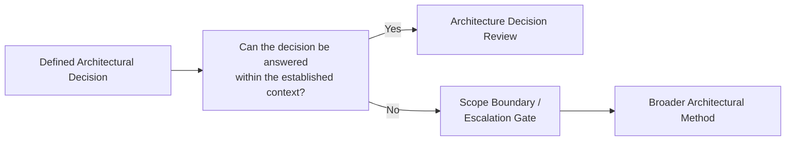
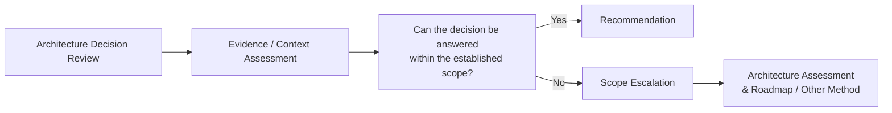
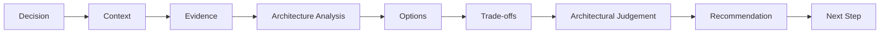

# Architecture Decision Review

> [!NOTE]
> **Classification:** `PUBLIC — Enterprise Architecture Practice Methodology`

## Purpose

The **Architecture Decision Review** is a bounded architectural method for evaluating a defined architectural or technology decision within an established business and architectural context.
Its purpose is to determine whether the proposed decision is appropriate, identify material risks and trade-offs, evaluate credible alternatives where necessary, and provide a clear architectural judgement that enables the client to make or validate the decision.
The method answers:
> **"Given the decision we need to make, the context in which it sits, and the evidence available, is this the right architectural direction?"**
The method is deliberately narrower than a full architecture assessment or transformation roadmap.
An Architecture Decision Review should **not** become a broader strategy, target-state, capability, or transformation exercise unless the evidence and decision context demonstrate that the original question cannot be answered without that additional work.
---

## Relationship to the Core EA SOP

The Architecture Decision Review is an **Engagement Method**, not a replacement for the Core Enterprise Architecture SOP.
The Core EA SOP defines the professional architectural capabilities and lifecycle. This method selects and combines the capabilities required to answer a specific architectural decision.

Not every Architecture Decision Review requires substantive activity in every SOP stage.

The method determines the required depth based on:

* decision scope;
* architectural complexity;
* evidence complexity;
* delivery implications;
* organisational context;
* material risks;
* uncertainty; and
* the consequences of the decision.

⸻

## 1. Method Principles

### 1.1 Start with the Decision

The review begins with a clearly stated architectural decision.

The architect should be able to express:

Decision: What needs to be decided?

Context: Why does the decision need to be made?

Boundary: What system, capability, architecture or change is being considered?

Decision criteria: What makes one option better or worse than another?

Where materially relevant, the decision should also be connected to:

* the strategic intent or business outcome driving the decision;
* the relevant business capability;
* the required capability evolution;
* the business or operational implication of that change.

The review does not require a complete capability model.

The relevant capability context should be established only to the extent necessary to understand and evaluate the decision.

If the decision cannot be clearly bounded, the engagement may require additional discovery before a meaningful review can begin.

⸻

### 1.2 Review Within Context

An architecture decision cannot be assessed meaningfully in isolation.

The review should establish enough context to understand:

* business objectives;
* strategic priorities;
* relevant capabilities;
* required capability evolution where relevant;
* existing architecture;
* technology constraints;
* organisational constraints;
* security and compliance considerations;
* operational requirements;
* delivery constraints;
* strategic direction; and
* known dependencies.

The required depth of contextual analysis is proportional to the decision.

The review should not create a broader enterprise assessment merely because additional architectural context exists.

⸻

### 1.3 Evidence Before Judgement

Architectural recommendations should be traceable to evidence, explicit assumptions, or clearly identified professional judgement.

The architect should distinguish between:

* Evidence — information supported by supplied or independently validated material;
* Assumption — information treated as true for the purpose of analysis but not yet verified;
* Inference — a conclusion derived from available evidence;
* Judgement — professional architectural interpretation;
* Recommendation — the resulting architectural position.

Missing information should not automatically be treated as a material evidence gap.

A gap is material when resolving it could reasonably change the assessment, option evaluation, risk position, or recommendation.

⸻

### 1.4 Scope Is Explicit

The review must maintain a clear boundary around the decision.

The architect should explicitly distinguish between:

* what is being evaluated;
* what is being assumed;
* what is outside the review;
* what requires further investigation; and
* what would constitute scope escalation.

Scope discipline protects the quality of the architectural judgement and prevents a bounded decision review from silently becoming a broader transformation engagement.

⸻

1.5 Options Before Commitment

Where the decision materially depends on architectural alternatives, credible options should be identified before committing to a preferred solution.

Options do not need to be exhaustive.

The objective is to expose the meaningful architectural choices and their consequences.

The absence of a credible alternative should itself be explainable where the proposed direction is effectively constrained by established context.

⸻

1.6 Evaluate Trade-offs Contextually

There is no universally superior architectural pattern.

Evaluation should consider the context-specific balance between factors such as:

* business fit;
* capability fit;
* functional suitability;
* architectural fit;
* complexity;
* scalability;
* resilience;
* security;
* compliance;
* operability;
* maintainability;
* delivery feasibility;
* organisational capability;
* vendor dependency;
* cost;
* time;
* reversibility; and
* strategic alignment.

The assessment should avoid mechanical scoring where qualitative judgement provides a more meaningful result.

Quantitative scoring may be used where it improves transparency or comparability, but it is not mandatory.

⸻

1.7 Simplicity First

The preferred option should be the simplest architecture that adequately satisfies the established requirements and constraints.

Complexity should be introduced only where it provides sufficient architectural, business, operational, or strategic value.

This applies particularly to:

* microservices;
* distributed systems;
* event-driven architectures;
* additional infrastructure layers;
* AI systems;
* agentic architectures; and
* abstraction layers.

⸻

1.8 AI Is an Architectural Choice

AI or agentic technology should be evaluated as an architectural option where the problem and requirements justify it.

The review should consider whether AI provides meaningful value relative to deterministic or conventional alternatives.

Where AI is relevant, the review may consider:

* model capability;
* probabilistic behaviour;
* context and data requirements;
* evaluation;
* observability;
* human oversight;
* security;
* privacy;
* model/provider dependency;
* cost;
* latency;
* failure modes;
* operational complexity; and
* governance requirements.

AI should not be introduced merely because it is technically possible.

⸻

1.9 Decoupling Must Have a Reason

Provider-agnostic abstractions, interfaces and integration boundaries should be introduced where they provide meaningful value.

Potential drivers include:

* material vendor dependency;
* expected provider substitution;
* strategic flexibility;
* contractual risk;
* technology lifecycle;
* interoperability;
* independent evolution of architectural components.

Abstraction should not be treated as an automatic architectural requirement.

⸻

1.10 Human Judgement Remains Accountable

AI and automation may accelerate evidence processing and analytical preparation, but architectural judgement remains the responsibility of the architect.

AI may assist with:

* document ingestion;
* information extraction;
* cross-document comparison;
* evidence organisation;
* gap identification;
* framework mapping;
* candidate finding generation;
* initial option generation;
* report drafting; and
* consistency checking.

The architect remains accountable for:

* context interpretation;
* materiality;
* trade-off assessment;
* risk interpretation;
* recommendation;
* architectural judgement; and
* communication of the decision.

⸻

1.11 Traceability Is Mandatory

Material recommendations should be traceable through the reasoning chain:

This does not require every observation to appear in the final deliverable.

It ensures that material conclusions can be challenged and explained.

⸻

## 2. Entry Conditions

An Architecture Decision Review is appropriate when:

* there is a defined architectural or technology decision;
* the decision has a reasonably identifiable boundary;
* sufficient context can be established;
* relevant evidence exists or can reasonably be obtained;
* the decision can be evaluated without first creating an entirely new enterprise strategy;
* the client requires architectural judgement rather than simply factual research; and
* the expected outcome is a decision, recommendation, validation, or clearly defined next step.

Typical examples include:

* selecting between architectural approaches;
* assessing a proposed solution architecture;
* evaluating build vs buy vs extend;
* evaluating an AI architecture;
* assessing vendor/platform suitability;
* reviewing an integration approach;
* evaluating whether a proposed architecture satisfies requirements;
* challenging an existing architecture decision; or
* validating a significant design proposal.

⸻

## 3. Scope Boundary

The Architecture Decision Review is bounded by a single named decision or tightly coupled decision set.

The review may include supporting architectural questions where those questions are necessary to answer the primary decision.

It should not silently expand into:

* enterprise strategy definition;
* comprehensive capability modelling;
* enterprise-wide current-state assessment;
* enterprise-wide target architecture;
* transformation portfolio definition;
* comprehensive roadmap development;
* organisational operating-model redesign.

Where such work becomes necessary, the engagement should pass through a Scope Boundary / Escalation Gate.

⸻

## 4. Scope Boundary / Escalation Gate

The architect should ask:

Can the stated decision be answered credibly within the established context and boundary?

If yes, continue with the Architecture Decision Review.

If no, determine whether the missing work is:

1. a normal evidence gap that can be resolved within the review; or
2. a material scope expansion requiring a different engagement method.

Scope Escalation Indicators

Escalation should be considered when answering the decision requires:

* establishing or materially redefining business strategy;
* defining new business capabilities;
* creating a broad current-state baseline;
* establishing a target enterprise or domain state;
* developing a transformation roadmap;
* evaluating a portfolio of unrelated decisions;
* resolving substantial organisational or operating-model questions; or
* creating architectural direction that does not already exist.

In such circumstances, the appropriate method may be Architecture Assessment & Roadmap or another broader engagement method.

⸻

## 5. Workflow

```mermaid
flowchart LR
    S0["0. Decision & Context"]
    S1["1. Evidence Assimilation"]
    S2["2. Evidence Sufficiency Gate"]
    S3["3. Assessment Design"]
    S4["4. Architecture Analysis"]
    S5["5. Options & Trade-offs"]
    S6["6. Architectural Judgement"]
    S7["7. Decision-ready Deliverable"]
    S8["8. Quality Assurance"]
    S0 --> S1
    S1 --> S2
    S2 --> S3
    S3 --> S4
    S4 --> S5
    S5 --> S6
    S6 --> S7
    S7 --> S8
    S2 -. "Additional evidence" .-> S1
    S4 -. "New evidence / concern" .-> S2
    S5 -. "New analysis required" .-> S4
    S8 -. "Material issue identified" .-> S4
```

The workflow is iterative where necessary.

New evidence may require the architect to revisit:

* assessment criteria;
* architecture analysis;
* options;
* risks; or
* the recommendation.

⸻

### Step 0 — Decision & Context

Objective

Establish exactly what decision is being reviewed and the context required to interpret it.

Activities

Define:

* decision statement;
* decision owner;
* business trigger;
* desired outcome;
* architectural boundary;
* relevant systems and capabilities;
* relevant capability evolution where established;
* stakeholders;
* known constraints;
* decision criteria;
* timing considerations;
* dependencies;
* assumptions;
* known alternatives.

Key Questions

* What decision must be made?
* Why must it be made now?
* What happens if no decision is made?
* Who owns the decision?
* What architecture or systems are affected?
* Which business capability or capabilities are materially affected?
* What capability change is required, if known?
* What constraints are already established?
* What does success look like?
* What is explicitly outside the review?

Output

Decision & Context Statement

⸻

### Step 1 — Evidence Assimilation

Objective

Establish the evidence base required to perform the review.

Potential Evidence

Depending on the decision, this may include:

* architecture diagrams;
* solution proposals;
* technical specifications;
* requirements;
* business cases;
* vendor proposals;
* security documentation;
* data models;
* integration specifications;
* operational information;
* existing ADRs;
* standards;
* policies;
* service-level requirements;
* cost information;
* delivery constraints;
* existing architecture repositories;
* stakeholder interviews or clarification sessions.

Evidence Classification

Evidence should be classified where useful as:

| Classification | Meaning                                                   |
| -------------- | --------------------------------------------------------- |
| Verified       | Directly supported by authoritative evidence              |
| Provided       | Supplied by stakeholders but not independently validated  |
| Assumed        | Required assumption for analysis                          |
| Inferred       | Derived from available evidence                           |
| Unknown        | Information unavailable or unresolved                     |

Output

Evidence Base and Assumptions

⸻

### Step 2 — Evidence Sufficiency Gate

Before substantive architectural judgement, determine whether the evidence is sufficient.

The question is not:

“Do we have all possible information?”

It is:

“Do we have enough reliable information to make a defensible architectural judgement?”

Assess:

* evidence completeness;
* evidence quality;
* conflicting information;
* material unknowns;
* assumptions;
* decision sensitivity to missing information.

Gate Outcomes

Sufficient

Proceed to assessment.

Sufficient with Assumptions

Proceed while explicitly recording material assumptions.

Insufficient — Resolvable Within Scope

Obtain additional evidence.

Insufficient — Requires Broader Work

Trigger scope escalation.

The Evidence Sufficiency Gate therefore also protects against accidental expansion of a bounded Decision Review.

⸻

### Step 3 — Assessment Design

Objective

Define how the decision will be evaluated.

Assessment lenses should be selected according to the decision rather than applied mechanically.

Potential Lenses

Business Fit

* alignment with desired outcomes;
* capability support;
* business constraints;
* strategic alignment.

Functional Fit

* requirements coverage;
* user needs;
* workflow suitability;
* functional completeness.

Architecture

* architectural coherence;
* boundaries;
* coupling;
* dependencies;
* scalability;
* resilience;
* extensibility.

Data

* data ownership;
* data quality;
* data flows;
* data lifecycle;
* privacy;
* accessibility.

Integration

* interfaces;
* APIs;
* events;
* interoperability;
* dependency management.

Security & Compliance

* security architecture;
* identity;
* access control;
* data protection;
* regulatory obligations;
* auditability.

Operational

* reliability;
* observability;
* supportability;
* maintainability;
* disaster recovery;
* operational ownership.

Delivery

* implementation complexity;
* organisational capability;
* dependencies;
* delivery risk;
* sequencing.

Technology & Vendor

* technology maturity;
* vendor capability;
* lock-in;
* licensing;
* ecosystem;
* lifecycle.

AI / Agentic

Where relevant:

* model capability;
* context;
* evaluation;
* guardrails;
* observability;
* human oversight;
* failure modes;
* model/provider dependency;
* cost and latency.

The architect should select only the lenses that materially contribute to the decision.

No universal assessment framework is required.

Output

Assessment Framework

⸻

### Step 4 — Architecture Analysis

Objective

Assess the proposed or candidate architecture against the established decision criteria.

Activities

Activities may include:

* architecture review;
* current-state context assessment;
* target-state assessment;
* dependency analysis;
* interface analysis;
* data-flow analysis;
* security analysis;
* operational analysis;
* technology assessment;
* AI/agentic architecture assessment;
* identification of architectural risks;
* identification of architectural gaps.

Architecture models should be used where they improve understanding.

Potential models include:

* system context;
* container;
* component;
* deployment;
* integration;
* data-flow;
* capability;
* domain;
* sequence;
* process.

C4 modelling is available as a communication technique but is not mandatory for every review.

The appropriate level of visualisation depends on the architectural question and the audience.

Output

Architecture Assessment Findings

⸻

### Step 5 — Options & Trade-offs

Objective

Identify and evaluate meaningful architectural alternatives.

Options may include:

* proposed architecture;
* alternative architecture;
* build;
* buy;
* extend;
* replace;
* integrate;
* defer;
* hybrid approaches.

The review should avoid creating artificial alternatives solely to satisfy a template.

For each meaningful option consider:

| Dimension       | Considerations                                |
| --------------- | --------------------------------------------- |
| Business fit    | Alignment with desired outcome                |
| Capability fit  | Support for required capability evolution     |
| Architecture    | Coherence, boundaries, dependencies           |
| Technology      | Suitability and maturity                      |
| Delivery        | Complexity and feasibility                    |
| Operations      | Supportability and resilience                 |
| Security        | Risk and control requirements                 |
| Cost            | Relative investment and operating cost        |
| Vendor          | Dependency and lock-in                        |
| Strategic fit   | Alignment with future direction               |
| Reversibility   | Ability to change direction later             |
| Risk            | Material failure modes                        |

The output should expose the important trade-offs rather than simply produce a numerical score.

Output

Options & Trade-offs Matrix

⸻

### Step 6 — Architectural Judgement

Objective

Translate the evidence and analysis into professional architectural judgement.

The architect should determine:

* preferred option;
* rationale;
* material trade-offs;
* conditions for success;
* material risks;
* unresolved uncertainties;
* confidence level;
* required mitigations;
* decision implications.

The recommendation should explicitly distinguish:

What the evidence shows

from:

What the architect concludes from the evidence.

Recommendation Confidence

Confidence may be expressed qualitatively, for example:

* High;
* Medium;
* Low.

Confidence should reflect:

* quality of available evidence;
* completeness of relevant evidence;
* degree of uncertainty;
* sensitivity of the recommendation to unresolved assumptions.

Confidence is not a numerical assessment of the architect.

It communicates the degree to which the recommendation is supported by the available evidence.

Output

Architectural Recommendation

⸻

### Step 7 — Decision-ready Deliverable

The final deliverable should be proportionate to the decision.

A typical structure is:

1. Executive Summary
2. Decision & Context
3. Review Boundary
4. Evidence & Assumptions
5. Architecture Overview
6. Assessment Findings
7. Options & Trade-offs
8. Risks & Constraints
9. Architectural Recommendation
10. Decision / Next Steps
11. Supporting Visuals and Artefacts

Not every review requires every section.

The deliverable should optimise for decision usefulness, not document volume.

⸻

### Step 8 — Quality Assurance

Before delivery, perform an independent challenge of the reasoning.

Scope

* Is the review answering the stated decision?
* Has scope expanded unintentionally?
* Has the decision remained bounded?

Evidence

* Are material claims traceable?
* Are assumptions explicit?
* Are material unknowns identified?
* Is the evidence sufficient for the recommendation?

Analysis

* Are the assessment lenses appropriate?
* Are relevant alternatives considered?
* Are trade-offs fairly represented?
* Are material dependencies understood?

Recommendation

* Does the recommendation follow from the evidence?
* Are important risks disclosed?
* Is confidence appropriate?
* Are conditions and mitigations clear?

Architecture

* Are boundaries coherent?
* Are dependencies understood?
* Are operational implications considered?
* Are security/compliance implications addressed where relevant?
* Is the architecture proportionate to the requirements?

Communication

* Can an executive understand the decision?
* Can an architect challenge the reasoning?
* Are visuals used where they improve clarity?
* Is the document proportionate to the decision?

⸻

## 9. Deliverable Selection

Deliverables should be selected according to the decision and engagement scope.

Potential artefacts include:

| Artefact                     | When Useful                                                    |
| ---------------------------- | -------------------------------------------------------------- |
| Decision & Context Statement | Almost always                                                  |
| Evidence Register            | Where evidence volume or complexity warrants it                |
| Architecture Overview        | Where architecture needs explanation                           |
| C4 Context Model             | Where system boundaries need clarification                     |
| C4 Container Model           | Where application or integration structure matters             |
| Assessment Matrix            | Where multiple criteria or options require comparison          |
| Options Matrix               | Where alternatives materially affect the decision              |
| Risk Register                | Where material risks need structured tracking                  |
| ADR                          | Where the decision should become part of governance records    |
| Recommendation Brief         | For executive decision-making                                  |
| Technical Appendix           | Where detailed evidence or analysis supports the decision      |

The presence of an artefact in this table does not make it mandatory.

⸻

## 10. Complexity Calibration

Architecture Decision Review effort should be calibrated using the complexity of the work rather than document length alone.

Three primary dimensions are:

### 10.1 Decision Complexity

Consider:

* number of meaningful architectural choices;
* number of interacting concerns;
* architectural interdependencies;
* ambiguity;
* reversibility;
* degree of architectural novelty.

### 10.2 Evidence Complexity

Consider:

* number of sources;
* volume of material;
* document heterogeneity;
* conflicting evidence;
* quality of existing architecture information;
* amount of evidence synthesis required.

### 10.3 Delivery Complexity

Consider:

* implementation dependencies;
* organisational readiness;
* integration complexity;
* operational implications;
* migration implications;
* delivery constraints.

Decision criticality is not itself a sizing dimension.

A highly critical decision may require greater rigour, validation, stakeholder engagement, or QA without necessarily requiring broader scope.

⸻

## 11. AI-Assisted Delivery

Where appropriate, AI may form part of the architect’s internal delivery system.

A typical workflow may include:

AI-generated outputs must remain subject to architectural review.

AI should accelerate:

* evidence processing;
* synthesis;
* comparison;
* consistency checking;
* drafting.

It should not replace:

* contextual interpretation;
* materiality judgement;
* trade-off evaluation;
* architectural accountability.

The use of AI is therefore an implementation choice within the architectural method, not a prerequisite for performing the method.

⸻

## 12. Engagement-specific Tailoring

The Architecture Decision Review method can be instantiated through different engagement definitions and delivery channels.

Examples include:

* Focused Decision Review;
* Standard Decision Review;
* Complex Decision Review;
* direct client advisory;
* workshop-based review;
* fixed-scope project;
* ongoing advisory engagement;
* platform-mediated engagement such as Upwork.

These are delivery and commercial definitions, not alternative architectural methods.

The underlying architectural workflow remains consistent.

⸻

## 13. Scope Expansion and Method Transition

An Architecture Decision Review may identify that the original question cannot be answered within its established boundary.

This is not necessarily a failure of the review.

It may indicate that the organisation needs broader architectural work.

Typical transition:

The architect should clearly identify:

* what has been established;
* what remains unresolved;
* why the existing scope is insufficient;
* what additional work is required;
* which method is better suited to that work.

A scope escalation should therefore create a clear transition rather than an uncontrolled expansion of the existing engagement.

⸻

## 14. Reusable Assets

The method may use or generate reusable assets including:

* Decision & Context template;
* Evidence Register;
* Evidence Sufficiency Checklist;
* Assessment Lens Library;
* Architecture Review Checklist;
* Options & Trade-offs Matrix;
* Risk Assessment template;
* Recommendation template;
* Confidence Assessment;
* Decision-ready Report template;
* Architecture Diagram templates;
* ADR template;
* QA / Challenge Checklist.

Reusable assets should support the method without making the method dependent on a specific tool or template.

⸻

## 15. Governance & Quality Gates

The following gates should be applied proportionately.

Gate 1 — Decision Boundary

A clearly defined decision exists.

Gate 2 — Evidence Sufficiency

There is sufficient evidence for defensible analysis.

Gate 3 — Scope

The review remains within its agreed architectural boundary.

Gate 4 — Assessment Relevance

The assessment lenses are appropriate to the decision.

Gate 5 — Options

Meaningful alternatives have been considered where relevant.

Gate 6 — Traceability

Material findings and recommendations can be traced to evidence and reasoning.

Gate 7 — Architectural Judgement

The recommendation reflects explicit professional judgement.

Gate 8 — Quality Assurance

The deliverable has been challenged for scope, evidence, reasoning and communication.

The gates are not intended to create unnecessary ceremony.

They provide a proportionate control structure around architectural judgement.

⸻

## 16. Method Outputs

Depending on scope, the Architecture Decision Review may produce:

* defined decision statement;
* decision context;
* review boundary;
* evidence register;
* assumptions and uncertainties;
* architecture assessment;
* architecture models;
* findings;
* options;
* trade-offs;
* risks;
* recommendation;
* confidence assessment;
* decision record;
* implementation implications;
* follow-up recommendations.

The final output should be decision-ready, not necessarily comprehensive.

⸻

## 17. Relationship to Other Engagement Methods

Architecture Decision Review is one method within the broader Enterprise Architecture practice.

| Method                            | Primary Question                                                        |
| --------------------------------- | ----------------------------------------------------------------------- |
| Architecture Decision Review      | Are we making the right architectural decision?                         |
| Architecture Health Check         | How healthy is our existing architecture?                               |
| Architecture Assessment & Roadmap | Where are we, where should we go, and how do we get there?              |
| Target Architecture Blueprint     | What should the target architecture look like?                          |
| Governance & Operating Model      | How should architectural decisions be governed and owned?               |
| Delivery Steering                 | How do we enable and assure execution of the architecture?              |

Methods may interact or transition into one another, but they should not be artificially merged into a single product.

In particular:

Architecture Decision Review evaluates a defined decision within an established context.

Architecture Assessment & Roadmap establishes or assesses broader context, current state, target direction and transition.

Where a Decision Review cannot answer its question without materially creating that broader context, the engagement should escalate rather than silently expand.

⸻

## 18. Method Success Criteria

An Architecture Decision Review is successful when the client has:

1. a clearly articulated decision;
2. an appropriate architectural boundary;
3. sufficient evidence to support judgement;
4. a clear understanding of the relevant architectural alternatives;
5. explicit trade-offs;
6. material risks and uncertainties identified;
7. a defensible architectural recommendation;
8. an appropriate confidence level; and
9. clear next steps for the decision owner.

The objective is not to produce the largest or most technically detailed architecture document.

The objective is to improve the quality, clarity and defensibility of an important architectural decision.

⸻

## 19. Method Governance

This method is governed by the Core Enterprise Architecture SOP.

Changes to the method should be evaluated through the Methodology Improvement Log.

A change should normally be incorporated into the Core SOP only when it represents a general principle of the architectural practice rather than a characteristic of this particular method, engagement definition, or delivery channel.

The method should evolve through evidence from real engagements, client feedback, architectural practice and lessons learned.

⸻

## 20. Summary

The Architecture Decision Review provides a disciplined way to move from a defined architectural decision to a defensible recommendation without unnecessarily expanding the engagement.

Its core logic is:

The method is deliberately bounded, evidence-led and context-driven.

Its purpose is not to remove uncertainty or produce certainty where none exists.

Its purpose is to make the decision, evidence, alternatives, trade-offs, risks and architectural judgement sufficiently clear that the organisation can make a better-informed architectural decision.

⸻

© 2026 Alexandre Franco. Ideas-to-Life. All rights reserved. Proprietary methodology and architecture specification.
