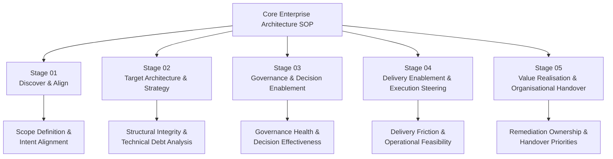
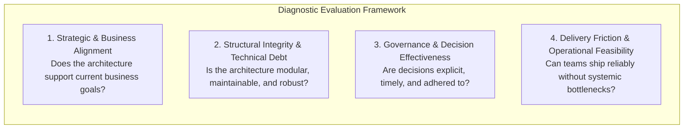

# Architecture Health Check

> [!IMPORTANT]
> **Classification Level**: `RESTRICTED / HIGHLY CONFIDENTIAL` — Alexandre Franco Enterprise Architecture Portfolio.

## Purpose

The **Architecture Health Check** is a targeted diagnostic method for rapidly evaluating the vitality, stability, risk posture, and strategic alignment of an organisation's current architecture and engineering practice.

Where a full **Architecture Assessment & Roadmap** produces a comprehensive target state and multi-year transformation path, the Architecture Health Check is designed to provide immediate clarity on architectural friction, systemic risks, and near-term remediation priorities.

The method answers:
> **"What is the current health of our architecture, where are the critical risks and delivery bottlenecks, and what targeted interventions are required immediately to safeguard delivery and long-term sustainability?"**

---

## Relationship to the Core EA SOP

The Architecture Health Check is an **Engagement Method** derived from the Core Enterprise Architecture SOP. It draws selectively upon foundational capabilities across all five stages of the practice lifecycle:

---

## The Four Diagnostic Dimensions

The health check assesses an organisation across four balanced dimensions:

### 1. Strategic & Business Alignment
- **Intent Traceability**: Are technical investments and system boundaries directly traceable to current business goals?
- **Capability Coverage**: Are critical business capabilities supported by modern, appropriately sized platforms?
- **Investment Balance**: Is effort disproportionately allocated to sustaining brittle legacy rather than differentiating capabilities?

### 2. Structural Integrity & Technical Debt
- **Component Coupling & Boundaries**: Are domain and application boundaries well-defined, or has tight coupling created fragile dependencies?
- **Technical Debt Burden**: What is the volume and severity of unmanaged technical debt across critical applications?
- **Non-Functional Attributes**: How well does the architecture satisfy security, resilience, scalability, and maintainability requirements?

### 3. Governance & Decision Effectiveness
- **Decision Traceability**: Are material decisions captured and communicated (e.g., via Architectural Decision Records)?
- **Friction vs. Guardrails**: Does governance operate as an enabling guardrail or a bureaucratic bottleneck?
- **Standardisation & Patterns**: Are shared architectural patterns applied consistently across teams?

### 4. Delivery Friction & Operational Feasibility
- **Engineering Velocity**: How much friction do teams experience when modifying or deploying shared architectural components?
- **Observability & Operability**: Can system health, failures, and performance anomalies be detected and resolved rapidly?
- **Team Cognitive Load**: Is the operational complexity manageable by existing engineering capacity?

---

## Method Lifecycle

The Architecture Health Check executes across four structured phases:

### Phase 1: Scoping & Setup
- Agree the boundary, target systems, and critical business contexts to assess.
- Identify key stakeholders across engineering, product, operations, and enterprise architecture.
- Define evaluation criteria and tailoring rules.

### Phase 2: Evidence Reconnaissance
- Review available architecture artefacts, repository structures, system diagrams, and ADRs.
- Conduct structured interviews with technical leads, product managers, and engineering teams.
- Gather telemetry, incident logs, and deployment frequency indicators.

### Phase 3: Diagnostic Scoring & Risk Synthesis
- Score each of the 4 dimensions against a standardised maturity and health baseline.
- Identify critical risks, architectural anti-patterns, and points of acute vulnerability.
- Synthesise findings into root-cause themes rather than superficial symptom lists.

### Phase 4: Action Plan & Handover
- Develop a pragmatic 30-60-90 day remediation roadmap.
- Establish immediate guardrails and mitigation strategies for high-priority risks.
- Present findings to leadership and hand over actionable recommendations to engineering teams.

---

## Diagnostic Deliverables

A standard Architecture Health Check produces:

1. **Architecture Health Scorecard**: A multi-dimensional assessment matrix highlighting strengths, amber warnings, and red flags.
2. **Critical Findings & Risk Register**: Ranked vulnerabilities categorised by business impact, technical severity, and likelihood.
3. **30-60-90 Day Remediation Plan**: High-leverage, sequenced interventions designed to eliminate delivery friction and stabilise the architecture.

---

*© 2026 Alexandre Franco. Ideas-to-Life. All rights reserved.*
