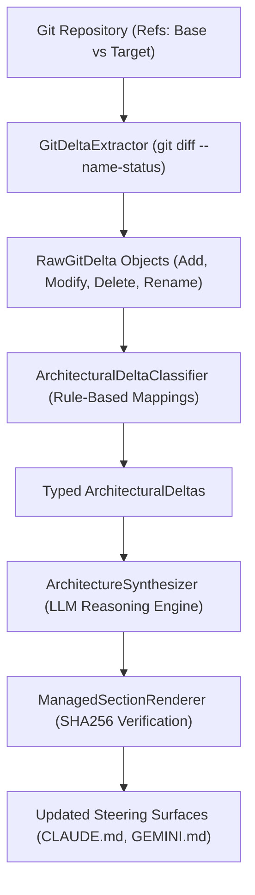

# Decoupling Git Diff Parsing for Verifiable Architecture Evaluation

As software engineering organizations integrate autonomous AI agents into code delivery pipelines, evaluating architectural change becomes a primary operational challenge. Automated agents frequently alter system boundaries, introduce dependencies, or update configuration files across multiple commits. To maintain system integrity, automated governance platforms must continuously evaluate code deltas against defined architectural rules.

However, attempting to evaluate repository changes by feeding unparsed diffs directly into large language models (LLMs) creates systemic vulnerabilities. LLMs are probabilistic engines. When tasked with reading raw unified diffs or scanning full file trees, they risk hallucinating file additions, misinterpreting file rename events, or running into strict context window limits.

The solution lies in architectural separation. Decoupling deterministic git diff parsing from downstream semantic AI analysis enables continuous, verifiable architecture evaluation without relying on LLMs for basic state extraction. By establishing a three-stage pipeline—Extraction, Classification, and Analysis—governance systems establish auditable ground truth before invoking probabilistic reasoning.

<!-- more -->

## The Challenge: Evaluating Deltas in AI Native Workflows

Integrating LLMs into automated governance tooling creates a trade-off between semantic flexibility and structural determinism. Software architects need semantic reasoning to interpret *why* a module boundary shifted, but they require deterministic facts regarding *what* actually changed in the version control system.

Single-pass architectures—where a single LLM prompt receives raw diff outputs and is expected to both parse file changes and evaluate compliance—present three operational failure modes:

1. **Hallucinated Structural Deltas**: Probabilistic models may invent file paths or misread file status indicators (such as confusing a file modification with a file deletion).
2. **Context Window Escalation**: Passing raw unified diffs containing thousands of lines of boilerplate code inflates token usage and increases inference cost without providing high-value signal.
3. **Non-Auditable Evaluation**: When extraction and interpretation are blended within a single prompt, engineers cannot independently verify whether a governance finding stemmed from a real code delta or an LLM parsing error.

To overcome these issues, architecture evaluation must treat git repository state as immutable ground truth that is parsed deterministically before any semantic model evaluates policy implications.

## Architectural Approach: The 3-Layer Pipeline Model

To establish continuous governance while maintaining verification boundaries, the Continuous Architecture System (CAS) implements a decoupled three-layer processing model:



The pipeline enforces a strict progression of data transformation across three distinct stages:

- **Extraction Layer**: Executes native version control commands to extract file delta facts without model intervention.
- **Classification Layer**: Categorizes raw file changes into domain-specific architectural events using explicit rule sets.
- **Analysis Layer**: Receives structured, typed deltas and invokes LLM reasoning strictly for semantic evaluation and steering generation.

By isolating each phase, the pipeline allows the downstream LLM to receive structured, pre-verified input.

## Implementation Details

The implementation of this three-layer approach in `cas_runner` relies on explicit Python components for deterministic parsing and targeted LLM synthesis.

### Stage 1: Deterministic Extraction (`GitDeltaExtractor`)

The extraction phase isolates version control parsing from model logic. The `GitDeltaExtractor` module in `src/cas_runner/steering/git_extractor.py` invokes `git diff --name-status` between a baseline reference and a target reference.

```python
from dataclasses import dataclass
from typing import Optional, List
import subprocess

@dataclass
class RawGitDelta:
    status: approved  # 'A' (Added), 'M' (Modified), 'D' (Deleted), 'R' (Renamed)
    path: str
    old_path: Optional[str] = None

class GitDeltaExtractor:
    """Executes git diff --name-status to extract deterministic file deltas."""
    
    def extract_deltas(self, repo_path: str, base_ref: str, target_ref: str) -> List[RawGitDelta]:
        cmd = ["git", "diff", "--name-status", base_ref, target_ref]
        result = subprocess.run(cmd, cwd=repo_path, capture_output=True, text=True, check=True)
        return self._parse_name_status(result.stdout)

    def _parse_name_status(self, stdout: str) -> List[RawGitDelta]:
        deltas = []
        for line in stdout.strip().splitlines():
            if not line:
                continue
            parts = line.split('\t')
            status = parts[0][0]
            path = parts[-1]
            old_path = parts[1] if status == 'R' else None
            deltas.append(RawGitDelta(status=status, path=path, old_path=old_path))
        return deltas
```

Executing `GitDeltaExtractor` produces typed `RawGitDelta` objects representing exact file system events. This step operates entirely without LLM involvement, establishing deterministic facts that are verified via automated unit tests in `tests/cas_runner/steering/test_architectural_delta_analysis.py`.

### Stage 2: Rule-Based Structural Classification (`ArchitecturalDeltaClassifier`)

Once raw deltas are captured, the `ArchitecturalDeltaClassifier` (`src/cas_runner/steering/classifier.py`) categorizes changes into architectural categories using rule-based path mappings.

```python
class ArchitecturalDeltaClassifier:
    """Categorizes raw git diffs into typed semantic architectural deltas."""
    
    def categorize(self, raw_deltas: List[RawGitDelta]) -> List[ArchitecturalDelta]:
        architectural_deltas = []
        for delta in raw_deltas:
            category = self._map_path_to_category(delta.path)
            is_steering = delta.path.endswith(('.md', '.yml', '.json'))
            
            architectural_deltas.append(
                ArchitecturalDelta(
                    raw_delta=delta,
                    category=category,
                    is_steering_surface=is_steering
                )
            )
        return architectural_deltas
```

This classification step filters out irrelevant changes (such as line spacing in documentation) and flags modifications to key steering surfaces or module boundaries.

### Stage 3: Semantic LLM Synthesis & Hash Verification

With classified inputs prepared, `ArchitectureSynthesizer` (`src/cas_runner/steering/synthesizer.py`) passes the structured `ArchitecturalDelta` list to the underlying reasoning engine. Because the model receives explicit delta facts rather than raw git logs, its prompt context remains focused entirely on high-level architectural interpretation.

Finally, when updates are written back to agent configuration files (such as `CLAUDE.md` or `GEMINI.md`), `ManagedSectionRenderer` (`src/cas_runner/steering/section_renderer.py`) calculates SHA256 hashes across marked capability sections to verify content checksums prior to writing updates.

## Key Decisions & Trade-offs

Designing a multi-stage architecture evaluation pipeline requires balancing implementation complexity against governance rigor.

- **Decision 1: Pipeline Separation over Single-Pass Prompting**
  - *Rationale*: Isolating git diff parsing into `GitDeltaExtractor` provides verifiable file delta facts, avoiding LLM hallucination of file additions or modifications before semantic analysis.
  - *Trade-off*: Requires maintaining dedicated parser code, data schemas, and unit test suites rather than relying on a single prompt template.

- **Decision 2: Informational CI Validation over Hard Blocking Gating**
  - *Rationale*: Executing `GovernanceValidator` in GitHub Actions (`.github/workflows/governance-validation.yml`) during the initial rollout enforces schema and policy checks while providing feedback to developers without creating pull request friction.
  - *Trade-off*: Relies on engineering teams to address build output findings voluntarily rather than blocking merged code automatically.

## Results & Lessons Learned

Implementing the three-layer pipeline produced valuable observations regarding the boundaries between deterministic parsing and probabilistic AI analysis:

- **Verified Fact Extraction**: Unit test suites (`tests/cas_runner/steering/test_architectural_delta_analysis.py`) validate that raw git diff outputs parse consistently into typed `RawGitDelta` records across complex ref comparisons.
- **Calibrated AI Synthesis**: While `GitDeltaExtractor` provides deterministic file deltas, downstream LLM interpretation in `ArchitectureSynthesizer` remains probabilistic. Structuring the input reduces ambiguity in steering updates, but semantic reasoning still requires validation boundaries.
- **Architectural Scope Control**: Treating agent steering surfaces (such as `CLAUDE.md` and `GEMINI.md`) as managed sections verified by `ManagedSectionRenderer` using SHA256 hashes keeps automated agent steering aligned across updates.

## Conclusion

Continuous architecture evaluation in AI native workflows requires clear boundaries between factual repository state and semantic interpretation. By decoupling git diff parsing into a dedicated extraction and classification layer, engineering teams build governance tools that ground AI reasoning in deterministic facts.

When designing automated steering and governance workflows for software delivery, keep extraction deterministic and reserve LLM capacity for high-level semantic analysis.
