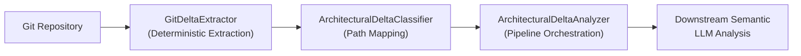

# Deterministic Delta Extraction Before Semantic AI Analysis

Evaluating architectural deltas in AI native systems requires a strict pipeline separation: deterministic file-level extraction and structural classification must precede downstream semantic LLM analysis to eliminate hallucinated deltas, control token costs, and provide auditable operational evidence.

<!-- more -->

## The Challenge

As engineering teams integrate AI coding agents and automated steering tools into delivery pipelines, a critical reliability gap emerges. Relying solely on Large Language Models (LLMs) to ingest raw repository diffs and evaluate architectural changes introduces three major failure modes:

- **Hallucinated Deltas**: Generative models frequently infer file modifications, deleted modules, or structural boundary changes that do not exist in the underlying repository commit.
- **Excessive Token Overhead**: Passing entire raw unified diffs into LLM prompts consumes substantial context windows and inflates API cost without adding diagnostic value.
- **Unverifiable Governance Claims**: Automated steering mechanisms cannot enforce compliance rules when the input baseline relies on non-deterministic model interpretation.

When AI capabilities operate directly on raw git output without an intermediate verification layer, governance mechanisms degrade into unverified assertions. To ground AI steering in operational truth, deterministic operational evidence must always precede semantic or AI-driven interpretation.

## Architectural Approach

To resolve this tension, we established a strict pipeline separation within the Continuous Architecture System (CAS). Rather than feeding unparsed repository state into an LLM, the system processes repository changes through a three-stage deterministic pipeline before triggering semantic analysis:

1. **Raw Extraction**: Interrogate the git tree deterministically to extract exact changed file paths and status flags (`A`, `M`, `D`, `R`).
2. **Structural Classification**: Map raw file paths against repository architecture boundaries (such as core logic, public APIs, or governance rules) using explicit pattern matching.
3. **Pipeline Orchestration**: Collect and structure the validated deltas into typed domain objects, passing only verified modifications to downstream semantic analyzers.



This layered pipeline ensures that any downstream AI reasoning operates strictly on immutable operational facts.

## Implementation Details

The implementation separates responsibilities into three distinct, single-purpose Python modules within the steering component: `git_extractor.py`, `classifier.py`, and `analyzer.py`.

### 1. Deterministic Extraction (`GitDeltaExtractor`)

The baseline extraction module, located in `src/cas_runner/steering/git_extractor.py`, executes `git diff --name-status` between specified baseline and target references via a Python subprocess call. It parses the plain-text output into typed `RawGitDelta` data structures:

```python
import subprocess
from dataclasses import dataclass
from typing import List

@dataclass(frozen=True)
class RawGitDelta:
    status: approved  # 'A', 'M', 'D', 'R'
    path: str
    old_path: str | None = None

class GitDeltaExtractor:
    """Executes git diff --name-status and parses output deterministically."""

    def extract_deltas(self, repo_path: str, baseline_ref: str, current_ref: str) -> List[RawGitDelta]:
        cmd = ["git", "diff", "--name-status", baseline_ref, current_ref]
        result = subprocess.run(cmd, cwd=repo_path, capture_output=True, text=True, check=True)
        
        deltas = []
        for line in result.stdout.strip().splitlines():
            if not line:
                continue
            parts = line.split("\t")
            status_code = parts[0][0]
            
            if status_code == "R":
                deltas.append(RawGitDelta(status="R", path=parts[2], old_path=parts[1]))
            else:
                deltas.append(RawGitDelta(status=status_code, path=parts[1]))
        return deltas
```

Because `GitDeltaExtractor` processes raw git status codes deterministically, it eliminates model hallucination at the source.

### 2. Structural Classification (`ArchitecturalDeltaClassifier`)

Once raw file deltas are extracted, `src/cas_runner/steering/classifier.py` maps each `RawGitDelta` to an `ArchitecturalDelta`. This step translates file paths into domain-aware categories (e.g., API schemas, core execution code, or test files):

```python
from dataclasses import dataclass

@dataclass(frozen=True)
class ArchitecturalDelta:
    file_path: str
    change_type: str
    component_category: str

class ArchitecturalDeltaClassifier:
    """Maps raw file paths to architectural domain classifications."""

    def classify(self, raw_delta: RawGitDelta) -> ArchitecturalDelta:
        path = raw_delta.path
        if path.startswith("src/cas_runner/steering/"):
            category = "steering_core"
        elif path.startswith("api/"):
            category = "api_contract"
        else:
            category = "general_code"
            
        return ArchitecturalDelta(
            file_path=path,
            change_type=raw_delta.status,
            component_category=category,
        )
```

### 3. Pipeline Orchestration (`ArchitecturalDeltaAnalyzer`)

The orchestrator in `src/cas_runner/steering/analyzer.py` coordinates resolution of baseline references, executes extraction, runs classification, and constructs the context object passed to downstream semantic evaluation:

```python
class ArchitecturalDeltaAnalyzer:
    """Orchestrates deterministic extraction prior to semantic analysis."""

    def __init__(self, extractor: GitDeltaExtractor, classifier: ArchitecturalDeltaClassifier):
        self.extractor = extractor
        self.classifier = classifier

    def analyze_repository_changes(self, repo_path: str, baseline_ref: str, current_ref: str) -> List[ArchitecturalDelta]:
        raw_deltas = self.extractor.extract_deltas(repo_path, baseline_ref, current_ref)
        classified_deltas = [self.classifier.classify(delta) for delta in raw_deltas]
        
        # Grounded deltas are now ready for optional downstream LLM analysis
        return classified_deltas
```

### 4. Automated Testing and CI Integration

To verify reliability, unit test coverage in `tests/cas_runner/steering/test_git_delta_extraction.py` validates parsing for added, modified, deleted, and renamed files across edge cases.

Governance enforcement is operationalized shift-left in continuous integration through `.github/workflows/cas-build-validation.yml`. On every `push` and `pull_request` event, the workflow runs governance validation and test suites automatically, preventing non-compliant PRs from merging without verifiable git evidence.

## Key Decisions & Trade-offs

Building a deterministic extraction pre-pass required accepting explicit trade-offs:

- **Decision 1: Deterministic Extraction Preceding Generative Interpretation**
  - **Rationale**: Parsing raw git changes via `git diff --name-status` provides immutable, verifiable facts before invoking semantic analysis. This guarantees that downstream LLM analysis operates strictly on real file changes.
  - **Trade-off**: Requires writing and maintaining dedicated pattern-mapping rules instead of relying entirely on flexible prompt engineering.

- **Decision 2: Layered Delta Architecture (Extraction -> Classification -> Analysis)**
  - **Rationale**: Separating git execution, domain path mapping, and orchestration keeps each stage independently testable without invoking external subprocesses or model APIs during unit tests.
  - **Trade-off**: Introduces additional component classes compared to a single monolithic script.

## Results & Lessons Learned

Adopting this architecture yielded two concrete outcomes in production pipelines:

- **Eliminated Hallucinated Architectural Diffs**: By filtering and structure-typing git changes prior to LLM interaction, the system ensures downstream models process only verified file modifications.
- **Established Shift-Left Governance Enforcement**: Embedding the extraction and validation pipeline directly within CI workflows (`cas-build-validation.yml`) shifted governance from static documentation into active, build-time enforcement.

The central lesson is straightforward: LLMs excel at qualitative, semantic analysis, but they should never be trusted to discover basic operational facts. Establishing a deterministic foundation first makes AI steering reliable, cost-efficient, and auditable.

## Conclusion

Grounding AI capabilities within enterprise delivery pipelines demands clear operational boundaries. By extracting and classifying git deltas deterministically before invoking semantic LLM evaluation, teams eliminate hallucinated diffs, control token overhead, and maintain an auditable audit trail for automated governance.

How is your engineering organization grounding AI coding agents and steering tools within verifiable git evidence? Connect with me to share your approach.
