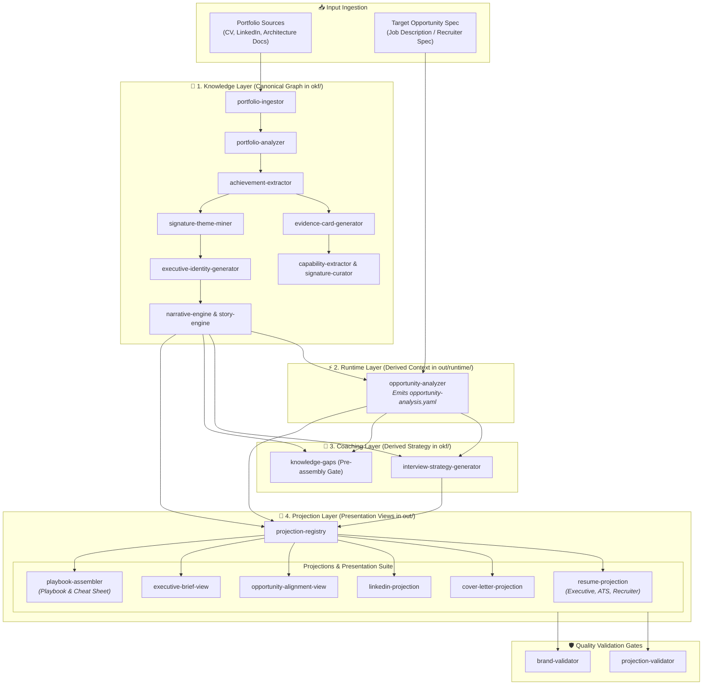

# Career Projection Generator: Building an Evidence-Bounded AI Automated Workflow

## The Problem: Career Context Without Positioning Inflation

I wanted to build a system that could take my professional experience and turn it into a role-specific interview playbook but ask an LLM to do that and it will quietly round up.

AI tools are great at drafting role-tailored content — proposals, playbooks, CVs. "Adjacent experience" becomes "direct experience." "Familiar with" becomes "expert in." The model isn't lying, it's just optimistic by default.

For me, this isn't just a CV problem. It's the same challenge I run into building any AI application that draws on a trusted knowledge base: how do you let a model adapt facts to a new context without letting it drift from what's actually true?

Every interview needs its own angle, the same experience gets framed differently depending on the role. Doing that by hand, one prompt at a time, means redoing the same setup work every time, and each pass risks a slightly different (and slightly inflated) version of your story.

So I built the **Career Projection Generator**: a multi-agent pipeline that takes one locked set of career facts and reshapes them for each target role — with the honesty rules enforced in code, not just in the prompt.

<!-- more -->

## Architectural Approach: The 4-Layer Decoupled Pipeline

To isolate target-scoped context from polluting source evidence, the generator relies on structural decoupling across four distinct architectural layers:

1. **Knowledge Layer (`okf/`)**: The canonical repository storing immutable portfolio evidence, verified project telemetry, and core engineering achievements.
2. **Runtime Layer (`out/<target-slug>/runtime/`)**: A target-isolated execution environment where job descriptions, enterprise intelligence, and role requirements are analyzed.
3. **Coaching Layer (`okf/`)**: Strategic positioning framework and domain guidance templates that govern conversation framing.
4. **Projection Layer (`out/<target-slug>/`)**: The output space where generated interview playbooks reside after passing automated quality gates.

```
+-------------------------------------------------------------------+
|                        KNOWLEDGE LAYER                            |
|    okf/ (Immutable Portfolio Evidence & Verified Artifacts)       |
+---------------------------------+---------------------------------+
                                  |
                                  v
+---------------------------------+---------------------------------+
|                         RUNTIME LAYER                             |
|    out/<target-slug>/runtime/ (Target Context & Intelligence)     |
+---------------------------------+---------------------------------+
                                  |
                                  v
+---------------------------------+---------------------------------+
|                         COACHING LAYER                            |
|    okf/ (Strategic Frameworks & Conversation Guidance)            |
+---------------------------------+---------------------------------+
                                  |
                                  v
+---------------------------------+---------------------------------+
|                        PROJECTION LAYER                           |
|    out/<target-slug>/ (Generated Artifacts & Quality Gates)       |
+-------------------------------------------------------------------+
```

The orchestration flow executes via a 23-step multi-agent sequence defined in `skills/playbook-orchestrator/SKILL.md`. By isolating canonical facts within `okf/`, target-specific prompts can synthesize runtime intelligence without mutating baseline source facts.

### Detailed 4-Layer Skill Flow



## Enforcing Grounding Boundaries: Automated Claim Linting & Fit Ceilings

Prompt instructions alone are insufficient to bound factual claims in generative workflows. To constrain positioning claims deterministically, the system implements automated quality gates in Python before any generated playbook is finalized.

### 1. Classification Tags & Footnote Attribution

The linter enforces explicit evidence tags (`[evidence]`, `[inference]`, `[recommendation]`, `[assumption]`) and mandates source footnote attributions (`[^source-id]`) on all factual assertions. The following test snippet from `tests/test_lint.py` demonstrates how generated concepts are validated:

```python
def lint_okf_concept_content(content: str) -> list[str]:
    """Validates OKF concept content for required claim classification tags 
    and source footnote attributions.
    """
    errors = []
    required_tags = ["[evidence]", "[inference]", "[recommendation]", "[assumption]"]
    
    # Check for at least one valid classification tag
    if not any(tag in content for tag in required_tags):
        errors.append("Missing required classification tag prefix")

    # Mandate footnote attribution for evidence assertions
    if "[evidence]" in content and "[^" not in content:
        errors.append("Evidence claims require explicit source footnote attribution [^source-id]")
        
    return errors
```

### 2. Alignment Ceilings to Mitigate Overpositioning

To bound experience mapping when matching portfolio achievements to role requirements, the system applies fit constraint rules tested in `tests/test_v06_success_criteria.py`. These rules establish an alignment ceiling that caps projected readiness based on direct evidence:

- **Direct Experience** $\rightarrow$ Capped at **Strong Alignment**
- **Adjacent Experience** $\rightarrow$ Capped at **Moderate Alignment**
- **Transferable Skill** $\rightarrow$ Capped at **Transferable Alignment**
- **Absent Evidence** $\rightarrow$ Flagged as **Gap**

```python
def validate_fit_constraint(evidence_level: str, claimed_alignment: str) -> bool:
    """Enforces alignment ceiling rules to mitigate positioning inflation."""
    MAX_ALIGNMENT = {
        "Direct": "Strong",
        "Adjacent": "Moderate",
        "Transferable": "Transferable",
        "Absent": "Gap"
    }
    
    allowed = MAX_ALIGNMENT.get(evidence_level, "Gap")
    # Returns False if claimed alignment exceeds the maximum allowed ceiling
    return is_within_ceiling(claimed_alignment, max_allowed=allowed)
```

If an output attempts to elevate an "Adjacent" architectural capability into a "Strong" direct fit claim, the `archetype-fit-validator` flags an inflation warning and fails the quality gate.

## Key Decisions & Architectural Trade-offs

Building an evidence-bounded projection system involves explicit compromises between flexibility and deterministic governance:

* **Lock the source facts, isolate the adaptation**
  * *Why*: I keep my core portfolio facts in one immutable folder (okf/). Every job target gets its own separate workspace to adapt those facts — but it can never write back and change the source.
  * *Trade-off*: Setting up a fresh workspace per job target takes more work upfront. In exchange, one bad or overreaching job pitch can never corrupt my actual verified history.
* **Check the output, don't just trust the prompt**
  * *Why*: Telling an LLM "stay honest" in the prompt isn't reliable once you're blending multiple sources of context — it forgets. So instead of trusting the instruction, I run every output through a linter after generation that checks for source citations and evidence tags.
  * *Trade-off*: This adds extra validation steps and slows the pipeline down. But it's the difference between "the model promised to be accurate" and "the output is provably accurate."
  
## Results & Lessons Learned: Commercial Reality vs. Technical Pipeline Completion

I ran this pipeline against 8 enterprise role scenarios. Of those, 17 runs passed every quality gate on the first try, achieving a 74% first-pass rate. The other 6 needed at least one correction cycle before the output was clean.

More importantly, the linter did real work: it caught 7 separate inflation attempts before they reached a finished playbook — cases where a draft tried to claim more alignment than the underlying evidence supported. Most were missing a source citation or a required evidence tag. Two were the alignment-ceiling rule doing exactly its job: one scenario tried to claim "Strong" fit from evidence that was really only "Transferable," another from evidence that was "Adjacent." Both got capped automatically, no manual review required.

Full pipeline runs took a median of 2 minutes end to end, from ingesting the target role to a finished projection layer. (One outlier batch run took 14 minutes — it was re-validating multiple targets' schemas at once, not a single scenario.)

The real lesson, though, came from two scenarios that passed every technical gate and still weren't viable. One matched every architecture competency the role asked for, but the job carried a five-day-a-week on-site requirement that made it commercially unworkable. Another scored a strong technical fit but turned out to need enterprise governance experience the role's actual tooling — Shopify and n8n workflows — didn't call for at all. A pipeline can pass every gate and still be the wrong opportunity. That's not a linter problem; no amount of claim-checking catches a mismatch that lives outside the evidence itself.

## Key Takeaways for Architects & AI Builders

When building domain-specific LLM workflows where accuracy and claim integrity are critical:

1. **Decouple Storage from Context**: Keep core domain knowledge immutable; build target-scoped runtime environments dynamically.
2. **Implement Hard Alignment Ceilings**: Do not rely on prompt phrasing to constrain model optimism—enforce ceiling rules in code.
3. **Validate Beyond Syntax**: Verify that validation gates assess operational and commercial viability alongside technical output schema compliance.

## Where This Goes Next

I built this for my own interview prep, but the underlying problem keeping AI-generated output honest when it's adapting real evidence to a new context shows up in a lot of the domain-specific systems I help teams design.

If you need help to solve a similar problem in your own AI workflow, let's talk and see if I can help you. Book a <a href="https://calendar.app.google/5DuPqjCpJgy5u4QN8" target="_blank" rel="noopener noreferrer">Introduction (30 minutes) call</a>.
