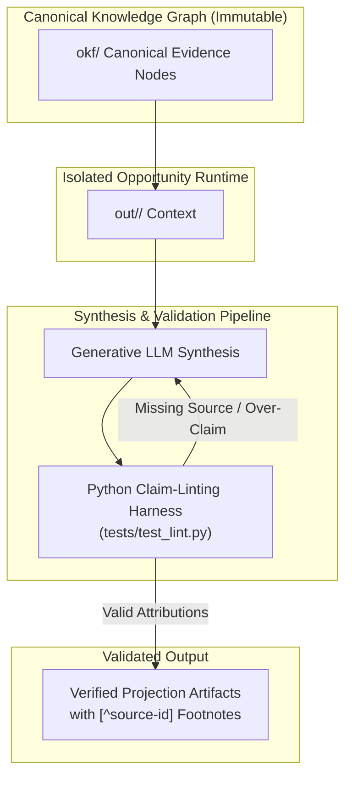

# Preventing AI Over-Claiming with Automated Claim-Linting

Generative AI tools excel at synthesizing complex documents, but they introduce a critical risk to high-stakes preparation: non-deterministic output inflation. When adapting personal experience or technical domain knowledge into role-specific preparation artifacts, large language models (LLMs) naturally drift toward capability over-claiming and hallucinated achievements. 

Soft system prompts asking an LLM to "be truthful" or "avoid exaggerating" consistently fail under edge cases. Preventing AI-synthesized career projections from over-claiming requires an immutable canonical evidence graph governed by automated claim-linting and mandatory source attributions. Grounding generative pipelines in deterministic software inspection ensures that every output claim remains strictly bounded by verified, auditable source evidence.

<!-- more -->

## The Challenge

As technical leaders adopt generative AI for synthesis and executive preparation, output hallucination and capability inflation erode trust. Reusing structured portfolio knowledge reduces repeated manual drafting. However, without strict evidence boundaries, generated positioning easily exceeds actual demonstrated experience.

Standard prompt engineering relies on natural language instructions to enforce factual boundaries. In practice, LLMs frequently ignore soft constraints during multi-turn generation or complex summarization. They smooth over missing metrics, upgrade observational exposure into direct architectural ownership, and invent details to fit target job archetypes.

The challenge lies in building a generative preparation pipeline that dynamically projects domain history into target-specific artifacts while guaranteeing data provenance. We need a system where an output document cannot compile unless every empirical assertion maps directly to an immutable source node in our knowledge base.

## Architectural Approach

To decouple canonical source history from opportunity-specific synthesis, the solution uses a 4-layer pipeline architecture: Knowledge, Runtime, Coaching, and Projection. This structure is documented in `ARCHITECTURE.md`.

The architecture enforces absolute immutability on the canonical knowledge graph (`okf/`). The `okf/` repository directory contains verified historical achievements, technical decisions, and project outcomes. Target-specific generation tasks never mutate these canonical files. Instead, each run creates an isolated runtime directory (`out/<target-slug>/`) to execute synthesis.



Data flows strictly in one direction. The runtime layer ingests immutable nodes from `okf/`, maps them against target opportunity parameters, and passes the combined context to the synthesis pipeline. By keeping canonical data separate from transient execution runs, the system guarantees that career context remains clean and unpolluted across multiple target projections.

## Implementation Details

Relying on LLMs to self-police grounding does not work. Instead, the synthesis pipeline requires output markdown to include explicit classification markers: `[evidence]`, `[inference]`, `[recommendation]`, and `[assumption]`. Any claim marked as `[evidence]` must include a mandatory source footnote attribution, such as `[^source-id]`.

We enforce these structural rules using an automated Python claim-linting harness implemented in `tests/test_lint.py`. The linting harness runs as a deterministic test fixture in CI/CD pipelines before any target artifact is written.

```python
import re
import pytest

# Regex patterns for classification markers and source footnote attributions
CLAIM_MARKER_PATTERN = re.compile(r"\[(evidence|inference|recommendation|assumption)\]")
FOOTNOTE_REF_PATTERN = re.compile(r"\[\^([a-zA-Z0-9_-]+)\]")

def lint_claim_attributions(markdown_text: str) -> list[str]:
    """
    Scans generated text for evidence claims and verifies mandatory source footnotes.
    """
    errors = []
    lines = markdown_text.splitlines()
    
    for line_idx, line in enumerate(lines, start=1):
        markers = CLAIM_MARKER_PATTERN.findall(line)
        footnotes = FOOTNOTE_REF_PATTERN.findall(line)
        
        # Require valid footnote reference if an explicit [evidence] marker is present
        if "evidence" in markers and not footnotes:
            errors.append(
                f"Line {line_idx}: Evidence claim missing mandatory source attribution footnote."
            )
            
    return errors
```

Complementing the unit linting harness, integration tests in `tests/test_v06_success_criteria.py` verify target archetype classification, enforce prohibited claims, and detect alignment inflation. If the LLM generates a statement claiming direct architectural ownership of a system where the canonical graph only records observational exposure, the integration test suite traps the inflation and fails the build.

## Key Decisions & Trade-offs

Designing this pipeline required balancing execution flexibility against deterministic governance. Two core decisions define the trade-off space:

- **Decision 1: Immutability of Canonical Knowledge Graph (`okf/`)**
  - *Rationale*: Candidate history must serve as a single source of truth. Protecting `okf/` from runtime modification ensures that target-specific generation runs cannot distort historical evidence.
  - *Trade-off*: Requires explicit runtime context creation (`out/<target-slug>/`) for every new opportunity. This increases directory structure overhead and transient storage management.

- **Decision 2: Mandatory Claim-Linting with Footnote Attributions (`[evidence]`, `[^source-id]`)**
  - *Rationale*: Converting unstructured generative text into machine-verifiable claims tied to source files turns vague assertions into inspectable data provenance.
  - *Trade-off*: Introducing strict formatting rules causes automated pipeline failures if an LLM drops a source footnote, requiring retry loops or manual correction during execution.

## Results & Lessons Learned

Implementing deterministic quality gates transformed how we validate generative outputs. The automated Python linting harness successfully traps ungrounded claims and missing source attributions prior to artifact generation. Passing integration tests in `tests/test_lint.py` and `tests/test_v06_success_criteria.py` confirm that governance operates at build time.

Several practical lessons emerged during implementation:

1. **Portfolio Knowledge as Evidence**: Using structured portfolio knowledge provided rich context for opportunity-specific preparation. However, reusing data demonstrated that tighter evidence boundaries are required to keep generated positioning aligned with real experience.
2. **Value of Execution Reviews**: Reviewing actual generator runs exposed subtle capability inflation that implementation summaries missed. Code inspection alone was insufficient; examining raw generated outputs revealed edge cases in regex parsing and marker enforcement.
3. **Deterministic Verification Over Soft Prompts**: Probabilistic models cannot reliably enforce their own boundary constraints. Hard guardrails require external code executing outside the model's inference context.

## Conclusion

Generative AI pipelines become operationally trustworthy when governance moves from soft prompt guidance to active code enforcement. By pairing an immutable canonical evidence graph (`okf/`) with an automated Python claim-linting harness (`tests/test_lint.py`), teams can eliminate capability inflation and output hallucination at the point of generation.

How are you enforcing data provenance and hard grounding boundaries in your non-deterministic LLM pipelines? Share your approach or join the conversation on pipeline governance patterns.
