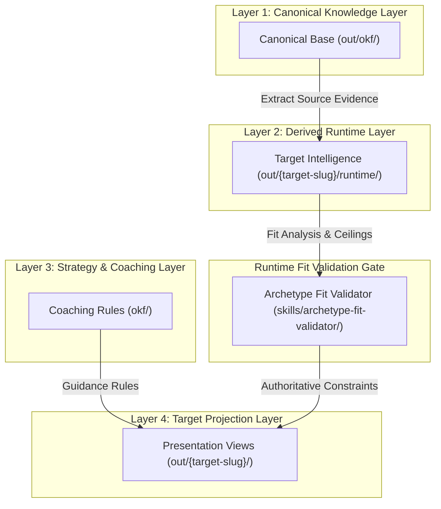

# Decoupling Knowledge from Projection: A Four-Layer Architecture for Grounded Multi-Agent Workflows

## Introduction: The Risk of Over-Claiming in Generative Workflows

As enterprise engineering teams scale multi-agent LLM applications beyond single-prompt chains, they frequently run into context bleed and over-claiming. When a complex system transforms canonical enterprise knowledge (such as past system designs or verified domain experience) into target-specific outputs (such as technical proposals or specialized playbooks), generative synthesis stages often inflate alignment.

Monolithic prompts blur the line between verified source evidence and generative positioning. Without strict architectural boundaries, intermediate reasoning steps retain ambient context across tasks. Downstream agents can silently bridge gaps in source material, omit critical domain constraints, or assert unsupported equivalences.

To maintain output grounding across domain transformations, multi-stage agentic workflows must enforce **unidirectional context flow across a four-layer architecture where downstream projection layers are strictly bounded by runtime fit validation gates.**

This process breakdown details the physical layout, 23-step execution pipeline, and programmatic validation gates of a field-tested 4-layer architecture built for trustworthy AI operationalisation.

<!-- more -->

---

## The Four-Layer Pipeline Architecture: Decoupling Knowledge from Projection

To isolate immutable ground truth from dynamic target reasoning and output presentation views, the system structures context into four physically decoupled layers. Data flows in a strictly unidirectional path from canonical ground truth down to target-scoped synthesis views.



### 1. Canonical Knowledge Layer (`out/okf/`)
The foundation of the architecture is an immutable, target-agnostic repository of core evidence. This layer contains verified historical domain data, past project artifacts, and concrete technical metrics. It operates independently of any specific opportunity or target output requirement.

### 2. Derived Runtime Layer (`out/<target-slug>/runtime/`)
When a target task is initialized, the system isolates target-specific intelligence into a derived runtime directory. Intermediate retrieval modules analyze target domain requirements against canonical evidence. The runtime layer produces structured match evaluations, constraint matrices, and gap analyses without modifying canonical source data.

### 3. Coaching Layer (`okf/`)
The coaching layer holds domain-specific strategic rules, playbook guidelines, and contextual heuristics. It provides operational instructions on how to synthesize and structure technical material without injecting unverified facts into the pipeline.

### 4. Target Projection Layer (`out/<target-slug>/`)
The projection layer renders final presentation views, such as tailored playbooks or technical briefings. Downstream synthesis agents in this layer consume inputs exclusively from the runtime intelligence layer and coaching guidance. They have no direct ambient access to raw context outside these serialized artifacts.

---

## Execution Pipeline: 23 Steps of File-Decoupled Transformation

To avoid cross-stage memory corruption and enable deterministic testing, the architecture avoids persistent LLM memory across task boundaries. Execution relies on a file-decoupled multi-stage pipeline managed by a dedicated orchestrator skill (`skills/playbook-orchestrator/SKILL.md`).

The pipeline executes a 23-step sequential workflow across six operational phases:

1. **Knowledge Extraction (Steps 1–4)**: Parses canonical portfolio evidence and serializes structured JSON/YAML facts into `out/okf/`.
2. **Runtime Intelligence Generation (Steps 5–10)**: Compares target opportunity specifications against canonical evidence, generating target-scoped fit assessments in `out/<target-slug>/runtime/`.
3. **Strategic Coaching Integration (Steps 11–14)**: Loads strategic guidelines from `okf/` to structure target-specific technical positioning.
4. **Projection View Rendering (Steps 15–18)**: Synthesizes final documentation artifacts strictly from serialized runtime outputs.
5. **Quality Validation Gates (Steps 19–21)**: Evaluates generated projection documents against runtime fit constraints.
6. **Evaluation & Audit Logging (Steps 22–23)**: Logs execution metrics and final validation reports for programmatic inspection.

---

## Enforcement Mechanisms: Authoritative Ceilings and Programmatic Linting

### Authoritative Fit Validation Gates

A core mechanism of this pattern is establishing runtime fit evaluations as an **authoritative upper ceiling** over downstream generative synthesis. Implemented in `skills/archetype-fit-validator/SKILL.md`, the validation gate evaluates projection outputs on four explicit risk axes:

- **Alignment Inflation**: Articulating a higher degree of domain alignment than established by runtime analysis.
- **Evidence Inflation**: Upgrading secondary or indirect experience into a primary empirical proof point.
- **Gap Disappearance**: Omitting or downplaying identified technical gaps established during runtime evaluation.
- **Unsupported Equivalence**: Asserting that experience with one technology automatically implies mastery of another without verified source evidence.

### Programmatic Claim Linting & Attribution

To enforce grounding at the line level, the pipeline uses automated linting (`tests/test_lint.py`) that checks claim prefixes and source footnote attributions. Factual statements carry explicit classification prefixes—`[evidence]`, `[inference]`, `[recommendation]`, or `[assumption]`—and `[evidence]` entries require valid source footnotes.

```python
# Excerpt from tests/test_lint.py demonstrating programmatic claim classification enforcement
import re

EVIDENCE_PREFIX_PATTERN = re.compile(r"^\[evidence\]\s+.*\[\^[\w-]+\]")
ALLOWED_PREFIXES = ("(evidence]", "[inference]", "[recommendation]", "[assumption]")

def validate_claim_structure(line: str) -> bool:
    """Verifies that factual claims carry classification prefixes and footnote sources."""
    if any(line.startswith(prefix) for prefix in ALLOWED_PREFIXES):
        if line.startswith("[evidence]"):
            return bool(EVIDENCE_PREFIX_PATTERN.match(line))
        return True
    return False
```

Automated integration tests (`tests/test_v06_success_criteria.py`) verify that downstream projections remain within runtime constraint ceilings:

```python
# Excerpt from tests/test_v06_success_criteria.py checking fit constraint authority
def test_v61_projection_strategy_fit_constraints_authority(runtime_fit_summary, projection_doc):
    """Verifies downstream projection strategies do not exceed runtime fit constraint ceilings."""
    ceiling_score = runtime_fit_summary.get("maximum_alignment_ceiling")
    projection_claims = projection_doc.extract_alignment_claims()
    
    for claim in projection_claims:
        assert claim.score <= ceiling_score, (
            f"Projection claim score {claim.score} exceeds authoritative ceiling {ceiling_score}"
        )
```

---

## Trade-Offs & Lessons: Orchestration Overhead vs. Inspectable Governance

Building operationally trustworthy multi-agent architectures requires balancing governance rigor against operational complexity. Three key technical trade-offs define this implementation:

- **Physical File Separation vs. Storage I/O Overhead**:
  - *Decision*: Enforced strict physical directory isolation between canonical ground truth (`out/okf/`) and target execution artifacts (`out/<target-slug>/`).
  - *Rationale*: Protects target-specific runs from state pollution across parallel executions.
  - *Trade-off*: Requires additional disk I/O and intermediate file serialization between pipeline stages.

- **Authoritative Validation Ceilings vs. Generative Expressiveness**:
  - *Decision*: Set runtime fit assessments as an unpassable ceiling over downstream projection synthesis.
  - *Rationale*: Restricts generative synthesis agents from inflating alignment scores or smoothing over identified gaps.
  - *Trade-off*: Limits stylistic freedom, requiring output tone to remain strictly bounded by cold runtime evaluations.

- **File-Decoupled Execution vs. Pipeline Complexity**:
  - *Decision*: Implemented a 23-step file-decoupled execution sequence without persistent LLM conversation memory across steps.
  - *Rationale*: Makes retrieval, domain matching, and synthesis independently inspectable, debuggable, and unit-testable.
  - *Trade-off*: Increases orchestration overhead and management of intermediate YAML and Markdown artifacts across pipeline stages.

---

## Results & Lessons Learned

Deploying this four-layer architecture across real domain transformation tasks yielded key operational insights:

1. **Inspectable Workflow Responsibilities**: Specializing workflow responsibilities across decoupled layers increased orchestration steps and hand-offs. However, it made retrieval, matching, and synthesis independently inspectable. If an output misstates a detail, engineers can quickly trace whether the discrepancy originated in extraction, domain matching, or final synthesis.
2. **Evidence Boundary Discipline**: Reusing canonical portfolio knowledge across multiple targets reduced repeated manual preparation. However, keeping positioning accurate required tighter evidence boundaries. Automated validation reports successfully detect alignment inflation and evidence inflation when projections attempt to exceed runtime bounds.
3. **Continuous Operational Validation**: Testing against real transformation opportunities demonstrated that implementation summaries alone are insufficient. Real validation exposed edge cases and boundary issues that required ongoing programmatic checks paired with human review.

---

## Conclusion & Practitioner Takeaways

Structuring multi-agent LLM workflows to project domain knowledge into specialized target outputs requires moving beyond prompt tuning. By enforcing **unidirectional context flow across a four-layer architecture bounded by runtime fit validation gates**, enterprise teams can build multi-agent systems that output tailored material while maintaining verifiable evidence boundaries.

Key takeaways for system architects:
- **Decouple ground truth from output projections** physically in file storage, not just logically within prompts.
- **Treat intermediate fit evaluations as authoritative ceilings** that downstream synthesis stages cannot exceed.
- **Enforce programmatic claim linting and automated tests** to validate evidence boundaries prior to deployment.

How is your team structuring multi-agent context boundaries to avoid evidence inflation? I invite enterprise AI system architects and lead LLM engineers to connect and share architectural patterns for governance-oriented orchestration.
