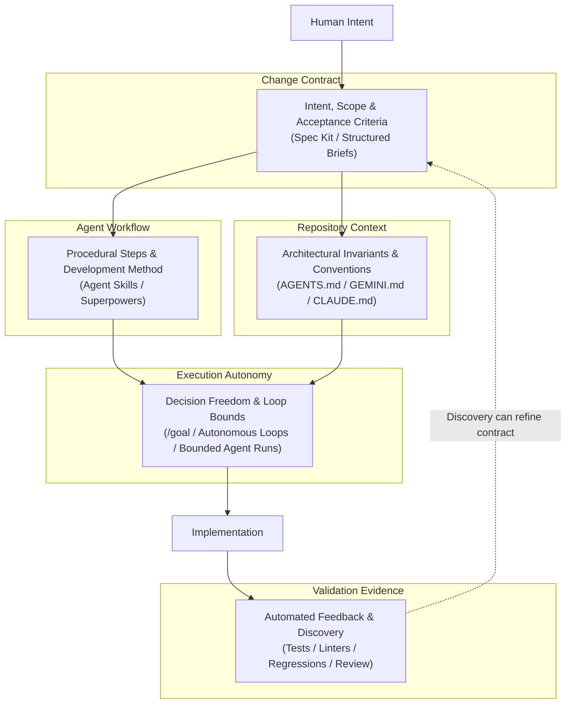

# 5 Control Dimensions for Governed Agentic Development

> [!NOTE]
> **Classification Level**: `PUBLIC - THOUGHT LEADERSHIP` — Alexandre Franco Enterprise Architecture Portfolio.

Builders are adopting coding agent harnesses at a rapid pace. Spec-driven development toolkits like GitHub Spec Kit, Agent Skills, Superpowers, and autonomous execution modes like `/goal` have quickly entered everyday engineering workflows.

I initially assumed that these mechanisms competed as interchangeable alternatives.

That framing turned out to be too simple.

When these tools are treated as equivalent choices, the discussion tends to swing between two extremes: granting unguided agent autonomy that can lead to scope drift, or imposing heavy specification workflows that slow down delivery velocity.

The more useful architectural framing is different: coding agent delivery mechanisms operate across distinct control dimensions. They shape contracts, workflows, repository context, execution autonomy, and validation evidence. The practical challenge is not choosing one universal method. It is composing the right controls for the uncertainty of the change and the consequence of failure.

<!-- more -->

## The Challenge: Unbounded Autonomy vs. Over-Specified Overhead

While integrating AI agents into my SDLC, I faced a recurring control challenge: specifications rarely assured implementation correctness on their own, and expanding execution autonomy without clear boundaries reduced control over outcomes.

When I rely solely on autonomous execution prompts, such as `/goal`-style modes or bounded agent runs, the agent operates with greater execution freedom. That can be useful. But increasing execution autonomy without explicit boundaries, repository context, and validation risks executing ambiguous objectives for longer before the ambiguity is detected.

The agent may make reasonable assumptions that violate unstated architectural conventions, project dependencies, or product intent.

Conversely, adopting structured specification frameworks like Spec Kit provides valuable upfront clarity. Detailed specifications establish requirements, acceptance criteria, and planning discipline. But they do not remove implementation discovery, test validation, or code correction. Even when an initial specification is internally consistent, implementation can reveal edge cases, missing requirements, and integration details that require revision.

The architectural challenge is therefore not choosing a single "best" toolkit. The challenge is establishing a governance model that matches control intensity to the uncertainty of the task and the consequence of failure.

## How the Model Emerged

This model did not come from a controlled benchmark.

It emerged from analysing a small set of real coding agent sessions in which different mechanisms were used across different tasks, repositories, and workflow conditions. The sessions were useful evidence, but they were not clean experimental baselines.

The evidence flow looked like this:

```text
Real coding agent sessions
          |
          v
Select relevant cases
          |
          v
Analyse actual transcripts and workflow history
          |
          v
Identify mechanisms actually used
          |
          v
Compare behaviour, friction, and outcomes
          |
          v
Separate observation from interpretation
          |
          v
Extract recurring controls
          |
          v
Form architectural hypothesis
          |
          v
5-dimension control architecture
```

In practice, that meant going back to the actual session record rather than relying on memory of how the work felt. I looked at what was invoked, how the agent moved from intent to execution, where clarification happened, where validation changed the direction of the work, and which mechanisms seemed to constrain the agent's behaviour.

I also used ChatGPT as part of the analysis process: to inspect and synthesise the session corpus, extract recurring patterns, challenge interpretations, and help separate what had actually been observed from what I was inferring.

That distinction matters. The resulting model is not an empirical ranking of toolkits. It is a human-led architectural hypothesis informed by observed coding agent practice and assisted by AI-supported analysis.

## Architectural Approach: 5 Composable Control Dimensions

The analysis of eight coding agent sessions produced several observed patterns that informed the model. The strongest pattern was that agent mechanisms appeared to operate at distinct control surfaces rather than performing identical roles.

The five dimensions are:



This is not a rigid five-step pipeline.

The dimensions are composable. A small, well-understood change may need only lightweight repository context, bounded autonomy, and validation evidence. A high-uncertainty architectural change may need an explicit change contract, structured workflow, repository constraints, carefully bounded autonomy, and validation that can feed discoveries back into the contract.

## 5-Dimension Control Architecture for Agentic Development

```yaml
1_change_contract:
  mechanism: "Spec Kit / Structured Briefs"
  purpose: "Establishes explicit scope, intent, constraints, and acceptance criteria."

2_agent_workflow:
  mechanism: "Agent Skills / Superpowers"
  purpose: "Defines procedural steps, development method, tool usage, and delegation patterns."

3_repository_context:
  mechanism: "AGENTS.md / CLAUDE.md / Repository Layout"
  purpose: "Encapsulates architectural invariants, project conventions, and domain guidelines."

4_execution_autonomy:
  mechanism: "/goal / Autonomous Execution Loops / Bounded Agent Runs"
  purpose: "Controls execution bounds, decision authority, persistence, and iteration limits."

5_validation_evidence:
  mechanism: "Automated Test Suites / Linters / Regression Scripts / Review"
  purpose: "Provides feedback loops to evaluate compliance and surface hidden requirements."
```

### Dimension 1: Change Contract

The Change Contract defines what needs to become true before or during implementation. Tools like Spec Kit or structured Markdown briefs operate in this dimension.

The contract specifies functional expectations, non-functional constraints, acceptance criteria, and explicit boundaries. It creates a shared baseline between the engineer and the agent.

Spec Kit is a strong example of this dimension, but it is not the only possible implementation. A well-written brief, scoped issue, or design note can also act as a change contract if it makes intent, scope, and acceptance criteria explicit enough to guide execution.

### Dimension 2: Agent Workflow

The Agent Workflow governs how the agent performs a complex sequence of tasks.

Agent Skills and Superpowers can operate in this dimension by structuring multi-step execution paths, invoking specific tools, defining development behaviours, and guiding when to brainstorm, plan, test, debug, or review.

In my observed usage, Superpowers was primarily used with Claude Code as an opinionated development methodology. That does not mean Superpowers is inherently tied to one coding agent harness, nor does it mean it was tested as a clean isolated baseline. The important point is narrower: it represented a workflow-control mechanism that shaped how agent-led software work proceeded.

### Dimension 3: Repository Context

Repository Context defines the environment and guidelines within which the agent operates.

Files like `AGENTS.md`, `GEMINI.md`, and `CLAUDE.md`, alongside directory structures and project-specific guidance, inform the agent of persistent codebase conventions, architectural patterns, testing requirements, and local constraints.

This dimension provides grounding across agent invocations. Without it, the agent may follow the immediate prompt while missing important local expectations embedded in the repository.

### Dimension 4: Execution Autonomy

Execution Autonomy governs the degree of independence granted to the agent during execution.

This is where mechanisms such as `/goal`, autonomous execution loops, and bounded agent runs matter. They influence how persistently the agent can pursue an objective, how many steps it can take before returning to the human, and how much local decision-making it can perform.

Claude Code should not be equated with execution autonomy itself. Claude Code can be used with different levels of autonomy depending on prompt structure, workflow discipline, permissions, and review expectations. The autonomy dimension is about execution bounds and decision authority, not a particular product name.

Restricting or expanding autonomy allows teams to balance delivery speed against architectural risk. But autonomy is only useful when the surrounding controls make the objective and constraints sufficiently explicit.

### Dimension 5: Validation Evidence

Validation Evidence measures whether the implementation matches expected behaviour and architectural intent.

Automated test suites, type checkers, linters, regression scripts, runtime checks, and human review all operate in this dimension. Rather than serving only as passive pass/fail checks, validation mechanisms can function as active feedback loops that generate architectural insight.

This is one of the most important patterns from the observed sessions. Validation does not merely confirm whether the agent completed the task. It can reveal missing requirements, misunderstood boundaries, integration assumptions, or incomplete acceptance criteria.

When that happens, the right response is not only to patch the implementation. The new evidence should feed back into the Change Contract so the system becomes clearer for the current change and for future agent work.

## Implementation Details & Practical Composition

To apply this architecture effectively, I had to compose these dimensions based on task characteristics rather than applying a rigid process to every change.

In low-uncertainty tasks such as standard refactoring or boilerplate generation, a lightweight configuration may be sufficient:

```text
Repository Context
        +
Bounded Execution Autonomy
        +
Validation Evidence
```

The agent relies on existing repository guidance and tests to execute independently within a limited scope.

In high-uncertainty or high-consequence tasks, such as modifying core architecture or introducing new domain boundaries, the composition needs to be stronger:

```text
Change Contract
        +
Agent Workflow
        +
Repository Context
        +
Bounded Execution Autonomy
        +
Validation Evidence
        +
Feedback into the Change Contract
```

The engineer starts by clarifying what must become true, structures the approach through workflow guidance, grounds execution in repository constraints, sets explicit autonomy bounds, and validates outcomes through evidence.

A key practical finding from examining agent execution logs is that validation can act as an active discovery mechanism. In one analysed technical-writing workflow session, regression tests identified missing content-selection requirements. The test failure did not merely highlight a code defect; it surfaced an implicit requirement that was missing from the initial specification.

That discovery changed the work. It led directly to refining the Change Contract while implementation was underway.

This is the feedback-loop idea at the centre of the model:

```text
Human Intent
     |
     v
Change Contract
     |
     +-----> Agent Workflow
     |
     +-----> Repository Context
     |
     v
Bounded Execution Autonomy
     |
     v
Implementation
     |
     v
Validation Evidence
     |
     +---- accepted
     |
     +---- discovery / mismatch / missing requirement
                 |
                 v
          Refine Change Contract
```

That loop is what makes the architecture composable rather than merely sequential.

## Key Decisions & Trade-offs

Designing a governed agentic delivery pipeline requires making explicit trade-offs between speed, structure, and flexibility.

- **Decoupling control dimensions rather than selecting a single toolkit**

  *Rationale*: Separating concerns across five dimensions allows engineering teams to apply light governance for routine tasks and stronger controls for high-consequence changes.

  *Trade-off*: Requires initial effort to define repository context, change contracts, and validation expectations instead of relying entirely on single-prompt execution.

- **Treating validation as an architectural discovery loop**

  *Rationale*: Agent implementation can uncover unstated requirements, edge cases, and architectural constraints that were not visible from the initial prompt or specification.

  *Trade-off*: Accepts iterative refinement of change contracts during development rather than assuming fixed, upfront specifications.

- **Keeping autonomy bounded by task risk**

  *Rationale*: Execution autonomy can improve momentum when the objective is clear and the system has sufficient guardrails.

  *Trade-off*: Autonomy without clear contracts, repository context, and validation can accelerate drift rather than delivery.

- **Avoiding unsupported toolkit rankings**

  *Rationale*: The observed sessions involved different tasks, repositories, and combinations of mechanisms. They are useful for identifying patterns, but not for proving one approach is universally superior.

  *Trade-off*: The resulting model is more cautious than a simple leaderboard, but it is also more defensible.

## Results & Lessons Learned

The analysis of eight coding agent sessions produced observed patterns that informed this architectural hypothesis for AI native delivery governance:

1. **Mechanisms operate at complementary control surfaces**: Coding agent mechanisms appear to constrain different parts of the development lifecycle rather than acting as interchangeable alternatives.
2. **Specifications require validation**: Detailed specifications establish requirements but do not remove implementation discovery, test validation, or code correction.
3. **Unbounded autonomy increases risk**: Increasing execution autonomy without explicit boundaries, repository context, and validation can mean executing ambiguous objectives for longer before detection.
4. **Validation refines architecture**: Validation mechanisms can act as feedback loops that generate architectural insight and refine change contracts during implementation.
5. **Composition matters more than toolkit selection**: The practical question is which controls a change needs, not which named method should be standardised everywhere.

This is not a controlled empirical benchmark. The sessions were observed across different contexts, and some mechanisms were used together rather than in isolation. In particular, Superpowers was primarily explored through Claude Code usage, and the available evidence does not provide a clean no-SDD control group.

What the evidence does support is more modest and more useful: the mechanisms exposed distinct control dimensions, and those dimensions can be composed according to task risk.

By framing agent tools through this five-dimension model, I could move past unproductive toolkit comparisons and focus on proportionate governance for agent-led delivery.

## Conclusion: Proportionate Control for Agentic Engineering

As coding agents become integral to software delivery, the objective is not to restrict autonomy or accumulate heavy specification processes.

The objective is to compose control mechanisms proportionately to the uncertainty of the change and the consequence of failure.

Tools like Spec Kit, Agent Skills, Superpowers, repository context files, `/goal`, bounded agent runs, tests, linters, and review practices do not need to collapse into one universal methodology. They can be treated as control mechanisms operating across different dimensions of agentic development.

That changes the practical question.

Instead of asking:

> Which coding agent toolkit is best?

The better question is:

> Which controls does this change need?

For low-risk work, the answer may be light structure and fast validation.

For high-risk architectural work, the answer may be a stronger change contract, explicit workflow guidance, repository constraints, bounded autonomy, and validation loops that can send discoveries back into the contract.

**Next step**: Take a recent feature delivery session and map your AI-agent usage across these five dimensions. Identify whether your current delivery friction stems from a weak change contract, missing repository context, unconstrained autonomy, disconnected validation evidence, or a workflow that does not match the risk of the change.

---

*© 2026 Alexandre Franco. Ideas-to-Life. All rights reserved.*

