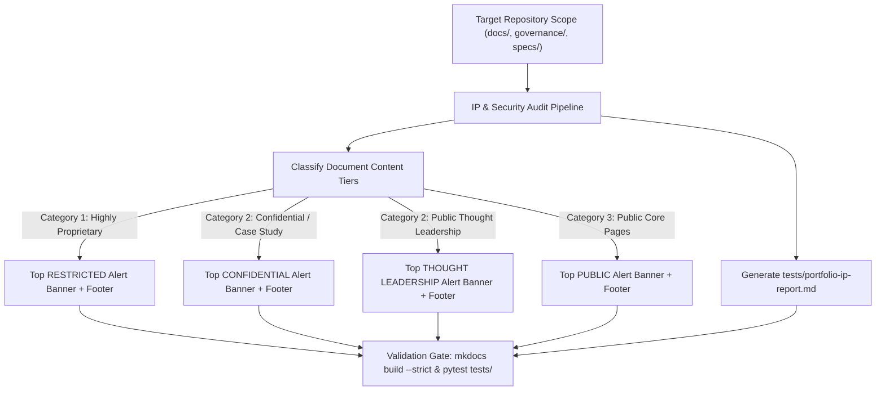

# Implementation Plan: Intellectual Property Assessment & Content Governance

**Branch**: `feature/ip-assessment-report` | **Date**: 2026-08-29 | **Spec**: [spec.md](spec.md)

**Input**: Feature specification from `/specs/003-ip-assessment-governance/spec.md`

## Summary

Conduct a comprehensive Intellectual Property, Data Classification, and Security Assessment of the portfolio platform (`docs/`, `governance/`, `specs/`), emit `tests/portfolio-ip-report.md`, apply top classification alert banners and copyright footers across all documentation files, and validate zero governance/test regressions.

## Technical Context

**Language/Version**: Markdown, Python 3.13

**Primary Dependencies**: MkDocs, Material for MkDocs, PyYAML, Pytest

**Storage**: Static Markdown files in `docs/`, report artifact in `tests/portfolio-ip-report.md`

**Testing**: Pytest suite (`tests/`), `bash scripts/run_governance.sh` (`mkdocs build --strict`, `validate_governance.py`)

**Target Platform**: GitHub Pages (static site) & GitHub repository

**Project Type**: Static Site / Enterprise Architecture Portfolio Platform

**Performance Goals**: Sub-2s `mkdocs build --strict` execution; sub-2s pytest execution

**Constraints**: Strict adherence to `experiments/intellectual-property.md` report structure; hyphen-free canonical terms per `governance/terminology.yaml`.

## Constitution Check

*GATE: Must pass before Phase 0 research. Re-check after Phase 1 design.*

- [x] **I. Documentation-First**: Markdown-native, git-friendly, static site publishing.
- [x] **II. Specification-Driven Development**: Spec created at `specs/003-ip-assessment-governance/spec.md`.
- [x] **III. CAS Governance Operationalisation**: Validated via `scripts/validate_governance.py` and `pytest tests/`.
- [x] **IV. Operational Simplicity & Sustainability**: Uses standard GitHub alerts and Markdown footers without custom plugin dependencies.
- [x] **V. Systems Thinking & Transparency**: Complete IP taxonomy, security exposure audit, and stakeholder risk matrices documented.

## Architecture & Data Flow

## Risk Mitigation Strategies

| Risk Description | Severity | Mitigation Strategy |
| :--- | :--- | :--- |
| Broken links or nav errors introduced by banner insertion | Medium | Run `mkdocs build --strict` after editing Markdown files. |
| Terminology violation in banner prose (e.g. hyphenated terms) | Low | Run `python scripts/validate_governance.py` against modified files. |
| Uncommitted changes left on wrong feature branch | Medium | Stash changes, sync with `main`, pop onto dedicated branch (`feature/ip-assessment-report`). |
