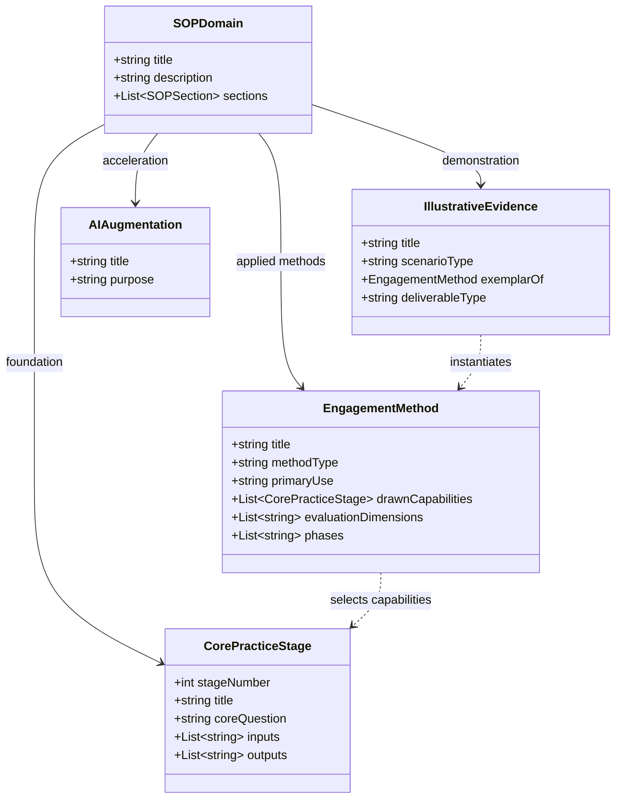

# Data & Content Model: Architecture SOP Structure

## Conceptual Model

The Architecture SOP operates as a structured knowledge and practice hierarchy containing four core entities:

---

## Entity Definitions

### 1. CorePracticeStage
- **Identifier**: `stage-01` to `stage-05`
- **Fields**:
  - `number`: 1 to 5
  - `name`: e.g. "Discover & Align", "Target Architecture & Strategy", "Governance & Decision Enablement", "Delivery Enablement & Execution Steering", "Value Realisation & Organisational Handover"
  - `path`: `docs/sop/0X-*.md`
  - `role`: Foundational architectural capability definition

### 2. EngagementMethod
- **Identifier**: method slug (e.g. `architecture-health-check`)
- **Fields**:
  - `name`: e.g. "Architecture Health Check"
  - `path`: `docs/sop/methods/architecture-health-check.md`
  - `scope`: Bounded consulting intervention
  - `drawnCapabilities`: Stages 01–05

### 3. IllustrativeEvidence
- **Identifier**: report slug (e.g. `architecture-decision-review-report`)
- **Fields**:
  - `name`: e.g. "Decision Review report"
  - `path`: `docs/sop/methods/architecture-decision-review-report.v2.md`
  - `scenario`: Sanitised, fictionalized realistic engagement output

### 4. NavigationGrouping (`mkdocs.yml`)
- **Key**: `How I work` → `Architecture SOP`
- **Sub-groupings**:
  - `Overview`: `sop/index.md`
  - `Core EA Practice`: 5 items
  - `Engagement Methods`: 4 items
  - `Illustrative Evidence`: 2 items
  - `AI Augmented Architecture`: 2 items
