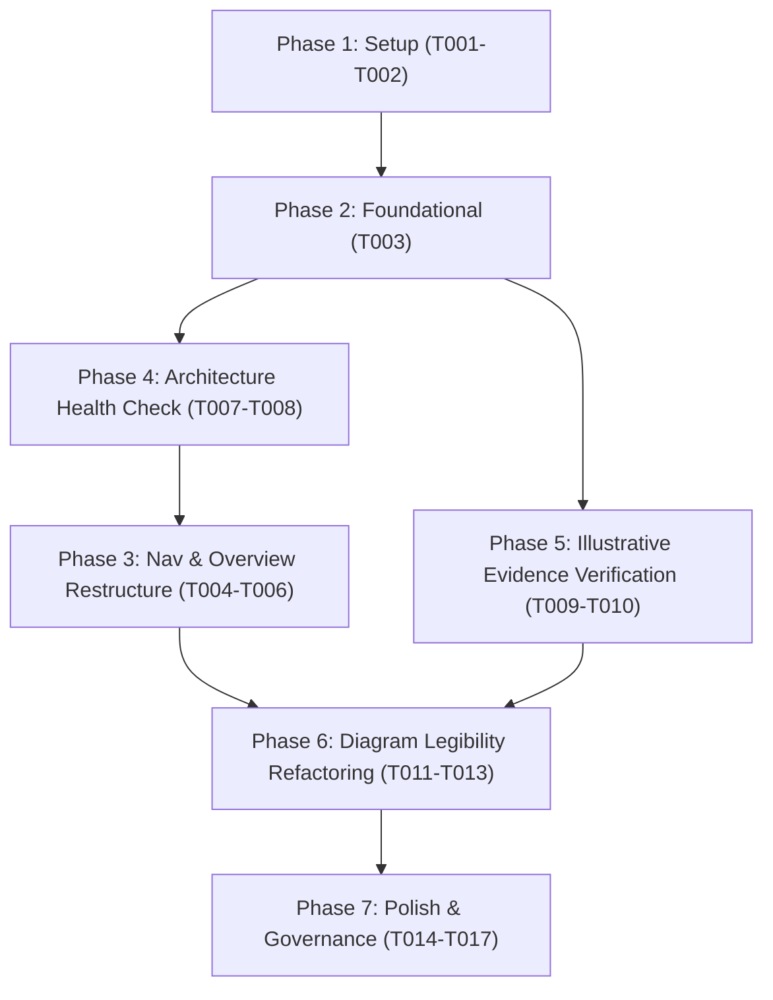

# Tasks: Architecture SOP Structure Reorganisation

**Input**: Design documents from `/specs/005-sop-structure-reorg/`  
**Prerequisites**: plan.md (required), spec.md (required for user stories), research.md, data-model.md, contracts/

## Format: `[ID] [P?] [Story] Description with file path`

- **[P]**: Can run in parallel (different files, no dependencies)
- **[Story]**: Which user story this task belongs to (`US1`, `US2`, `US3`)
- Strict checklist format with exact file paths

---

## Phase 1: Setup & Foundational Preparation

**Purpose**: Baseline verification before altering navigation or authoring new documents.

- [X] T001 Verify baseline site build passes via `mkdocs build --strict`
- [X] T002 Verify baseline terminology governance via `python scripts/validate_governance.py`

---

## Phase 2: Foundational Implementation (Stage 03 Standardisation)

**Purpose**: Align naming and conceptual foundation across Core EA Practice.

- [X] T003 Align Stage 03 title, headings, and metadata to "Governance & Decision Enablement" in `docs/sop/03-governance-framework.md`

---

## Phase 3: User Story 1 - Structured Practice Exploration (Priority: P1) 🎯 MVP

**Goal**: Structure navigation in `mkdocs.yml` and the SOP overview page into three clean tiers (Core EA Practice, Engagement Methods, Illustrative Evidence) plus AI Augmented Architecture.

**Independent Test**: Run `mkdocs serve` and confirm the navigation expands cleanly with all 5 stages under Core EA Practice, 4 methods under Engagement Methods, 2 reports under Illustrative Evidence, and 2 pages under AI Augmented Architecture with zero broken links.

- [X] T004 [US1] Update navigation tree in `mkdocs.yml` to reflect Core EA Practice, Engagement Methods, Illustrative Evidence, and AI Augmented Architecture per contracts/nav-hierarchy-contract.md
- [X] T005 [US1] Update Section 22 relationship diagram and taxonomy description to reflect the three tiers in `docs/sop/index.md`
- [X] T006 [US1] Validate User Story 1 navigation integrity via `mkdocs build --strict`

**Checkpoint**: At this point, the three-tier taxonomy is live in site navigation and the SOP landing page.

---

## Phase 4: User Story 2 - Engagement Method and Health Check Discovery (Priority: P2)

**Goal**: Provide the foundational "Architecture Health Check" engagement method document to complete the Engagement Methods suite.

**Independent Test**: Open `docs/sop/methods/architecture-health-check.md` directly and via navigation, verifying complete sections (Purpose, Core EA SOP Capability Mapping, 4 Health Dimensions, Assessment Phases, Diagnostic Outputs).

- [X] T007 [US2] Author foundational Architecture Health Check method document in `docs/sop/methods/architecture-health-check.md`
- [X] T008 [US2] Validate that internal anchors, stage references, and Mermaid diagrams render correctly in `docs/sop/methods/architecture-health-check.md`

**Checkpoint**: All 4 Engagement Methods are fully defined, discoverable, and cross-referenced.

---

## Phase 5: User Story 3 - Examining Real-world Illustrative Deliverables (Priority: P3)

**Goal**: Ensure illustrative deliverables under "Illustrative Evidence" remain linked, rendered with proper banner formatting, and decoupled from method definitions.

**Independent Test**: Navigate to both reports (Decision Review report and Assessment & Transformation Roadmap report) and confirm image headers, tables, and scenario notes render without broken paths.

- [X] T009 [P] [US3] Verify image paths and illustrative banner formatting in `docs/sop/methods/architecture-decision-review-report.v2.md`
- [X] T010 [P] [US3] Verify image paths and illustrative banner formatting in `docs/sop/methods/architecture-assessment-roadmap-report.v2.md`

**Checkpoint**: Both illustrative sample reports render cleanly under Illustrative Evidence.

---

---

## Phase 6: User Story 4 - Legible Architecture Flow Diagrams (Priority: P2)

**Goal**: Refactor wide horizontal Mermaid diagrams in `docs/sop/index.md` into folded multi-tier flows or subgraphs and introduce responsive CSS rules to prevent microscopic typography and text truncation.

**Independent Test**: Build site via `mkdocs build --strict`, preview `docs/sop/index.md`, and verify node text across all diagrams is clearly readable (equivalent to standard body text) without clipping or unreadable scaling.

- [X] T011 [US4] Create `docs/css/mermaid.css` with responsive `.mermaid` container rules and register in `mkdocs.yml` under `extra_css`
- [X] T012 [US4] Refactor Strategy-to-Value overview chain (lines 26-44 & 56-84), Traceability chain (Section 15), and Practice Loop (Section 21) in `docs/sop/index.md` into multi-row folded flows/subgraphs
- [X] T013 [US4] Verify all refactored Mermaid diagrams render valid syntax and legible typography via `mkdocs build --strict`

---

## Phase 7: Polish, Governance & Verification

**Purpose**: Final end-to-end validation, linting, and regression checks.

- [X] T014 Run terminology validation check in `scripts/validate_governance.py`
- [X] T015 Run test suite via `pytest tests/`
- [X] T016 Run strict compilation via `mkdocs build --strict`
- [X] T017 Execute manual visual checks per `specs/005-sop-structure-reorg/quickstart.md`

---

## Dependencies & Execution Order

*Note*: Authoring `architecture-health-check.md` (US2) before finalizing `mkdocs.yml` navigation (US1) ensures that `mkdocs build --strict` immediately finds the target file when compiling navigation.

---

## Implementation Strategy

### MVP First (User Story 1 & Foundational)
1. Complete T001 to T003 (Foundation ready)
2. Complete T007 (Create Health Check so nav doesn't fail on missing file)
3. Complete T004 to T006 (MVP Navigation live and verified)
4. Verify site locally with `mkdocs serve`
